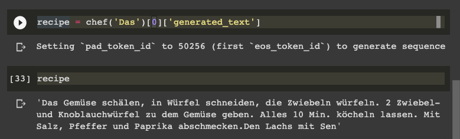
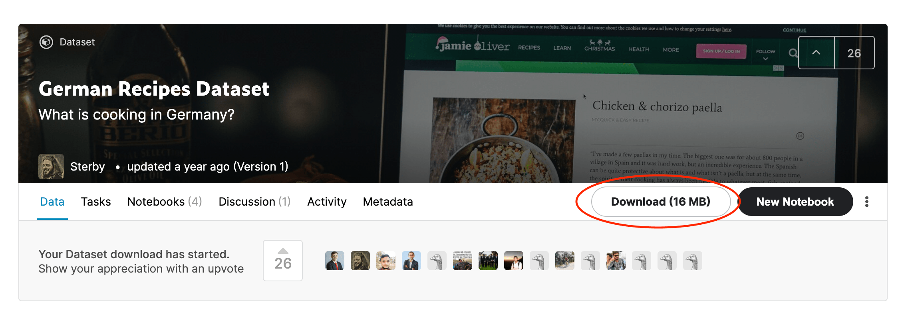

# Tutorial

In the tutorial, we are going to fine-tune a German GPT-2 from the
[Huggingface model hub](https://huggingface.co/models). As fine-tune, data we are using the
[German Recipes Dataset](https://www.kaggle.com/sterby/german-recipes-dataset), which consists of 12190 german recipes
with metadata crawled from [chefkoch.de](http://chefkoch.de/).

The idea is we use the recipe description to fine-tune our GPT-2 to let us write recipes we can cook.



I am using Google Colab with a GPU runtime for this tutorial. If you are not sure how to use a GPU Runtime take a look
here.

## **What are we going to do:**

- load the dataset from kaggle
- prepare the dataset and build a `TextDataset`
- load the pre-trained GPT-2 model and tokenizer
- initialize `Trainer` with `TrainingArguments`
- train and save the model
- test the model

```bash
!pip install transformers
```

### check for gpu

```bash
!nvidia-smi
```

    Mon Sep  7 07:40:08 2020
    +-----------------------------------------------------------------------------+
    | NVIDIA-SMI 450.66       Driver Version: 418.67       CUDA Version: 10.1     |
    |-------------------------------+----------------------+----------------------+
    | GPU  Name        Persistence-M| Bus-Id        Disp.A | Volatile Uncorr. ECC |
    | Fan  Temp  Perf  Pwr:Usage/Cap|         Memory-Usage | GPU-Util  Compute M. |
    |                               |                      |               MIG M. |
    |===============================+======================+======================|
    |   0  Tesla V100-SXM2...  Off  | 00000000:00:04.0 Off |                    0 |
    | N/A   35C    P0    24W / 300W |      0MiB / 16130MiB |      0%      Default |
    |                               |                      |                 ERR! |
    +-------------------------------+----------------------+----------------------+

    +-----------------------------------------------------------------------------+
    | Processes:                                                                  |
    |  GPU   GI   CI        PID   Type   Process name                  GPU Memory |
    |        ID   ID                                                   Usage      |
    |=============================================================================|
    |  No running processes found                                                 |
    +-----------------------------------------------------------------------------+

# Load the dataset from Kaggle

As already mentioned in the introduction of the tutorial we use the
"[German Recipes Dataset](https://www.kaggle.com/sterby/german-recipes-dataset)" dataset from Kaggle. The dataset
consists of 12190 german recipes with metadata crawled from [chefkoch.de](http://chefkoch.de/). In this example, we only
use the Instructions of the recipes. You can either download the dataset by using the "Download" Button and uploading it
to our colab notebook.



```python
#upload files to your colab environment
from google.colab import files
uploaded = files.upload()
```

After we uploaded the file with use `unzip` to extract the recipes.json.

```bash
!unzip '132879_316218_bundle_archive.zip'
```

# Prepare the dataset and build a `TextDataset`

The next step is to extract the instructions from all recipes and build a `TextDataset`. The `TextDataset` is a custom
implementation of the
[Pytroch `Dataset` class](https://pytorch.org/tutorials/beginner/data_loading_tutorial.html#dataset-class) implemented
by the transformers library. If you want to know more about Dataset in Pytroch you can check out this
[youtube video](https://www.youtube.com/watch?v=PXOzkkB5eH0&ab_channel=PythonEngineer).

First, we are going to split the `recipes.json` into a `train` and `test` section and extract `Instructions` from the
recipes and write them into a `train_dataset.txt` and `test_dataset.txt`

```python
import re
import json
from sklearn.model_selection import train_test_split


with open('recipes.json') as f:
    data = json.load(f)

def build_text_files(data_json, dest_path):
    f = open(dest_path, 'w')
    data = ''
    for texts in data_json:
        summary = str(texts['Instructions']).strip()
        summary = re.sub(r"\s", " ", summary)
        data += summary + "  "
    f.write(data)

train, test = train_test_split(data,test_size=0.15)


build_text_files(train,'train_dataset.txt')
build_text_files(test,'test_dataset.txt')

print("Train dataset length: "+str(len(train)))
print("Test dataset length: "+ str(len(test)))

```

`Train dataset length: 10361`  
`Test dataset length: 1829`

the next step is to download the tokenizer, which we use. We use the tokenizer from the `german-gpt2` model on
[huggingface](https://huggingface.co/anonymous-german-nlp/german-gpt2).

```python
from transformers import AutoTokenizer

tokenizer = AutoTokenizer.from_pretrained("anonymous-german-nlp/german-gpt2")

train_path = 'train_dataset.txt'
test_path = 'test_dataset.txt'
```

```python
from transformers import TextDataset,DataCollatorForLanguageModeling

def load_dataset(train_path,test_path,tokenizer):
    train_dataset = TextDataset(
          tokenizer=tokenizer,
          file_path=train_path,
          block_size=128)

    test_dataset = TextDataset(
          tokenizer=tokenizer,
          file_path=test_path,
          block_size=128)

    data_collator = DataCollatorForLanguageModeling(
        tokenizer=tokenizer, mlm=False,
    )
    return train_dataset,test_dataset,data_collator

train_dataset,test_dataset,data_collator = load_dataset(train_path,test_path,tokenizer)
```

# Initialize `Trainer` with `TrainingArguments` and GPT-2 model

The [Trainer](https://huggingface.co/transformers/main_classes/trainer.html#transformers.Trainer) class provides an API
for feature-complete training. It is used in most of
the [example scripts](https://huggingface.co/transformers/examples.html) from Huggingface. Before we can instantiate our
`Trainer` we need to download our GPT-2 model and create
a [TrainingArguments](https://huggingface.co/transformers/main_classes/trainer.html#transformers.TrainingArguments) to
access all the points of customization during training. In the `TrainingArguments`, we can define the Hyperparameters we
are going to use in the training process like our `learning_rate`, `num_train_epochs`, or `per_device_train_batch_size`.
A complete list can you find [here](https://huggingface.co/transformers/main_classes/trainer.html#trainingarguments).

```python
from transformers import Trainer, TrainingArguments,AutoModelWithLMHead

model = AutoModelWithLMHead.from_pretrained("anonymous-german-nlp/german-gpt2")


training_args = TrainingArguments(
    output_dir="./gpt2-gerchef", #The output directory
    overwrite_output_dir=True, #overwrite the content of the output directory
    num_train_epochs=3, # number of training epochs
    per_device_train_batch_size=32, # batch size for training
    per_device_eval_batch_size=64,  # batch size for evaluation
    eval_steps = 400, # Number of update steps between two evaluations.
    save_steps=800, # after # steps model is saved
    warmup_steps=500,# number of warmup steps for learning rate scheduler
    )


trainer = Trainer(
    model=model,
    args=training_args,
    data_collator=data_collator,
    train_dataset=train_dataset,
    eval_dataset=test_dataset,
    prediction_loss_only=True,
)
```

# Train and save the model

To train the model we can simply run `Trainer.train()`.

```python
trainer.train()
```

`{'loss': 2.84846630859375, 'learning_rate': 5e-05, 'epoch': 1.0101010101010102, 'step': 500}`  
`{'loss': 2.183541015625, 'learning_rate': 2.4619289340101523e-05, 'epoch': 2.0202020202020203, 'step': 1000}`  
`TrainOutput(global_step=1485, training_loss=2.3330630523989897)`

After training is done you can save the model by calling `save_model()`. This will save the trained model to our
`output_dir` from our `TrainingArguments`.

```python
trainer.save_model()
```

# Test the model

To test the model we are going to use another
[highlight of the transformers library](https://huggingface.co/transformers/main_classes/pipelines.html?highlight=pipelines)
called `pipeline`. [Pipelines](https://huggingface.co/transformers/main_classes/pipelines.html?highlight=pipelines) are
objects that offer a simple API dedicated to several tasks, among others also `text-generation`

```python
from transformers import pipeline

chef = pipeline('text-generation',model='./gpt2-gerchef', tokenizer='anonymous-german-nlp/german-gpt2',config={'max_length':800})

#result = chef('Zuerst Hähnchen')[0]['generated_text']

```

```python
chef('Die Nudeln Kochen, Fleisch anbraten')
```

`[{'generated_text': 'Die Nudeln Kochen, Fleisch anbraten, Tomaten- und Erbsenzehen abgießen, etwas Tomatenmark, Brühepulver und Wein angießen, aufkochen lassen. Tomaten, Erbsenzehen, Tomaten- und Erbsenz'}]`

```python
chef('Zuerst Hähnchen')
```

`[{'generated_text': 'Zuerst Hähnchen innen und außen salzen, pfeffern und in Olivenöl kurz anbraten. Mit Pfeffer pfeffern. Anschließend Knoblauch dazu pressen und mit etwas Wasser angießen, so dass die Brühe einen goldbraunen Brä'}]`

```python
chef('Der beste Weg, um einen Schokoladenkuchen zuzubereiten, ist')

```

`[{'generated_text': 'Der beste Weg, um einen Schokoladenkuchen zuzubereiten, ist, ihn auf einem Holzspießchen unter fließend kaltem Wasser zu fixieren.Das Ergebnis ist eine knackige Konsistenz der Eier. Eierkuchen schmecken schön knusprig,'}]`

```python
chef('Zuerst Hähnchen')[0]['generated_text']
```

`'Zuerst Hähnchen und Zwiebeln in Butter anbraten. Paprika, Paprikastreifen und Tomatenmark zufügen. Brühe hinzugeben und aufkochen. Alles ca. 25 - 30 Minuten köcheln lassen.Die Suppe zum Servieren in'`
