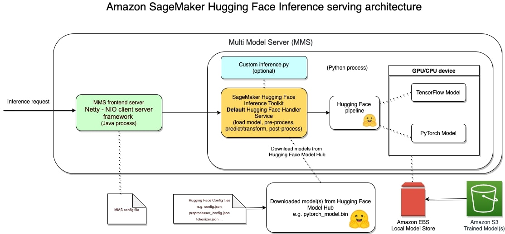
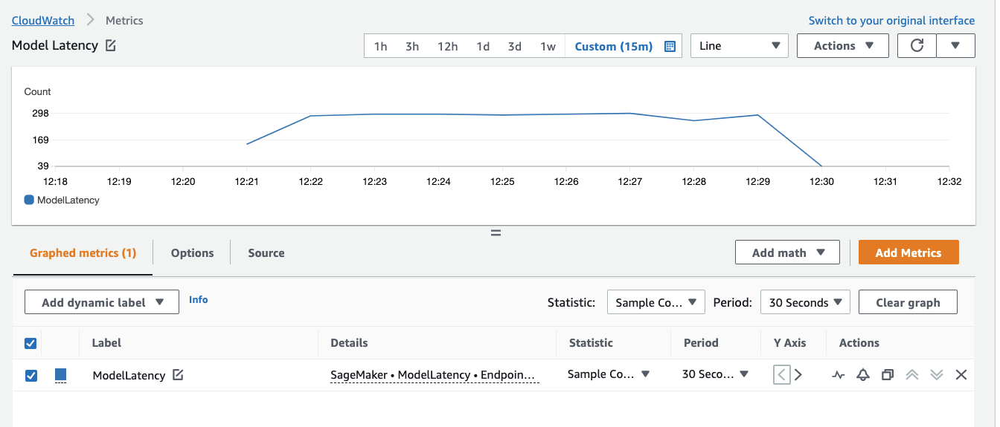
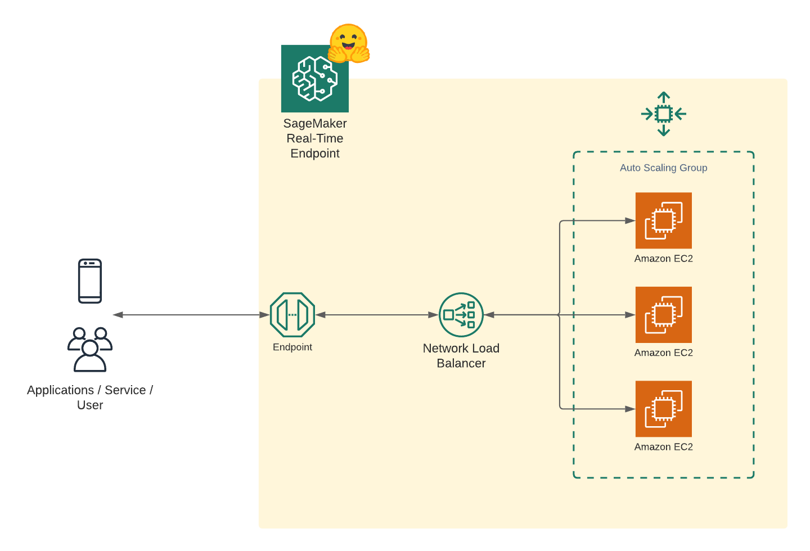
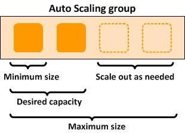

Welcome to this getting started guide, we will use the new Hugging Face Inference DLCs and Amazon SageMaker Python SDK to deploy a transformer model for real-time inference. 
In this example, we are going to deploy a trained Hugging Face Transformer model onto SageMaker for inference.


```python
!pip install "sagemaker>=2.66.2" --upgrade
```


```python
import sagemaker
sagemaker.__version__
# '2.66.2.post0'

```


Reference Blog post [Configuring autoscaling inference endpoints in Amazon SageMaker](https://aws.amazon.com/de/blogs/machine-learning/configuring-autoscaling-inference-endpoints-in-amazon-sagemaker/)


## Deploy s Hugging Face Transformer model to Amazon SageMaker for Inference

To deploy a model directly from the Hub to SageMaker we need to define 2 environment variables when creating the `HuggingFaceModel`. We need to define:

- `HF_MODEL_ID`: defines the model id, which will be automatically loaded from [huggingface.co/models](http://huggingface.co/models) when creating or SageMaker Endpoint. The 🤗 Hub provides +10 000 models all available through this environment variable.
- `HF_TASK`: defines the task for the used 🤗 Transformers pipeline. A full list of tasks can be found [here](https://huggingface.co/transformers/main_classes/pipelines.html).


```python
from sagemaker.huggingface import HuggingFaceModel
from uuid import uuid4
import sagemaker 

role = sagemaker.get_execution_role()

# Hub Model configuration. https://huggingface.co/models
hub = {
  'HF_MODEL_ID':'yiyanghkust/finbert-tone', # model_id from hf.co/models
  'HF_TASK':'text-classification' # NLP task you want to use for predictions
}

# endpoint name
endpoint_name=f'{hub["HF_MODEL_ID"].split("/")[1]}-{str(uuid4())}' # model and endpoint name

# create Hugging Face Model Class
huggingface_model = HuggingFaceModel(
   env=hub,
   role=role, # iam role with permissions to create an Endpoint
   name=endpoint_name, # model and endpoint name
   transformers_version="4.11", # transformers version used
   pytorch_version="1.9", # pytorch version used
   py_version="py38", # python version of the DLC
)

```

Next step is to deploy our endpoint.

```python
# deploy model to SageMaker Inference
predictor = huggingface_model.deploy(
   initial_instance_count=1,
   instance_type="ml.c5.large"
)
# get aws region for dashboards
aws_region = predictor.sagemaker_session.boto_region_name
```

**Architecture**

The [Hugging Face Inference Toolkit for SageMaker](https://github.com/aws/sagemaker-huggingface-inference-toolkit) is an open-source library for serving Hugging Face transformer models on SageMaker. It utilizes the SageMaker Inference Toolkit for starting up the model server, which is responsible for handling inference requests. The SageMaker Inference Toolkit uses [Multi Model Server (MMS)](https://github.com/awslabs/multi-model-server) for serving ML models. It bootstraps MMS with a configuration and settings that make it compatible with SageMaker and allow you to adjust important performance parameters, such as the number of workers per model, depending on the needs of your scenario.



**Deploying a model using SageMaker hosting services is a three-step process:**

1. **Create a model in SageMaker** —By creating a model, you tell SageMaker where it can find the model components. 
2. **Create an endpoint configuration for an HTTPS endpoint** —You specify the name of one or more models in production variants and the ML compute instances that you want SageMaker to launch to host each production variant.
3. **Create an HTTPS endpoint** —Provide the endpoint configuration to SageMaker. The service launches the ML compute instances and deploys the model or models as specified in the configuration


After the endpoint is deployed we can use the `predictor` to send requests.


```python
# example request, you always need to define "inputs"
data = {
   "inputs": "There is a shortage of capital for project SageMaker. We need extra financing"
}

# request
predictor.predict(data)
# [{'label': 'negative', 'score': 0.9870443940162659}]
```


## Model Monitoring

To properly monitor our endpoint lets send a few hundred requests.

```python
for i in range(500):
    predictor.predict(data)
```

After that we can go to the cloudwatch dashboard to take a look.


```python
print(f"https://console.aws.amazon.com/cloudwatch/home?region={aws_region}#metricsV2:graph=~(metrics~(~(~'AWS*2fSageMaker~'ModelLatency~'EndpointName~'finbert-tone-73d26f97-9376-4b3f-9334-a2-2021-10-29-12-18-52-365~'VariantName~'AllTraffic))~view~'timeSeries~stacked~false~start~'-PT15M~end~'P0D~region~'{aws_region}~stat~'SampleCount~period~30);query=~'*7bAWS*2fSageMaker*2cEndpointName*2cVariantName*7d*20{predictor.endpoint_name}")
```



# Auto Scaling your Model

[Amazon SageMaker](https://aws.amazon.com/sagemaker/) is a fully managed service that provides every developer and data scientist with the ability to quickly build, train, and deploy machine learning (ML) models at scale.

Autoscaling is an out-of-the-box feature that monitors your workloads and dynamically adjusts the capacity to maintain steady and predictable performance at the possible lowest cost.

The following diagram is a sample architecture that showcases how a model is served as an endpoint with autoscaling enabled.





## Configure Autoscaling for our Endpoint

You can define the minimum, desired, and the maximum number of instances per endpoint and, based on the autoscaling configurations, instances are managed dynamically. The following diagram illustrates this architecture. 



AWS offers many different [ways to auto-scale your endpoints](https://docs.aws.amazon.com/autoscaling/application/userguide/application-auto-scaling-target-tracking.html). One of them Simple-Scaling, where you scale the instance capacity based on `CPUUtilization` of the instances or `SageMakerVariantInvocationsPerInstance`. 

In this example we are going to use `CPUUtilization` to auto-scale our Endpoint


```python
import boto3

# Let us define a client to play with autoscaling options
asg_client = boto3.client('application-autoscaling') # Common class representing Application Auto Scaling for SageMaker amongst other services

# the resource type is variant and the unique identifier is the resource ID.
# Example: endpoint/my-bert-fine-tuned/variant/AllTraffic .
resource_id=f"endpoint/{predictor.endpoint_name}/variant/AllTraffic"

# scaling configuration
response = asg_client.register_scalable_target(
    ServiceNamespace='sagemaker', #
    ResourceId=resource_id,
    ScalableDimension='sagemaker:variant:DesiredInstanceCount', 
    MinCapacity=1,
    MaxCapacity=4
)

```

Create Scaling Policy with configuration details, e.g. `TargetValue` when the instance should be scaled.


```python
response = asg_client.put_scaling_policy(
    PolicyName=f'CPUUtil-ScalingPolicy-{predictor.endpoint_name}',
    ServiceNamespace='sagemaker',
    ResourceId=resource_id,
    ScalableDimension='sagemaker:variant:DesiredInstanceCount',
    PolicyType='TargetTrackingScaling',
    TargetTrackingScalingPolicyConfiguration={
        'TargetValue': 50.0, # threshold 
        'CustomizedMetricSpecification':
        {
            'MetricName': 'CPUUtilization',
            'Namespace': '/aws/sagemaker/Endpoints',
            'Dimensions': [
                {'Name': 'EndpointName', 'Value': predictor.endpoint_name },
                {'Name': 'VariantName','Value': 'AllTraffic'}
            ],
            'Statistic': 'Average', # Possible - 'Statistic': 'Average'|'Minimum'|'Maximum'|'SampleCount'|'Sum'
            'Unit': 'Percent'
        },
        'ScaleInCooldown': 300, # duration until scale in
        'ScaleOutCooldown': 100 # duration between scale out
    }
)

```

stress test the endpoint with threaded requests


```python
from concurrent.futures import ThreadPoolExecutor
import os 

workers = os.cpu_count() * 5
requests = 200
print(f"workers used for load test: {workers}")

with ThreadPoolExecutor(max_workers=workers) as executor:
    for i in range(requests):
        executor.submit(predictor.predict, data)

```

Monitor the `CPUUtilization` in cloudwatch 


```python
print(f"https://console.aws.amazon.com/cloudwatch/home?region={aws_region}#metricsV2:graph=~(metrics~(~(~'*2faws*2fsagemaker*2fEndpoints~'CPUUtilization~'EndpointName~'finbert-tone-73d26f97-9376-4b3f-9334-a2-2021-10-29-12-18-52-365~'VariantName~'AllTraffic))~view~'timeSeries~stacked~false~region~'{aws_region}~start~'-PT15M~end~'P0D~stat~'Average~period~60);query=~'*7b*2faws*2fsagemaker*2fEndpoints*2cEndpointName*2cVariantName*7d*20finbert-tone-73d26f97-9376-4b3f-9334-a2-2021-10-29-12-18-52-365*20Endpoint*20{predictor.endpoint_name}*20has*20Current*20Instance*20Count*3a*201*20With*20a*20desired*20instance*20count*20of*201")
```

Now we check the endpoint instance_count number an see that SageMaker has scaled out.


```python
bt_sm = boto3.client('sagemaker')
response = bt_sm.describe_endpoint(EndpointName=predictor.endpoint_name)
print(f"Endpoint {response['EndpointName']} has \nCurrent Instance Count: {response['ProductionVariants'][0]['CurrentInstanceCount']}\nWith a desired instance count of {response['ProductionVariants'][0]['DesiredInstanceCount']}")
# Endpoint finbert-tone-73d26f97-9376-4b3f-9334-a2-2021-10-29-12-18-52-365 has 
#    Current Instance Count: 4
#    With a desired instance count of 4
```

   
## Clean up


```python
# delete endpoint
predictor.delete_endpoint()
```


# Conclusion

With the help of the Autoscaling groups were we able to apply elasticity without heavy lifting. The endpoint now adapts to the incoming load and scales in and out as required. 

Through the simplicity of SageMaker you don't need huge Ops-teams anymore to manage and scale your machine learning models. You can do it yourself.

---

You can find the code [here](https://github.com/huggingface/notebooks/blob/master/sagemaker/13_deploy_and_autoscaling_transformers/sagemaker-notebook.ipynb) and feel free open a thread the [forum](https://discuss.huggingface.co/).

Thanks for reading. If you have any questions, feel free to contact me, through [Github](https://github.com/huggingface/transformers), or on the [forum](https://discuss.huggingface.co/c/sagemaker/17). You can also connect with me on [Twitter](https://twitter.com/_philschmid) or [LinkedIn](https://www.linkedin.com/in/philipp-schmid-a6a2bb196/).
