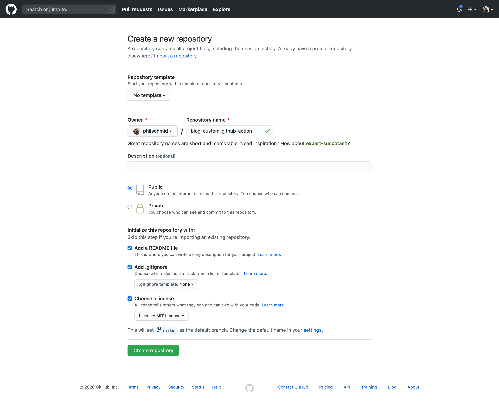
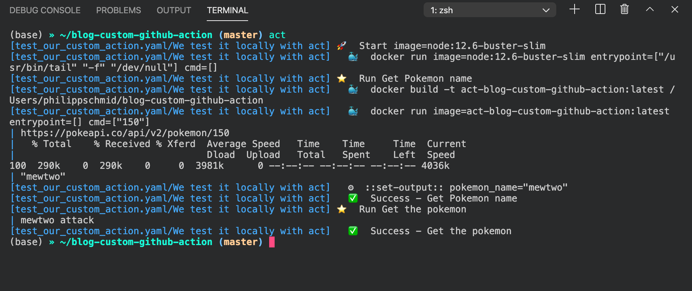
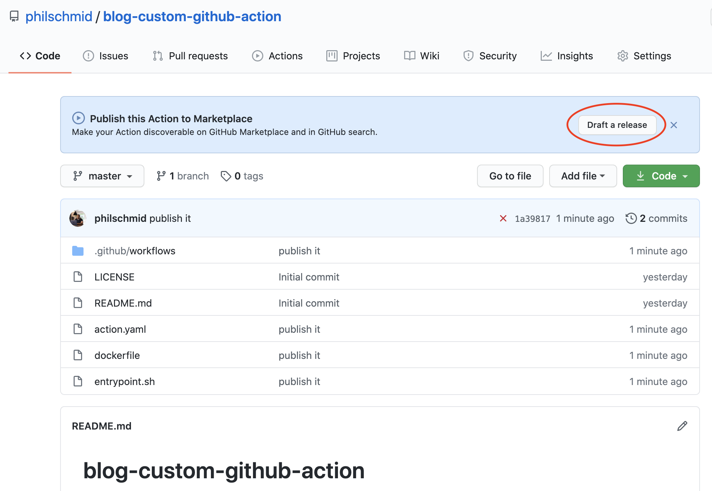
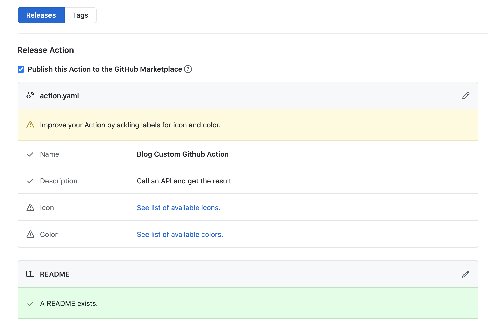
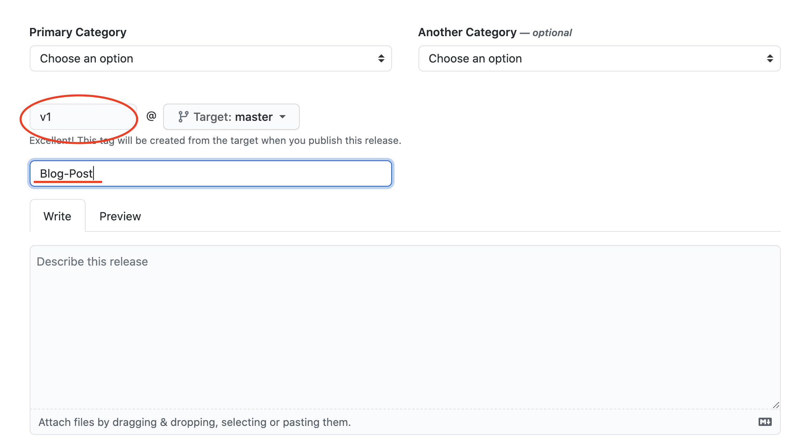
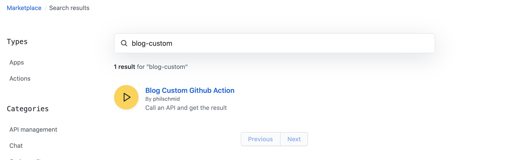

# Introduction

Automation, complexity reduction, reproducibility, maintainability are all advantages that can be realized by a
continuous integration (CI) pipeline. With GitHub Actions, you can build these CI pipelines.

"You can create workflows using actions defined in your repository, open-source Actions in a public repository on
GitHub, or a published Docker container image." -
[Source](https://docs.github.com/en/actions/getting-started-with-github-actions/about-github-actions)

I recently started a new project at work, where I had to implement a new CI pipeline. In this process, I had to call an
API, validate the result, and pass it on. I ended up with a 20 lines long inline script within the `run` section. That
was anything but simple, maintainable, and reusable.

> Well, done 🤦🏻‍♂️

After this miserable failure, I looked up how to create custom Github Actions. I was pleasantly surprised that it is
very easy to write, test, and publish your own custom Github Action. It took me around 1h to research, implement, test,
deploy, and release my action. You can check it out
[here](https://github.com/marketplace/actions/download-custom-release-asset).

---

# Tutorial

In the following tutorial, we are going to create a custom Github Action in 4 steps. Our Action will execute a simple
bash script. This bash script will call the [pokeapi.co](http://pokeapi.co/) API-Endpoint with a PokeDex ID as a
parameter. Then we will parse the result and return the name of the pokemon. After that, we will `echo` the result of
our bash script in our Github Actions workflow.

**What are we going to do:**

- Create a Github repository with a license
- Create `action.yaml` file with inputs and outputs
- Create our bash script
- Create a `Dockerfile`

_optional:_

- test it locally with `act`
- publish the action to the Github Action marketplace

You can find everything we do in this [Github repository](https://github.com/philschmid/blog-custom-github-action).

---

# Create a Github repository with a license

First, [we create a repository](https://github.com/new). We can directly add a `.gitignore`, `README.md`, and license
file. For the Repository name, we can use whatever we want.



Next, clone the repository to your local machine and open it with your preferred IDE.

```bash
git clone https://github.com/philschmid/blog-custom-github-action.git && \
cd blog-custom-github-action && \
code .
```

---

# Create `action.yaml` file with inputs and outputs

Next, we create an `action.yaml` file in our repository. The `action.yaml` is the metadata file and defines the inputs,
outputs, and main entrypoint for our Action. It uses `YAML` as syntax.

In our example, we use one input and one output. If you want detailed documentation for the `action.yaml` and learn more
about the configurations take a look
[here](https://docs.github.com/en/actions/creating-actions/metadata-syntax-for-github-actions).

The `action.yaml` always has to include this:

- `name`: The name of your Action. This must be globally unique if you want to publish your Github Action to the
  marketplace
- `description` : A short description of what your Action is doing
- `inputs`: defines the input parameters you can pass into your bash script. You can access them with
  `$INPUT_{Variable}` in our example `$INPUT_POKEMON_ID`
- `outputs`: defines the output parameters that you can us later in another workflow step
- `runs`: defines where and what the action will execute in our case it will run a docker

The `action.yaml` we are going to use looks like that.

```yaml
# action.yaml
name: 'Blog Custom Github Action'
description: 'Call an API and get the result'
inputs:
  pokemon_id:
    description: 'number of the pokemon in the pokedex'
    required: true
    default: 1
outputs:
  pokemon_name:
    description: 'Name des Pokemons'
runs:
  using: 'docker'
  image: 'Dockerfile'
  args:
    - ${{ inputs.pokemon_id}}
```

---

# Create a bash script

In the third step, we create our bash script called `entrypoint.sh`. This script will be executed in the Action.

For demo purposes, we use a simple script, which calls the [pokeapi.co](http://pokeapi.co/) API and parses the return
value with the [jq processor](https://stedolan.github.io/jq/) to get the name of the pokemon. In order to create an
output for our Action we need to use a Github Action specific syntax: `echo "::set-output name=<output name>::<value>"`.

```bash
set -e

api_url="https://pokeapi.co/api/v2/pokemon/${INPUT_POKEMON_ID}"
echo $api_url

pokemon_name=$(curl "${api_url}" | jq ".name")
echo $pokemon_name

echo "::set-output name=pokemon_name::$pokemon_name"
```

---

# Create a `Dockerfile`

The last step in our 4 step tutorial is to create a `Dockerfile`. If you are not familiar with docker and `Dockerfile`
check out
[Dockerfile support for GitHub Actions](https://docs.github.com/en/actions/creating-actions/dockerfile-support-for-github-actions).

```docker
# Base image
FROM alpine:latest

# installes required packages for our script
RUN	apk add --no-cache \
  bash \
  ca-certificates \
  curl \
  jq

# Copies your code file  repository to the filesystem
COPY entrypoint.sh /entrypoint.sh

# change permission to execute the script and
RUN chmod +x /entrypoint.sh

# file to execute when the docker container starts up
ENTRYPOINT ["/entrypoint.sh"]
```

---

That's it. We've done it.✅ To use it we create a new workflow file in `.github/workflows` and add our Action as a
`step` .

```yaml
- name: Get Pokemon name
  uses: ./ # Uses an action in the root directory
  id: pokemon
  with:
    pokemon_id: 150
```

To access the output of our Action we have to define the `id` attribute in our step.

```yaml
# Use the pokemon_name output from our action (id:pokemon)
- name: Get the pokemon
  run: echo "${{ steps.pokemon.outputs.pokemon_name }} attack"
```

---

# Optional

The previous 4 steps have shown us how to build our own custom Github Action. But we never tested, if it works as
expected. In the following two additional steps we test our Github Action locally with
[act](https://github.com/nektos/act) and afterwards publish it to the Github Marketplace.

---

## Local testing with `act`

[Act](https://github.com/nektos/act) is an open-source CLI toolkit written in Go. It allows us to execute and test our
Github Actions locally. It supports environment variables, secrets, and custom events.
[Definitely check it out.](https://github.com/nektos/act) Instructions for the installation can be found
[here](https://github.com/nektos/act#installation).

Before we can test our Action we have to create a Github Workflow in `.github/worklfows` .

```yaml
on: [push]

jobs:
  custom_test:
    runs-on: ubuntu-latest
    name: We test it locally with act
    steps:
      - name: Get Pokemon name
        uses: ./ # Uses an action in the root directory
        id: pokemon
        with:
          pokemon_id: 150
      - name: Get the pokemon
        run: echo "${{ steps.pokemon.outputs.pokemon_name }} attack"
```

Afterwards we can run `act` in our terminal and it should run our action.

```bash
act
```



As a result, we can see our Action runs successfully. It also outputs our `pokemon_name` in the second last line
`"mewtwo attack"`.

---

## Publish the Action to the marketplace

To be able to publish a custom Github Action to the marketplace we need a globally unique name. There must be no Action
with this name on the marketplace.

After we committed and pushed our files to our repository and go to the web console we should see something like that.



If we click on "draft a release" we should see a custom release page especially for Github Actions.



If we have green checks ✅ for name and description we are able to publish the Action to the marketplace.

Adding an icon and color can be done in the `action.yaml`. You can check out how to do that
[here](https://docs.github.com/en/actions/creating-actions/metadata-syntax-for-github-actions#branding).

The next step is to create a new release with a title. Therefore we scroll down a bit and add a release version and
title to it.



After that we can click "publish release" and our custom Github Action is published to the marketplace. We can find it
on [https://github.com/marketplace](https://github.com/marketplace) by searching "blog-custom".



Now we are able to use our custom Github Action in our workflows without having it in the project folder.

```yaml
- name: Get Pokemon name
  uses: philschmid/blog-custom-github-action@master # or @release_version (e.g. v1)
  id: pokemon
  with:
    pokemon_id: 150
```

_This is only a quick example on how to publish a Github Action to the marketplace. There are many more custom settings,
such as category, icon, and brand that we have not made._

---

Thanks for reading. I hope I was able to prevent some Github Action failures.

There are more possibilities to create your own Github Actions for example with Node. You can find more information
[here](https://docs.github.com/en/actions/creating-actions). Furthermore, Github has fantastic
[documentation for Github Action](https://docs.github.com/en/actions).

You can find the code for the tutorial in this
[Github repository](https://github.com/philschmid/blog-custom-github-action).

---

If you have any questions, feel free to contact me or comment on this article. You can also connect with me on
[Twitter](https://twitter.com/_philschmid) or [LinkedIn](https://www.linkedin.com/in/philipp-schmid-a6a2bb196/).
