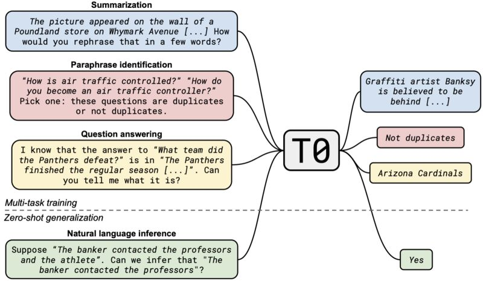
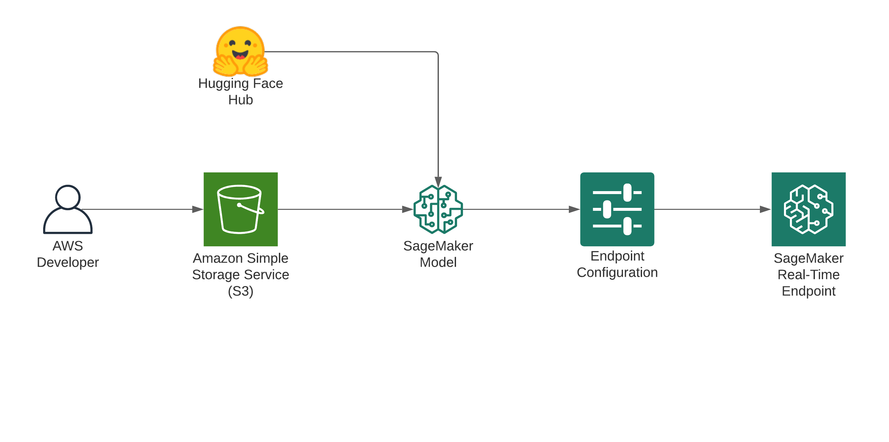

Earlier this week 🌸 [BigScience](https://bigscience.huggingface.co/) released their first [modeling paper](https://arxiv.org/abs/2110.08207) for the collaboration introducing [T0*](https://huggingface.co/bigscience/T0_3B). For those of you who haven't heard about 🌸 [BigScience](https://bigscience.huggingface.co/) it is a open collaboration of 600 researchers from 50 countries and +250 institutions creating large multilingual neural network language models and very large multilingual text datasets together using the Jean Zay (IDRIS) supercomputer. 

The [paper](https://arxiv.org/pdf/2110.08207.pdf) introduces a new model [T0\*](https://huggingface.co/bigscience/T0_3B), which is a series of encoder-decoder models trained on a large set of different tasks specified in natural language prompts. You can learn more about T0* on the [Hugging Face model card](https://huggingface.co/bigscience/T0_3B). But in short  [T0\*](https://huggingface.co/bigscience/T0_3B) outperforms GPT-3 on many zero-shot tasks while being 16x smaller!



Image from [Multitask Prompted Training Enables Zero-Shot Task Generalization](https://arxiv.org/abs/2110.08207)

We will take advantage of this downsizing and deploy the model to AWS & Amazon SageMaker with just a few lines of code for production scale workloads. 

Check out my other blog post ["Scalable, Secure Hugging Face Transformer Endpoints with Amazon SageMaker, AWS Lambda, and CDK"](https://www.philschmid.de/huggingface-transformers-cdk-sagemaker-lambda) to learn how you could create a secure public-facing `T0_3B` API.

---

# Tutorial

If you’re not familiar with Amazon SageMaker: *“Amazon SageMaker is a fully managed service that provides every developer and data scientist with the ability to build, train, and deploy machine learning (ML) models quickly. SageMaker removes the heavy lifting from each step of the machine learning process to make it easier to develop high-quality models.”* [[REF]](https://aws.amazon.com/sagemaker/faqs/)

**What are we going to do:**

- Setting up the environment
- deploy `T0_3B` to Amazon SageMaker
- Run inference and test the Model



## Setting up the environment

We will use an Amazon SageMaker Notebook Instance for the example. You can learn **[here how to set up a Notebook Instance.](https://docs.aws.amazon.com/sagemaker/latest/dg/nbi.html)** To get started, jump into your Jupyter Notebook or JupyterLab and create a new Notebook with the **`conda_pytorch_p36`** kernel.

***Note: The use of Jupyter is optional: We could also use a Laptop, another IDE, or a task scheduler like Airflow or AWS Step Functions when having appropriate permissions.***

After that, we can install the required dependencies.

```bash
pip install "sagemaker>=2.48.0" --upgrade
```

To deploy a model on SageMaker, we need to provide an IAM role with the right permission. The **`get_execution_role`** method is provided by the SageMaker SDK as an optional convenience (only available in Notebook Instances and Studio). 

```python
import sagemaker
role = sagemaker.get_execution_role()
```

## Deploy `T0_3B` to Amazon SageMaker

To deploy a `T0_3B` directly from the [Hugging Face Model Hub](http://hf.co/models) to Amazon SageMaker, we need to define two environment variables when creating the **`HuggingFaceModel`**. We need to define:

- HF_MODEL_ID: defines the model id, which will be automatically loaded from **[huggingface.co/models](http://huggingface.co/models)** when creating or SageMaker Endpoint.
- HF_TASK: defines the task for the used 🤗 Transformers pipeline.

```python
from sagemaker.huggingface.model import HuggingFaceModel

# Hub Model configuration. <https://huggingface.co/models>
hub = {
  'HF_MODEL_ID':'bigscience/T0_3B', # model_id from hf.co/models
  'HF_TASK':'text2text-generation' # NLP task you want to use for predictions
}

# create Hugging Face Model Class
huggingface_model = HuggingFaceModel(
	transformers_version='4.6.1',
	pytorch_version='1.7.1',
	py_version='py36',
	env=hub,
	role=role
)
```

After we create our `HuggingFaceModel` instance we can run `.deploy()` and provide our required infrastructure configuration. Since the model is pretty big we are going to use the `ml.g4dn.2xlarge` instance type.

```python
# deploy model to SageMaker Inference
predictor = huggingface_model.deploy(
   initial_instance_count=1,
   instance_type='ml.g4dn.2xlarge'
)
```

This will start the deployment of our model and the endpoint should be up and ready for inference after a few minutes. 

## Run inference and test the Model

The `.deploy` method is returning a `HuggingFacePredictor`, which we can use to immediately run inference against our model after it is up and ready. 

```python
predictor.predict({
	'inputs': "Is this review positive or negative? Review: Best cast iron skillet you will every buy."
})
# ✅ [{'generated_text': 'Positive'}]

predictor.predict({
	'inputs': "A is the son's of B's uncle. What is the family relationship between A and B?"
})
# ✅ [{'generated_text': "B is A's cousin."}]

```

After we run our inference we can delete the endpoint again.

```python
# delete endpoint
predictor.delete_endpoint()
```

# Conclusion

This short blog posts how you can easily deploy and run inference on `T0_3B` in secure, controlled & managed environments. The Endpoint can be integrated into Applications already or you could create a public-facing API out of it by adding a AWS Lambda Wrapper. Check out my other blog post ["Scalable, Secure Hugging Face Transformer Endpoints with Amazon SageMaker, AWS Lambda, and CDK"](https://www.philschmid.de/huggingface-transformers-cdk-sagemaker-lambda) for this.

But the biggest thanks goes to the 🌸 [BigScience](https://bigscience.huggingface.co/) collaboration for creating and sharing the results of their great work. I am so grateful that open-science & open-source exist and are being pushed forward.

---

Thanks for reading. If you have any questions, feel free to contact me, through [Github](https://github.com/huggingface/transformers), or on the [forum](https://discuss.huggingface.co/c/sagemaker/17). You can also connect with me on [Twitter](https://twitter.com/_philschmid) or [LinkedIn](https://www.linkedin.com/in/philipp-schmid-a6a2bb196/).