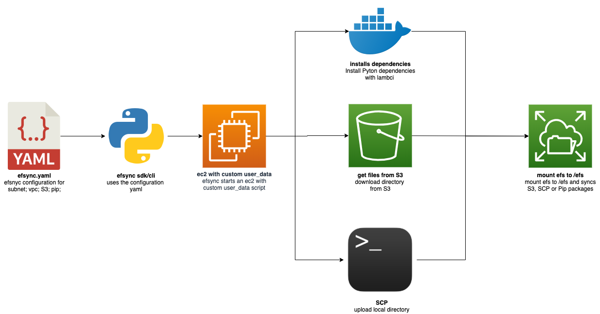

# Introduction

Part of using Machine Learning successfully in production is the use of MLOps. MLOps enhances DevOps with continuous
training (CT). The main components of MLOps therefore include continuous integration (CI), continuous delivery (CD), and
continuous training (CT).
[Nvidia wrote an article about what MLOps is in detail.](https://blogs.nvidia.com/blog/2020/09/03/what-is-mlops/)

My Name is Philipp and I live in Nuremberg, Germany. Currently, I am working as a machine learning engineer at a
technology incubation startup. At work, I design and implement cloud-native machine learning architectures for fin-tech
and insurance companies. I am a big fan of Serverless and providing machine learning models in a serverless fashion. I
already wrote two articles about how to use Deep Learning models like BERT in a Serverless Environment like AWS Lambda.

- [Scaling Machine Learning from ZERO to HERO](https://www.philschmid.de/scaling-machine-learning-from-zero-to-hero)
- [Serverless BERT with HuggingFace and AWS Lambda](https://www.philschmid.de/serverless-bert-with-huggingface-and-aws-lambda)

A big hurdle to overcome in serverless machine learning with tools like [AWS Lambda](https://aws.amazon.com/de/lambda/),
[Google Cloud Functions](https://cloud.google.com/functions),
[Azure Functions](https://azure.microsoft.com/de-de/services/functions/) was storage.
[Tensorflow](https://www.tensorflow.org/) and [Pytorch](https://pytorch.org/) are having a huge size and newer "State of
the Art" models like BERT have a size of over 300MB.

In July this year, AWS added support for
[](https://aws.amazon.com/lambda/?nc1=h_ls)[Amazon Elastic File System (EFS)](https://aws.amazon.com/efs/?nc1=h_ls), a
scalable and elastic NFS file system for AWS Lambda. This allows us to mount AWS EFS filesystems to
[AWS Lambda](https://aws.amazon.com/lambda/?nc1=h_ls) functions.

Until today it was very difficult to sync dependencies or model files to an AWS EFS Filesystem. You could do it with
[AWS Datasync](https://docs.aws.amazon.com/efs/latest/ug/gs-step-four-sync-files.html) or you could start an EC2
instance in the same subnet and VPC and upload your files from there.

For this reason, I have built an MLOps toolkit called **efsync**. Efsync is a CLI/SDK tool, which syncs files from S3 or
local filesystem automatically to AWS EFS and enables you to install dependencies with the AWS Lambda runtime directly
into your EFS filesystem. The CLI is easy to use, you only need access to an AWS Account and an AWS EFS-filesystem up
and running.

---

## Architecture



---

# Quick Start

1. **Install via pip3**

```python
pip3 install efsync
```

2. **sync your pip dependencies or files to AWS EFS**

```python
# using the CLI
efsync -cf efsync.yaml

# using the SDK
from efsync import efsync
efsync('efsync.yaml')
```

---

# Use Cases

Efsync covers 5 use cases. On the one hand, it allows you to install the needed dependencies, on the other hand, efsync
helps you to get your models ready, be it via sync from S3 to EFS or a local upload with SCP. I created an example
[Jupyter Notebooks](https://github.com/philschmid/efsync#--examples) for each use case.

The 5 use cases consist of:

- install Python dependencies with the AWS Lambda runtime directly into an EFS filesystem and use them in an AWS Lambda
  function. _[Example](https://github.com/philschmid/efsync/blob/main/examples/efsync_pip_packages.ipynb)_
- sync files from S3 to an EFS Filesystem.
  _[Example](https://github.com/philschmid/efsync/blob/main/examples/efsync_s3_files.ipynb)_
- upload files with SCP to an EFS Filesystem.
  _[Example](https://github.com/philschmid/efsync/blob/main/examples/efsync_scp_files.ipynb)_
- Install Python dependencies and sync from S3 to an EFS Filesystem.
  _[Example](https://github.com/philschmid/efsync/blob/main/examples/efsync_pip_packages_and_s3_files.ipynb)_
- Install Python dependencies and uploading files with SCP an EFS Filesystem.
  _[Example](https://github.com/philschmid/efsync/blob/main/examples/efsync_pip_packages_and_scp_files.ipynb)_

_**Note:** Each Example can be run in a Google Colab._

---

# Implementation Configuration possibilities

There are 4 different ways to use efsync in your project:

- You can create a `yaml` configuration and use the SDK.
- You can create a python `dict` and use the SDK.
- You can create a `yaml` configuration and use the CLI.
- You can use the CLI with parameters.

You can find examples for each configuration in the
[Github Repository](https://github.com/philschmid/efsync#%EF%B8%8F--configurations). I also included configuration
examples for the different use cases.

_**Note**: If you sync a file with SCP from a local directory (e.g. `model/bert`) to efs (`my_efs_model`) efsync will
sync the model to `my_efs_model/bert` that happens because scp uploads the files recursively._

---

# Examples

The following example shows how to install Python dependencies to the EFS Filesystem and sync files from S3 to the EFS
Filesystem, afterwards. For configuration purpose, we have to create an `efsync.yaml` and a `requirements.txt` file
which holds our dependencies and configuration.

**1. Install efsync**

```python
pip3 install efsync
```

**2. Create a `requirements.txt` with the dependencies**

```python
torch
numpy
```

**3. Create an `efsync.yaml` with all required configuration**

```yaml
#standard configuration
efs_filesystem_id: fs-2226b27a # aws efs filesystem id (moint point)
subnet_Id: subnet-17f97a7d # subnet of which the efs is running in
ec2_key_name: efsync-asd913fjgq3 # required key name for starting the ec2 instance
clean_efs: all # Defines if the EFS should be cleaned up before. values: `'all'`,`'pip'`,`'file'` uploading
# aws profile configuration
aws_profile: schueler-vz # aws iam profile with required permission configured in .aws/credentials
aws_region: eu-central-1 # the aws region where the efs is running

# pip packages configurations
efs_pip_dir: lib # pip directory on ec2
python_version: 3.8 # python version used for installing pip packages -> should be used as lambda runtime afterwads
requirements: requirements.txt # path + file to requirements.txt which holds the installable pip packages
# s3 config
s3_bucket: efsync-test-bucket # s3 bucket name from files should be downloaded
s3_keyprefix: distilbert # s3 keyprefix for the files
file_dir_on_ec2: ml # Name of the directory where your S3 files will be saved
```

The `efsync.yaml` contains all configuration, such as:

**Standard Configuration**

- `efs_filesystem_id`: the AWS EFS filesystem id (mount point).
- `subnet_Id`: the Subnet Id of the EFS filesystem, which is running in.
- `ec2_key_name`: A required key name for starting the EC2 instance.
- `aws_profile`: the IAM profile with required permission configured in `.aws/credentials`.
- `aws_region`: the AWS region where the EFS filesystem is running.

**Pip Dependencies Configurations**

- `efs_pip_dir`: the pip directory on EC2, where dependencies will be installed.
- `python_version`**:** Python version used for installing pip packages -> should be used as lambda runtime.
- `requirements`: Path + file to requirements.txt which holds the installable pip dependencies.

  **S3 Configurations**

- `s3_bucket`: S3 bucket name from files should be downloaded.
- `s3_keyprefix`: S3 keyprefix for the directory/files
- `file_dir_on_ec2`: Name of the directory where your S3 files will be saved

**4. Run efsync wit `efsync.yaml`**

```python
from efsync import efsync

efsync('./efsync.yaml')

#--------------------------Result--------------------------#

#2020-10-25 20:12:33,747 - efsync - starting....
#2020-10-25 20:12:33,748 - efsync - loading config
#2020-10-25 20:12:33,772 - efsync - creating security group
#2020-10-25 20:12:34,379 - efsync - loading default security group
#2020-10-25 20:12:39,444 - efsync - creating ssh key for scp in memory
#2020-10-25 20:12:40,005 - efsync - starting ec2 instance with security group sg-0ff6539317d7e48da and subnet_Id subnet-17f97a7d
#2020-10-25 20:18:46,430 - efsync - stopping ec2 instance with instance id i-020e3f3cc4b3d690b
#2020-10-25 20:19:17,159 - efsync - deleting iam profile
#2020-10-25 20:19:18,354 - efsync - deleting ssh key
#2020-10-25 20:19:18,604 - efsync - deleting security group
#2020-10-25 20:19:18,914 - efsync - #################### finished after 6.752833333333333 minutes ####################
```

---

# Summary

With efsync you can easily sync files from S3 or local filesystem automatically to AWS EFS and enables you to install
dependencies with the AWS Lambda runtime directly into your EFS filesystem. Installing and syncing files from S3 takes
around 6 minutes, only installing dependencies around 4–5 minutes and only syncing files around 2 minutes.

---

Thanks for reading. If you have any questions, feel free to contact me or comment on this article. You can also connect
with me on [Twitter](https://twitter.com/_philschmid) or
[LinkedIn](https://www.linkedin.com/in/philipp-schmid-a6a2bb196/).

You can find the library [on Github](https://github.com/philschmid/efsync). Feel free to create Pull Request or Issues
if you have any questions or improvements.
