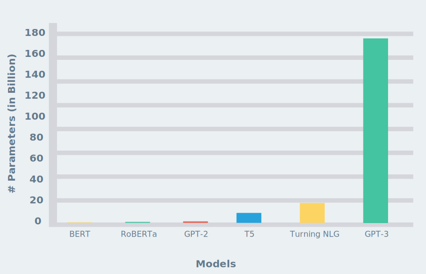

# introduction

Unless you’re living under a rock, you probably have heard about [OpenAI](https://openai.com/)'s GPT-3 language model.
You might also have seen all the crazy demos, where the model writes `JSX`, `HTML` code, or its capabilities in the area
of zero-shot / few-shot learning. [Simon O'Regan](https://twitter.com/Simon_O_Regan) wrote an
[article with excellent demos and projects built on top of GPT-3](https://towardsdatascience.com/gpt-3-demos-use-cases-implications-77f86e540dc1).

A Downside of GPT-3 is its 175 billion parameters, which results in a model size of around 350GB. For comparison, the
biggest implementation of the GPT-2 iteration has 1,5 billion parameters. This is less than 1/116 in size.

In fact, with close to 175B trainable parameters, GPT-3 is much bigger in terms of size in comparison to any other model
else out there. Here is a comparison of the number of parameters of recent popular NLP models, GPT-3 clearly stands out.



This is all magnificent, but you do not need 175 billion parameters to get good results in `text-generation`.

There are already tutorials on how to fine-tune GPT-2. But a lot of them are obsolete or outdated. In this tutorial, we
are going to use the `transformers` library by [Huggingface](https://huggingface.co/) in their newest version (3.1.0).
We will use the new `Trainer` class and fine-tune our GPT-2 Model with German recipes from
[chefkoch.de](http://chefkoch.de).

You can find everything we are doing in this
[colab notebook.](https://colab.research.google.com/github/philschmid/fine-tune-GPT-2/blob/master/Fine_tune_a_non_English_GPT_2_Model_with_Huggingface.ipynb)

---

## Transformers Library by [Huggingface](https://huggingface.co/)


The [Transformers library](https://github.com/huggingface/transformers) provides state-of-the-art machine learning
architectures like BERT, GPT-2, RoBERTa, XLM, DistilBert, XLNet, T5 for Natural Language Understanding (NLU), and
Natural Language Generation (NLG). It also provides thousands of pre-trained models in 100+ different languages and is
deeply interoperable between PyTorch & TensorFlow 2.0. It enables developers to fine-tune machine learning models for
different NLP-tasks like text classification, sentiment analysis, question-answering, or text generation.

---

# Tutorial

In the tutorial, we fine-tune a German GPT-2 from the [Huggingface model hub](https://huggingface.co/models). As data,
we use the [German Recipes Dataset](https://www.kaggle.com/sterby/german-recipes-dataset), which consists of 12190
german recipes with metadata crawled from [chefkoch.de](http://chefkoch.de/).

We will use the recipe Instructions to fine-tune our GPT-2 model and let us write recipes afterwards that we can cook.


We use a Google Colab with a GPU runtime for this tutorial. If you are not sure how to use a GPU Runtime take a look
[here](https://www.philschmid.de/google-colab-the-free-gpu-tpu-jupyter-notebook-service).

**What are we going to do:**

- load the dataset from Kaggle
- prepare the dataset and build a `TextDataset`
- initialize `Trainer` with `TrainingArguments` and GPT-2 model
- train and save the model
- test the model

You can find everything we do in this
[colab notebook.](https://colab.research.google.com/github/philschmid/fine-tune-GPT-2/blob/master/Fine_tune_a_non_English_GPT_2_Model_with_Huggingface.ipynb)

---

# Load the dataset from Kaggle

As already mentioned in the introduction of the tutorial we use the
"[German Recipes Dataset](https://www.kaggle.com/sterby/german-recipes-dataset)" dataset from Kaggle. The dataset
consists of 12190 german recipes with metadata crawled from [chefkoch.de](http://chefkoch.de/). In this example, we only
use the Instructions of the recipes. We download the dataset by using the "Download" button and upload it to our colab
notebook since it only has a zipped size of 4,7MB.


```python
#upload files to your colab environment
from google.colab import files
uploaded = files.upload()

#132879_316218_bundle_archive.zip(application/zip) - 4749666 bytes, last modified: 29.8.2020 - 100% done
#Saving 132879_316218_bundle_archive.zip to 132879_316218_bundle_archive.zip
```

After we uploaded the file we use `unzip` to extract the `recipes.json` .

```python
!unzip '132879_316218_bundle_archive.zip'

#Archive:  132879_316218_bundle_archive.zip
#inflating: recipes.json
```

_You also could use the `kaggle` CLI to download the dataset, but be aware you need your Kaggle credentials in the colab
notebook._

```python
kaggle datasets download -d sterby/german-recipes-dataset
```

here an example of a recipe.

```json
{
  "Url": "https://www.chefkoch.de/rezepte/2718181424631245/",
  "Instructions": "Vorab folgende Bemerkung: Alle Mengen sind Circa-Angaben und können nach Geschmack variiert werden!Das Gemüse putzen und in Stücke schneiden (die Tomaten brauchen nicht geschält zu werden!). Alle Zutaten werden im Mixer püriert, das muss wegen der Mengen in mehreren Partien geschehen, und zu jeder Partie muss auch etwas von der Brühe gegeben werden. Auch das Toastbrot wird mitpüriert, es dient der Bindung. Am Schluss lässt man das \u00d6l bei laufendem Mixer einflie\u00dfen. In einer gro\u00dfen Schüssel alles gut verrühren und für mindestens eine Stunde im Kühlschrank gut durchkühlen lassen.Mit frischem Baguette an hei\u00dfen Tagen ein Hochgenuss.Tipps: Wer mag, kann in kleine Würfel geschnittene Tomate, Gurke und Zwiebel separat dazu reichen.Die Suppe eignet sich hervorragend zum Einfrieren, so dass ich immer diese gro\u00dfe Menge zubereite, um den Arbeitsaufwand gering zu halten.",
  "Ingredients": [
    "1 kg Strauchtomate(n)",
    "1 Gemüsezwiebel(n)",
    "1 Salatgurke(n)",
    "1 Paprikaschote(n) nach Wahl",
    "6 Zehe/n Knoblauch",
    "1 Chilischote(n)",
    "15 EL Balsamico oder Weinessig",
    "6 EL Olivenöl",
    "4 Scheibe/n Toastbrot",
    "Salz und Pfeffer",
    "1 kl. Dose/n Tomate(n), geschälte, oder 1 Pck. pürierte Tomaten",
    "1/2Liter Brühe, kalte"
  ],
  "Day": 1,
  "Name": "Pilz Stroganoff",
  "Year": 2017,
  "Month": "July",
  "Weekday": "Saturday"
}
```

# Prepare the dataset and build a `TextDataset`

The next step is to extract the instructions from all recipes and build a `TextDataset`. The `TextDataset` is a custom
implementation of the
[Pytroch `Dataset` class](https://pytorch.org/tutorials/beginner/data_loading_tutorial.html#dataset-class) implemented
by the transformers library. If you want to know more about `Dataset` in Pytorch you can check out this
[youtube video](https://www.youtube.com/watch?v=PXOzkkB5eH0&ab_channel=PythonEngineer).

First, we split the `recipes.json` into a `train` and `test` section. Then we extract `Instructions` from the recipes
and write them into a `train_dataset.txt` and `test_dataset.txt`

```python
import re
import json
from sklearn.model_selection import train_test_split

with open('recipes.json') as f:
    data = json.load(f)

def build_text_files(data_json, dest_path):
    f = open(dest_path, 'w')
    data = ''
    for texts in data_json:
        summary = str(texts['Instructions']).strip()
        summary = re.sub(r"\s", " ", summary)
        data += summary + "  "
    f.write(data)

train, test = train_test_split(data,test_size=0.15)

build_text_files(train,'train_dataset.txt')
build_text_files(test,'test_dataset.txt')

print("Train dataset length: "+str(len(train)))
print("Test dataset length: "+ str(len(test)))

#Train dataset length: 10361
#Test dataset length: 1829
```

The next step is to download the tokenizer. We use the tokenizer from the `german-gpt2` model.

```python
from transformers import AutoTokenizer

tokenizer = AutoTokenizer.from_pretrained("anonymous-german-nlp/german-gpt2")

train_path = 'train_dataset.txt'
test_path = 'test_dataset.txt'
```

Now we can build our `TextDataset`. Therefore we create a `TextDataset` instance with the `tokenizer` and the path to
our datasets. We also create our `data_collator`, which is used in training to form a batch from our dataset.

```python
from transformers import TextDataset,DataCollatorForLanguageModeling

def load_dataset(train_path,test_path,tokenizer):
    train_dataset = TextDataset(
          tokenizer=tokenizer,
          file_path=train_path,
          block_size=128)

    test_dataset = TextDataset(
          tokenizer=tokenizer,
          file_path=test_path,
          block_size=128)

    data_collator = DataCollatorForLanguageModeling(
        tokenizer=tokenizer, mlm=False,
    )
    return train_dataset,test_dataset,data_collator

train_dataset,test_dataset,data_collator = load_dataset(train_path,test_path,tokenizer)
```

---

# Initialize `Trainer` with `TrainingArguments` and GPT-2 model

The [Trainer](https://huggingface.co/transformers/main_classes/trainer.html#transformers.Trainer) class provides an API
for feature-complete training. It is used in most of
the [example scripts](https://huggingface.co/transformers/examples.html) from Huggingface. Before we can instantiate our
`Trainer` we need to download our GPT-2 model and create
 [TrainingArguments](https://huggingface.co/transformers/main_classes/trainer.html#transformers.TrainingArguments). The
`TrainingArguments` are used to define the Hyperparameters, which we use in the training process like the
`learning_rate`, `num_train_epochs`, or `per_device_train_batch_size`. You can find a complete list
[here](https://huggingface.co/transformers/main_classes/trainer.html#trainingarguments).

```python
from transformers import Trainer, TrainingArguments, AutoModelWithLMHead

model = AutoModelWithLMHead.from_pretrained("anonymous-german-nlp/german-gpt2")

training_args = TrainingArguments(
    output_dir="./gpt2-gerchef", #The output directory
    overwrite_output_dir=True, #overwrite the content of the output directory
    num_train_epochs=3, # number of training epochs
    per_device_train_batch_size=32, # batch size for training
    per_device_eval_batch_size=64,  # batch size for evaluation
    eval_steps = 400, # Number of update steps between two evaluations.
    save_steps=800, # after # steps model is saved
    warmup_steps=500,# number of warmup steps for learning rate scheduler
    )

trainer = Trainer(
    model=model,
    args=training_args,
    data_collator=data_collator,
    train_dataset=train_dataset,
    eval_dataset=test_dataset,
    prediction_loss_only=True,
)
```

---

# Train and Save the model

To train the model we can simply run `trainer.train()`.

```python
trainer.train()
```

After training is done you can save the model by calling `save_model()`. This will save the trained model to our
`output_dir` from our `TrainingArguments`.

```python
trainer.save_model()
```

---

# Test the model

To test the model we use another
[highlight of the transformers library](https://huggingface.co/transformers/main_classes/pipelines.html?highlight=pipelines)
called `pipeline`. [Pipelines](https://huggingface.co/transformers/main_classes/pipelines.html?highlight=pipelines) are
objects that offer a simple API dedicated to several tasks, `text-generation` amongst others.

```python
from transformers import pipeline

chef = pipeline('text-generation',model='./gpt2-gerchef', tokenizer='anonymous-german-nlp/german-gpt2',config={'max_length':800})

result = chef('Zuerst Tomaten')[0]['generated_text']

```

result:

"_Zuerst Tomaten dazu geben und 2 Minuten kochen lassen. Die Linsen ebenfalls in der Brühe anbrühen.Die Tomaten
auspressen. Mit der Butter verrühren. Den Kohl sowie die Kartoffeln andünsten, bis sie weich sind. "_

Well, thats it. We've done it👨🏻‍🍳. We have successfully fine-tuned our gpt-2 model to write us recipes.

To improve our results we could train it longer and adjust our `TrainingArguments` or enlarge the dataset.

---

You can find everything in this
[colab notebook.](https://colab.research.google.com/github/philschmid/fine-tune-GPT-2/blob/master/Fine_tune_a_non_English_GPT_2_Model_with_Huggingface.ipynb)

Thanks for reading. If you have any questions, feel free to contact me or comment on this article. You can also connect
with me on [Twitter](https://twitter.com/_philschmid) or
[LinkedIn](https://www.linkedin.com/in/philipp-schmid-a6a2bb196/).
