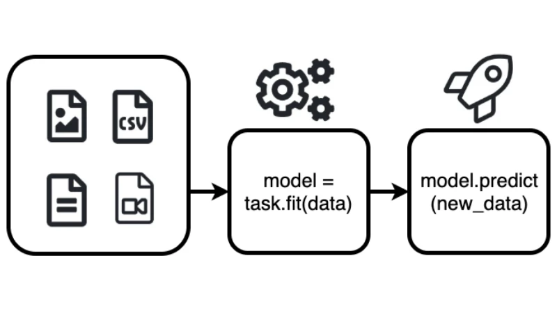

# Introduction

Google [CEO Sundar Pichai wrote](https://blog.google/technology/ai/making-ai-work-for-everyone/), “... _designing neural
nets is extremely time intensive, and requires an expertise that limits its use to a smaller community of scientists and
engineers._" Shortly after this Google launched its service AutoML in early 2018.

AutoML aims to enable developers with limited machine learning expertise to train high-quality models specific to their
business needs. The goal of AutoML is to automate all the major repetitive tasks such as
[feature selection](https://en.wikipedia.org/wiki/Feature_selection) or
[hyperparameter tuning](https://en.wikipedia.org/wiki/Hyperparameter_optimization). This allows creating more models in
less time with improved quality and accuracy.

A basic two step approach to machine learning: First, the model is created by fitting it to the data. Second, the model
is used to predict the output for new (previously unseen) data.



This blog post demonstrates how to get started quickly with AutoML. It will give you a step-by-step tutorial on how to
built an Object Detection Model using AutoGluon, with top-notch accuracy. I created a
[Google Colab Notebook](https://colab.research.google.com/drive/1Z0F2FOowLWrJ-gYx72fiWLIpmEVMk4Bo) with a full example.

---

# AWS is entering the field of AutoML

At Re:Invent 2019 AWS launched a bunch on add-ons for there
[managed machine Learning service Sagemaker](https://aws.amazon.com/sagemaker/?nc1=h_ls) amongst other
"**[Sagemaker Autopilot](https://aws.amazon.com/sagemaker/autopilot/?nc1=h_ls)**". Sagemaker Autopilot is an AutoML
Service comparable to Google AutoML service.

In January 2020 Amazon Web Services Inc. (AWS) secretly launched an open-source library called
**[AutoGluon](https://autogluon.mxnet.io/)** the library behind Sagemaker Autopilot.

AutoGluon enables developers to write machine learning-based applications that use image, text or tabular data sets with
just a few lines of code.


With those tools, AWS has entered the field of managed AutoML Services or MLaas and to compete
[Google with its AutoML](https://cloud.google.com/automl?hl=de) service.

---

# What is AutoGluon?

"_[AutoGluon](https://autogluon.mxnet.io/index.html) enables easy-to-use and easy-to-extend AutoML with a focus on deep
learning and real-world applications spanning image, text, or tabular data. Intended for both ML beginners and experts,
AutoGluon enables you to... "_

- quickly prototype deep learning solutions
- automatic hyperparameter tuning, model selection / architecture search
- improve existing bespoke models and data pipelines \*\*

AutoGluon enables you to build machine learning models with only 3 Lines of Code.

```python
from autogluon import TabularPrediction as task

predictor = task.fit(train_data=task.Dataset(file_path="TRAIN_DATA.csv"), label="PREDICT_COLUMN")
predictions = predictor.predict(task.Dataset(file_path="TEST_DATA.csv"))
```

Currently, AutoGluon can create models for image classification, object detection, text classification, and supervised
learning with tabular datasets.

If you are interested in how AutoGluon is doing all the magic behind the scenes take a look at the
"[Machine learning with AutoGluon, an open source AutoML library](https://aws.amazon.com/blogs/opensource/machine-learning-with-autogluon-an-open-source-automl-library/)"
Post on the AWS Open Source Blog.

---

# Tutorial

We are going to build an Object Detection Model, to detect fruits (apple, orange and banana) on images. I built a small
dataset with around 300 images to achieve a quick training process.
[You can find the dataset here.](https://www.kaggle.com/philschmid/tiny-fruit-object-detection/metadata)

I am using Google Colab with a GPU runtime for this tutorial. If you are not sure how to use a GPU Runtime take a look
[here](https://www.philschmid.de/google-colab-the-free-gpu-tpu-jupyter-notebook-service).

Okay, now let's get started with the tutorial.

---

# Installing AutoGluon

AutoGluon offers different installation packages for different hardware preferences. For more installation instructions
take a look at the [AutoGluon Installation Guide here.](https://autogluon.mxnet.io/#installation)

The first step is to install `AutoGluon` with pip and CUDA support.

```python
# Here we assume CUDA 10.0 is installed.  You should change the number
# according to your own CUDA version (e.g. mxnet-cu101 for CUDA 10.1).
!pip install --upgrade mxnet-cu100
!pip install autogluon
```

For AutoGluon to work in Google Colab, we also have to install `ipykernel` and restart the runtime.

```python
    !pip install -U ipykernel
```

After a successful restart of your runtime you can import `autogluon` and print out the version.

```python
import autogluon as ag
from autogluon import ObjectDetection as task

print(ag.__version__)

# >>>> '0.0.6'
```

---

# Loading data and creating datasets

The next step is to load the dataset we use for the object detection task. In the `ObjectDetection` task from AutoGluon,
you can either use PASCAL VOC format or the COCO format by adjusting the `format` parameter of `Dataset()` to either
`coco` or `voc`. The
[Pascal VOC](https://gluon-cv.mxnet.io/build/examples_datasets/detection_custom.html#pascal-voc-like) Dataset contains
two directories: `Annotations` and `JPEGImages`. The
[COCO](https://www.immersivelimit.com/tutorials/create-coco-annotations-from-scratch/#coco-dataset-format) dataset is
formatted in `JSON` and is a collection of "info", "licenses", "images", "annotations", "categories".

For training, we are going to use the
[tiny_fruit_object_detection](https://www.kaggle.com/philschmid/tiny-fruit-object-detection/metadata) dataset, which I
build. The Dataset contains around 300 images of bananas, apples, oranges or a combination of them together.

We are using 240 images for training, 30 for testing and 30 for evaluating the model.


Using the commands below, we can `download` and `unzip` this dataset, which is only 29MB. After this we create our
`Dataset` for train and test with `task.Dataset()`.

```python
# download the data
root = './'
filename_zip = ag.download('https://philschmid-datasets.s3.eu-central-1.amazonaws.com/tiny_fruit.zip',
                        path=root)
# unzip data
filename = ag.unzip(filename_zip, root=root)

# create Dataset
data_root = os.path.join(root, filename)
# train dataset
dataset_train = task.Dataset(data_root, classes=('banana','apple','orange'),format='voc')
# test dataset
dataset_test = task.Dataset(data_root, index_file_name='test', classes=('banana','apple','orange'),format='voc')
```

---

# Training the Model

The third step is to train our model with the created `dataset`. In AutoGluon you define your classifier as variable,
here `detector` and define parameters in the `fit()` function during train-time. For example, you can define a
`time_limit` which automatically stops the training after a certain time. You can define a range for your own
`learning_rate` or set the number of `epochs`. One of the most important parameters is `num_trials`. This parameter
defines the maximum number of hyperparameter configurations to try out. You can find the full documentation of the
[configurable parameters here](https://autogluon.mxnet.io/api/autogluon.task.html#autogluon.task.ObjectDetection).

We are going to train our model for `20 epochs` and train 3 different models by setting `num_trials=3`.

```python
from autogluon import ObjectDetection as task

epochs = 20
detector = task.fit(dataset_train,
                    num_trials=3,
                    epochs=epochs,
                    lr=ag.Categorical(5e-4, 1e-4, 3e-4),
                                        ngpus_per_trial=1)
```

As a result, we are getting a chart with the mean average precision (mAP) and the number of epochs. The mAP is a common
metric to calculate the accuracy of an object detection model.

Our best model (blue-line) achieved an mAP of `0.9198171507070327`

## 

# Evaluating the Model

After finishing training, we are now going to evaluate/test the performance of our model on our `test` dataset

```python
test_map = detector.evaluate(dataset_test)
print(f"The mAP on the test dataset is {test_map[1][1]}")
```

The mAP on the test dataset is `0.8724113724113725` which is pretty good considering we only training with 240 Images
and 20 epochs.

---

# Predict an Image

To use our trained model for predicting you can simply run `detector.predict(image_path)`, which will return a tuple
(`ind`) containing the class-IDs of detected objects, the confidence-scores (`prob`), and the corresponding predicted
bounding box locations (`loc`).

```pthon
image = 'mixed_10.jpg'
image_path = os.path.join(data_root, 'JPEGImages', image)

ind, prob, loc = detector.predict(image_path)
```

## 

# Save Model

_As of the time writing this article, saving an object detection model is not yet implemented in version `0.0.6`, but
will be in the next deployed version._

To save your model, you only have to run `detector.save()`

```python
savefile = 'model.pkl'
detector.save(savefile)
```

---

# Load Model

_As of the time writing this article, loading an object detection model is not yet implemented in version `0.0.6`, but
will be in the next deployed version._

```python
from autogluon import Detector
new_detector = Detector.load(savefile)

image = 'mixed_17.jpg'
image_path = os.path.join(data_root, 'JPEGImages', image)

detector.predict(image_path)
```

---

Thanks for reading. You can find the
[Google Colab Notebook](https://colab.research.google.com/drive/1Z0F2FOowLWrJ-gYx72fiWLIpmEVMk4Bo) containing a full
example [here](https://colab.research.google.com/drive/1Z0F2FOowLWrJ-gYx72fiWLIpmEVMk4Bo#scrollTo=XtuOeo_ZzLMq).
