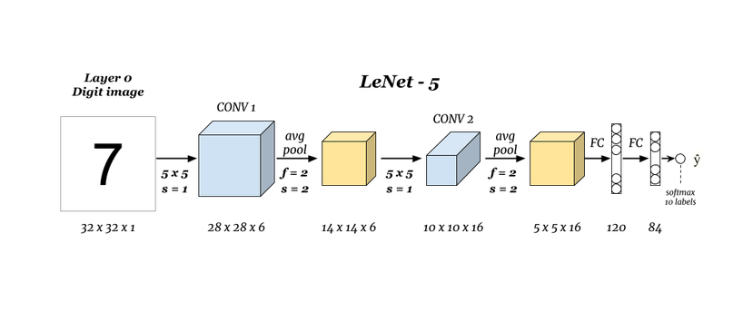
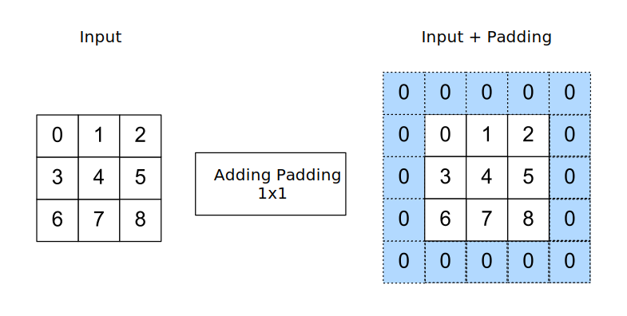
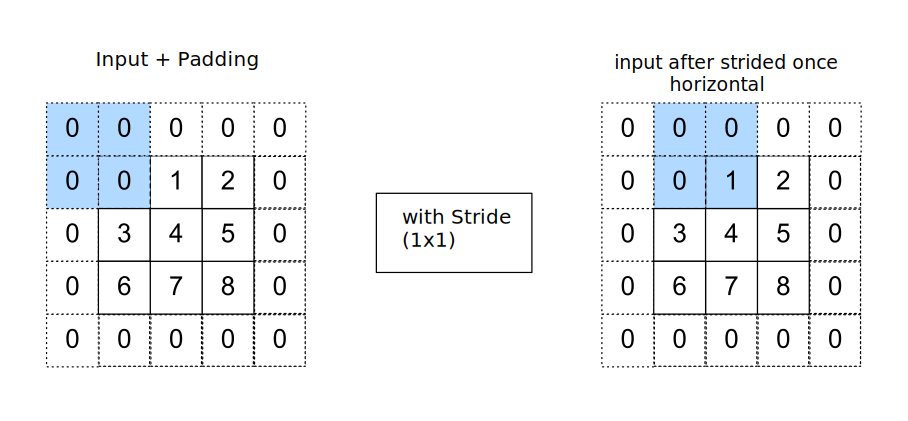
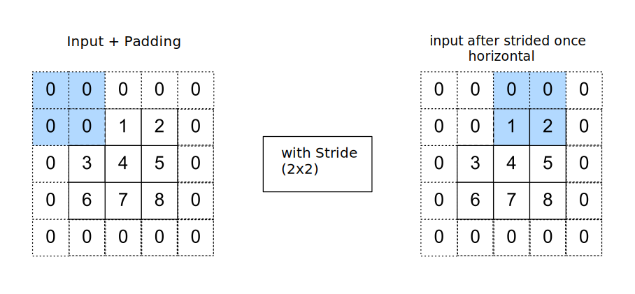
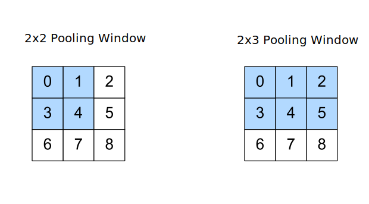
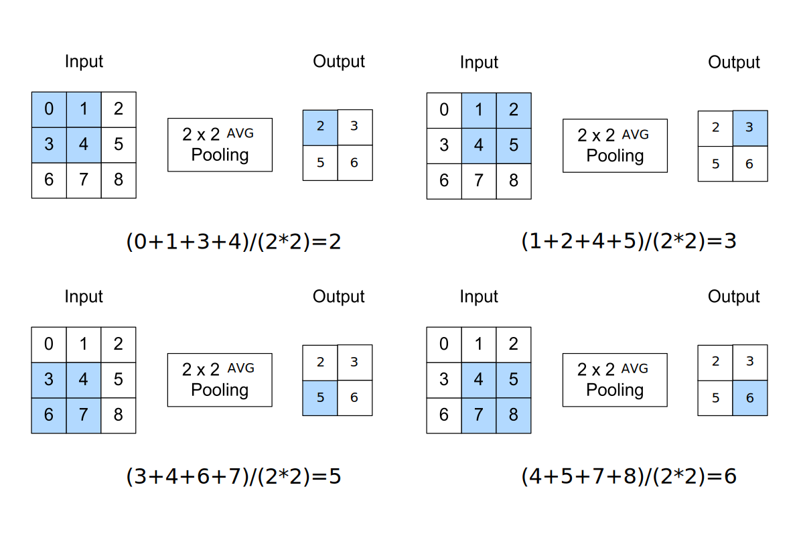
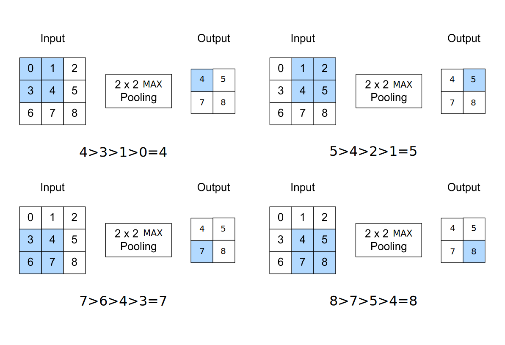

# Introduction

The idea of CNNs is intelligently adapt to the properties of images by reducing the dimension. To achieve this
convolutional layer and pooling layer are used. Convolutional layers are reducing the dimensions by adding filters
(kernel windows) to the Input. The dimension can reduce by applying kernel windows to calculate new outputs. Assuming
the input shape is $$n_{h} x n_{w}$$ and the kernel window ist $$k_{h} x k_{w}$$ then the output shape will be.

$$
(n_{h} - k _{h}+1 )\ x\ (n_{w} - k_{w}+1 )
$$

Pooling Layers are reducing the dimension by aggregating the input elements. Assuming the input shape is
$$n_{h} x n_{w}$$ and the pooling method is average with a kernel window of $$k_{h} x k_{w}$$ then the output shape will
be

$$
(n - k +p+s)/s
$$

The Explanation for $$p$$ and $$s$$ will follow in the section of Stride and Padding.

## Example CNNs Architecture LeNet-5

 This is the architecture of LeNet-5 created by **Yann LeCun** in 1998 and
widely used for written digits recognition (MNIST).

To understand what is happening in each layer we have to clarify a few basics. Let’s start with Stride and Padding

# Stride and Padding

As described in the introduction the goal of a CNNs is to reduce the dimension by applying a layer. A tricky part of
reducing dimensions is not to erase peaces of information from the original input, for example, if you have an input of
100 x 100 and apply 5 layer of 5 x 5 you reduce the size of dimension to 80 x 80 or you erase 20% in 5 layers. This is
where Stride and Padding can be helpful.

$$
(100_{h} - 5_{h}+1 )\ x\ (100_{w} - 5_{w}+1 ) = 95\newline repeat\ it\ 5\ times
$$

## Padding

You can define padding as adding extra pixels as filler around the original input to decrease the erasion of
information.

 Example of adding p (1x1) to an input. If we add padding
to our input the formula for calculating the output changes to

$$
(n_{h} - k _{h}+p_{h}+1 )\ x \ n_{w} - k_{w}+p_{w}+1 )
$$

if we now add a 1x1 padding to our 100 x 100 input example the reduction of the dimension changes to 85 x 85.

## Stride

When calculating inputs with kernel window you start at the top-left corner of the input and then slide it overall
locations from left to right and top to bottom. The default behavior is sliding by one at a time. The problem of sliding
by one can sometimes result in computational inefficency for example, if you have a 4k input image you don’t want to
calculate and slide by one. To optimize this we can slide by more than one to downsample our output. This sliding is
called _stride_.

 If we add stride to our input the formula for calculating
the output changes to

$$
(n_{h} - k _{h}+p_{h}+s_{h})/s_{h}\ x \ n_{w} - k_{w}+p_{w}+/s_{w} )/s_{w}
$$

if we now add a 2x2 stride to our 100 x 100 input example with padding and apply only 1 layer the reduction of the
dimension changes to 49 x 49. _If you have stride of 0 or None just means having a stride of 1._

# Pooling Layer

Pooling layers are used to reduce the dimension of input tensors by aggregating information. Pooling layer don’t have
parameter like Convolutional layer do. Pooling operators are deterministic (all events - especially future ones - are
clearly defined by preconditions). Typically Pooling layers are calculating either the maximum (Max Pooling Layer) or
the average (Average Pooling Layer) value of the elements in the pooling window. A Pooling window is normally a 2x2
cutout from your input. The size of the pooling window can be tuned, but in most cases, it is 2x2 or 2x2x2.  
—_Pooling with a pooling window of XxY is called 2D Pooling and with a pooling window of XxYxZ it is called 3d Pooling._
—  
_X x Y => X is vertidal and Y is horizontal_ 

## Average 2D Pooling Layer

Average Pooling is calculating the mean of the given input. It is calculating the Sum of all elements and dividing it by
the size of the pooling window. 

## Max 2D Pooling Layer

Max Pooling is extracting the maximum number of the given input. It is comparing each element and extracting the element
with the highest value. 

# Fully-Connected / Dense Layer

A Fully-Connected / Dense Layer represents a matrix-vector multiplication, where each input Neuron is connected to the
output Neuron by a weight. A dense layer is used to change the dimensions of your input. Mathematically speaking, it
applies a rotation, scaling, translation transform to your vector.

Dense Layer are calculated same as linear layers $$wx+b$$, but the end result is passed through **Activation function**.

$$
((current\ layer\ n *previous\ layer\ n(X\ x\ X\ x\ X))+b
$$

# Calculating CNN-Layers in LeNet-5

For Calculating the CNN-Layers we are using the formula from Yann LeCun
[LeNet-5 Paper](http://yann.lecun.com/exdb/publis/pdf/lecun-01a.pdf)

$$
(n_{h} +2p_{h}-f_{h})/ s_{h} +1\ x\ (n_{w} +2p_{w} -f_{w})/ s_{w} +1\ x\ Nc
$$

### Variable definiton

$$n=dimension\ of\ input-tensor$$  
$$p=padding\ (32x32\ by\ p=1\ \rightarrow\ 34x34)$$  
$$f= filter\ size$$  
$$Nc = number\ of\ filters $$

The LeNet-5 was trained with Images of the Size of 32x32x1. The first Layer are 6 5x5 filters applied with a stride
of 1. This results in the following variables:

### Calculating first layer

Variables are defined like:  
$$n=32$$  
$$p=0$$  
$$f=5$$  
$$s=1$$  
$$Nc=6$$  
Add Variables to the formula:

$$
(32+(2*0)-5)/1+1\ x\ (32+(2*0)-5)/1+1\ x\ 6\ ==\ 28\ x\ 28\ x\ 6
$$

## Calculating Pooling-Layers in LeNet-5

The LeNet-5 is using average pooling back then when [this paper](http://yann.lecun.com/exdb/publis/pdf/lecun-01a.pdf)
was published, people used average pooling much more than max pooling.

$$
(n - k +p+s)/s\ x\ (n - k +p+s)/s\ x\ Nc
$$

### Variable definition

$$n=dimension\ of\ input-tensor$$  
$$k=pooling\ window\ size$$  
$$p=padding\ (32x32\ by\ p=1\ \rightarrow\ 34x34)$$  
$$s=stride$$

### Calculating first layer

Variables are defined like:  
$$n=28$$  
$$k=2$$  
$$p=0$$  
$$s=2$$  
$$Nc=6$$  
Add Variables to the formula:

$$
(28- 2 +0+2)/2\ x\ (28 - 2 +0+2)/2\ x\ 6 == \ 14\ x\ 14\ x\ 6
$$

The calculation can now be done analogously for the remaining layers until the last layer before you would reached 1x1xX
output-layer. Afterward you use FC-Layers and softmax for your classification.

---

Refrence:  
[vdumoulin/conv_arithmetic · GitHub](https://github.com/vdumoulin/conv_arithmetic/blob/master/README.md)

---

Thanks for reading my first blog post about Google Colaboratory.  
See you soon :)
