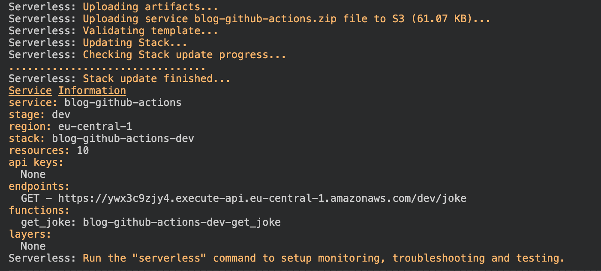
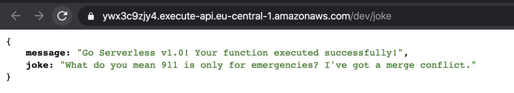
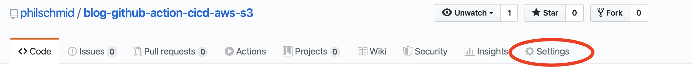
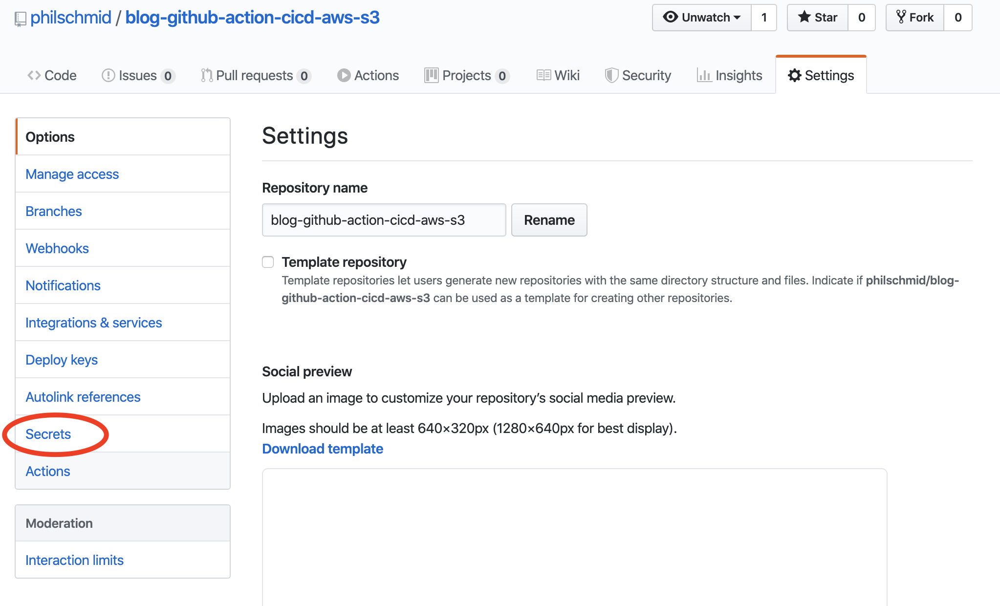
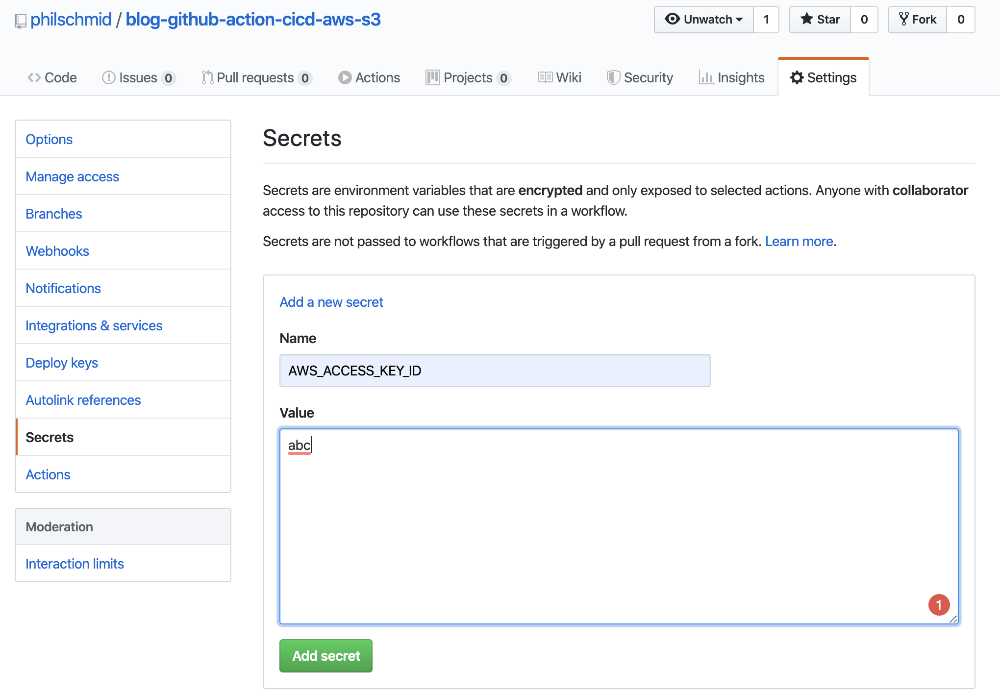
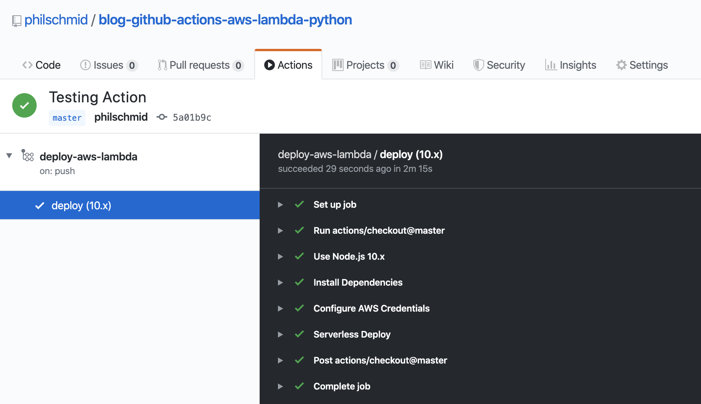
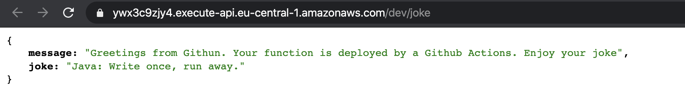

# Introduction

A CI/CD pipeline functional for your project is incredibly valuable as a developer. Thankfully, it’s not difficult to
set up such a pipeline with Github Actions.

In my previous
article, [Set up a CI/CD Pipeline for your Web app on AWS with Github Actions](https://www.philschmid.de/set-up-a-ci-cd-pipeline-for-your-web-app-on-aws-with-github-actions),
I demonstrated how to set up a CI/CD pipeline for your front end application. This time, I’ll focus on the back end.

I’m going to give you a quick and easy, step-by-step tutorial on setting up a CI/CD Pipeline for AWS Lambda with Github
Actions. For my AWS Lambda, I chose Python for the runtime. I’ll also cover how to include Python packages such
as `scikit-learn` or `pandas`.

---

# TL;DR

If you don't want to read the complete post, just copy the action
and `Serverless` configuration [from this Github repository](https://github.com/philschmid/blog-github-actions-aws-lambda-python) and
add the Github secrets to your repository. If you fail, come back and read the article!

---

# Requirements

This post assumes you have the [Serverless Framework](https://serverless.com/) for deploying an AWS Lambda function
installed a configured, as well as a working Github account and Docker installed. The Serverless Framework helps us
develop and deploy AWS Lambda functions. It’s a CLI that offers structure, automation, and best practices right out of
the box. It also allows you to focus on building sophisticated, event-driven, serverless architectures, comprised of
functions and events.


If you aren’t familiar or haven’t set up the Serverless Framework, take a look at
this [quick-start with the Serverless Framework](https://serverless.com/framework/docs/providers/aws/guide/quick-start/).

Now let’s get started with the tutorial.

---

# Create AWS Lambda function

The first thing we are doing is creating our AWS Lambda function by using the Serverless CLI with the `aws-python3`
template.

    serverless create --template aws-python3 --path <your-path>

This CLI command will create a new directory with a `handler.py`, `.gitignore` and `serverless.yaml` file in it. The
`handler.py` contains some basic boilerplate code.

```python
import json


def hello(event, context):
    body = {
        "message": "Go Serverless v1.0! Your function executed successfully!",
        "input":event
    }
    response = {
        "statusCode": 200,
        "body": json.dumps(body)
    }
    return response
```

The `serverless.yaml` contains the configuration for deploying the function. if you are interested in what can be
configured with the `serverless.yaml` take a look
[here](https://serverless.com/framework/docs/providers/aws/guide/serverless.yml/).

---

# Add Python Requirements

Next, we are adding our Python Requirements to our AWS Lambda function. For this we are using the Serverless plugin
`serverless-python-requirements` . It automatically bundle requirements from a `requirements.txt` and makes them
available in our `PYTHONPATH`. The `serverless-python-requirements` plugin allows you to even bundle non-pure-Python
modules.
[if you are interested take a look here.](https://github.com/UnitedIncome/serverless-python-requirements#readme)

### Installing the plugin

To install the plugin run the following command.

```bash
    serverless plugin install -n serverless-python-requirements
```

This will automatically add the plugin to your project's `package.json` and to the plugins section in the
`serverless.yml`. The next step is adjusting the `serverless.yaml` and including the `custom` Python requirement
configuration. We need this extra configuration because our Github Actions runtime is Node and with the configuration,
we can bundle our python requirements in a docker container.

I also...

- deleted all comments
- add HTTP-Event
- add the `package` section to exclude the `node_modulues` from deploying
- change the region to `eu-central-1`

```yaml
service: <name-of-your-function>

provider:
  name: aws
  runtime: python3.7
  region: eu-central-1

custom:
  pythonRequirements:
    dockerizePip: true

package:
  individually: false
  exclude:
    - package.json
    - package-log.json
    - node_modules/**

functions:
  get_joke:
    handler: handler.get_joke
    events:
      - http:
          path: joke
          method: get

plugins:
  - serverless-python-requirements
```

### Creating deploy script

In addition to our configuration in the `serverless.yaml` we need to edit the `package.json` and include `serverless` as
`devDependencies`. Additionally, we add a `deploy` script to deploy the function later. We are going to use this deploy
script in the Github Action later.

```json
{
  "name": "blog-github-actions-aws-lambda-python",
  "description": "",
  "version": "0.1.0",
  "dependencies": {},
  "scripts": {
    "deploy": "serverless deploy"
  },
  "devDependencies": {
    "serverless": "^1.67.0",
    "serverless-python-requirements": "^5.1.0"
  }
}
```

### Adding Requirements to `requirements.txt`

We have to create a `requirements.txt` file on the root level, with all required Python packages. But you have to be
careful that the deployment package size cannot go over 250MB unzipped. You can find a list of all AWS Lambda
limitations [here](https://docs.aws.amazon.com/lambda/latest/dg/gettingstarted-limits.html).

Another tip: the `boto3` package is already pre-installed you don´t have to include it in the `requirements.txt`.

For demonstration purposes, i choose the `pyjokes` packages and let the function respond with a joke to all requests. I
include `pyjokes` in the `requirements.txt`

```
pyjokes
```

Afterward i add `pyjokes` to the function in `handler.py` and return a random joke.

```python
import json
import pyjokes


def get_joke(event, context):
    body = {
        "message": "Go Serverless v1.0! Your function executed successfully!",
        "joke":pyjokes.get_joke()
    }
    response = {
        "statusCode": 200,
        "body": json.dumps(body)
    }
    return response
```

---

# Deploy Function manually

Before using Github Actions we are deploying the function by hand with the following command.

**Attention Docker must be up and running.**

```bash
    npm run-script deploy
```

In your CLI you should see an output like this.



We can test our function by clicking the url provided in the `endpoints` section.



---

# Create Github Actions

## Create folders & files

The first thing we have to do for our Action is to create the folder `.github` with a folder `workflows` in it on your
project root level. Afterwards create the `deploy-aws-lambda.yaml` file in it.

## Creating the Github Action

Copy this code snippet into the `deploy-aws-lambda.yaml` file.

```yaml
name: deploy-aws-lambda

on:
  push:
    branches:
      - master
jobs:
  deploy:
    runs-on: ubuntu-latest
    strategy:
      matrix:
        node-version: [10.x]
    steps:
      - uses: actions/checkout@master
      - name: Use Node.js ${{ matrix.node-version }}
        uses: actions/setup-node@v1
        with:
          node-version: ${{ matrix.node-version }}
      - name: Install Dependencies
        run: npm install
      - name: Configure AWS Credentials
        uses: aws-actions/configure-aws-credentials@v1
        with:
          aws-access-key-id: ${{ secrets.AWS_ACCESS_KEY_ID }}
          aws-secret-access-key: ${{ secrets.AWS_SECRET_ACCESS_KEY }}
          aws-region: eu-central-1
      - name: Serverless Deploy
        run: npm run-script deploy
```

This code snippet describes the Action. The Github Action will be triggered after a `push` on the `master` branch. You
can change this by adjusting the `on` section in the snippet. If you want a different trigger for your action look
[here](https://help.github.com/en/actions/reference/events-that-trigger-workflows).

## Add secrets to your repository

The third and last step is adding secrets to your Github repository. For this Github Action, we need the access key ID
and secret access key from IAM User as secrets called `AWS_ACCESS_KEY_ID` and `AWS_SECRET_ACCESS_KEY`.

If you are not sure how to create an IAM user for the access key ID and secret access key you can read
[here](https://serverless-stack.com/chapters/create-an-iam-user.html).

### Adding the secrets

To add the secrets you have to go to the “settings” tab of your repository.



Then go to secrets in the left navigation panel.



On the secrets page, you can add your 2 secrets `AWS_ACCESS_KEY_ID` and `AWS_SECRET_ACCESS_KEY`.



## Grab a coffee and enjoy it

We´re almost done. The Last step is to test it. Therefore edit the `handler.py` and push it to the master branch of your
repository.

```python
import json
import pyjokes


def get_joke(event, context):
    body = {
        "message": "Greetings from Github. Your function is deployed by a Github Actions. Enjoy your joke",
        "joke":pyjokes.get_joke()
    }
    response = {
        "statusCode": 200,
        "body": json.dumps(body)
    }
    return response
```

After the push, we can see our Action deploying our AWS Lambda Function.



After a successful run of our Github Action, we can request our function again to see if it worked.



---

I created a demo repository with a full example. You can find the repository
[here](https://github.com/philschmid/blog-github-actions-aws-lambda-python). If something is unclear let me know and i
will adjust it.
