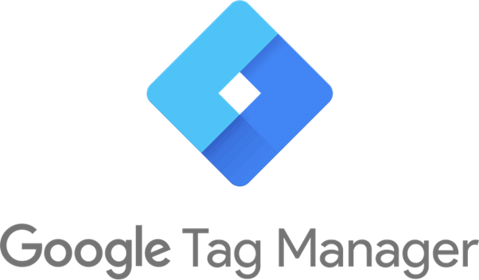

# Introduction

_"Web analytics is the measurement, collection, analysis, and reporting of web data for purposes of understanding and
optimizing web usage. However, Web analytics is not just a process for measuring web traffic but can be used as a tool
for business and market research, and to assess and improve the effectiveness of a website."
[Source](https://en.wikipedia.org/wiki/Web_analytics)_

so web analytics enables you to:

- connect your user behavior with technical insights.
- improve your customer experience, by understanding your users and where they might get stuck.
- track the value of expenses through user conversions.
- learn to know your target group and how you can reach them.
- ...

Due to these facts, more than 50 million websites/web apps around the world use analytics tools like Google Analytics.
Most of these tools use cookies to track user behaviors. If you live in Europe you probably have heard of the
[GDPR, the regulation in EU law on data protection and privacy](https://en.wikipedia.org/wiki/General_Data_Protection_Regulation).
Due to the GDPR, it is no longer easy to use cookies for web analytics. I am neither a lawyer nor I want to go into
detail here. If you want to know more about it and be secure you have to talk to a lawyer. Google also provides a
[website with information about it](https://privacy.google.com/businesses/compliance/).

But I can help you learn how to use Google Tag Manager and Google Analytics without cookies.

---

# Google Tag Manager



Google Tag Manager is a free tool, which allows you to manage and deploy marketing/analytics tags (snippets of code) on
your website/web app. These Tags can be used to share information from one data source (e.g. your website) to another
data source (e.g. Google Analytics).

The key components of Google Tag Manager are **Tags**, **Triggers** and **Variables.**

**Tags** are snippets of code, which tell Google Tag Manager what to do. Examples of Tags are Google Analytics, Google
Adwords, Facebook Pixel.

**Triggers** are the way events are handled. They tell Google Tag Manager what to do and when to do it. Examples of
Triggers are `page view`, `window.loaded`, `clicks`, Javascript `errors`, or `custom events` (Javascript functions).

**Variables** are additional information for your Tags and Triggers to work. Examples are DOM elements, click classes,
click text.

Google even has a [video series](https://www.youtube.com/watch?v=9A-i7EWXzjs) on how to get started with Google Tag
Manager.

---

# Purpose

I write this tutorial because I saw a gap in the documentation of Google Tag Manager and how to use it without cookies.
The Google Analytics documentation already includes examples
[on how to use Google Analytics without cookies](https://developers.google.com/analytics/devguides/collection/analyticsjs/cookies-user-id#using_localstorage_to_store_the_client_id)
but not for Google Tag Manager.

Google Tag Manager has different attribute keys when using the Tag Google Analytics than using Google Analytics
standalone. In Google Analytics you have the attribute `clientId` and in Google Tag Manager you have the attribute
`client_id`.

Google is providing a
[list of these field mappings](https://developers.google.com/analytics/devguides/collection/gtagjs/migration) but the
list is missing the important attribute mapping for `storage`, which is needed to prevent the creation of cookies.

---

# Tutorial

In this tutorial, we use Google Analytics as a Tag. Before we get started make sure you have a valid
`GA_MEASUREMENT_ID`. I assume that you have already worked before with Google Analytics and you are therefore familiar
with the terminologies used.

In their
"[getting started with Google Tag Manager](https://developers.google.com/analytics/devguides/collection/gtagjs)" Gooogle
provides a snippet, with which you initialize Google Tag Manager with Google Analytics as Tag. But this would create
cookies for it.

```html
<!-- Global site tag (gtag.js) - Google Analytics -->
<script async src="https://www.googletagmanager.com/gtag/js?id=GA_MEASUREMENT_ID"></script>
<script>
  window.dataLayer = window.dataLayer || [];
  function gtag() {
    dataLayer.push(arguments);
  }
  gtag('js', new Date());

  gtag('config', 'GA_MEASUREMENT_ID');
</script>
```

To initialize Google Tag Manager without cookies, we only need to add two attributes to `'config'`.

```html
<!-- Global site tag (gtag.js) - Google Analytics with out cookies -->
<script async src="https://www.googletagmanager.com/gtag/js?id=GA_MEASUREMENT_ID"></script>
<script>
  window.dataLayer = window.dataLayer || [];
  function gtag() {
    dataLayer.push(arguments);
  }
  gtag('js', new Date());

  gtag('config', 'GA_MEASUREMENT_ID', {
    client_storage: 'none',
    client_id: CLIENT_ID,
  });
</script>
```

The only issue we face without cookies is that we need to save the `client_id` somewhere. Normally the `client_id`is
saved in the cookie. To overcome this we save the `client_id` in `window.localstorage`. We also need to create the
`values` of the `client_id`.
[The `client_id` is basically the device id](https://support.google.com/analytics/answer/6205850?hl=en).

We can use any value for the `client_id`but to be sure we won`t get any duplicates we use a`uuid` for this.

Below, you find a complete example, which generates a `uuid` for the `client_id` save it in `window.localstorage` and
initializes Google Tag Manager.

```html
<!-- Global site tag (gtag.js) - Google Analytics with out cookies -->
<script async src="https://www.googletagmanager.com/gtag/js?id=GA_MEASUREMENT_ID"></script>
<script async src="https://cdn.jsdelivr.net/npm/uuid@latest/dist/umd/uuidv4.min.js"></script>

<script>
  // https://developers.google.com/tag-manager/devguide
  window.dataLayer = window.dataLayer || [];
  function gtag() {
    dataLayer.push(arguments);
  }
  gtag('js', new Date());

  // defines window.localstorage key
  const GA_LOCAL_STORAGE_KEY = 'ga:clientId';

  // checks if localstorage is available
  if (window.localStorage) {
    // checks if user was already connected and loads client_id from localstorage
    if (localStorage.getItem(GA_LOCAL_STORAGE_KEY)) {
      // creates new tracker with same client_id as the last time the user visited
      gtag('js', new Date());
      gtag('config', 'GA_MEASUREMENT_ID', {
        send_page_view: true,
        client_storage: 'none',
        client_id: localStorage.getItem(GA_LOCAL_STORAGE_KEY),
      });
    } else {
      // creates client_id and saves it in localStorage -> currently random number better would be a uuid
      window.localStorage.setItem(GA_LOCAL_STORAGE_KEY, uuidv4());
      // creates new tracker with the new client_id
      gtag('js', new Date());
      gtag('config', 'GA_MEASUREMENT_ID', {
        send_page_view: true,
        client_storage: 'none',
        client_id: localStorage.getItem(GA_LOCAL_STORAGE_KEY),
      });
    }
  }
</script>
```

---

Thanks for reading. If you have any questions, feel free to contact me or comment on this article. You can also connect
with me on [Twitter](https://twitter.com/_philschmid) or
[LinkedIn](https://www.linkedin.com/in/philipp-schmid-a6a2bb196/).
