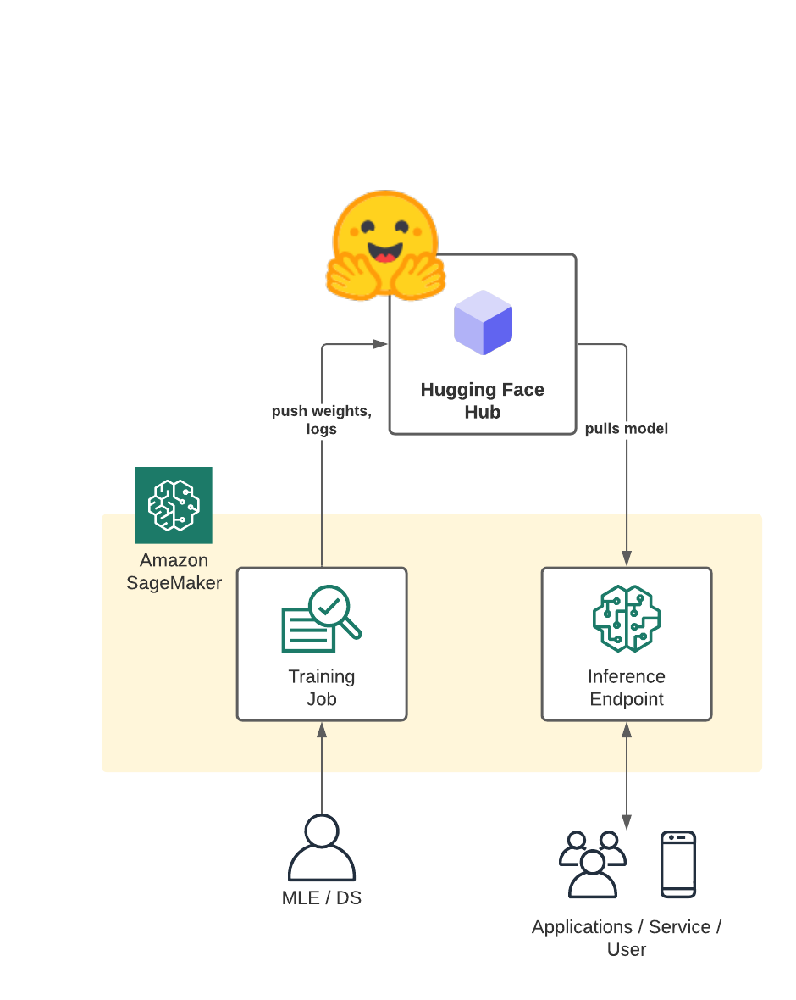

# Introduction

The [Hugging Face Hub](hf.co/models) is the largest collection of models, datasets, and metrics in order to democratize and advance AI for everyone 🚀. The Hugging Face Hub works as a central place where anyone can share and explore models and datasets. 

In this blog post you will learn how to automatically save your model weights, logs, and artifacts to the Hugging Face Hub using Amazon SageMaker and how to deploy the model afterwards for inference.  🏎 

This will allow you to use the Hugging Face Hub as the backbone of your model-versioning, -storage & -management 👔

You will be able to easily share your models inside your own private organization or with the whole Hugging Face community without heavy lifting due to [build in permission and access control features](https://huggingface.co/docs/hub/security).🔒




# Example

In this demo, we will use the Hugging Faces `transformers` and `datasets` library together with a custom Amazon sagemaker-sdk extension to fine-tune a pre-trained transformer for multi-class text classification. In particular, the pre-trained model will be fine-tuned using the `emotion` dataset. To get started, we need to set up the environment with a few prerequisite steps, for permissions, configurations, and so on. 

_**NOTE: You can run this demo in Sagemaker Studio, your local machine or Sagemaker Notebook Instances**_


## Development Environment and Permissions 

_*Note:* we only install the required libraries from Hugging Face and AWS. You also need PyTorch or Tensorflow, if you haven´t it installed_


```python
!pip install "sagemaker>=2.69.0" "transformers==4.12.3" --upgrade
# using older dataset due to incompatibility of sagemaker notebook & aws-cli with > s3fs and fsspec to >= 2021.10
!pip install  "datasets==1.13" --upgrade
```


```python
import sagemaker
assert sagemaker.__version__ >= "2.69.0"
```

## Permissions

_If you are going to use Sagemaker in a local environment. You need access to an IAM Role with the required permissions for Sagemaker. You can find [here](https://docs.aws.amazon.com/sagemaker/latest/dg/sagemaker-roles.html) more about it._


```python
import sagemaker

sess = sagemaker.Session()
# sagemaker session bucket -> used for uploading data, models and logs
# sagemaker will automatically create this bucket if it not exists
sagemaker_session_bucket=None
if sagemaker_session_bucket is None and sess is not None:
    # set to default bucket if a bucket name is not given
    sagemaker_session_bucket = sess.default_bucket()

role = sagemaker.get_execution_role()
sess = sagemaker.Session(default_bucket=sagemaker_session_bucket)

print(f"sagemaker role arn: {role}")
print(f"sagemaker bucket: {sess.default_bucket()}")
print(f"sagemaker session region: {sess.boto_region_name}")
```

## Preprocessing

We are using the `datasets` library to download and preprocess the `emotion` dataset. After preprocessing, the dataset will be uploaded to our `sagemaker_session_bucket` to be used within our training job. The [emotion](https://github.com/dair-ai/emotion_dataset) dataset consists of 16000 training examples, 2000 validation examples, and 2000 testing examples.

### Tokenization 


```python
from datasets import load_dataset
from transformers import AutoTokenizer

# tokenizer used in preprocessing
tokenizer_name = 'distilbert-base-uncased'

# dataset used
dataset_name = 'emotion'

# s3 key prefix for the data
s3_prefix = 'samples/datasets/emotion'
```


```python
# download tokenizer
tokenizer = AutoTokenizer.from_pretrained(tokenizer_name)

# tokenizer helper function
def tokenize(batch):
    return tokenizer(batch['text'], padding='max_length', truncation=True)

# load dataset
train_dataset, test_dataset = load_dataset(dataset_name, split=['train', 'test'])

# tokenize dataset
train_dataset = train_dataset.map(tokenize, batched=True)
test_dataset = test_dataset.map(tokenize, batched=True)

# set format for pytorch
train_dataset =  train_dataset.rename_column("label", "labels")
train_dataset.set_format('torch', columns=['input_ids', 'attention_mask', 'labels'])
test_dataset = test_dataset.rename_column("label", "labels")
test_dataset.set_format('torch', columns=['input_ids', 'attention_mask', 'labels'])
```

## Uploading data to `sagemaker_session_bucket`

After we processed the `datasets` we are going to use the new `FileSystem` [integration](https://huggingface.co/docs/datasets/filesystems.html) to upload our dataset to S3.


```python
import botocore
from datasets.filesystems import S3FileSystem

s3 = S3FileSystem()  

# save train_dataset to s3
training_input_path = f's3://{sess.default_bucket()}/{s3_prefix}/train'
train_dataset.save_to_disk(training_input_path, fs=s3)

# save test_dataset to s3
test_input_path = f's3://{sess.default_bucket()}/{s3_prefix}/test'
test_dataset.save_to_disk(test_input_path, fs=s3)
```

## Creating an Estimator and start a training job

List of supported models: https://huggingface.co/models?library=pytorch,transformers&sort=downloads

### setting up `push_to_hub` for our model. 

The `train.py` scripts implements the `push_to_hub` using the `Trainer` and `TrainingArguments`. To push our model to the [Hub](https://huggingface.co/models) we need to define the `push_to_hub`. hyperparameter and set it to `True` and provide out [Hugging Face Token](https://hf.co/settings/token). Additionally, we can configure the repository name and saving strategy using the `hub_model_id`, `hub_strategy`.

You can find documentation to those parameters [here](https://huggingface.co/transformers/main_classes/trainer.html).

We are going to provide our HF Token securely with out exposing it to the public using `notebook_login` from the `huggingface_hub` SDK. 
But be careful your token will still be visible insight the logs of the training job. If you run `huggingface_estimator.fit(...,wait=True)` you will see the token in the logs.
A better way of providing your `HF_TOKEN` to your training jobs would be using [AWS Secret Manager](https://docs.aws.amazon.com/secretsmanager/latest/userguide/intro.html)

### You can also directly find your token at [https://hf.co/settings/token](https://hf.co/settings/token).


```python
from huggingface_hub import notebook_login

notebook_login()
```

Now we can use the `HfFolder.get_token()` to dynamically load our Token from disk and use it as Hyperparameter. The `train.py` script can be found in the [Github repository](https://github.com/huggingface/notebooks/blob/master/sagemaker/14_train_and_push_to_hub/scripts/train.py).


```python
from sagemaker.huggingface import HuggingFace
from huggingface_hub import HfFolder
import time

# hyperparameters, which are passed into the training job
hyperparameters={'epochs': 1,                                    # number of training epochs
                 'train_batch_size': 32,                         # batch size for training
                 'eval_batch_size': 64,                          # batch size for evaluation
                 'learning_rate': 3e-5,                          # learning rate used during training
                 'model_id':'distilbert-base-uncased',           # pre-trained model
                 'fp16': True,                                   # Whether to use 16-bit (mixed) precision training
                 'push_to_hub': True,                            # Defines if we want to push the model to the hub
                 'hub_model_id': 'sagemaker-distilbert-emotion', # The model id of the model to push to the hub
                 'hub_strategy': 'every_save',                   # The strategy to use when pushing the model to the hub
                 'hub_token': HfFolder.get_token()               # HuggingFace token to have permission to push
                }

# define Training Job Name 
job_name = f'push-to-hub-sample-{time.strftime("%Y-%m-%d-%H-%M-%S", time.localtime())}'

# create the Estimator
huggingface_estimator = HuggingFace(
    entry_point          = 'train.py',        # fine-tuning script used in training jon
    source_dir           = './scripts',       # directory where fine-tuning script is stored
    instance_type        = 'ml.p3.2xlarge',   # instances type used for the training job
    instance_count       = 1,                 # the number of instances used for training
    base_job_name        = job_name,          # the name of the training job
    role                 = role,              # Iam role used in training job to access AWS ressources, e.g. S3
    transformers_version = '4.12',           # the transformers version used in the training job
    pytorch_version      = '1.9',           # the pytorch_version version used in the training job
    py_version           = 'py38',            # the python version used in the training job
    hyperparameters      = hyperparameters,   # the hyperparameter used for running the training job
)
```

After we defined our Hyperparameter and Estimator we can start the training job.


```python
# define a data input dictonary with our uploaded s3 uris
data = {
    'train': training_input_path,
    'test': test_input_path
}

# starting the train job with our uploaded datasets as input
# setting wait to False to not expose the HF Token
huggingface_estimator.fit(data, wait=False)
```

Since we set `wait=False` to hide the logs we can use a `waiter` to see when our training job is done.


```python
# adding waiter to see when training is done
waiter = huggingface_estimator.sagemaker_session.sagemaker_client.get_waiter('training_job_completed_or_stopped')
waiter.wait(TrainingJobName=huggingface_estimator.latest_training_job.name)
```

## Accessing the model on [hf.co/models](hf.co/models)

we can access the model on [hf.co/models](https://hf.co/models) using the `hub_model_id` and our username.


```python
from huggingface_hub import HfApi

whoami = HfApi().whoami()
username = whoami['name']

print(f"https://huggingface.co/{username}/{hyperparameters['hub_model_id']}")

#     https://huggingface.co/philschmid/sagemaker-distilbert-emotion
```

## Deploying the model from Hugging Face to a SageMaker Endpoint

To deploy our model to Amazon SageMaker we can create a `HuggingFaceModel` and provide the Hub configuration (`HF_MODEL_ID` & `HF_TASK`) to deploy it. Alternatively, we can use the the `hugginface_estimator` to deploy our model from S3 with `huggingface_estimator.deploy()`.


```python
from sagemaker.huggingface import HuggingFaceModel
import sagemaker

role = sagemaker.get_execution_role()
# Hub Model configuration. https://huggingface.co/models
hub = {
	'HF_MODEL_ID':f"{username}/{hyperparameters['hub_model_id']}",
	'HF_TASK':'text-classification'
}

# create Hugging Face Model Class
huggingface_model = HuggingFaceModel(
	transformers_version='4.12',
	pytorch_version='1.9',
	py_version='py38',
	env=hub,
	role=role, 
)

# deploy model to SageMaker Inference
predictor = huggingface_model.deploy(
	initial_instance_count=1, # number of instances
	instance_type='ml.m5.xlarge' # ec2 instance type
)

```

Then, we use the returned predictor object to call the endpoint.


```python
sentiment_input= {"inputs": "Winter is coming and it will be dark soon."}

predictor.predict(sentiment_input)
```

Finally, we delete the inference endpoint.


```python
predictor.delete_endpoint()
```

# Conclusion

With the `push_to_hub` integration of the `Trainer API` we were able to automatically push our model weights and logs based on the `hub_strategy` to the Hugging Face Hub. With this we benefit from automatic model versioning through the git system and [build in permission and access control features](https://huggingface.co/docs/hub/security).

The combination of using Amazon SageMaker with the Hugging Face Hub allows Machine Learning Teams to easily collaborate across Regions and Accounts using the private and secure Organization to manage, monitor and deploy their own models into production. 

---

You can find the code [here](https://github.com/huggingface/notebooks/blob/master/sagemaker/14_train_and_push_to_hub/sagemaker-notebook.ipynb) and feel free open a thread the [forum](https://discuss.huggingface.co/).

Thanks for reading. If you have any questions, feel free to contact me, through [Github](https://github.com/huggingface/transformers), or on the [forum](https://discuss.huggingface.co/c/sagemaker/17). You can also connect with me on [Twitter](https://twitter.com/_philschmid) or [LinkedIn](https://www.linkedin.com/in/philipp-schmid-a6a2bb196/).
