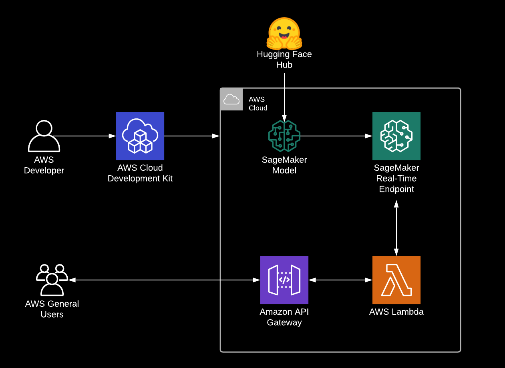
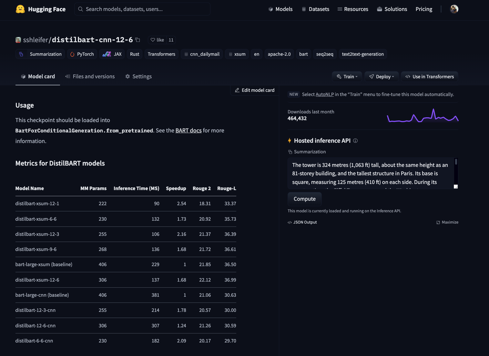
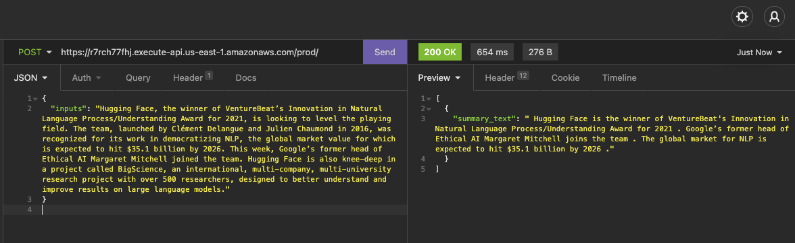

 
# Introduction

Researchers, Data Scientists, Machine Learning Engineers are excellent at creating models to achieve new state-of-the-art performance on different tasks, but deploying those models in an accessible, scalable, and secure way is more of an art than science. Commonly, those skills are found in software engineering and DevOps. [Venturebeat](https://venturebeat.com/2019/07/19/why-do-87-of-data-science-projects-never-make-it-into-production/) reports that 87% of data science projects never make it to production, while [redapt](https://www.redapt.com/blog/why-90-of-machine-learning-models-never-make-it-to-production#:~:text=During%20a%20panel%20at%20last,actually%20make%20it%20into%20production.) claims it to be 90%. 

We partnered up with AWS and the Amazon SageMaker team to reduce those numbers. Together we built 🤗 Transformers optimized Deep Learning Containers to accelerate and secure training and deployment of Transformers-based models. If you want to know more about the collaboration, take a look [here](https://huggingface.co/blog/the-partnership-amazon-sagemaker-and-hugging-face).

In this blog, we are going to use the [AWS Cloud Development Kit (AWS CDK)](https://aws.amazon.com/cdk/?nc1=h_ls) to create our infrastructure and automatically deploy our model from the [Hugging Face Hub](https://huggingface.co/models) to the AWS Cloud. The AWS CDK uses the expressive of modern programming languages, like `Python` to model and deploy your applications as code. In our example, we are going to build an application using the Hugging Face Inference DLC for model serving and Amazon [API Gateway](https://aws.amazon.com/de/api-gateway/) with [AWS Lambda](https://docs.aws.amazon.com/lambda/latest/dg/welcome.html) for building a secure accessible API. The AWS Lambda will be used as a client proxy to interact with our SageMaker Endpoint. 



If you’re not familiar with Amazon SageMaker: *“Amazon SageMaker is a fully managed service that provides every developer and data scientist with the ability to build, train, and deploy machine learning (ML) models quickly. SageMaker removes the heavy lifting from each step of the machine learning process to make it easier to develop high-quality models.”* [[REF]](https://aws.amazon.com/sagemaker/faqs/)

You find the complete code for it in this [Github repository](https://github.com/philschmid/cdk-samples/tree/master/aws-lambda-sagemaker-endpoint-huggingface).

---

# Tutorial

Before we get started, make sure you have the [AWS CDK installed](https://docs.aws.amazon.com/cdk/latest/guide/getting_started.html#getting_started_install) and [configured your AWS credentials](https://docs.aws.amazon.com/cdk/latest/guide/getting_started.html#getting_started_prerequisites). 

**What are we going to do:**

- selecting a model from the [Hugging Face Hub](https://huggingface.co/models)
- bootstrap our CDK project
- Deploy the model using CDK
- Run inference and test the API

## Selecting a model from the [Hugging Face Hub](https://huggingface.co/models)

For those of you who don't what the Hugging Face Hub is you should definitely take a look [here](https://huggingface.co/docs/hub/main). But the TL;DR; is that the Hugging Face Hub is an open community-driven collection of state-of-the-art models. At the time of writing the blog post, we have 17,501 available free models to use.

To select the model we want to use we navigate to [hf.co/models](http://hf.co/models) then pre-filter using the task on the left, e.g. `summarization`. For this blog post, I went with the [sshleifer/distilbart-cnn-12-6](https://huggingface.co/sshleifer/distilbart-cnn-12-6), which was fine-tuned on CNN articles for summarization. 



## Bootstrap our CDK project

Deploying applications using the CDK may require additional resources for CDK to store for example assets. The process of provisioning these initial resources is called [bootstrapping](https://docs.aws.amazon.com/cdk/latest/guide/bootstrapping.html). So before being able to deploy our application, we need to make sure that we bootstrapped our project. 

```json
cdk bootstrap
```

## Deploy the model using CDK

Now we are able to deploy our application with the whole infrastructure and deploy our previous selected Transformer `sshleifer/distilbart-cnn-12-6` to Amazon SageMaker. Our application uses the [CDK context](https://docs.aws.amazon.com/cdk/latest/guide/context.html) to accept dynamic parameters for the deployment. We can provide our model with as key `model` and our task as key `task` . The application allows further configuration, like passing a different `instance_type` when deploying. You can find the whole list of arguments in the [repository](https://github.com/philschmid/cdk-samples/tree/master/aws-lambda-sagemaker-endpoint-huggingface#context).  

In our case we will provide `model=sshleifer/distilbart-cnn-12-6` and `task=summarization` with the a GPU instance `instance_type=ml.g4dn.xlarge`.

```json
cdk deploy \
  -c model="sshleifer/distilbart-cnn-12-6" \
  -c task="summarization" \
  -c instance_type="ml.g4dn.xlarge"
```

After running the `cdk deploy` command we will get an output of all resources, which are going to be created. We then confirm our deployment and the CDK will create all required resources, deploy our AWS Lambda function and our Model to Amazon SageMaker. This takes around 3-5 minutes.

After the deployment the console output should look similar to this.

```json
 ✅  HuggingfaceSagemakerEndpoint

Outputs:
HuggingfaceSagemakerEndpoint.hfapigwEndpointE75D67B4 = https://r7rch77fhj.execute-api.us-east-1.amazonaws.com/prod/

Stack ARN:
arn:aws:cloudformation:us-east-1:558105141721:stack/HuggingfaceSagemakerEndpoint/6eab9e10-269b-11ec-86cc-0af6d09e2aab
```

## Run inference and test the API

After the deployment is successfully complete we can grap our Endpoint  URL `HuggingfaceSagemakerEndpoint.hfapigwEndpointE75D67B4`  from the CLI output and use any REST-client to test it. 



the request as curl to copy

```json
curl --request POST \
  --url https://r7rch77fhj.execute-api.us-east-1.amazonaws.com/prod/ \
  --header 'Content-Type: application/json' \
  --data '{
	"inputs": "Hugging Face, the winner of VentureBeat’s Innovation in Natural Language Process/Understanding Award for 2021, is looking to level the playing field. The team, launched by Clément Delangue and Julien Chaumond in 2016, was recognized for its work in democratizing NLP, the global market value for which is expected to hit $35.1 billion by 2026. This week, Google’s former head of Ethical AI Margaret Mitchell joined the team. Hugging Face is also knee-deep in a project called BigScience, an international, multi-company, multi-university research project with over 500 researchers, designed to better understand and improve results on large language models."
}
'
```

# Conclusion

With the help of the AWS CDK we were able to deploy all required Infrastructure for our API by defining them in a programmatically familiar language we know and use. The Hugging Face Inference DLC allowed us to deploy a model from the [Hugging Face Hub](https://huggingface.co/), with out writing a single line of inference code and we are now able to use our public exposed API in securely in any applications, service or frontend we want.

To optimize the solution you can tweek the CDK template to your needs, e.g. add a VPC to the AWS Lambda and the SageMaker Endpoint to accelerate communication between those two.

---

You can find the code [here](https://github.com/philschmid/cdk-samples/tree/master/aws-lambda-sagemaker-endpoint-huggingface) and feel free open a thread the [forum](https://discuss.huggingface.co/).

Thanks for reading. If you have any questions, feel free to contact me, through [Github](https://github.com/huggingface/transformers), or on the [forum](https://discuss.huggingface.co/c/sagemaker/17). You can also connect with me on [Twitter](https://twitter.com/_philschmid) or [LinkedIn](https://www.linkedin.com/in/philipp-schmid-a6a2bb196/).