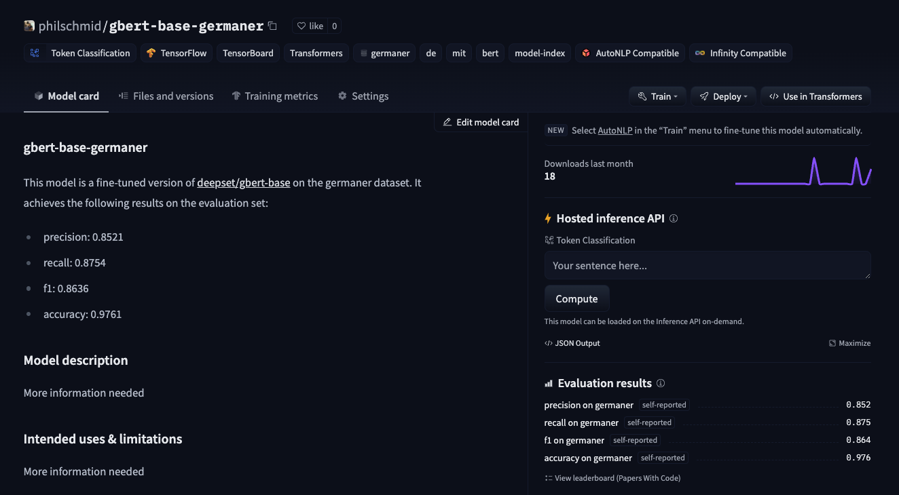

Welcome to this end-to-end Named Entity Recognition example using Keras. In this tutorial, we will use the Hugging Faces `transformers` and `datasets` library together with `Tensorflow` & `Keras` to fine-tune a pre-trained non-English transformer for token-classification (ner). 

If you want a more detailed example for token-classification you should check out this [notebook](https://github.com/huggingface/notebooks/blob/master/examples/token_classification-tf.ipynb) or the [chapter 7](https://huggingface.co/course/chapter7/2?fw=pt) of the [Hugging Face Course](https://huggingface.co/course/chapter7/2?fw=pt).

## Installation


```python
#!pip install "tensorflow==2.6.0"
!pip install transformers datasets seqeval tensorboard --upgrade
```


```python
!sudo apt-get install git-lfs
```

This example will use the [Hugging Face Hub](https://huggingface.co/models) as remote model versioning service. To be able to push our model to the Hub, you need to register on the [Hugging Face](https://huggingface.co/join). 
If you already have an account you can skip this step. 
After you have an account, we will use the `notebook_login` util from the `huggingface_hub` package to log into our account and store our token (access key) on the disk. 


```python
from huggingface_hub import notebook_login

notebook_login()

```

## Setup & Configuration

In this step we will define global configurations and paramters, which are used across the whole end-to-end fine-tuning proccess, e.g. `tokenizer` and `model` we will use. 

In this example are we going to fine-tune the [deepset/gbert-base](https://huggingface.co/deepset/gbert-base) a German BERT model. 


```python
model_id = "deepset/gbert-base"
```

You can change the `model_id` to another BERT-like model for a different language, e.g. **Italian** or **French** to use this script to train a French or Italian Named Entity Recognition Model. But don't forget to also adjust the dataset in the next step.

## Dataset & Pre-processing

As Dataset we will use the [GermanNER](https://huggingface.co/datasets/germaner) a german named entity recognition dataset from [GermaNER: Free Open German Named Entity Recognition Tool](https://www.inf.uni-hamburg.de/en/inst/ab/lt/publications/2015-benikovaetal-gscl2015-germa.pdf) paper. The dataset contains the four default coarse
named entity classes LOCation, PERson, ORGanisation, and OTHer from the [GermEval 2014 task](https://sites.google.com/site/germeval2014ner/). If you are fine-tuning in a different language then German you can search on the [Hub](https://huggingface.co/datasets?task_ids=task_ids:named-entity-recognition&sort=downloads) for a dataset for your language or you can take a look at [Datasets for Entity Recognition](https://github.com/juand-r/entity-recognition-datasets)


```python
dataset_id="germaner"

seed=33
```

To load the `germaner` dataset, we use the `load_dataset()` method from the 🤗 Datasets library.


```python
from datasets import load_dataset

dataset = load_dataset(dataset_id)
```

We can display all our NER classes by inspecting the features of our dataset. Those `ner_labels` will be later used to create a user friendly output after we fine-tuned our model.


```python
# accessing the "train" split for the "ner_tags" feature
ner_labels = dataset["train"].features["ner_tags"].feature.names
#     ['B-LOC', 'B-ORG', 'B-OTH', 'B-PER', 'I-LOC', 'I-ORG', 'I-OTH', 'I-PER', 'O']
```


### Pre-processing & Tokenization

To train our model we need to convert our "Natural Language" to token IDs. This is done by a 🤗 Transformers Tokenizer which will tokenize the inputs (including converting the tokens to their corresponding IDs in the pretrained vocabulary). If you are not sure what this means check out [chapter 6](https://huggingface.co/course/chapter6/1?fw=tf) of the Hugging Face Course.

```python
from transformers import AutoTokenizer

tokenizer = AutoTokenizer.from_pretrained(model_id)
```

Compared to a text-classification dataset of question-answering dataset is "text" of the `germaner` already split into a list of words (`tokens`). So cannot use `tokenzier(text)` we need to pass `is_split_into_words=True` to the `tokenizer` method. Additionally we add the `truncation=True` to truncate texts that are bigger than the maximum size allowed by the model. 


```python
def tokenize_and_align_labels(examples):
    tokenized_inputs = tokenizer(
        examples["tokens"], truncation=True, is_split_into_words=True
    )

    labels = []
    for i, label in enumerate(examples[f"ner_tags"]):
        # get a list of tokens their connecting word id (for words tokenized into multiple chunks)
        word_ids = tokenized_inputs.word_ids(batch_index=i)
        previous_word_idx = None
        label_ids = []
        for word_idx in word_ids:
            # Special tokens have a word id that is None. We set the label to -100 so they are automatically
            # ignored in the loss function.
            if word_idx is None:
                label_ids.append(-100)
            # We set the label for the first token of each word.
            elif word_idx != previous_word_idx:
                label_ids.append(label[word_idx])
            # For the other tokens in a word, we set the label to the current
            else:
                label_ids.append(label[word_idx])
            previous_word_idx = word_idx

        labels.append(label_ids)

    tokenized_inputs["labels"] = labels
    return tokenized_inputs
```

process our dataset using `.map` method with `batched=True`.


```python
tokenized_datasets = dataset.map(tokenize_and_align_labels, batched=True)
```

Since we later only need the tokenized + labels columns for the model to train, we are just filtering out which columns have been added by processing the dataset. The `tokenizer_columns` are the dataset column(s) to load in the `tf.data.Dataset`

```python
pre_tokenizer_columns = set(dataset["train"].features)
tokenizer_columns = list(set(tokenized_datasets["train"].features) - pre_tokenizer_columns)
# ['attention_mask', 'labels', 'token_type_ids', 'input_ids']
```

Since our dataset only includes one split (`train`) we need to `train_test_split` ourself to have an evaluation/test dataset for evaluating the result during and after training. 

```python
# test size will be 15% of train dataset
test_size=.15

processed_dataset = tokenized_datasets["train"].shuffle(seed=seed).train_test_split(test_size=test_size)
processed_dataset
```

---

## Fine-tuning the model using `Keras`

Now that our `dataset` is processed, we can download the pretrained model and fine-tune it. But before we can do this we need to convert our Hugging Face `datasets` Dataset into a `tf.data.Dataset`. For this we will us the `.to_tf_dataset` method and a `data collator` for token-classification (Data collators are objects that will form a batch by using a list of dataset elements as input).

### Hyperparameter


```python
from huggingface_hub import HfFolder
import tensorflow as tf

id2label = {str(i): label for i, label in enumerate(ner_labels)}
label2id = {v: k for k, v in id2label.items()}

num_train_epochs = 5
train_batch_size = 16
eval_batch_size = 32
learning_rate = 2e-5
weight_decay_rate=0.01
num_warmup_steps=0
output_dir=model_id.split("/")[1]
hub_token = HfFolder.get_token() # or your token directly "hf_xxx"
hub_model_id = f'{model_id.split("/")[1]}-{dataset_id}'
fp16=True

# Train in mixed-precision float16
# Comment this line out if you're using a GPU that will not benefit from this
if fp16:
  tf.keras.mixed_precision.set_global_policy("mixed_float16")

```

### Converting the dataset to a `tf.data.Dataset`


```python
from transformers import DataCollatorForTokenClassification

# Data collator that will dynamically pad the inputs received, as well as the labels.
data_collator = DataCollatorForTokenClassification(
    tokenizer=tokenizer, return_tensors="tf"
)

# converting our train dataset to tf.data.Dataset
tf_train_dataset = processed_dataset["train"].to_tf_dataset(
    columns= tokenizer_columns,
    shuffle=False,
    batch_size=train_batch_size,
    collate_fn=data_collator,
)

# converting our test dataset to tf.data.Dataset
tf_eval_dataset = processed_dataset["test"].to_tf_dataset(
    columns=tokenizer_columns,
    shuffle=False,
    batch_size=eval_batch_size,
    collate_fn=data_collator,
)

```

### Download the pretrained transformer model and fine-tune it. 


```python
from transformers import TFAutoModelForTokenClassification, create_optimizer


num_train_steps = len(tf_train_dataset) * num_train_epochs
optimizer, lr_schedule = create_optimizer(
    init_lr=learning_rate,
    num_train_steps=num_train_steps,
    weight_decay_rate=weight_decay_rate,
    num_warmup_steps=num_warmup_steps,
)

model = TFAutoModelForTokenClassification.from_pretrained(
    model_id,
    id2label=id2label,
    label2id=label2id,
)

model.compile(optimizer=optimizer)
```

### Callbacks

As mentioned in the beginning we want to use the [Hugging Face Hub](https://huggingface.co/models) for model versioning and monitoring. Therefore we want to push our models weights, during training and after training to the Hub to version it.
Additionally we want to track the peformance during training therefore we will push the `Tensorboard` logs along with the weights to the Hub to use the "Training Metrics" Feature to monitor our training in real-time. 


```python
import os
from transformers.keras_callbacks import PushToHubCallback
from tensorflow.keras.callbacks import TensorBoard as TensorboardCallback

callbacks=[]

callbacks.append(TensorboardCallback(log_dir=os.path.join(output_dir,"logs")))
if hub_token:
  callbacks.append(PushToHubCallback(output_dir=output_dir,
                                     tokenizer=tokenizer,
                                     hub_model_id=hub_model_id,
                                     hub_token=hub_token))

```


## Training

Start training with calling `model.fit`


```python
model.fit(
    tf_train_dataset,
    validation_data=tf_eval_dataset,
    callbacks=callbacks,
    epochs=num_train_epochs,
)
```

## Evaluation

The traditional framework used to evaluate token classification prediction is `seqeval`. This metric does not behave like the standard accuracy: it will actually take the lists of labels as strings, not integers, so we will need to fully decode the predictions and labels before passing them to the metric. 


```python
from datasets import load_metric
import numpy as np


metric = load_metric("seqeval")


def evaluate(model, dataset, ner_labels):
  all_predictions = []
  all_labels = []
  for batch in dataset:
      logits = model.predict(batch)["logits"]
      labels = batch["labels"]
      predictions = np.argmax(logits, axis=-1)
      for prediction, label in zip(predictions, labels):
          for predicted_idx, label_idx in zip(prediction, label):
              if label_idx == -100:
                  continue
              all_predictions.append(ner_labels[predicted_idx])
              all_labels.append(ner_labels[label_idx])
  return metric.compute(predictions=[all_predictions], references=[all_labels])

results = evaluate(model, tf_eval_dataset, ner_labels=list(model.config.id2label.values()))

```
```json
  {'LOC': {'precision': 0.8931558935361217,
      'recall': 0.9115250291036089,
      'f1': 0.9022469752256578,
      'number': 2577},
     'ORG': {'precision': 0.7752112676056339,
      'recall': 0.8075117370892019,
      'f1': 0.7910319057200345,
      'number': 1704},
     'OTH': {'precision': 0.6788389513108615,
      'recall': 0.7308467741935484,
      'f1': 0.703883495145631,
      'number': 992},
     'PER': {'precision': 0.9384366140137708,
      'recall': 0.9430199430199431,
      'f1': 0.9407226958993098,
      'number': 2457},
     'overall_precision': 0.8520523797532108,
     'overall_recall': 0.8754204398447607,
     'overall_f1': 0.8635783563042368,
     'overall_accuracy': 0.976147969774973}
```

---

## Create Model Card with evaluation results

To complete our Hugging Face Hub repository we will create a model card with the used hyperparameters and the evaluation results.


```python
from transformers.modelcard import TrainingSummary


eval_results = {
    "precision":float(results["overall_precision"]),
    "recall":float(results["overall_recall"]),
    "f1":float(results["overall_f1"]),
    "accuracy":float(results["overall_accuracy"]),
}

training_summary = TrainingSummary(
    model_name = hub_model_id,
    language = "de",
    tags=[],
    finetuned_from=model_id,
    tasks="token-classification",
    dataset=dataset_id,
    dataset_tags=dataset_id,
    dataset_args="default",
    eval_results=eval_results,
    hyperparameters={
        "num_train_epochs": num_train_epochs,
        "train_batch_size": train_batch_size,
        "eval_batch_size": eval_batch_size,
        "learning_rate": learning_rate,
        "weight_decay_rate": weight_decay_rate,
        "num_warmup_steps": num_warmup_steps,
        "fp16": fp16
    }
)
model_card = training_summary.to_model_card()

model_card_path = os.path.join(output_dir, "README.md")

with open(model_card_path, "w") as f:
    f.write(model_card)
```

push model card to repository


```python
from huggingface_hub import HfApi

api = HfApi()

user = api.whoami(hub_token)

api.upload_file(
    token=hub_token,
    repo_id=f"{user['name']}/{hub_model_id}",
    path_or_fileobj=model_card_path,
    path_in_repo="README.md",
)
```



---

# Run Managed Training using Amazon Sagemaker

If you want to run this examples on Amazon SageMaker to benefit from the Training Platform follow the cells below. I converted the Notebook into a python script [train.py](./scripts/train.py), which accepts same hyperparameter and can we run on SageMaker using the `HuggingFace` estimator


```python
#!pip install sagemaker
```


```python
import sagemaker

sess = sagemaker.Session()
# sagemaker session bucket -> used for uploading data, models and logs
# sagemaker will automatically create this bucket if it not exists
sagemaker_session_bucket=None
if sagemaker_session_bucket is None and sess is not None:
    # set to default bucket if a bucket name is not given
    sagemaker_session_bucket = sess.default_bucket()

role = sagemaker.get_execution_role()
sess = sagemaker.Session(default_bucket=sagemaker_session_bucket)

print(f"sagemaker role arn: {role}")
print(f"sagemaker bucket: {sess.default_bucket()}")
print(f"sagemaker session region: {sess.boto_region_name}")
```


```python
from sagemaker.huggingface import HuggingFace

# gets role for executing training job
role = sagemaker.get_execution_role()
hyperparameters = {
	'model_id': 'deepset/gbert-base',
	'dataset_id': 'germaner',
	'num_train_epochs': 5,
	'train_batch_size': 16,
	'eval_batch_size': 32,
	'learning_rate': 2e-5,
	'weight_decay_rate': 0.01,
	'num_warmup_steps': 0,
	'hub_token': HfFolder.get_token(),
	'hub_model_id': 'sagemaker-gbert-base-germaner',
	'fp16': True
}


# creates Hugging Face estimator
huggingface_estimator = HuggingFace(
	entry_point='train.py',
	source_dir='./scripts',
	instance_type='ml.p3.2xlarge',
	instance_count=1,
	role=role,
	transformers_version='4.12.3',
	tensorflow_version='2.5.1',
	py_version='py36',
	hyperparameters = hyperparameters
)

# starting the train job
huggingface_estimator.fit()
```

## Conclusion

We managed to successfully fine-tune a German BERT model using Transformers and Keras, without any heavy lifting or complex and unnecessary boilerplate code. The new utilities like `.to_tf_dataset` are improving the developer experience of the Hugging Face ecosystem to become more Keras and TensorFlow friendly. Combining those new features with the Hugging Face Hub we get a fully-managed MLOps pipeline for model-versioning and experiment management using Keras callback API. 

Big Thanks to [Matt](https://twitter.com/carrigmat) for all the work he is doing to improve the experience using Transformers and Keras.

Now its your turn! Adjust the notebook to train a BERT for another language like French, Spanish or Italian. 🇫🇷 🇪🇸 🇮🇹

---

You can find the code [here](hhttps://github.com/philschmid/transformers-keras-e2e-ner) and feel free to open a thread on the [forum](https://discuss.huggingface.co/).

Thanks for reading. If you have any questions, feel free to contact me, through [Github](https://github.com/huggingface/transformers), or on the [forum](https://discuss.huggingface.co/c/sagemaker/17). You can also connect with me on [Twitter](https://twitter.com/_philschmid) or [LinkedIn](https://www.linkedin.com/in/philipp-schmid-a6a2bb196/).
