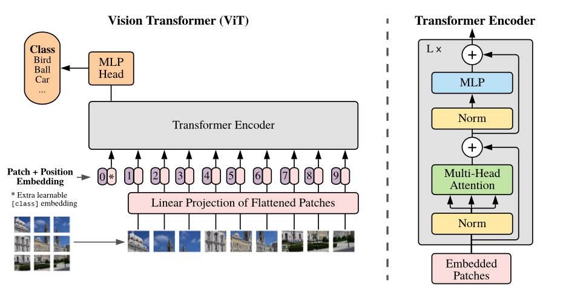
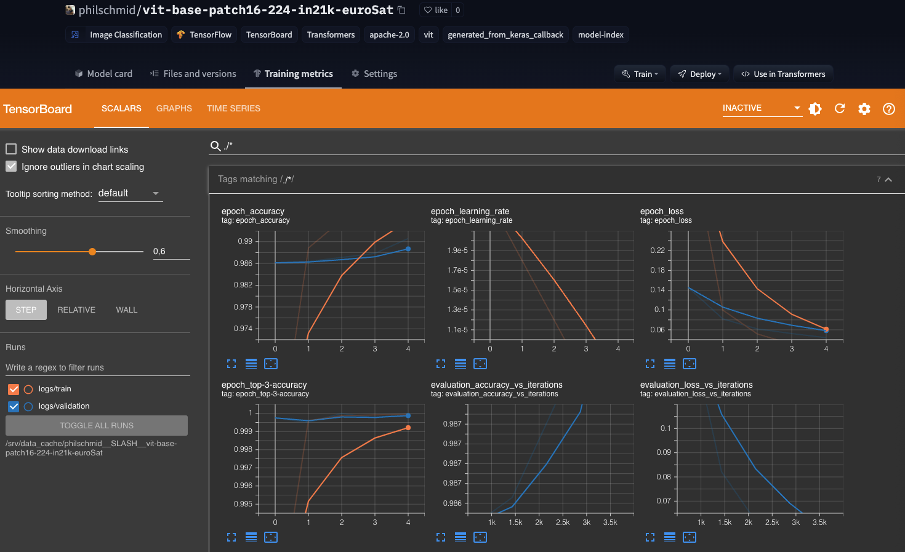
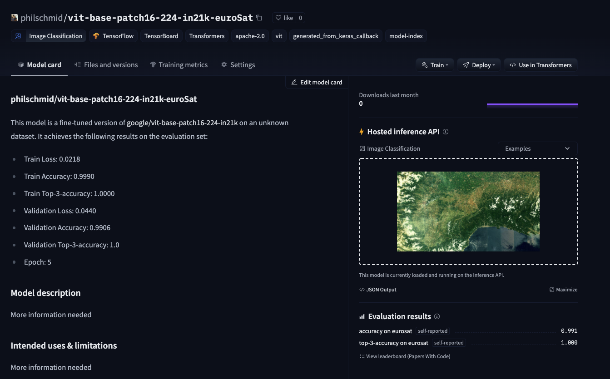

Welcome to this end-to-end Image Classification example using Keras and Hugging Face Transformers. In this demo, we will use the Hugging Faces `transformers` and `datasets` library together with `Tensorflow` & `Keras` to fine-tune a pre-trained vision transformer for image classification.

We are going to use the [EuroSAT](https://paperswithcode.com/dataset/eurosat) dataset for land use and land cover classification. The dataset is based on Sentinel-2 satellite images covering 13 spectral bands and consisting out of 10 classes within total 27,000 labeled and geo-referenced images.

More information for the dataset can be found at the [repository](https://github.com/phelber/eurosat).


We are going to use all of the great Features from the Hugging Face ecosystem like model versioning and experiment tracking as well as all the great features of Keras like Early Stopping and Tensorboard.


# Quick intro: Vision Transformer (ViT) by Google Brain
The Vision Transformer (ViT) is basically BERT, but applied to images. It attains excellent results compared to state-of-the-art convolutional networks. In order to provide images to the model, each image is split into a sequence of fixed-size patches (typically of resolution 16x16 or 32x32), which are linearly embedded. One also adds a [CLS] token at the beginning of the sequence in order to classify images. Next, one adds absolute position embeddings and provides this sequence to the Transformer encoder.



* Paper: https://arxiv.org/abs/2010.11929
* Official repo (in JAX): https://github.com/google-research/vision_transformer

# Installation


```python
#!pip install "tensorflow==2.6.0"
!pip install transformers "datasets>=1.17.0" tensorboard --upgrade
```


```python
!sudo apt-get install git-lfs
```

This example will use the [Hugging Face Hub](https://huggingface.co/models) as a remote model versioning service. To be able to push our model to the Hub, you need to register on the [Hugging Face](https://huggingface.co/join). 
If you already have an account you can skip this step. 
After you have an account, we will use the `notebook_login` util from the `huggingface_hub` package to log into our account and store our token (access key) on the disk. 


```python
from huggingface_hub import notebook_login

notebook_login()

```

## Setup & Configuration

In this step, we will define global configurations and parameters, which are used across the whole end-to-end fine-tuning process, e.g. `feature extractor` and `model` we will use. 

In this example are we going to fine-tune the [google/vit-base-patch16-224-in21k](https://huggingface.co/google/vit-base-patch16-224-in21k) a Vision Transformer (ViT) pre-trained on ImageNet-21k (14 million images, 21,843 classes) at resolution 224x224.


```python
model_id = "google/vit-base-patch16-224-in21k"
```

You can easily adjust the `model_id` to another Vision Transformer model, e.g. `google/vit-base-patch32-384`

## Dataset & Pre-processing

As Dataset we will use the [EuroSAT](https://paperswithcode.com/dataset/eurosat) an image classification dataset based on satellite images caputred by the Sentinel-2. The dataset consisting out of 10 classes (`Forest`, `River`, `Highway`, `AnnualCrop`,`SeaLake`, `HerbaceousVegetation`, `Industrial`, `Residential`, `PermanentCrop`, `Pasture`) with in total 27,000 labeled and geo-referenced images.


  
Source: [EuroSAT](https://github.com/phelber/eurosat)

The `EuroSAT` is not yet available as a dataset in the `datasets` library. To be able to create a `Dataset` instance we need to write a small little helper function, which will load our `Dataset` from the filesystem and create the instance to use later for training. 

As a first step, we need to download the dataset to our filesystem and unzip it.


```python
!wget https://madm.dfki.de/files/sentinel/EuroSAT.zip
!unzip EuroSAT.zip -d EuroSAT
```

We should now have a directory structure that looks like this:

```bash
EuroSAT/2750/
├── AnnualCrop/
    └── AnnualCrop_1.jpg
├── Forest/
    └── Forest_1.jpg
├── HerbaceousVegetation/
    └── HerbaceousVegetation_1.jpg
├── Highway/
    └── Highway_1.jpg
├── Pasture/
    └── Pasture_1.jpg
├── PermanentCrop/
    └── PermanentCrop_1.jpg
├── Residential/
    └── Residential_1.jpg
├── River/
    └── River_1.jpg
└── SeaLake/
    └── SeaLake_1.jpg
```

At the time of writing this example `datasets` does not yet support loading image dataset from the filesystem. Therefore we create a `create_image_folder_dataset` helper function to load the dataset from the filesystem. This method creates our `_CLASS_NAMES` and our `datasets.Features`. After that, it iterates through the filesystem and creates a `Dataset` instance.


```python
import os
import datasets

def create_image_folder_dataset(root_path):
  """creates `Dataset` from image folder structure"""
  
  # get class names by folders names
  _CLASS_NAMES= os.listdir(root_path)
  # defines `datasets` features`
  features=datasets.Features({
                      "img": datasets.Image(),
                      "label": datasets.features.ClassLabel(names=_CLASS_NAMES),
                  })
  # temp list holding datapoints for creation
  img_data_files=[]
  label_data_files=[]
  # load images into list for creation
  for img_class in os.listdir(root_path):
    for img in os.listdir(os.path.join(root_path,img_class)):
      path_=os.path.join(root_path,img_class,img)
      img_data_files.append(path_)
      label_data_files.append(img_class)
  # create dataset
  ds = datasets.Dataset.from_dict({"img":img_data_files,"label":label_data_files},features=features)
  return ds

```


```python
eurosat_ds = create_image_folder_dataset("EuroSAT/2750")
```

We can display all our classes by inspecting the features of our dataset. Those `labels` can be later used to create a user friendly output when predicting.

```python
img_class_labels = eurosat_ds.features["label"].names
```


# Pre-processing

To train our model we need to convert our "Images" to `pixel_values`. This is done by a [🤗 Transformers Feature Extractor](https://huggingface.co/docs/transformers/master/en/main_classes/feature_extractor#feature-extractor) which allows us to `augment` and convert the images into a 3D Array to be fed into our model.


```python
from transformers import ViTFeatureExtractor
from tensorflow import keras 
from tensorflow.keras import layers


feature_extractor = ViTFeatureExtractor.from_pretrained(model_id)

# learn more about data augmentation here: https://www.tensorflow.org/tutorials/images/data_augmentation
data_augmentation = keras.Sequential(
    [
        layers.Resizing(feature_extractor.size, feature_extractor.size),
        layers.Rescaling(1./255),
        layers.RandomFlip("horizontal"),
        layers.RandomRotation(factor=0.02),
        layers.RandomZoom(
            height_factor=0.2, width_factor=0.2
        ),
    ],
    name="data_augmentation",
)
# use keras image data augementation processing
def augmentation(examples):
    # print(examples["img"])
    examples["pixel_values"] = [data_augmentation(image) for image in examples["img"]]
    return examples


# basic processing (only resizing)
def process(examples):
    examples.update(feature_extractor(examples['img'], ))
    return examples

# we are also renaming our label col to labels to use `.to_tf_dataset` later
eurosat_ds = eurosat_ds.rename_column("label", "labels")


```

process our dataset using `.map` method with `batched=True`.


```python
processed_dataset = eurosat_ds.map(process, batched=True)
processed_dataset

# # augmenting dataset takes a lot of time
# processed_dataset = eurosat_ds.map(augmentation, batched=True)
```

Since our dataset doesn't includes any split we need to `train_test_split` ourself to have an evaluation/test dataset for evaluating the result during and after training. 


```python
# test size will be 15% of train dataset
test_size=.15

processed_dataset = processed_dataset.shuffle().train_test_split(test_size=test_size)
```

# Fine-tuning the model using `Keras`

Now that our `dataset` is processed, we can download the pretrained model and fine-tune it. But before we can do this we need to convert our Hugging Face `datasets` Dataset into a `tf.data.Dataset`. For this, we will use the `.to_tf_dataset` method and a `data collator` (Data collators are objects that will form a batch by using a list of dataset elements as input).


# Hyperparameter


```python
from huggingface_hub import HfFolder
import tensorflow as tf

id2label = {str(i): label for i, label in enumerate(img_class_labels)}
label2id = {v: k for k, v in id2label.items()}

num_train_epochs = 5
train_batch_size = 32
eval_batch_size = 32
learning_rate = 3e-5
weight_decay_rate=0.01
num_warmup_steps=0
output_dir=model_id.split("/")[1]
hub_token = HfFolder.get_token() # or your token directly "hf_xxx"
hub_model_id = f'{model_id.split("/")[1]}-euroSat'
fp16=True

# Train in mixed-precision float16
# Comment this line out if you're using a GPU that will not benefit from this
if fp16:
  tf.keras.mixed_precision.set_global_policy("mixed_float16")

```

## Converting the dataset to a `tf.data.Dataset`


```python
from transformers import DefaultDataCollator

# Data collator that will dynamically pad the inputs received, as well as the labels.
data_collator = DefaultDataCollator(return_tensors="tf")

# converting our train dataset to tf.data.Dataset
tf_train_dataset = processed_dataset["train"].to_tf_dataset(
   columns=['pixel_values'],
   label_cols=["labels"],
   shuffle=True,
   batch_size=train_batch_size,
   collate_fn=data_collator)

# converting our test dataset to tf.data.Dataset
tf_eval_dataset = processed_dataset["test"].to_tf_dataset(
   columns=['pixel_values'],
   label_cols=["labels"],
   shuffle=True,
   batch_size=eval_batch_size,
   collate_fn=data_collator)
```

## Download the pre-trained transformer model and fine-tune it. 


```python
from transformers import TFViTForImageClassification, create_optimizer
import tensorflow as tf

# create optimizer wight weigh decay
num_train_steps = len(tf_train_dataset) * num_train_epochs
optimizer, lr_schedule = create_optimizer(
    init_lr=learning_rate,
    num_train_steps=num_train_steps,
    weight_decay_rate=weight_decay_rate,
    num_warmup_steps=num_warmup_steps,
)

# load pre-trained ViT model
model = TFViTForImageClassification.from_pretrained(
    model_id,
    num_labels=len(img_class_labels),
    id2label=id2label,
    label2id=label2id,
)

# define loss
loss=tf.keras.losses.SparseCategoricalCrossentropy(from_logits=True)

# define metrics 
metrics=[
    tf.keras.metrics.SparseCategoricalAccuracy(name="accuracy"),
    tf.keras.metrics.SparseTopKCategoricalAccuracy(3, name="top-3-accuracy"),
]

# compile model
model.compile(optimizer=optimizer,
              loss=loss,
              metrics=metrics
              )
```

If you want to create you own classification head or if you want to add the augmentation/processing layer to your model, you can directly use the [functional Keras API](https://keras.io/guides/functional_api/). Below you find an example on how you would create a classification head.


```python
# alternatively create Image Classification model using Keras Layer and ViTModel 
# here you can also add the processing layers of keras

import tensorflow as tf
from transformers import TFViTModel

base_model = TFViTModel.from_pretrained('google/vit-base-patch16-224-in21k')


# inputs
pixel_values = tf.keras.layers.Input(shape=(3,224,224), name='pixel_values', dtype='float32')

# model layer
vit = base_model.vit(pixel_values)[0]
classifier = tf.keras.layers.Dense(10, activation='softmax', name='outputs')(vit[:, 0, :])

# model
keras_model = tf.keras.Model(inputs=pixel_values, outputs=classifier)
```

## Callbacks

As mentioned in the beginning we want to use the [Hugging Face Hub](https://huggingface.co/models) for model versioning and monitoring. Therefore we want to push our model weights, during training and after training to the Hub to version it.
Additionally, we want to track the performance during training therefore we will push the `Tensorboard` logs along with the weights to the Hub to use the "Training Metrics" Feature to monitor our training in real-time. 

```python
import os
from transformers.keras_callbacks import PushToHubCallback
from tensorflow.keras.callbacks import TensorBoard as TensorboardCallback, EarlyStopping

callbacks=[]

callbacks.append(TensorboardCallback(log_dir=os.path.join(output_dir,"logs")))
callbacks.append(EarlyStopping(monitor="val_accuracy",patience=1))
if hub_token:
  callbacks.append(PushToHubCallback(output_dir=output_dir,
                                     hub_model_id=hub_model_id,
                                     hub_token=hub_token))


```



## Training

Start training with calling `model.fit`


```python
train_results = model.fit(
    tf_train_dataset,
    validation_data=tf_eval_dataset,
    callbacks=callbacks,
    epochs=num_train_epochs,
)
```

As the time of writing this `feature_extractor` doesn't yet support `push_to_hub` thats why we are pushing it manually.


```python
from huggingface_hub import HfApi

api = HfApi()

user = api.whoami(hub_token)


feature_extractor.save_pretrained(output_dir)

api.upload_file(
    token=hub_token,
    repo_id=f"{user['name']}/{hub_model_id}",
    path_or_fileobj=os.path.join(output_dir,"preprocessor_config.json"),
    path_in_repo="preprocessor_config.json",
)
```




# Run Managed Training using Amazon Sagemaker

If you want to run this examples on Amazon SageMaker to benefit from the Training Platform follow the cells below. I converted the Notebook into a python script [train.py](./scripts/train.py), which accepts same hyperparameter and can we run on SageMaker using the `HuggingFace` estimator


```python
#!pip install sagemaker
```


```python
import sagemaker

sess = sagemaker.Session()
# sagemaker session bucket -> used for uploading data, models and logs
# sagemaker will automatically create this bucket if it not exists
sagemaker_session_bucket=None
if sagemaker_session_bucket is None and sess is not None:
    # set to default bucket if a bucket name is not given
    sagemaker_session_bucket = sess.default_bucket()

role = sagemaker.get_execution_role()
sess = sagemaker.Session(default_bucket=sagemaker_session_bucket)

print(f"sagemaker role arn: {role}")
print(f"sagemaker bucket: {sess.default_bucket()}")
print(f"sagemaker session region: {sess.boto_region_name}")
```


```python
from sagemaker.huggingface import HuggingFace

# gets role for executing training job
role = sagemaker.get_execution_role()
hyperparameters = {
	'model_id': 'google/vit-base-patch16-224-in21k',
	'num_train_epochs': 5,
	'train_batch_size': 32,
	'eval_batch_size': 32,
	'learning_rate': 3e-5,
	'weight_decay_rate': 0.01,
	'num_warmup_steps': 0,
	'hub_token': HfFolder.get_token(),
	'hub_model_id': 'sagemaker-vit-base-patch16-224-in21k-eurosat',
	'fp16': True
}


# creates Hugging Face estimator
huggingface_estimator = HuggingFace(
	entry_point='train.py',
	source_dir='./scripts',
	instance_type='ml.p3.2xlarge',
	instance_count=1,
	role=role,
	transformers_version='4.12.3',
	tensorflow_version='2.5.1',
	py_version='py36',
	hyperparameters = hyperparameters
)

```

upload our raw dataset to s3


```python
from sagemaker.s3 import S3Uploader


dataset_uri = S3Uploader.upload(local_path="EuroSat",desired_s3_uri=f"s3://{sess.default_bucket()}/EuroSat")

```

After the dataset is uploaded we can start the training a pass our `s3_uri` as argument.


```python
# starting the train job
huggingface_estimator.fit({"dataset": dataset_uri})
```

# Conclusion

We managed to successfully fine-tune a Vision Transformer using Transformers and Keras, without any heavy lifting or complex and unnecessary boilerplate code. The new utilities like `.to_tf_dataset` are improving the developer experience of the Hugging Face ecosystem to become more Keras and TensorFlow friendly. Combining those new features with the Hugging Face Hub we get a fully-managed MLOps pipeline for model-versioning and experiment management using Keras callback API. 

Additionally, people can now leverage the Keras vision ecosystem together with Transformers, to create their own custom models including preprocessing layers or customer classification heads. 

---

You can find the code [here](https://github.com/philschmid/keras-vision-transformer-huggingface) and feel free to open a thread on the [forum](https://discuss.huggingface.co/).

Thanks for reading. If you have any questions, feel free to contact me, through [Github](https://github.com/huggingface/transformers), or on the [forum](https://discuss.huggingface.co/c/sagemaker/17). You can also connect with me on [Twitter](https://twitter.com/_philschmid) or [LinkedIn](https://www.linkedin.com/in/philipp-schmid-a6a2bb196/).
