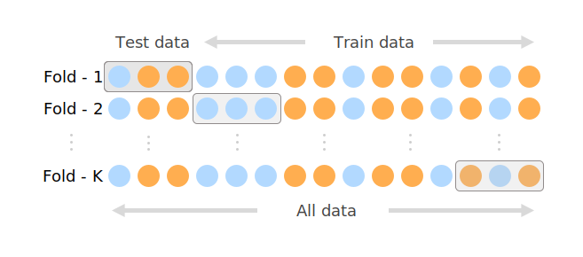

K-fold is a cross-validation method used to estimate the skill of a machine learning model on unseen data. It is
commonly used to validate a model, because it is easy to understand, to implement and results are having a higher
informative value than regular Validation Methods.

Cross-validation is a resampling procedure used to validate machine learning models on a limited data set. The procedure
has a single parameter called K that refers to the number of groups that a given data sample is to be split into, that's
the reason why it´s called K-fold.

The choice of K is usually 5 or 10, but there is no formal rule. As K is getting larger, the resampling subsets are
getting smaller. The number of K also defines how often your Machine Learning Model is trained. Most of the time we
split our data into train/validation sets in 80%-20%, 90%-10% or 70%-30% and train our model once. In cross-validation,
we split our model K times and then train. Be aware that this will result in longer training processes.

## K-Fold steps:

1. Shuffle the dataset.
2. Split the dataset into `K` groups.
3. For each unique group `g`:  
    1. Take `g` as a test dataset.  
    2. Take the remaining groups as a training data set.  
    3. Fit a model on the training set and evaluate it on the test set.  
    4. Retain the evaluation score and discard the model.
4. Summarize the skill of the model using the sample of model evaluation scores.



**The results of a K-fold cross-validation run are often summarized with the mean of the model scores.**

---

# Scitkit-Learn Example

The example is a simple implementation with scikit-learn and a scalar numpy array .

```python
    import numpy as np
    from sklearn.model_selection import KFold
    # data sample
    data = np.array([0.1, 0.2, 0.3, 0.4, 0.5, 0.6])
    # prepare cross validation
    kfold = KFold(n_splits=3, shuffle=True, random_state=1)
    # enumerate splits
    for train, test in kfold.split(data):
    	print('train: %s, test: %s' % (data[train], data[test]))

    #>>> Result
    #train: [0.1 0.4 0.5 0.6], test: [0.2 0.3]
    #train: [0.2 0.3 0.4 0.6], test: [0.1 0.5]
    #train: [0.1 0.2 0.3 0.5], test: [0.4 0.6]
```

# Simpletransformers Example (BERT Text-Classification)

The example is an implementation for a `BERT Text-Classification` with
[`simpletransformers` library](https://github.com/ThilinaRajapakse/simpletransformers) and `Scikit-Learn`.

```python
    from simpletransformers.classification import ClassificationModel
    from sklearn.model_selection import KFold
    from sklearn.metrics import accuracy_score
    import pandas as pd


    # Dataset
    dataset = [["Example sentence belonging to class 1", 1],
    					 ["Example sentence belonging to class 0", 0],
    					 ["Example eval sentence belonging to class 1", 1],
    					 ["Example eval sentence belonging to class 0", 0]]
    train_data = pd.DataFrame(dataset)

    # prepare cross validation
    n=5
    kf = KFold(n_splits=n, random_state=seed, shuffle=True)

    results = []

    for train_index, val_index in kf.split(train_data):
    		# splitting Dataframe (dataset not included)
        train_df = train_data.iloc[train_index]
        val_df = train_data.iloc[val_index]
        # Defining Model
        model = ClassificationModel('bert', 'bert-base-uncased')
    		# train the model
        model.train_model(train_df)
    		# validate the model
        result, model_outputs, wrong_predictions = model.eval_model(val_df, acc=accuracy_score)
        print(result['acc'])
    		# append model score
        results.append(result['acc'])


    print("results",results)
    print(f"Mean-Precision: {sum(results) / len(results)}")

    #>>> Result
    # 0.8535784635587655
    # 0.8509520682862771
    # 0.855548260013132
    # 0.8272010512483574
    # 0.8212877792378449
    #results [0.8535784635587655,0.8509520682862771,0.855548260013132,
    #					 0.8272010512483574,0.8212877792378449]
    # Mean-Precision: 0.8407520682862771
```

---

# Benefits of K-Fold Cross-Validation

**Using all data**: By using K-fold cross-validation we are using the complete dataset, which is helpful if we have a
small dataset because you split and train your model K times to see its performance instead of wasting X% for your
validation dataset.

**Getting more metrics**: Most of the time you have one result of metrics, but with K-Fold you´ll be able to get K
results of the metric and can have a deeper look into your model's performance.

**Achieving higher precision**: By validating your model against multiple “validation-sets” we get a higher level of
reliability. Let’s imagine the following example: We have 3 speakers and 1500 recordings (500 for each speaker). If we
do a simple train/validation split the result could be very different depending on the split.
