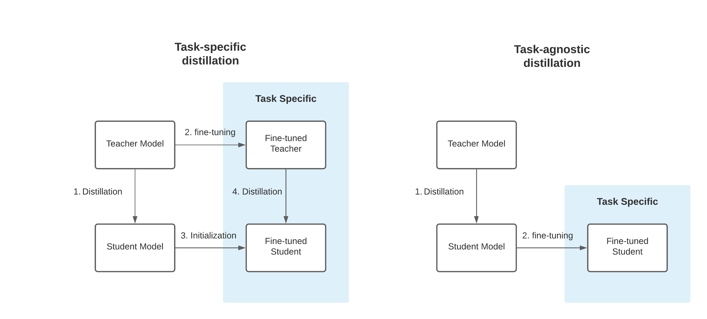

Welcome to this end-to-end task-specific knowledge distillation Text-Classification example using Transformers, PyTorch & Amazon SageMaker. Distillation is the process of training a small "student" to mimic a larger "teacher". In this example, we will use a [BERT-base](https://huggingface.co/textattack/bert-base-uncased-SST-2) as Teacher and [BERT-Tiny](https://huggingface.co/google/bert_uncased_L-2_H-128_A-2) as Student. We will use [Text-Classification](https://huggingface.co/tasks/text-classification) as our task-specific knowledge distillation task and the [Stanford Sentiment Treebank v2 (SST-2)](https://paperswithcode.com/dataset/sst) dataset for training.

They are two different types of knowledge distillation, the Task-agnostic knowledge distillation (right) and the Task-specific knowledge distillation (left). In this example we are going to use the Task-specific knowledge distillation. 


_Task-specific distillation (left) versus task-agnostic distillation (right). Figure from FastFormers by Y. Kim and H. Awadalla [arXiv:2010.13382]._


In Task-specific knowledge distillation a "second step of distillation" is used to "fine-tune" the model on a given dataset. This idea comes from the [DistilBERT paper](https://arxiv.org/pdf/1910.01108.pdf) where it was shown that a student performed better than simply finetuning the distilled language model:

> We also studied whether we could add another step of distillation during the adaptation phase by fine-tuning DistilBERT on SQuAD using a BERT model previously fine-tuned on SQuAD as a teacher for an additional term in the loss (knowledge distillation). In this setting, there are thus two successive steps of distillation, one during the pre-training phase and one during the adaptation phase. In this case, we were able to reach interesting performances given the size of the model:79.8 F1 and 70.4 EM, i.e. within 3 points of the full model.

If you are more interested in those topics you should defintely read: 
* [DistilBERT, a distilled version of BERT: smaller, faster, cheaper and lighter](https://arxiv.org/abs/1910.01108)
* [FastFormers: Highly Efficient Transformer Models for Natural Language Understanding](https://arxiv.org/abs/2010.13382)

Especially the [FastFormers paper](https://arxiv.org/abs/2010.13382) contains great research on what works and doesn't work when using knowledge distillation.

---

Huge thanks to [Lewis Tunstall](https://www.linkedin.com/in/lewis-tunstall/) and his great [Weeknotes: Distilling distilled transformers](https://lewtun.github.io/blog/weeknotes/nlp/huggingface/transformers/2021/01/17/wknotes-distillation-and-generation.html#fn-1)


## Installation


```python
#%pip install "pytorch==1.10.1"
%pip install transformers datasets tensorboard --upgrade

!sudo apt-get install git-lfs
```

This example will use the [Hugging Face Hub](https://huggingface.co/models) as remote model versioning service. To be able to push our model to the Hub, you need to register on the [Hugging Face](https://huggingface.co/join). 
If you already have an account you can skip this step. 
After you have an account, we will use the `notebook_login` util from the `huggingface_hub` package to log into our account and store our token (access key) on the disk. 


```python
from huggingface_hub import notebook_login

notebook_login()

```

## Setup & Configuration

In this step we will define global configurations and paramters, which are used across the whole end-to-end fine-tuning proccess, e.g. `teacher` and `studen` we will use. 

In this example, we will use [BERT-base](textattack/bert-base-uncased-SST-2) as Teacher and [BERT-Tiny](https://huggingface.co/google/bert_uncased_L-2_H-128_A-2) as Student. Our Teacher is already fine-tuned on our dataset, which makes it easy for us to directly start the distillation training job rather than fine-tuning the teacher first to then distill it afterwards.

_**IMPORTANT**: This example will only work with a `Teacher` & `Student` combination where the Tokenizer is creating the same output._

Additionally, describes the [FastFormers: Highly Efficient Transformer Models for Natural Language Understanding](https://arxiv.org/abs/2010.13382) paper an additional phenomenon. 
> In our experiments, we have observed that dis-
tilled models do not work well when distilled to a
different model type. Therefore, we restricted our
setup to avoid distilling RoBERTa model to BERT
or vice versa. The major difference between the
two model groups is the input token (sub-word) em-
bedding. We think that different input embedding
spaces result in different output embedding spaces,
and knowledge transfer with different spaces does
not work well


```python
student_id = "google/bert_uncased_L-2_H-128_A-2"
teacher_id = "textattack/bert-base-uncased-SST-2"

# name for our repository on the hub
repo_name = "tiny-bert-sst2-distilled"
```

Below are some checks to make sure the `Teacher` & `Student` are creating the same output.


```python
from transformers import AutoTokenizer

# init tokenizer
teacher_tokenizer = AutoTokenizer.from_pretrained(teacher_id)
student_tokenizer = AutoTokenizer.from_pretrained(student_id)

# sample input
sample = "This is a basic example, with different words to test."

# assert results
assert teacher_tokenizer(sample) == student_tokenizer(sample), "Tokenizers haven't created the same output"

```

## Dataset & Pre-processing

As Dataset we will use the [Stanford Sentiment Treebank v2 (SST-2)](https://paperswithcode.com/dataset/sst) a text-classification for `sentiment-analysis`, which is included in the [GLUE benchmark](https://gluebenchmark.com/). The dataset is based on the dataset introduced by Pang and Lee (2005) and consists of 11,855 single sentences extracted from movie reviews. It was parsed with the Stanford parser and includes a total of 215,154 unique phrases from those parse trees, each annotated by 3 human judges. It uses the two-way (positive/negative) class split, with only sentence-level labels.


```python
dataset_id="glue"
dataset_config="sst2"
```

To load the `sst2` dataset, we use the `load_dataset()` method from the 🤗 Datasets library.


```python
from datasets import load_dataset

dataset = load_dataset(dataset_id,dataset_config)
```

### Pre-processing & Tokenization

To distill our model we need to convert our "Natural Language" to token IDs. This is done by a 🤗 Transformers Tokenizer which will tokenize the inputs (including converting the tokens to their corresponding IDs in the pretrained vocabulary). If you are not sure what this means check out [chapter 6](https://huggingface.co/course/chapter6/1?fw=tf) of the Hugging Face Course.

We are going to use the tokenizer of the `Teacher`, but since both are creating same output you could also go with the `Student` tokenizer.


```python
from transformers import AutoTokenizer

tokenizer = AutoTokenizer.from_pretrained(teacher_id)
```

Additionally we add the `truncation=True` and `max_length=512` to align the length and truncate texts that are bigger than the maximum size allowed by the model. 


```python
def process(examples):
    tokenized_inputs = tokenizer(
        examples["sentence"], truncation=True, max_length=512
    )
    return tokenized_inputs

tokenized_datasets = dataset.map(process, batched=True)
tokenized_datasets = tokenized_datasets.rename_column("label","labels")

tokenized_datasets["test"].features
```

## Distilling the model using `PyTorch` and `DistillationTrainer`


Now that our `dataset` is processed, we can distill it. Normally, when fine-tuning a transformer model using PyTorch you should go with the `Trainer-API`. The [Trainer](https://huggingface.co/docs/transformers/v4.16.1/en/main_classes/trainer#transformers.Trainer) class provides an API for feature-complete training in PyTorch for most standard use cases. 

In our example we cannot use the `Trainer` out-of-the-box, since we need to pass in two models, the `Teacher` and the `Student` and compute the loss for both. But we can subclass the `Trainer` to create a `DistillationTrainer` which will take care of it and only overwrite the [compute_loss](https://github.com/huggingface/transformers/blob/c4ad38e5ac69e6d96116f39df789a2369dd33c21/src/transformers/trainer.py#L1962) method as well as the `init` method. In addition to this we also need to subclass the `TrainingArguments` to include the our distillation hyperparameters. 


```python
from transformers import TrainingArguments, Trainer
import torch
import torch.nn as nn
import torch.nn.functional as F

class DistillationTrainingArguments(TrainingArguments):
    def __init__(self, *args, alpha=0.5, temperature=2.0, **kwargs):
        super().__init__(*args, **kwargs)
        
        self.alpha = alpha
        self.temperature = temperature
        
class DistillationTrainer(Trainer):
    def __init__(self, *args, teacher_model=None, **kwargs):
        super().__init__(*args, **kwargs)
        self.teacher = teacher_model
        # place teacher on same device as student
        self._move_model_to_device(self.teacher,self.model.device)
        self.teacher.eval()

    def compute_loss(self, model, inputs, return_outputs=False):

        # compute student output
        outputs_student = model(**inputs)
        student_loss=outputs_student.loss
        # compute teacher output
        with torch.no_grad():
          outputs_teacher = self.teacher(**inputs)
        
        # assert size
        assert outputs_student.logits.size() == outputs_teacher.logits.size()
        
        # Soften probabilities and compute distillation loss
        loss_function = nn.KLDivLoss(reduction="batchmean")
        loss_logits = (loss_function(
            F.log_softmax(outputs_student.logits / self.args.temperature, dim=-1),
            F.softmax(outputs_teacher.logits / self.args.temperature, dim=-1)) * (self.args.temperature ** 2))
        # Return weighted student loss
        loss = self.args.alpha * student_loss + (1. - self.args.alpha) * loss_logits
        return (loss, outputs_student) if return_outputs else loss
```

### Hyperparameter Definition, Model Loading


```python
from transformers import AutoModelForSequenceClassification, DataCollatorWithPadding
from huggingface_hub import HfFolder

# create label2id, id2label dicts for nice outputs for the model
labels = tokenized_datasets["train"].features["labels"].names
num_labels = len(labels)
label2id, id2label = dict(), dict()
for i, label in enumerate(labels):
    label2id[label] = str(i)
    id2label[str(i)] = label

# define training args
training_args = DistillationTrainingArguments(
    output_dir=repo_name,
    num_train_epochs=7,
    per_device_train_batch_size=128,
    per_device_eval_batch_size=128,
    fp16=True,
    learning_rate=6e-5,
    seed=33,
    # logging & evaluation strategies
    logging_dir=f"{repo_name}/logs",
    logging_strategy="epoch", # to get more information to TB
    evaluation_strategy="epoch",
    save_strategy="epoch",
    save_total_limit=2,
    load_best_model_at_end=True,
    metric_for_best_model="accuracy",
    report_to="tensorboard",
    # push to hub parameters
    push_to_hub=True,
    hub_strategy="every_save",
    hub_model_id=repo_name,
    hub_token=HfFolder.get_token(),
    # distilation parameters
    alpha=0.5,
    temperature=4.0
    )

# define data_collator
data_collator = DataCollatorWithPadding(tokenizer=tokenizer)

# define model
teacher_model = AutoModelForSequenceClassification.from_pretrained(
    teacher_id,
    num_labels=num_labels, 
    id2label=id2label,
    label2id=label2id,
)

# define student model
student_model = AutoModelForSequenceClassification.from_pretrained(
    student_id,
    num_labels=num_labels, 
    id2label=id2label,
    label2id=label2id,
)
```

### Evaluation metric

we can create a `compute_metrics` function to evaluate our model on the test set. This function will be used during the training process to compute the `accuracy` & `f1` of our model.


```python
from datasets import load_metric
import numpy as np

# define metrics and metrics function
accuracy_metric = load_metric( "accuracy")

def compute_metrics(eval_pred):
    predictions, labels = eval_pred
    predictions = np.argmax(predictions, axis=1)
    acc = accuracy_metric.compute(predictions=predictions, references=labels)
    return {
        "accuracy": acc["accuracy"],
    }
```

## Training

Start training with calling `model.fit`


```python
trainer = DistillationTrainer(
    student_model,
    training_args,
    teacher_model=teacher_model,
    train_dataset=tokenized_datasets["train"],
    eval_dataset=tokenized_datasets["validation"],
    data_collator=data_collator,
    tokenizer=tokenizer,
    compute_metrics=compute_metrics,
)
```

start training using the `DistillationTrainer`.


```python
trainer.train()
```

## Hyperparameter Search for Distillation parameter `alpha` & `temperature` with optuna 

The parameter `alpha` & `temparature` in the `DistillationTrainer` can also be used when doing Hyperparamter search to maxizime our "knowledge extraction". As Hyperparamter Optimization framework are we using [Optuna](https://optuna.org/), which has a integration into the `Trainer-API`. Since we the `DistillationTrainer` is a sublcass of the `Trainer` we can use the `hyperparameter_search` without any code changes. 

```python
#%pip install optuna 
```

To do Hyperparameter Optimization using `optuna` we need to define our hyperparameter space. In this example we are trying to optimize/maximize the `num_train_epochs`, `learning_rate`, `alpha` & `temperature` for our `student_model`. 


```python
def hp_space(trial):
    return {
      "num_train_epochs": trial.suggest_int("num_train_epochs", 2, 10),
      "learning_rate": trial.suggest_float("learning_rate", 1e-5, 1e-3 ,log=True),
      "alpha": trial.suggest_float("alpha", 0, 1),
      "temperature": trial.suggest_int("temperature", 2, 30),
      }
```

To start our Hyperparmeter search we just need to call `hyperparameter_search` provide our `hp_space` and number of trials to run. 


```python
def student_init():
    return AutoModelForSequenceClassification.from_pretrained(
        student_id,
        num_labels=num_labels, 
        id2label=id2label,
        label2id=label2id
    )

trainer = DistillationTrainer(
    model_init=student_init,
    args=training_args,
    teacher_model=teacher_model,
    train_dataset=tokenized_datasets["train"],
    eval_dataset=tokenized_datasets["validation"],
    data_collator=data_collator,
    tokenizer=tokenizer,
    compute_metrics=compute_metrics,
)
best_run = trainer.hyperparameter_search(
    n_trials=50,
    direction="maximize",
    hp_space=hp_space
)

print(best_run)
```

Since optuna is just finding the best hyperparameters we need to fine-tune our model again using the best hyperparamters from the `best_run`. 


```python
# overwrite initial hyperparameters with from the best_run
for k,v in best_run.hyperparameters.items():
    setattr(training_args, k, v)
    
# Define a new repository to store our distilled model
best_model_ckpt = "tiny-bert-best"
training_args.output_dir = best_model_ckpt
```

We have overwritten the default Hyperparameters with the one from our `best_run` and can start the training now. 


```python
# Create a new Trainer with optimal parameters
optimal_trainer = DistillationTrainer(
    student_model,
    training_args,
    teacher_model=teacher_model,
    train_dataset=tokenized_datasets["train"],
    eval_dataset=tokenized_datasets["validation"],
    data_collator=data_collator,
    tokenizer=tokenizer,
    compute_metrics=compute_metrics,
)

optimal_trainer.train()


# save best model, metrics and create model card
trainer.create_model_card(model_name=training_args.hub_model_id)
trainer.push_to_hub()
```


```python
from huggingface_hub import HfApi

whoami = HfApi().whoami()
username = whoami['name']

print(f"https://huggingface.co/{username}/{repo_name}")
```

## Results & Conclusion

We were able to achieve a `accuracy` of 0.8337, which is a very good result for our model. Our distilled `Tiny-Bert` has only 96% less parameters than the teacher `bert-base`, runs ~46.5x faster while preserving over 90% of BERT’s performances as measured on the SST2 dataset.

| model | Parameter | Speed-up | Accuracy |
|------------|-----------|----------|----------|
| BERT-base  | 109M      | 1x       | 93.2%      |
| tiny-BERT  | 4M        | 46.5x    | 83.4%      |

_Note: The [FastFormers paper](https://arxiv.org/abs/2010.13382) uncovered that the biggest boost in performance is observerd when having 6 or more layers in the student. The [google/bert_uncased_L-2_H-128_A-2](https://huggingface.co/google/bert_uncased_L-2_H-128_A-2) we used only had 2, which means when changing our student to, e.g. `distilbert-base-uncased` we should better performance in terms of accuracy._

If you are now planning to implement and add task-specific knowledge distillation to your models. I suggest to take a look at the [sagemaker-distillation](https://github.com/philschmid/knowledge-distillation-transformers-pytorch-sagemaker/blob/master/sagemaker-distillation.ipynb), which shows how to run task-specific knowledge distillation on Amazon SageMaker. For the example i created a script deriving this notebook to make it as easy as possible to use for you. You only need to define your `teacher_id`, `student_id` as well as your `dataset` config to run task-specific knowledge distillation for `text-classification`. 

```python
from sagemaker.huggingface import HuggingFace

# hyperparameters, which are passed into the training job
hyperparameters={
    'teacher_id':'textattack/bert-base-uncased-SST-2',           
    'student_id':'google/bert_uncased_L-2_H-128_A-2',           
    'dataset_id':'glue',           
    'dataset_config':'sst2',             
    # distillation parameter
    'alpha': 0.5,
    'temparature': 4,
    # hpo parameter
    "run_hpo": True,
    "n_trials": 100,            
}

# create the Estimator
huggingface_estimator = HuggingFace(..., hyperparameters=hyperparameters)

# start knwonledge distillation training
huggingface_estimator.fit()
```

In conclusion you can say that it is just incredible how easy Transformers and the `Trainer API` can be used to implement task-specific knowledge distillation. We needed to write ~20 lines of custom code deriving the `Trainer` into a `DistillationTrainer` to support task-specific knowledge distillation with leveraging all benefits of the `Trainer API` like evaluation, hyperparameter tuning, and model card creation. 

In addition, we used Amazon SageMaker to easily scale our Training with out thinking to much about the infrastructure and how we iterate on our experiments. At the end we created an example, which can be used for any Text-Classification dataset and teacher & student combination for task-specific knowledge distillation.

I believe this will help companies improiving their production performance of Transformers even more by implementing task-specific knowledge distillation as one part of their MLOps pipeline.


---

You can find the code [here](https://github.com/philschmid/knowledge-distillation-transformers-pytorch-sagemaker) and feel free to open a thread on the [forum](https://discuss.huggingface.co/).

Thanks for reading. If you have any questions, feel free to contact me, through [Github](https://github.com/huggingface/transformers), or on the [forum](https://discuss.huggingface.co/c/sagemaker/17). You can also connect with me on [Twitter](https://twitter.com/_philschmid) or [LinkedIn](https://www.linkedin.com/in/philipp-schmid-a6a2bb196/).
