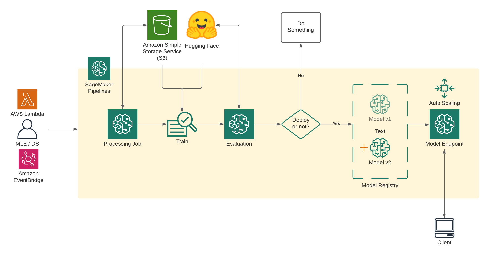

Welcome to this getting started guide, we will use the new Hugging Face Inference DLCs and Amazon SageMaker Python SDK to create  an End-to-End MLOps Pipeline for Hugging Face Transformers from training to production using Amazon SageMaker. 
This blog posts demonstrates how to use [SageMaker Pipelines](https://docs.aws.amazon.com/sagemaker/latest/dg/pipelines-sdk.html) to train a [Hugging Face](https://docs.aws.amazon.com/sagemaker/latest/dg/hugging-face.html) Transformer model and deploy it. The SageMaker integration with Hugging Face makes it easy to train and deploy advanced NLP models. A Lambda step in SageMaker Pipelines enables you to easily do lightweight model deployments and other serverless operations.

In this example we are going to fine-tune and deploy a `DistilBERT` model on the `imdb` dataset.

* Prerequisites: Make sure your notebook environment has IAM managed policy `AmazonSageMakerPipelinesIntegrations` as well as `AmazonSageMakerFullAccess`
* [Reference Blog Post: Use a SageMaker Pipeline Lambda step for lightweight model deployments](https://aws.amazon.com/de/blogs/machine-learning/use-a-sagemaker-pipeline-lambda-step-for-lightweight-model-deployments/)
* [Github Repository](https://github.com/philschmid/huggingface-sagemaker-workshop-series/tree/main/workshop_3_mlops)

# Development Environment and Permissions 


## Installation & Imports

We'll start by updating the SageMaker SDK, and importing some necessary packages.


```python
!pip install "sagemaker>=2.48.0" --upgrade
```

Import all relevant packages for SageMaker Pipelines.

```python
import boto3
import os
import numpy as np
import pandas as pd
import sagemaker
import sys
import time

from sagemaker.workflow.parameters import ParameterInteger, ParameterFloat, ParameterString

from sagemaker.lambda_helper import Lambda

from sagemaker.sklearn.processing import SKLearnProcessor

from sagemaker.processing import ProcessingInput, ProcessingOutput
from sagemaker.workflow.steps import CacheConfig, ProcessingStep

from sagemaker.huggingface import HuggingFace, HuggingFaceModel
import sagemaker.huggingface

from sagemaker.inputs import TrainingInput
from sagemaker.workflow.steps import TrainingStep

from sagemaker.processing import ScriptProcessor
from sagemaker.workflow.properties import PropertyFile
from sagemaker.workflow.step_collections import CreateModelStep, RegisterModel

from sagemaker.workflow.conditions import ConditionLessThanOrEqualTo,ConditionGreaterThanOrEqualTo
from sagemaker.workflow.condition_step import ConditionStep
from sagemaker.workflow.functions import JsonGet

from sagemaker.workflow.pipeline import Pipeline, PipelineExperimentConfig
from sagemaker.workflow.execution_variables import ExecutionVariables
```

## Permissions

_If you are going to use Sagemaker in a local environment. You need access to an IAM Role with the required permissions for Sagemaker. You can find [here](https://docs.aws.amazon.com/sagemaker/latest/dg/sagemaker-roles.html) more about it._


```python
import sagemaker

sess = sagemaker.Session()
region = sess.boto_region_name

# sagemaker session bucket -> used for uploading data, models and logs
# sagemaker will automatically create this bucket if it not exists
sagemaker_session_bucket=None
if sagemaker_session_bucket is None and sess is not None:
    # set to default bucket if a bucket name is not given
    sagemaker_session_bucket = sess.default_bucket()

role = sagemaker.get_execution_role()
sagemaker_session = sagemaker.Session(default_bucket=sagemaker_session_bucket)

print(f"sagemaker role arn: {role}")
print(f"sagemaker bucket: {sagemaker_session.default_bucket()}")
print(f"sagemaker session region: {sagemaker_session.boto_region_name}")
```

# Pipeline Overview



# Defining the Pipeline

## 0. Pipeline parameters

Before defining the pipeline, it is important to parameterize it. SageMaker Pipeline can directly be parameterized, including instance types and counts.

Read more about Parameters in the [documentation](https://docs.aws.amazon.com/sagemaker/latest/dg/build-and-manage-parameters.html)


```python
# S3 prefix where every assets will be stored
s3_prefix = "hugging-face-pipeline-demo"

# s3 bucket used for storing assets and artifacts
bucket = sagemaker_session.default_bucket()

# aws region used
region = sagemaker_session.boto_region_name

# base name prefix for sagemaker jobs (training, processing, inference)
base_job_prefix = s3_prefix

# Cache configuration for workflow
cache_config = CacheConfig(enable_caching=False, expire_after="30d")


# package versions
transformers_version = "4.11.0"
pytorch_version = "1.9.0"
py_version = "py38"

model_id_="distilbert-base-uncased"
dataset_name_="imdb"

model_id = ParameterString(name="ModelId", default_value="distilbert-base-uncased")
dataset_name = ParameterString(name="DatasetName", default_value="imdb")
```

## 1. Processing Step

A SKLearn Processing step is used to invoke a SageMaker Processing job with a custom python script - `preprocessing.py`. 

### Processing Parameter


```python
processing_instance_type = ParameterString(name="ProcessingInstanceType", default_value="ml.c5.2xlarge")
processing_instance_count = ParameterInteger(name="ProcessingInstanceCount", default_value=1)
processing_script = ParameterString(name="ProcessingScript", default_value="./scripts/preprocessing.py")
```

### Processor


```python
processing_output_destination = f"s3://{bucket}/{s3_prefix}/data"


sklearn_processor = SKLearnProcessor(
    framework_version="0.23-1",
    instance_type=processing_instance_type,
    instance_count=processing_instance_count,
    base_job_name=base_job_prefix + "/preprocessing",
    sagemaker_session=sagemaker_session,
    role=role,
)

step_process = ProcessingStep(
    name="ProcessDataForTraining",
    cache_config=cache_config,
    processor=sklearn_processor,
    job_arguments=["--transformers_version",transformers_version,
                   "--pytorch_version",pytorch_version,
                   "--model_id",model_id_,
                   "--dataset_name",dataset_name_],
    outputs=[
        ProcessingOutput(
            output_name="train",
            destination=f"{processing_output_destination}/train",
            source="/opt/ml/processing/train",
        ),
        ProcessingOutput(
            output_name="test",
            destination=f"{processing_output_destination}/test",
            source="/opt/ml/processing/test",
        ),
        ProcessingOutput(
            output_name="validation",
            destination=f"{processing_output_destination}/test",
            source="/opt/ml/processing/validation",
        ),
    ],
    code=processing_script,
)
```

## 2. Model Training Step

We use SageMaker's [Hugging Face](https://sagemaker.readthedocs.io/en/stable/frameworks/huggingface/sagemaker.huggingface.html) Estimator class to create a model training step for the Hugging Face [DistilBERT](https://huggingface.co/distilbert-base-uncased) model.  Transformer-based models such as the original BERT can be very large and slow to train.  DistilBERT, however, is a small, fast, cheap and light Transformer model trained by distilling BERT base. It reduces the size of a BERT model by 40%, while retaining 97% of its language understanding capabilities and being 60% faster. 

The Hugging Face estimator also takes hyperparameters as a dictionary. The training instance type and size are pipeline parameters that can be easily varied in future pipeline runs without changing any code.  

### Training Parameter


```python
# training step parameters
training_entry_point = ParameterString(name="TrainingEntryPoint", default_value="train.py")
training_source_dir = ParameterString(name="TrainingSourceDir", default_value="./scripts")
training_instance_type = ParameterString(name="TrainingInstanceType", default_value="ml.p3.2xlarge")
training_instance_count = ParameterInteger(name="TrainingInstanceCount", default_value=1)

# hyperparameters, which are passed into the training job
epochs=ParameterString(name="Epochs", default_value="1")
eval_batch_size=ParameterString(name="EvalBatchSize", default_value="32")         
train_batch_size=ParameterString(name="TrainBatchSize", default_value="16")             
learning_rate=ParameterString(name="LearningRate", default_value="3e-5")               
fp16=ParameterString(name="Fp16", default_value="True")
```

### Hugging Face Estimator


```python
huggingface_estimator = HuggingFace(
    entry_point=training_entry_point,
    source_dir=training_source_dir,
    base_job_name=base_job_prefix + "/training",
    instance_type=training_instance_type,
    instance_count=training_instance_count,
    role=role,
    transformers_version=transformers_version,
    pytorch_version=pytorch_version,
    py_version=py_version,
    hyperparameters={
         'epochs':epochs,  
         'eval_batch_size': eval_batch_size,   
         'train_batch_size': train_batch_size,              
         'learning_rate': learning_rate,               
         'model_id': model_id,
         'fp16': fp16
    },
    sagemaker_session=sagemaker_session,
)

step_train = TrainingStep(
    name="TrainHuggingFaceModel",
    estimator=huggingface_estimator,
    inputs={
        "train": TrainingInput(
            s3_data=step_process.properties.ProcessingOutputConfig.Outputs[
                "train"
            ].S3Output.S3Uri
        ),
        "test": TrainingInput(
            s3_data=step_process.properties.ProcessingOutputConfig.Outputs[
                "test"
            ].S3Output.S3Uri
        ),
    },
    cache_config=cache_config,
)
```

## 3. Model evaluation Step

A ProcessingStep is used to evaluate the performance of the trained model. Based on the results of the evaluation, either the model is created, registered, and deployed, or the pipeline stops.

In the training job, the model was evaluated against the test dataset, and the result of the evaluation was stored in the `model.tar.gz` file saved by the training job.  The results of that evaluation are copied into a `PropertyFile` in this ProcessingStep so that it can be used in the ConditionStep. 

### Evaluation Parameter


```python
evaluation_script = ParameterString(name="EvaluationScript", default_value="./scripts/evaluate.py")
```

### Evaluator


```python
script_eval = SKLearnProcessor(
    framework_version="0.23-1",
    instance_type=processing_instance_type,
    instance_count=processing_instance_count,
    base_job_name=base_job_prefix + "/evaluation",
    sagemaker_session=sagemaker_session,
    role=role,
)

evaluation_report = PropertyFile(
    name="HuggingFaceEvaluationReport",
    output_name="evaluation",
    path="evaluation.json",
)

step_eval = ProcessingStep(
    name="HuggingfaceEvalLoss",
    processor=script_eval,
    inputs=[
        ProcessingInput(
            source=step_train.properties.ModelArtifacts.S3ModelArtifacts,
            destination="/opt/ml/processing/model",
        )
    ],
    outputs=[
        ProcessingOutput(
            output_name="evaluation",
            source="/opt/ml/processing/evaluation",
            destination=f"s3://{bucket}/{s3_prefix}/evaluation_report",
        ),
    ],
    code=evaluation_script,
    property_files=[evaluation_report],
    cache_config=cache_config,
)
```

## 4. Register the model

The trained model is registered in the Model Registry under a Model Package Group. Each time a new model is registered, it is given a new version number by default. The model is registered in the "Approved" state so that it can be deployed. Registration will only happen if the output of the [6. Condition for deployment](#6.-Condition-for-deployment) is true, i.e, the metrics being checked are within the threshold defined.


```python
model = HuggingFaceModel(
    model_data=step_train.properties.ModelArtifacts.S3ModelArtifacts,
    role=role,
    transformers_version=transformers_version,
    pytorch_version=pytorch_version,
    py_version=py_version,
    sagemaker_session=sagemaker_session,
)
model_package_group_name = "HuggingFaceModelPackageGroup"
step_register = RegisterModel(
    name="HuggingFaceRegisterModel",
    model=model,
    content_types=["application/json"],
    response_types=["application/json"],
    inference_instances=["ml.g4dn.xlarge", "ml.m5.xlarge"],
    transform_instances=["ml.g4dn.xlarge", "ml.m5.xlarge"],
    model_package_group_name=model_package_group_name,
    approval_status="Approved",
)
```

## 5. Model Deployment

We create a custom step `ModelDeployment` derived from the provided `LambdaStep`. This Step will create a Lambda function and invocate to deploy our model as SageMaker Endpoint.


```python
# custom Helper Step for ModelDeployment
from utils.deploy_step import ModelDeployment

# we will use the iam role from the notebook session for the created endpoint
# this role will be attached to our endpoint and need permissions, e.g. to download assets from s3
sagemaker_endpoint_role=sagemaker.get_execution_role()


step_deployment = ModelDeployment(
    model_name=f"{model_id_}-{dataset_name_}",
    registered_model=step_register.steps[0],
    endpoint_instance_type="ml.g4dn.xlarge",
    sagemaker_endpoint_role=sagemaker_endpoint_role,
    autoscaling_policy=None,
)
```

## 6. Condition for deployment

For the condition to be `True` and the steps after evaluation to run, the evaluated accuracy of the Hugging Face model must be greater than our `TresholdAccuracy` parameter.

### Condition Parameter


```python
threshold_accuracy = ParameterFloat(name="ThresholdAccuracy", default_value=0.8)
```

### Condition


```python
cond_gte = ConditionGreaterThanOrEqualTo(
    left=JsonGet(
        step=step_eval,
        property_file=evaluation_report,
        json_path="eval_accuracy",
    ),
    right=threshold_accuracy,
)

step_cond = ConditionStep(
    name="CheckHuggingfaceEvalAccuracy",
    conditions=[cond_gte],
    if_steps=[step_register, step_deployment],
    else_steps=[],
)
```


# Pipeline definition and execution

SageMaker Pipelines constructs the pipeline graph from the implicit definition created by the way pipeline steps inputs and outputs are specified.  There's no need to specify that a step is a "parallel" or "serial" step.  Steps such as model registration after the condition step are not listed in the pipeline definition because they do not run unless the condition is true.  If so, they are run in order based on their specified inputs and outputs.

Each Parameter we defined holds a default value, which can be overwritten before starting the pipeline. [Parameter Documentation](https://docs.aws.amazon.com/sagemaker/latest/dg/build-and-manage-parameters.html)


### Overwriting Parameters


```python
# define parameter which should be overwritten
pipeline_parameters=dict(
        ModelId="distilbert-base-uncased",
        ThresholdAccuracy=0.7,
        Epochs="3",
        TrainBatchSize="32",
        EvalBatchSize="64",
    )
```

### Create Pipeline


```python
pipeline = Pipeline(
    name=f"HuggingFaceDemoPipeline",
    parameters=[
        model_id,
        dataset_name,
        processing_instance_type,
        processing_instance_count,
        processing_script,
        training_entry_point,
        training_source_dir,
        training_instance_type,
        training_instance_count,
        evaluation_script,
        threshold_accuracy,
        epochs,
        eval_batch_size,
        train_batch_size,
        learning_rate,
        fp16
    ],
    steps=[step_process, step_train, step_eval, step_cond],
    sagemaker_session=sagemaker_session,
)
```

We can examine the pipeline definition in JSON format.  You also can inspect the pipeline graph in SageMaker Studio by going to the page for your pipeline.  


```python
import json

json.loads(pipeline.definition())
```


`upsert` creates or updates the pipeline.


```python
pipeline.upsert(role_arn=role)
```

### Run the pipeline


```python
execution = pipeline.start(parameters=pipeline_parameters)
```


```python
execution.wait()
```

## Getting predictions from the endpoint

After the previous cell completes, you can check whether the endpoint has finished deploying.

We can use the `endpoint_name` to create up a `HuggingFacePredictor` object that will be used to get predictions.


```python
from sagemaker.huggingface import HuggingFacePredictor

endpoint_name = f"{model_id}-{dataset_name}"

# check if endpoint is up and running
print(f"https://console.aws.amazon.com/sagemaker/home?region={region}#/endpoints/{endpoint_name}")

hf_predictor = HuggingFacePredictor(endpoint_name,sagemaker_session=sagemaker_session)

```

### Test data

Here are a couple of sample reviews we would like to classify as positive (`pos`) or negative (`neg`).  Demonstrating the power of advanced Transformer-based models such as this Hugging Face model, the model should do quite well even though the reviews are mixed.  


```python
sentiment_input1 = {"inputs":"Although the movie had some plot weaknesses, it was engaging. Special effects were mind boggling.  Can't wait to see what this creative team does next."}

hf_predictor.predict(sentiment_input1)

#     [{'label': 'pos', 'score': 0.9690886735916138}]

sentiment_input2 = {"inputs":"There was some good acting, but the story was ridiculous. The other sequels in this franchise were better.  It's time to take a break from this IP, but if they switch it up for the next one, I'll check it out."}

hf_predictor.predict(sentiment_input2)

#     [{'label': 'neg', 'score': 0.9938264489173889}]
```


## Cleanup Resources

The following cell will delete the resources created by the Lambda function and the Lambda itself. 
Deleting other resources such as the S3 bucket and the IAM role for the Lambda function are the responsibility of the notebook user. 


```python
sm_client = boto3.client("sagemaker")

# Delete the Lambda function
step_deployment.func.delete()

# Delete the endpoint
hf_predictor.delete_endpoint()
```

# Conclusion

With the help of the Amazon SageMaker Pipelines we were able to create a 100% managed End-to-End Machine Learning Pipeline with out the need think about any administration tasks. 
Through the simplicity of SageMaker you don't need huge Ops-teams anymore to manage and scale your machine learning pipelines. You can do it yourself.

---

You can find the code [here](https://github.com/philschmid/huggingface-sagemaker-workshop-series/tree/main/workshop_3_mlops) and feel free open a thread the [forum](https://discuss.huggingface.co/).

Thanks for reading. If you have any questions, feel free to contact me, through [Github](https://github.com/huggingface/transformers), or on the [forum](https://discuss.huggingface.co/c/sagemaker/17). You can also connect with me on [Twitter](https://twitter.com/_philschmid) or [LinkedIn](https://www.linkedin.com/in/philipp-schmid-a6a2bb196/).
