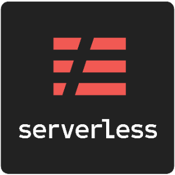
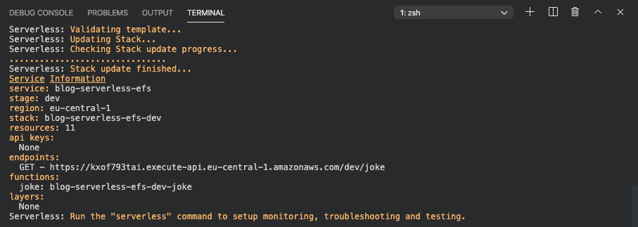
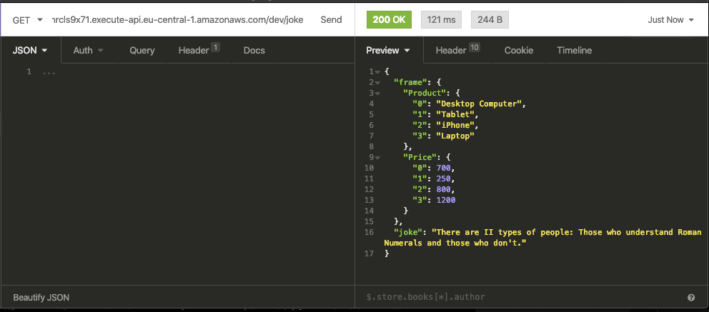

# Introduction

"_Just like wireless internet has wires somewhere, serverless architectures still have servers somewhere. What
‘serverless’ really means is that as a developer you don’t have to think about those servers. You just focus on
code." -_ [serverless.com](https://serverless.com/learn/overview/)

This focus is only possible if we make some tradeoffs. Currently, all Serverless FaaS Services like
[AWS Lambda](https://aws.amazon.com/de/lambda/), [Google Cloud Functions](https://cloud.google.com/functions),
[Azure Functions](https://azure.microsoft.com/de-de/services/functions/) are having limits. For example, there is no
real state or no endless configurable memory.

These limitations have led to serverless architectures being used more for software development and less for machine
learning, especially deep learning.

A big hurdle to overcome in serverless deep learning with tools like [AWS Lambda](https://aws.amazon.com/de/lambda/),
[Google Cloud Functions](https://cloud.google.com/functions),
[Azure Functions](https://azure.microsoft.com/de-de/services/functions/) is storage.
[Tensorflow](https://www.tensorflow.org/) and [Pytorch](https://pytorch.org/) are having a huge size and newer "State of
the art" models like BERT have a size of over 300MB. So far it was only possible to use them if you used some
compression techniques. You can check out two of my posts on how you could do this:

- [Scaling Machine Learning from ZERO to HERO](https://www.philschmid.de/scaling-machine-learning-from-zero-to-hero)
- [Serverless BERT with HuggingFace and AWS Lambda](https://www.philschmid.de/serverless-bert-with-huggingface-and-aws-lambda)

But last month AWS announced mountable storage to your serverless functions. They added support for
[](https://aws.amazon.com/lambda/?nc1=h_ls)[Amazon Elastic File System (EFS)](https://aws.amazon.com/efs/?nc1=h_ls), a
scalable and elastic NFS file system. This allows you to mount your AWS EFS filesystem to your
[AWS Lambda](https://aws.amazon.com/lambda/?nc1=h_ls) function.

In their
[blog post](https://aws.amazon.com/blogs/compute/using-amazon-efs-for-aws-lambda-in-your-serverless-applications/), they
explain to connect an AWS lambda function to AWS EFS. The blog post is very nice, definitely check it out.

In this post, we are going to do the same, but a bit better with using the
[Serverless Framework](https://www.serverless.com/) and without the manual work.


**_PREVIEW:_** I am building a CLI tool called `efsync` which enables you to upload automatically files (pip packages,
ML models, ...) to an EFS file system.

Until I finished `efsync` you can use
[AWS Datasync to upload you data to an AWS EFS file system](https://docs.aws.amazon.com/efs/latest/ug/gs-step-four-sync-files.html).

---

# What is AWS Lambda?

You are probably familiar with [AWS Lambda](https://docs.aws.amazon.com/lambda/latest/dg/welcome.html), but to make
things clear AWS Lambda is a computing service that lets you run code without managing servers. It executes your code
only when required and scales automatically, from a few requests per day to thousands per second. You only pay for the
compute time you consume - there is no charge when your code is not running.


[https://aws.amazon.com/de/lambda/features/](https://aws.amazon.com/de/lambda/features/)

---

# What is AWS EFS?

Amazon EFS is a fully-managed service that makes it easy to set up, scale, and cost-optimize file storage in the Amazon
Cloud. Amazon EFS-filesystems can automatically scale from gigabytes to petabytes of data without needing to provision
storage. Amazon EFS is designed to be highly durable and highly available. With Amazon EFS, there is no minimum fee or
setup costs, and you pay only for what you use.

---

# Serverless Framework

The Serverless Framework helps us develop and deploy AWS Lambda functions. It’s a CLI that offers structure, automation,
and best practices right out of the box. It also allows us to focus on building sophisticated, event-driven, serverless
architectures, comprised of functions and events.



If you aren’t familiar or haven’t set up the Serverless Framework, take a look at
this [quick-start with the Serverless Framework](https://serverless.com/framework/docs/providers/aws/guide/quick-start/).

---

# Tutorial

We build an AWS Lambda function with `python3.8` as runtime, which is going to import and use `pip packages` located on
our EFS-filesystem. As an example, we use `pandas` and `pyjokes`. They could easily be replaced by `Tensorflow` or
`Pytorch`.

Before we get started, make sure you have the [Serverless Framework](https://serverless.com/) configured and an
EFS-filesystem set up with the required dependencies. We are not going to cover the steps on how to install the
dependencies and upload them to EFS in this blog post. You can either user
[AWS Datasync](https://docs.aws.amazon.com/efs/latest/ug/gs-step-four-sync-files.html) or start an `ec2-instance`
connect with `ssh`, mount the EFS-filesystem with `amazon-efs-utils`, and use `pip install -t` to install the pip
packages on efs.

**We are going to do:**

- create a Python Lambda function with the Serverless Framework
- configure the `serverless.yaml` and add our `EFS-filesystem` as mount volume
- adjust the `handler.py` and import `pandas` and `pyjokes` from EFS
- deploy & test the function

---

# Create a Python Lambda function

First, we create our AWS Lambda function by using the Serverless CLI with the `aws-python3` template.

```bash
serverless create --template aws-python3 --path serverless-efs
```

This CLI command creates a new directory containing a `handler.py`, `.gitignore`, and `serverless.yaml` file. The
`handler.py` contains some basic boilerplate code.

```python
import json

def hello(event, context):
    body = {
        "message": "Go Serverless v1.0! Your function executed successfully!",
        "input": event
    }
    response = {
        "statusCode": 200,
        "body": json.dumps(body)
    }
    return response
```

---

# Configure the `serverless.yaml` and add our `EFS-filesystem` as mount volume

I provide the complete `serverless.yaml`for this example, but we go through all the details we need for our
EFS-filesystem and leave out all standard configurations. If you want to learn more about the `serverless.yaml`, I
suggest you check out
[Scaling Machine Learning from ZERO to HERO](https://www.philschmid.de/scaling-machine-learning-from-zero-to-hero). In
this article, I went through each configuration and explain the usage of them.

```yaml
service: blog-serverless-efs

plugins:
  - serverless-pseudo-parameters

custom:
  efsAccessPoint: <your-efs-accesspoint>
  LocalMountPath: <mount-directory-in-aws-lambda-function>
  subnetsId: <subnetid-in-which-efs-is>
  securityGroup: <any-security-group>

provider:
  name: aws
  runtime: python3.8
  region: eu-central-1

package:
  exclude:
    - node_modules/**
    - .vscode/**
    - .serverless/**
    - .pytest_cache/**
    - __pychache__/**

functions:
  joke:
    handler: handler.handler
    environment: # Service wide environment variables
      MNT_DIR: ${self:custom.LocalMountPath}
    vpc:
      securityGroupIds:
        - ${self:custom.securityGroup}
      subnetIds:
        - ${self:custom.subnetsId}
    iamManagedPolicies:
      - arn:aws:iam::aws:policy/AmazonElasticFileSystemClientReadWriteAccess
    events:
      - http:
          path: joke
          method: get

resources:
  extensions:
    # Name of function <joke>
    JokeLambdaFunction:
      Properties:
        FileSystemConfigs:
          - Arn: 'arn:aws:elasticfilesystem:${self:provider.region}:#{AWS::AccountId}:access-point/${self:custom.efsAccessPoint}'
            LocalMountPath: '${self:custom.LocalMountPath}'
```

First, we need to install the `serverless-pseudo-parameters` plugin with the following command.

```json
npm install serverless-pseudo-parameters
```

We use the `serverless-pseudo-parameters` plugin to get our `AWS::AccountID` referenced in the `serverless.yaml`. All
custom needed variables are referenced under `custom`.

- `efsAccessPoint` should be the value of your EFS access point. You can find it in the AWS Management Console under
  `EFS`. This one should look similar to this `fsap-0a31095162dd0ca44`
- `LocalMountPath` is the path under which EFS is mounted in the AWS Lambda function
- `subnetsId` should have the same id as the EFS-filesystem. If you started your filesystem in multiple Availability
  Zones you can choose the one you want.
- `securityGroup` can be any security group in the AWS account. We need this to deploy our AWS Lambda function into the
  required subnet. We can use the `default` security group id. This one should look like this `sg-1018g448`.

We utilize Cloudformation extensions to mount the EFS-filesystem after our lambda is created. Therefore we use this
little snippet.
[Extensions can be used to override Cloudformation Resources](https://www.serverless.com/framework/docs/providers/aws/guide/resources#override-aws-cloudformation-resource).

```json
resources:
  extensions:
    # Name of function <joke>
    JokeLambdaFunction:
      Properties:
        FileSystemConfigs:
          - Arn: "arn:aws:elasticfilesystem:${self:provider.region}:#{AWS::AccountId}:access-point/${self:custom.efsAccessPoint}"
            LocalMountPath: "${self:custom.LocalMountPath}"
```

---

# Adjust the `handler.py` and import `pandas` and `pyjokes` from EFS

The last step before we can deploy is to adjust our `handler.py` and import `pandas` and `pyjokes` from EFS. In my
example, I used `/mnt/efs` as `localMountPath` and installed my pip packages in `lib/`.

To use our dependencies from our EFS-filesystem we have to add our `localMountPath` path to our `PYTHONPATH`. Therefore
we add a small `try/except` statement at the top of your `handler.py`, which appends our `mnt/efs/lib` to the
`PYTHONPATH`. Lastly, we add some demo calls to show our 2 dependencies work.

```python
try:
    import sys
    import os
    sys.path.append(os.environ['MNT_DIR']+'/lib')  # nopep8 # noqa
except ImportError:
    pass

import json
import os
import pyjokes
from pandas import DataFrame

def handler(event, context):
    data = {'Product': ['Desktop Computer', 'Tablet', 'iPhone', 'Laptop'],
            'Price': [700, 250, 800, 1200]
            }

    df = DataFrame(data, columns=['Product', 'Price'])

    body = {
        "frame": df.to_dict(),
        "joke": pyjokes.get_joke()
    }

    response = {
        "statusCode": 200,
        "body": json.dumps(body)
    }

    return response
```

---

# Deploy & Test the function

In order to deploy the function we only have to run `serverless deploy`.

After this process is done we should see something like this.



To test our Lambda function we can use Insomnia, Postman, or any other REST client. Just send a GET-Request to our
created endpoint. The answer should look like this.



The first request to the cold AWS Lambda function took around 8 seconds. After it is warmed up it takes around 100-150ms
as you can see in the screenshot.

The best thing is, our AWS Lambda function automatically scales up if there are several incoming requests up to
thousands of parallel requests without any worries.

If you _rebuild this, you have to be careful that the first request could take a while._

---

You can find the [GitHub repository](https://github.com/philschmid/serverless-efs-and-aws-lambda) with the complete code
[here](https://github.com/philschmid/serverless-efs-and-aws-lambda).

Thanks for reading. If you have any questions, feel free to contact me or comment on this article. You can also connect
with me on [Twitter](https://twitter.com/_philschmid) or
[LinkedIn](https://www.linkedin.com/in/philipp-schmid-a6a2bb196/).
