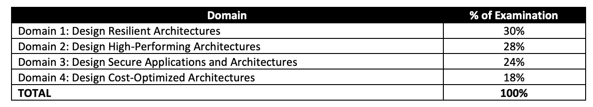
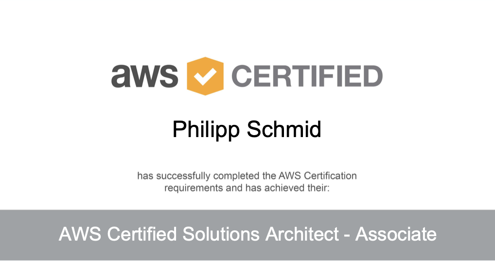

# Introduction

Hello, my name is Philipp and I am working as a machine learning engineer at a technology incubation startup. At work I
design and implement cloud-native machine learning architectures for fin-tech and insurance companies.

I started to work with AWS 2 1/2 years ago. Since then I had built many projects both privately and at work using AWS
Services. I like the Serverless services of aws the most. For me, Serverless first always applies.

In short, I have several years of professional and part-time experience with AWS, but no certificate. I know that
hands-on experience and knowledge are more important than certificates. But sometimes you need a sheet of paper to prove
that.

## Disclaimer

> This article won’t show how everyone gets certified in under 30h of studying. Instead, it should motivate others who
> have the same experience as me but are too lazy.

---

# The Certificate

So a few weeks ago I decided to do the "AWS Certified Solutions Architect - Associate SAA-C02" certificate.

The "AWS Solutions Architect – Associate SAA-C02" certificate validates the ability to architect and deploy dynamically
scalable, highly available, fault-tolerant, and reliable applications on AWS. The exam takes 130 minutes and consists of
65 questions

---

# Research

First I researched, what are the exam criteria. According to the
[AWS*Solution_Architect*-\_Associate_SAA-C02_Exam_Blue_Print](https://d1.awsstatic.com/training-and-certification/docs-sa-assoc/AWS-Certified-Solutions-Architect-Associate-Exam-Guide_v1.1_2019_08_27_FINAL.pdf)
it consists out of those 4 topics.

[except from the PDF-Document](https://d1.awsstatic.com/training-and-certification/docs-sa-assoc/AWS-Certified-Solutions-Architect-Associate-Exam-Guide_v1.1_2019_08_27_FINAL.pdf)

Second, I researched online courses and summary/ cheat sheets. I quickly found an online course as I was already
familiar with [a cloud guru](https://acloudguru.com/). After some googling, I found
[Jayendra's Blog](https://jayendrapatil.com/aws-certified-solutions-architect-associate-saa-c02-exam-learning-path/),
which has a cheat sheet for almost every topic.

---

# Study

Initially, I watched the
["AWS Certified Solutions Architect Associate SAA-C02" course on a cloud guru](https://acloud.guru/learn/aws-certified-solutions-architect-associate).
Due to my experienced, I watched the course at 2x speed. Every episode that contained a lab have I implemented
independently afterwards.

After I completed the course I did one practice exam from a cloud guru and achieved 78%. Therefore I booked my practice
in 3 days. In these 3 days, I studied 4 hours a day, did 10 practice exams, and learned with the cheatsheets.

## Learning Path Overview

| Week | Course Chapter | Topic                                     | Time invested |
| ---- | -------------- | ----------------------------------------- | ------------- |
| 1    | 1&2            | Introduction & 10,000-Foot Overview       | 1/2h          |
| 1    | 3              | Identity and Access Management & S3       | 2h            |
| 2    | 4              | EC2                                       | 3h            |
| 3    | 5              | Databases on AWS                          | 2h            |
| 3    | 6              | Advanced IAM                              | 1/2h          |
| 4    | 7              | Route 53                                  | 1h            |
| 4    | 8              | VPCs                                      | 2h            |
| 5    | 9              | HA Architecture                           | 2h            |
| 6    | 10             | Applications                              | 1h            |
| 6    | 11             | Security                                  | 1/2h          |
| 6    | 12             | Serverless                                | 1h            |
| 7    | -              | 10x Practice Exams & studying cheatsheets | 12h           |

In total it took me 7 Weeks and ~28h to complete the "AWS Certified Solutions Architect - Associate SAA-C02"
certificate.

---

# Exam

On the day of the exam, I took the last practice exam and did every quiz from the a cloud guru course. I took my exam at
home through PearsonVue. As an exemplary examinee, I fulfilled all requirements in advance and was ready for my exam.
The check-in was very easy and the Instructor was very kind. It took around 10 minutes to start.

It took me 80 minutes to finish and pass the exam.

---

# Learnings

Practice exams are good, but due to the fact that AWS is developing so fast, they don´t have to be accurate. In my case,
I had around 8–10 Questions about storage gateway, efs, fsx and in the practice exams way less of them. My learning from
this is I should rather do one less practice exam and read some more documentation.

My second learning is that the confirmation of your abilities is something great to be proud of.

---

Thanks for reading and a special Thanks to
[Jayendra's Blog](https://jayendrapatil.com/aws-certified-solutions-architect-associate-saa-c02-exam-learning-path/) and
[a cloud guru](https://acloudguru.com/).

If you have any questions, feel free to contact me. You can connect with me on
[Twitter](https://twitter.com/_philschmid) and [LinkedIn](https://www.linkedin.com/in/philipp-schmid-a6a2bb196/) or
write me an [email](https://www.philschmid.de).
