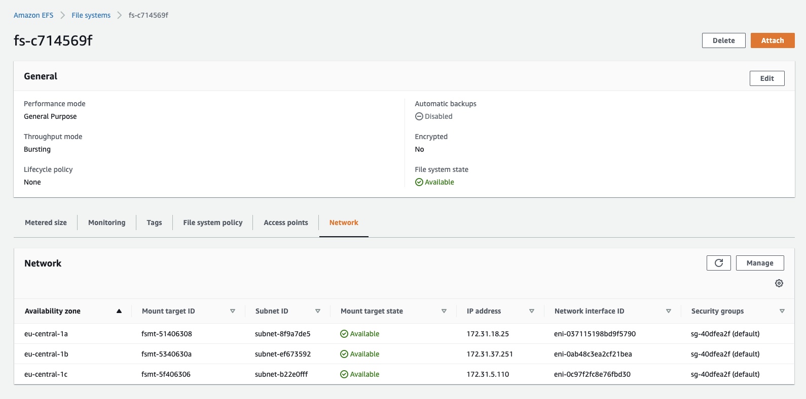
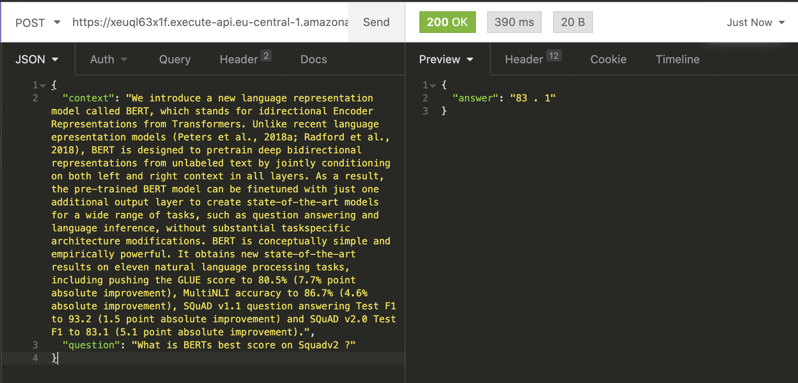

# Introduction

4 months ago I wrote the article
["Serverless BERT with HuggingFace and AWS Lambda"](https://www.philschmid.de/serverless-bert-with-huggingface-and-aws-lambda),
which demonstrated how to use BERT in a serverless way with AWS Lambda and the Transformers Library from HuggingFace.

In this article, I already predicted that
_["BERT and its fellow friends RoBERTa, GPT-2, ALBERT, and T5 will drive business and business ideas in the next few years and will change/disrupt business areas like the internet once did."](https://www.philschmid.de/serverless-bert-with-huggingface-and-aws-lambda)_

Since then the usage of BERT in Google Search increased from
[10% of English](https://www.blog.google/products/search/search-language-understanding-bert/) queries to almost
[100% of English-based queries](https://searchon.withgoogle.com/). But that's not it. Google powers now over
[70 languages with BERT for Google Search](https://twitter.com/searchliaison/status/1204152378292867074).


[https://youtu.be/ZL5x3ovujiM?t=484](https://youtu.be/ZL5x3ovujiM?t=484)

In this article, we are going to tackle all the drawbacks from my previous article like model load time, and dependency
size, and usage.

We are going to build the same "Serverless BERT powered Question-Answering API" as last time. But instead of using
compressing techniques to fit our Python dependencies into our AWS Lambda function, we are using a tool called
[efsync](https://github.com/philschmid/efsync). I built efsync to automatically upload dependencies to an AWS EFS
filesystem and then mount them into our AWS Lambda function. This allows us to include our machine learning model into
our function without the need to load it from S3.

## TL;DR;

We are going to build a serverless Question-Answering API using the [Serverless Framework](https://www.serverless.com/),
[AWS Lambda](https://docs.aws.amazon.com/lambda/latest/dg/welcome.html), [AWS EFS](https://aws.amazon.com/en/efs/),
[efsync](https://github.com/philschmid/efsync), [Terraform](https://www.terraform.io/), the
[transformers](https://github.com/huggingface/transformers) Library from HuggingFace, and a `mobileBert` model from
Google fine-tuned on [SQuADv2](https://rajpurkar.github.io/SQuAD-explorer/explore/v2.0/dev/).

You find the complete code for it in this
[Github repository](https://github.com/philschmid/new-serverless-bert-aws-lambda).

---

# Libraries and Frameworks

## Serverless Framework


[The Serverless Framework](https://www.serverless.com/) helps us develop and deploy AWS Lambda functions. It’s a CLI
that offers structure, automation, and best practices right out of the box.

---

## AWS Lambda


[https://aws.amazon.com/de/lambda/features/](https://aws.amazon.com/de/lambda/features/)

[AWS Lambda](https://docs.aws.amazon.com/lambda/latest/dg/welcome.html) is a serverless computing service that lets you
run code without managing servers. It executes your code only when required and scales automatically, from a few
requests per day to thousands per second.

---

## Amazon Elastic File System (EFS)

[Amazon EFS](https://aws.amazon.com/de/efs/) is a fully-managed service that makes it easy to set up, scale, and
cost-optimize file storage in the Amazon Cloud. Since June 2020 you can mount AWS EFS to AWS Lambda functions

---

## Efsync

[Efsync](https://github.com/philschmid/efsync) is a CLI/SDK tool, which automatically syncs files and dependencies to
AWS EFS. It enables you to install dependencies with the AWS Lambda runtime directly into your EFS filesystem and use
them in your AWS Lambda function.

---

## Terraform


[https://www.terraform.io/logos.html](https://www.terraform.io/logos.html)

[Terraform](https://www.terraform.io/) is an Infrastructure as Code (IaC) tool for building cloud-native infrastructure
safely and efficiently. Terraform enables you to use HCL (HashiCorp Configuration Language) to describe your
cloud-native infrastructure.

---

## Transformers Library by Huggingface


The [Transformers library](https://github.com/huggingface/transformers) provides state-of-the-art machine learning
architectures like BERT, GPT-2, RoBERTa, XLM, DistilBert, XLNet, T5 for Natural Language Understanding (NLU) and Natural
Language Generation (NLG). It also provides thousands of pre-trained models in 100+ different languages.

---

# The Architecture


# Tutorial

Before we get started, make sure you have the [Serverless Framework](https://serverless.com/) and
[Terraform](https://www.terraform.io/) configured and set up. Furthermore, you need access to an AWS Account to create
an EFS Filesystem, API Gateway, and the AWS Lambda function.

In the tutorial, we are going to build a Question-Answering API with a pre-trained `BERT` model from Google.

We are going to send a context (small paragraph) and a question to the lambda function, which will respond with the
answer to the question.

**What are we going to do:**

- create the required infrastructure using `terraform`.
- use `efsync` to upload our Python dependencies to AWS EFS.
- create a Python Lambda function with the Serverless Framework.
- add the `BERT`model to our function and create an inference pipeline.
- Configure the `serverless.yaml`, add EFS and set up an API Gateway for inference.
- deploy & test the function.

You will need a new IAM user called `serverless-bert` with `AdministratorAccess` and configured it with the AWS CLI
using `aws configure --profile serverless-bert`. This IAM user is used in the complete tutorial. If you don´t know how
to do this check out this [link](https://docs.aws.amazon.com/cli/latest/userguide/cli-configure-files.html).

_**Note:** I don´t recommend create a IAM User for production usage with `AdministratorAccess`_

---

Before we start, I want to say that we're not gonna go into detail for every step. If you want to understand more about
how to use Deep Learning in AWS Lambda I suggest you check out my other articles:

- [Scaling Machine Learning from ZERO to HERO](https://www.philschmid.de/scaling-machine-learning-from-zero-to-hero)
- [How to Set Up a CI/CD Pipeline for AWS Lambda With GitHub Actions and Serverless](https://www.philschmid.de/how-to-set-up-a-ci-cd-pipeline-for-aws-lambda-with-github-actions-and-serverless)
- [Serverless BERT with HuggingFace and AWS Lambda](https://www.philschmid.de/serverless-bert-with-huggingface-and-aws-lambda)
- [efsync my first open-source MLOps toolkit](https://www.philschmid.de/efsync-my-first-open-source-mlops-toolkit)

You find the complete code in this [Github repository](https://github.com/philschmid/new-serverless-bert-aws-lambda).

---

# Create the required infrastructure using `terraform`

At first, we define and create the required infrastructure using terraform. If you haven´t set it up you can check out
this [tutorial](https://learn.hashicorp.com/tutorials/terraform/install-cli?in=terraform/aws-get-started).

As infrastructure, we need an AWS EFS filesystem, an access point, and a mount target to be able to use it in our AWS
Lambda function. We could also create a VPC, but for the purpose of this tutorial, we are going to use the default VPC
and his subnets.

Next, we create a directory `serverless-bert/`, which contains all code for this tutorial with a subfolder `terraform/`
including our `main.tf` file.

```bash
mkdir serverless-bert serverless-bert/terraform && touch serverless-bert/terraform/main.tf
```

Afterwards, we open the `main.tf` with our preferred IDE and add the terraform resources. I provided a basic template
for all of them. If you want to customize them or add extra resources check out the
[documentation](https://registry.terraform.io/providers/hashicorp/aws/latest/docs) for all possibilities.

```bash
# provider
provider "aws" {
	region                  = "eu-central-1"
  shared_credentials_file = "~/.aws/credentials"
  profile                 = "serverless-bert"
}

# get all available availability zones

data "aws_vpc" "default" {
  default = true
}

data "aws_subnet_ids" "subnets" {
  vpc_id = data.aws_vpc.default.id
}

# EFS File System

resource "aws_efs_file_system" "efs" {
  creation_token = "serverless-bert"
}

# Access Point

resource "aws_efs_access_point" "access_point" {
  file_system_id = aws_efs_file_system.efs.id
}

# Mount Targets

resource "aws_efs_mount_target" "efs_targets" {
  for_each = data.aws_subnet_ids.subnets.ids
  subnet_id      = each.value
  file_system_id = aws_efs_file_system.efs.id
}

#
# SSM Parameter for serverless
#

resource "aws_ssm_parameter" "efs_access_point" {
  name      = "/efs/accessPoint/id"
  type      = "String"
  value     = aws_efs_access_point.access_point.id
  overwrite = true
}
```

To change the name of EFS you can edit the value `creation_token` in the `aws_efs_filesystem` resource. Otherwise, the
name of the EFS will be "serverless-bert". Additionally, we create an SSM parameter for the `efs_access_point_id` at the
end to use it later in our `serverless.yaml`.

To use terraform we first run `terraform init` to initialize our project and provider (AWS). Be aware we have to be in
the `terraform/` directory.

```bash
terraform init
```

Afterwards, we check our IaC definitions with `terraform plan`

```bash
terraform plan
```

When this is complete we create our infrastructure with `terraform apply`

```bash
terraform apply
```


---

# Use `efsync` to upload our Python dependencies to AWS EFS

The next step is to add and install our dependencies on our AWS EFS filesystem. Therefore we use a tool called `efsync`.
I created [efsync](https://github.com/philschmid/efsync) to install dependencies with the AWS Lambda runtime directly
into your EFS filesystem and use them in your AWS Lambda function.

install efsync by running `pip3 install efsync`

```bash
pip3 install efsync
```

After it is installed we create a `requirements.txt` in our root directory `serverless-bert/` and add our dependencies
to it.

```
https://download.pytorch.org/whl/cpu/torch-1.5.0%2Bcpu-cp38-cp38-linux_x86_64.whl
transformers==3.4.0
```

Efsync provides different [configurations](https://github.com/philschmid/efsync#sdk). This time we use the CLI with a
`yaml` configuration. For that, we create an `efsync.yaml` file in our root directory.

```yaml
#standard configuration
efs_filesystem_id: <efs-filesystem-id> # aws efs filesystem id
subnet_Id: <subnet-id-of-mount-target> # subnet of which the efs is running in
ec2_key_name: efsync-asd913fjgq3 # required key name for starting the ec2 instance
clean_efs: all # Defines if the EFS should be cleaned up before. values: `'all'`,`'pip'`,`'file'` uploading
# aws profile configuration
aws_profile: serverless-bert # aws iam profile with required permission configured in .aws/credentials
aws_region: eu-central-1 # the aws region where the efs is running

# pip dependencies configurations
efs_pip_dir: lib # pip directory on ec2
python_version: 3.8 # python version used for installing pip dependencies -> should be used as lambda runtime afterwads
requirements: requirements.txt # path + file to requirements.txt which holds the installable pip dependencies
```

Here we have to adjust the values of `efs_filesystem_id` and `subnet_Id`. Get these values by either looking them up in
the management console or using these two CLI commands.


```yaml
aws efs describe-file-systems --creation-token serverless-bert --profile serverless-bert
```


Beware that if you changed the `creation_token` earlier you have to adjust it here.



```yaml
aws efs describe-mount-targets --file-system-id <filesystem-id> --profile serverless-bert
```


You can choose one of your `subnet_Ids` for the `efsync.yaml` configuration. If you want to learn more about the
configuration options, you can read more [here](https://github.com/philschmid/efsync).

After the configuration of our `efsync.yaml` we run `efsync -cf efsync.yaml` to install our Python dependencies on our
AWS EFS filesystem. This will take around 5-10 Minutes.

```python
efsync -cf efsync.yaml
```


---

# Create a Python Lambda function with the Serverless Framework

Third, we create our AWS Lambda function by using the Serverless CLI with the `aws-python3` template.

```bash
serverless create --template aws-python3 --path function
```

This CLI command will create a new directory containing a `handler.py`, `.gitignore`, and `serverless.yaml` file. The
`handler.py` contains some basic boilerplate code.

```python
import json

def hello(event, context):
    body = {
        "message": "Go Serverless v1.0! Your function executed successfully!",
        "input": event
    }
    response = {
        "statusCode": 200,
        "body": json.dumps(body)
    }
    return response
```

---

# Add the `BERT`model to our function and create an inference pipeline

Since we are not including our Python dependencies into our AWS Lambda function, we have around 250MB of Storage to use
for our model files. For those who are not that familiar with AWS Lambda and its limitations, you can check out this
[link](https://www.notion.so/add-the-mobileBERTmodel-from-to-our-function-and-create-an-inference-pipeline-b5530c56acb7437c8ef1a395c4436b7d).

_If you want to use models, which are bigger than 250MB you could use efsync to upload them to EFS and then load them
from there. Read more [here](https://www.philschmid.de/efsync-my-first-open-source-mlops-toolkit)._

To add our `BERT` model to our function we have to load it from the
[model hub of HuggingFace](https://huggingface.co/models). For this, I have created a python script. Before we can
execute this script we have to install the `transformers` library to our local environment and create a `model`
directory in our `function/` directory.

```yaml
mkdir model function/model
```

```yaml
pip3 install torch==1.5.0 transformers==3.4.0
```

After we installed `transformers` we create `get_model.py` file in the `function/` directory and include the script
below.

```python
from transformers import AutoModelForQuestionAnswering, AutoTokenizer

def get_model(model):
  """Loads model from Hugginface model hub"""
  try:
    model = AutoModelForQuestionAnswering.from_pretrained(model,use_cdn=True)
    model.save_pretrained('./model')
  except Exception as e:
    raise(e)

def get_tokenizer(tokenizer):
  """Loads tokenizer from Hugginface model hub"""
  try:
    tokenizer = AutoTokenizer.from_pretrained(tokenizer)
    tokenizer.save_pretrained('./model')
  except Exception as e:
    raise(e)

get_model('mrm8488/mobilebert-uncased-finetuned-squadv2')
get_tokenizer('mrm8488/mobilebert-uncased-finetuned-squadv2')
```

To execute the script we run `python3 get_model.py` in the `function/` directory.

```python
python3 get_model.py
```

_**Tip**: add the `model` directory to gitignore._

The next step is to adjust our `handler.py` and include our `serverless_pipeline()`.

At first, we add all the required imports and our EFS Filesystem to the `PYTHONPATH` so we can import our dependencies
from there. Therefore we use `sys.path.append(os.environ['EFS_PIP_PATH'])`. We will define the `EFS_PIP_PATH` later in
our `serverless.yaml`.

We create `serverless_pipeline()` function, which initializes our model and tokenizer and returns a `predict` function,
we can use in our `handler`.

```python
import sys
import os
# adds EFS Filesystem to our PYTHONPATH
sys.path.append(os.environ['EFS_PIP_PATH'])  # nopep8 # noqa
import json
import torch
from transformers import AutoModelForQuestionAnswering, AutoTokenizer, AutoConfig

def encode(tokenizer, question, context):
    """encodes the question and context with a given tokenizer"""
    encoded = tokenizer.encode_plus(question, context)
    return encoded["input_ids"], encoded["attention_mask"]

def decode(tokenizer, token):
    """decodes the tokens to the answer with a given tokenizer"""
    answer_tokens = tokenizer.convert_ids_to_tokens(
        token, skip_special_tokens=True)
    return tokenizer.convert_tokens_to_string(answer_tokens)

def serverless_pipeline(model_path='./model'):
    """Initializes the model and tokenzier and returns a predict function that ca be used as pipeline"""
    tokenizer = AutoTokenizer.from_pretrained(model_path)
    model = AutoModelForQuestionAnswering.from_pretrained(model_path)
    def predict(question, context):
        """predicts the answer on an given question and context. Uses encode and decode method from above"""
        input_ids, attention_mask = encode(tokenizer,question, context)
        start_scores, end_scores = model(torch.tensor(
            [input_ids]), attention_mask=torch.tensor([attention_mask]))
        ans_tokens = input_ids[torch.argmax(
            start_scores): torch.argmax(end_scores)+1]
        answer = decode(tokenizer,ans_tokens)
        return answer
    return predict

# initializes the pipeline
question_answering_pipeline = serverless_pipeline()

def handler(event, context):
    try:
        # loads the incoming event into a dictonary
        body = json.loads(event['body'])
        # uses the pipeline to predict the answer
        answer = question_answering_pipeline(question=body['question'], context=body['context'])
        return {
            "statusCode": 200,
            "headers": {
                'Content-Type': 'application/json',
                'Access-Control-Allow-Origin': '*',
                "Access-Control-Allow-Credentials": True

            },
            "body": json.dumps({'answer': answer})
        }
    except Exception as e:
        print(repr(e))
        return {
            "statusCode": 500,
            "headers": {
                'Content-Type': 'application/json',
                'Access-Control-Allow-Origin': '*',
                "Access-Control-Allow-Credentials": True
            },
            "body": json.dumps({"error": repr(e)})
        }
```

---

# Configure the `serverless.yaml`, add EFS, and set up an API Gateway for inference.

I provide the complete `serverless.yaml`for this example, but we go through all the details we need for our
EFS-filesystem and leave out all standard configurations. If you want to learn more about the `serverless.yaml`, I
suggest you check out
[Scaling Machine Learning from ZERO to HERO](https://www.philschmid.de/scaling-machine-learning-from-zero-to-hero). In
this article, I went through each configuration and explain the usage of them.

```yaml
service: new-serverless-bert-lambda

plugins:
  - serverless-pseudo-parameters

custom:
  efsAccessPoint: ${ssm:/efs/accessPoint/id}
  LocalMountPath: /mnt/efs
  efs_pip_path: /lib

provider:
  name: aws
  runtime: python3.8
  region: eu-central-1
  memorySize: 3008 # optional, in MB, default is 1024
  timeout: 60 # optional, in seconds, default is 6
  environment: # Service wide environment variables
    MNT_DIR: ${self:custom.LocalMountPath}
    EFS_PIP_PATH: '${self:custom.LocalMountPath}${self:custom.efs_pip_path}'
  iamManagedPolicies:
    - arn:aws:iam::aws:policy/AmazonElasticFileSystemClientReadWriteAccess

package:
  exclude:
    - test/**
    - lib/**
    - terraform/**
    - node_modules/**
    - .vscode/**
    - .serverless/**
    - .pytest_cache/**
    - __pychache__/**

functions:
  questionanswering:
    handler: handler.handler
    fileSystemConfig:
      localMountPath: ${self:custom.LocalMountPath}
      arn: 'arn:aws:elasticfilesystem:${self:provider.region}:#{AWS::AccountId}:access-point/${self:custom.efsAccessPoint}'
    vpc:
      securityGroupIds:
        - <your-default-security-group-id>
      subnetIds:
        - <your-default-subnet-id>
        - <your-default-subnet-id>
        - <your-default-subnet-id>
    events:
      - http:
          path: qa
          method: post
```

We need to install the `serverless-pseudo-parameters` plugin with the following command.

```yaml
npm install serverless-pseudo-parameters
```

We use the `serverless-pseudo-parameters` plugin to get our `AWS::AccountID` referenced in the `serverless.yaml`. All
custom needed variables are referenced under `custom` or in our `functions` section.

**custom:**

- `efsAccessPoint` should be the value of your EFS access point. Here we use our SSM parameter created earlier by our
  `terraform` templates.
- `LocalMountPath` is the path under which EFS is mounted in the AWS Lambda function.
- `efs_pip_path` is the path under which we installed our Python dependencies using `efsync`.

**functions**

- `securityGroupIds` can be any security group in the AWS account. We use the `default` security group id. This one
  should look like this `sg-1018g448`.

  ```bash
  aws ec2   describe-security-groups --filters Name=description,Values="default VPC security group"   --profile serverless-bert
  ```

- `subnetsId` should have the same id as the EFS-filesystem. They should look like this `subnet-8f9a7de5`.

  ```bash
  aws efs describe-mount-targets --file-system-id <filesystem-id> --profile serverless-bert
  ```

---

# Deploy & Test the function

In order to deploy the function, we run `serverless deploy --aws-profile serverless-bert`.

```yaml
serverless deploy --aws-profile serverless-bert
```

After this process is done we should see something like this.


To test our Lambda function we can use Insomnia, Postman, or any other REST client. Just add a JSON with a `context` and
a `question` to the body of your request. Let´s try it with our example from the colab notebook.

```json
{
  "context": "We introduce a new language representation model called BERT, which stands for idirectional Encoder Representations from Transformers. Unlike recent language epresentation models (Peters et al., 2018a; Radford et al., 2018), BERT is designed to pretrain deep bidirectional representations from unlabeled text by jointly conditioning on both left and right context in all layers. As a result, the pre-trained BERT model can be finetuned with just one additional output layer to create state-of-the-art models for a wide range of tasks, such as question answering and language inference, without substantial taskspecific architecture modifications. BERT is conceptually simple and empirically powerful. It obtains new state-of-the-art results on eleven natural language processing tasks, including pushing the GLUE score to 80.5% (7.7% point absolute improvement), MultiNLI accuracy to 86.7% (4.6% absolute improvement), SQuAD v1.1 question answering Test F1 to 93.2 (1.5 point absolute improvement) and SQuAD v2.0 Test F1 to 83.1 (5.1 point absolute improvement).",
  "question": "What is BERTs best score on Squadv2 ?"
}
```

Our `serverless_pipeline()` answered our question correctly with `83.1`. Also, you can see the complete first request
took 2900ms or 29s. 15 seconds of this used to initialize the model in our function.



The second request took only 390ms.

The best thing is, our BERT model automatically scales up if there are several incoming requests! It scales up to
thousands of parallel requests without any worries.

---

# Conclusion

We have successfully implemented a Serverless Question-Answering API. For Implementation, we used both IaC tools and
"State of the Art" NLP models in a serverless fashion. We reduced the complexity from a developer's perspective but
included a lot of DevOps/MLOps steps. I think it is necessary to include DevOps/MLOps, which handles your deployment and
provisioning if you want to run scalable serverless machine learning in production.

---

You can find the [GitHub repository](https://github.com/philschmid/new-serverless-bert-aws-lambda) with the complete
code [here](https://github.com/philschmid/scale-machine-learning-w-pytorch).

Thanks for reading. If you have any questions, feel free to contact me or comment on this article. You can also connect
with me on [Twitter](https://twitter.com/_philschmid) or
[LinkedIn](https://www.linkedin.com/in/philipp-schmid-a6a2bb196/).
