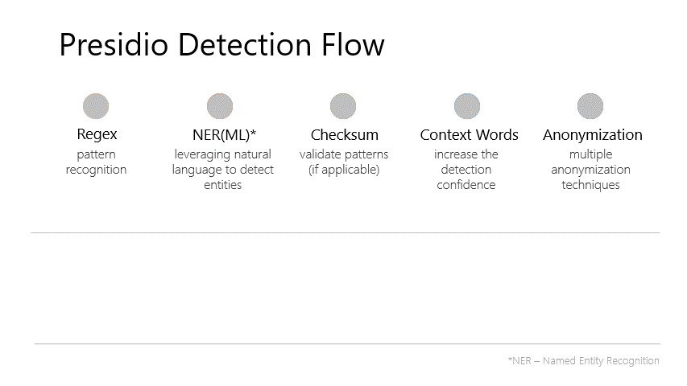

repository [philschmid/advanced-pii-huggingface-sagemaker](https://github.com/philschmid/advanced-pii-huggingface-sagemaker)

PII or Personally identifiable information (PII) is any data that could potentially identify a specific individual, e.g. to distinguish one person from another. Below are a few examples of PII:

- Name
- Address
- Date of birth
- Telephone number
- Credit Card number

Protecting PII is essential for personal privacy, data privacy, data protection, information privacy, and information security. With just a few bits of an individual's personal information, thieves can create false accounts in the person's name, incur debt, create a falsified passport or sell a person's identity to a criminal.

Transformer models are changing the world of machine learning, starting with natural language processing (NLP), and now, with audio and computer vision. Hugging Face’s mission is to democratize good machine learning and give anyone the opportunity to use these new state-of-the-art machine learning models.

Models Like BERT, RoBERTa, T5, and GPT-2 captured the NLP space and are achieving state-of-the-art results across almost any NLP tasks including, text-classification, question-answering, and token-classification. 

---

In this blog, you will learn how to use state-of-the-art Transformers models to recognize, detect and anonymize PII using Hugging Face Transformers, Presidio & Amazon SageMaker.

### What is Presidio?

_Presidio (Origin from Latin praesidium ‘protection, garrison’) helps to ensure sensitive data is properly managed and governed. It provides fast identification and anonymization modules for private entities in text and images such as credit card numbers, names, locations, social security numbers, bitcoin wallets, US phone numbers, financial data and more._ - [Documentation](https://microsoft.github.io/presidio/).


  
_- From Presidio [Documentation](https://microsoft.github.io/presidio/)_

By Default Presidio is using `Spacy` for PII identification and extraction. In this example are we going to replace `spacy` with a Hugging Face Transformer to perform PII detection and anonymization. 
Presidio supports already out of the box [24 PII entities including](https://microsoft.github.io/presidio/supported_entities/), CREDIT_CARD, IBAN_CODE, EMAIL_ADDRESS, US_BANK_NUMBER, US_ITIN... 
We are going to extend this available 24 entities with transformers to include LOCATION, PERSON & ORGANIZATION. But it is possible to use any "entity" extracted by the transformers model. 


You will learn how to: 

1. Setup Environment and Permissions
2. Create a new `transformers` based EntityRecognizer
3. Create a custom `inference.py` including the `EntityRecognizer`
4. Deploy the PII service to Amazon SageMaker
5. Request and customization of requests

Let's get started! 🚀

---

*If you are going to use Sagemaker in a local environment (not SageMaker Studio or Notebook Instances). You need access to an IAM Role with the required permissions for Sagemaker. You can find [here](https://docs.aws.amazon.com/sagemaker/latest/dg/sagemaker-roles.html) more about it.*

## 1. Setup Environment and Permissions

_*Note:* we only install the required libraries from Hugging Face and AWS. You also need PyTorch or Tensorflow, if you haven´t it installed_


```python
%pip install sagemaker --upgrade
import sagemaker

assert sagemaker.__version__ >= "2.75.0"
```

Install `git` and `git-lfs`


```python
# For notebook instances (Amazon Linux)
!sudo yum update -y 
!curl -s https://packagecloud.io/install/repositories/github/git-lfs/script.rpm.sh | sudo bash
!sudo yum install git-lfs git -y
# For other environments (Ubuntu)
!sudo apt-get update -y 
!curl -s https://packagecloud.io/install/repositories/github/git-lfs/script.deb.sh | sudo bash
!sudo apt-get install git-lfs git -y
```

### Permissions

_If you are going to use Sagemaker in a local environment (not SageMaker Studio or Notebook Instances). You need access to an IAM Role with the required permissions for Sagemaker. You can find [here](https://docs.aws.amazon.com/sagemaker/latest/dg/sagemaker-roles.html) more about it._


```python
import sagemaker
import boto3
sess = sagemaker.Session()
# sagemaker session bucket -> used for uploading data, models and logs
# sagemaker will automatically create this bucket if it not exists
sagemaker_session_bucket=None
if sagemaker_session_bucket is None and sess is not None:
    # set to default bucket if a bucket name is not given
    sagemaker_session_bucket = sess.default_bucket()

try:
    role = sagemaker.get_execution_role()
except ValueError:
    iam = boto3.client('iam')
    role = iam.get_role(RoleName='sagemaker_execution_role')['Role']['Arn']

sess = sagemaker.Session(default_bucket=sagemaker_session_bucket)

print(f"sagemaker role arn: {role}")
print(f"sagemaker bucket: {sess.default_bucket()}")
print(f"sagemaker session region: {sess.boto_region_name}")
```

## 2. Create a new `transformers` based EntityRecognizer

Presidio can be extended to support the detection of new types of PII entities and to support additional languages. These PII recognizers could be added **via code** or **ad-hoc as part of the request**.

- The `EntityRecognizer` is an abstract class for all recognizers.
- The `RemoteRecognizer` is an abstract class for calling external PII detectors. See more info [here](https://microsoft.github.io/presidio/analyzer/adding_recognizers/#creating-a-remote-recognizer).
- The abstract class `LocalRecognizer` is implemented by all recognizers running within the Presidio-analyzer process.
- The `PatternRecognizer` is a class for supporting regex and deny-list-based recognition logic, including validation (e.g., with checksum) and context support. See an example [here](https://microsoft.github.io/presidio/analyzer/adding_recognizers/#simple-example).

For simple recognizers based on regular expressions or deny-lists, we can leverage the provided `PatternRecognizer`:

```python
from presidio_analyzer import PatternRecognizer
titles_recognizer = PatternRecognizer(supported_entity="TITLE",
                                      deny_list=["Mr.","Mrs.","Miss"])
```

To create a Hugging Face Transformer recognizer you have to create a new class deriving the `EntityRecognizer` and implementing a `load` and `analyze` method. 

For this example the `__init__` method will be used to "load" and our model using the `transformers.pipeline` for `token-classification`. 
If you want to learn more how you can customize/create recognizer you can check out the [documentation](https://microsoft.github.io/presidio/analyzer/adding_recognizers/#extending-the-analyzer-for-additional-pii-entities).


```python
 class TransformersRecognizer(EntityRecognizer):    
    def __init__(self,model_id_or_path=None,aggregation_strategy="average",supported_language="en",ignore_labels=["O","MISC"]):
      # inits transformers pipeline for given mode or path
      self.pipeline = pipeline("token-classification",model=model_id_or_path,aggregation_strategy="average",ignore_labels=ignore_labels)
      # map labels to presidio labels
      self.label2presidio={
        "PER": "PERSON",
        "LOC": "LOCATION",
        "ORG": "ORGANIZATION",
      }

      # passes entities from model into parent class
      super().__init__(supported_entities=list(self.label2presidio.values()),supported_language=supported_language)

    def load(self) -> None:
        """No loading is required."""
        pass

    def analyze(
        self, text: str, entities: List[str]=None, nlp_artifacts: NlpArtifacts=None
    ) -> List[RecognizerResult]:
        """
        Extracts entities using Transformers pipeline
        """
        results = []
        
        # keep max sequence length in mind
        predicted_entities = self.pipeline(text)
        if len(predicted_entities) >0:
          for e in predicted_entities:
            converted_entity = self.label2presidio[e["entity_group"]]
            if converted_entity in entities or entities is None:
              results.append(
                  RecognizerResult(
                      entity_type=converted_entity,
                      start=e["start"],
                      end=e["end"],
                      score=e["score"]
                      )
                  )
        return results
```

## 3. Create a custom `inference.py` including the `EntityRecognizer`

To use the custom inference script, you need to create an `inference.py` script. In this example, we are going to overwrite the `model_fn` to load our `HFTransformersRecognizer` correctly and the `predict_fn` to run the PII analysis.

Additionally we need to provide a `requirements.txt` in the `code/` directory to install `presidio` and other required dependencies


```python
!mkdir code
```

create `inference.py`

```python
%%writefile code/inference.py

from presidio_anonymizer import AnonymizerEngine
from presidio_analyzer import AnalyzerEngine
from typing import List

from presidio_analyzer import AnalyzerEngine, EntityRecognizer, RecognizerResult
from presidio_analyzer.nlp_engine import NlpArtifacts
from transformers import pipeline

# load spacy model -> workaround
import os
os.system("spacy download en_core_web_lg")

# list of entities: https://microsoft.github.io/presidio/supported_entities/#list-of-supported-entities
DEFAULT_ANOYNM_ENTITIES = [
    "CREDIT_CARD",
    "CRYPTO",
    "DATE_TIME",
    "EMAIL_ADDRESS",
    "IBAN_CODE",
    "IP_ADDRESS",
    "NRP",
    "LOCATION",
    "PERSON",
    "PHONE_NUMBER",
    "MEDICAL_LICENSE",
    "URL",
    "ORGANIZATION"
]

# init anonymize engine
engine = AnonymizerEngine()

class HFTransformersRecognizer(EntityRecognizer):
    def __init__(
        self,
        model_id_or_path=None,
        aggregation_strategy="simple",
        supported_language="en",
        ignore_labels=["O", "MISC"],
    ):
        # inits transformers pipeline for given mode or path
        self.pipeline = pipeline(
            "token-classification", model=model_id_or_path, aggregation_strategy=aggregation_strategy, ignore_labels=ignore_labels
        )
        # map labels to presidio labels
        self.label2presidio = {
            "PER": "PERSON",
            "LOC": "LOCATION",
            "ORG": "ORGANIZATION",
        }

        # passes entities from model into parent class
        super().__init__(supported_entities=list(self.label2presidio.values()), supported_language=supported_language)

    def load(self) -> None:
        """No loading is required."""
        pass

    def analyze(
        self, text: str, entities: List[str] = None, nlp_artifacts: NlpArtifacts = None
    ) -> List[RecognizerResult]:
        """
        Extracts entities using Transformers pipeline
        """
        results = []

        # keep max sequence length in mind
        predicted_entities = self.pipeline(text)
        if len(predicted_entities) > 0:
            for e in predicted_entities:
                converted_entity = self.label2presidio[e["entity_group"]]
                if converted_entity in entities or entities is None:
                    results.append(
                        RecognizerResult(
                            entity_type=converted_entity, start=e["start"], end=e["end"], score=e["score"]
                        )
                    )
        return results


def model_fn(model_dir):
    transformers_recognizer = HFTransformersRecognizer(model_dir)
    # Set up the engine, loads the NLP module (spaCy model by default) and other PII recognizers
    analyzer = AnalyzerEngine()
    analyzer.registry.add_recognizer(transformers_recognizer)
    return analyzer


def predict_fn(data, analyzer):
    sentences = data.pop("inputs", data)
    if "parameters" in data:
        anonymization_entities = data["parameters"].get("entities", DEFAULT_ANOYNM_ENTITIES)
        anonymize_text = data["parameters"].get("anonymize", False)
    else:
        anonymization_entities = DEFAULT_ANOYNM_ENTITIES
        anonymize_text = False

    # identify entities
    results = analyzer.analyze(text=sentences, entities=anonymization_entities, language="en")
    # anonymize text
    if anonymize_text:
        result = engine.anonymize(text=sentences, analyzer_results=results)
        return {"anonymized": result.text}

    return {"found": [entity.to_dict() for entity in results]}
```

create `requirements.txt`

```python
%%writefile code/requirements.txt

presidio-analyzer
spacy
transformers
presidio-anonymizer
```

## 4. Deploy the PII service to Amazon SageMaker

Before you can deploy a t he PII service to Amazon SageMaker you need to create `model.tar.gz` with inference script and model.
You need to bundle the `inference.py` and all model-artifcats, e.g. `pytorch_model.bin` into a `model.tar.gz`. The `inference.py` script will be placed into a `code/` folder. We will use `git` and `git-lfs` to easily download our model from hf.co/models and upload it to Amazon S3 so we can use it when creating our SageMaker endpoint.

As the base model for the recognizer the example will use [Jean-Baptiste/roberta-large-ner-english](https://huggingface.co/Jean-Baptiste/roberta-large-ner-english)


```python
repository = "Jean-Baptiste/roberta-large-ner-english"
model_id=repository.split("/")[-1]
s3_location=f"s3://{sess.default_bucket()}/custom_inference/{model_id}/model.tar.gz"
```

1. Download the model from hf.co/models with `git clone`.


```python
!git lfs install
!git clone https://huggingface.co/$repository

```

2. copy `inference.py`  into the `code/` directory of the model directory.


```python
!cp -r code/ $model_id/code/
```

3. Create a `model.tar.gz` archive with all the model artifacts and the `inference.py` script.

```python
%cd $model_id
!tar zcvf model.tar.gz *
```

4. Upload the `model.tar.gz` to Amazon S3:

```python
!aws s3 cp model.tar.gz $s3_location
```

After you uploaded the `model.tar.gz` archive to Amazon S3. You can create a custom `HuggingfaceModel` class. This class will be used to create and deploy our SageMaker endpoint.

```python
from sagemaker.huggingface.model import HuggingFaceModel


# create Hugging Face Model Class
huggingface_model = HuggingFaceModel(
   model_data=s3_location,       # path to your model and script
   role=role,                    # iam role with permissions to create an Endpoint
   transformers_version="4.17",  # transformers version used
   pytorch_version="1.10",        # pytorch version used
   py_version='py38',            # python version used
)

# deploy the endpoint endpoint
predictor = huggingface_model.deploy(
    initial_instance_count=1,
    instance_type="ml.g4dn.xlarge"
    )
```

## 5. Request and customization of requests

The `.deploy()` returns an `HuggingFacePredictor` object which can be used to request inference.


```python
payload="""
Hello, my name is David Johnson and I live in Maine.
I work as a software engineer at Amazon. 
You can call me at (123) 456-7890.
My credit card number is 4095-2609-9393-4932 and my crypto wallet id is 16Yeky6GMjeNkAiNcBY7ZhrLoMSgg1BoyZ.

On September 18 I visited microsoft.com and sent an email to test@presidio.site, from the IP 192.168.0.1.
My passport: 191280342 and my phone number: (212) 555-1234.
This is a valid International Bank Account Number: IL150120690000003111111. Can you please check the status on bank account 954567876544?
Kate's social security number is 078-05-1126.  Her driver license? it is 1234567A.

"""
```

**Simple detection request**

```python
data = {
  "inputs": payload,
}

res = predictor.predict(data=data)
print(res)
# {'found': [{'entity_type': 'CREDIT_CARD', 'start': 120, 'end': 139, 'score': 1.0, 'analysis_explanation': None,....
```

**Detect only specific PII entities**

```python
data = {
  "inputs": payload,
  "parameters": {
    "entities":["PERSON","LOCATION","ORGANIZATION"]
  }
}

res = predictor.predict(data=data)
print(res)

```

**Anonzymizing PII entities**

```python
data = {
  "inputs": payload,
  "parameters": {
    "anonymize": True,
  }
}

res = predictor.predict(data=data)
print(res["anonymized"])

```

>Hello, my name is <PERSON> and I live in <LOCATION>.
>I work as a software engineer at <ORGANIZATION>. 
>You can call me at <PHONE_NUMBER>.
>My credit card number is <CREDIT_CARD> and my crypto wallet id is <CRYPTO>.
> 
>On <DATE_TIME> I visited <URL> and sent an email to <EMAIL_ADDRESS>, from the IP <IP_ADDRESS>.
>My passport: 191280342 and my phone number: <PHONE_NUMBER>.
>This is a valid International Bank Account Number: <IBAN_CODE>. Can you please check the status on bank account 954567876544?
><PERSON>'s social security number is <PHONE_NUMBER>.  Her driver license? it is 1234567A.

**Anonzymizing only specific PII entities**

```python
data = {
  "inputs": payload,
  "parameters": {
    "anonymize": True,
    "entities":["PERSON","LOCATION"]
  }
}

res = predictor.predict(data=data)
print(res["anonymized"])

```    

### Delete model and endpoint

To clean up, we can delete the model and endpoint.

```python
predictor.delete_model()
predictor.delete_endpoint()
```

## 6. Conclusion

We successfully create our Transformers-based PII detection and anonymization with Hugging Face Transformers and Amazon SageMaker. 

The service can either detect or directly anonymize the payload we send to the endpoint. The service is built on top of open-source libraries including `transformers` and `presidio` to keep full control of how detections and anonymization are done. 
This is a huge benefit compared to services like Amazon Comprehend, which are non-customizable intransparent black-box solutions. 

This solution can easily be extended and improved by improving the transformers model used, e.g. to identify job titles like “software engineer” or add a new pattern recognizer, e.g. german personal number. 

The code can be found in this repository [philschmid/advanced-pii-huggingface-sagemaker](https://github.com/philschmid/advanced-pii-huggingface-sagemaker)

---

Thanks for reading! If you have any questions, feel free to contact me, through [Github](https://github.com/huggingface/transformers), or on the [forum](https://discuss.huggingface.co/c/sagemaker/17). You can also connect with me on [Twitter](https://twitter.com/_philschmid) or [LinkedIn](https://www.linkedin.com/in/philipp-schmid-a6a2bb196/).