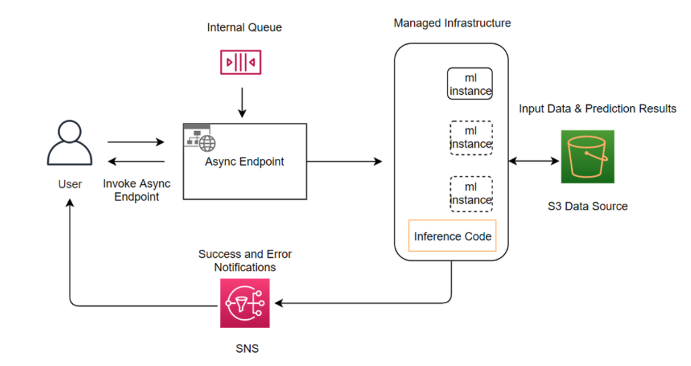
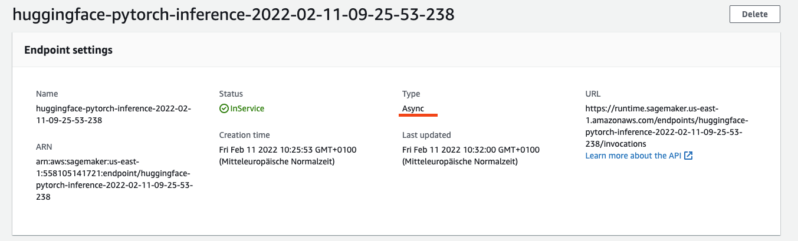
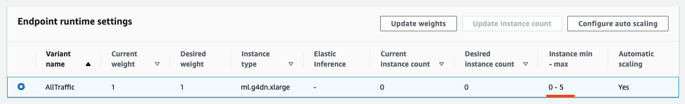
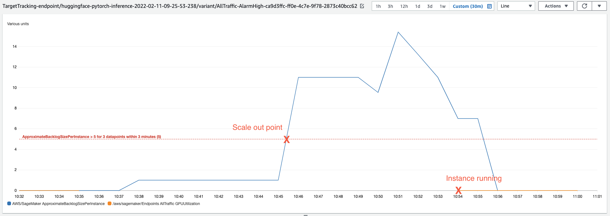

Welcome to this getting started guide. We will use the Hugging Face Inference DLCs and Amazon SageMaker Python SDK to run an [Asynchronous Inference](https://docs.aws.amazon.com/sagemaker/latest/dg/async-inference.html) job.
Amazon SageMaker Asynchronous Inference is a new capability in SageMaker that queues incoming requests and processes them asynchronously. Compared to [Batch Transform](https://docs.aws.amazon.com/sagemaker/latest/dg/batch-transform.html) [Asynchronous Inference](https://docs.aws.amazon.com/sagemaker/latest/dg/async-inference.html) provides immediate access to the results of the inference job rather than waiting for the job to complete.


## How it works 

Asynchronous inference endpoints have many similarities (and some key differences) compared to real-time endpoints. The process to create asynchronous endpoints is similar to real-time endpoints. You need to create: a model, an endpoint configuration, and an endpoint. However, there are specific configuration parameters specific to asynchronous inference endpoints, which we will explore below.

The Invocation of asynchronous endpoints differs from real-time endpoints. Rather than pass the request payload in line with the request, you upload the payload to Amazon S3 and pass an Amazon S3 URI as a part of the request. Upon receiving the request, SageMaker provides you with a token with the output location where the result will be placed once processed. Internally, SageMaker maintains a queue with these requests and processes them. During endpoint creation, you can optionally specify an Amazon SNS topic to receive success or error notifications. Once you receive the notification that your inference request has been successfully processed, you can access the result in the output Amazon S3 location.




Link to Notebook: [sagemaker/16_async_inference_hf_hub](https://github.com/huggingface/notebooks/blob/master/sagemaker/16_async_inference_hf_hub/sagemaker-notebook.ipynb)

_NOTE: You can run this demo in Sagemaker Studio, your local machine, or Sagemaker Notebook Instances_


## Development Environment and Permissions

### Installation 


```python
%pip install sagemaker --upgrade
```


```python
import sagemaker

assert sagemaker.__version__ >= "2.75.0"
```

### Permissions

_If you are going to use Sagemaker in a local environment (not SageMaker Studio or Notebook Instances). You need access to an IAM Role with the required permissions for Sagemaker. You can find [here](https://docs.aws.amazon.com/sagemaker/latest/dg/sagemaker-roles.html) more about it._


```python
import sagemaker
import boto3
sess = sagemaker.Session()
# sagemaker session bucket -> used for uploading data, models and logs
# sagemaker will automatically create this bucket if it not exists
sagemaker_session_bucket=None
if sagemaker_session_bucket is None and sess is not None:
    # set to default bucket if a bucket name is not given
    sagemaker_session_bucket = sess.default_bucket()

try:
    role = sagemaker.get_execution_role()
except ValueError:
    iam = boto3.client('iam')
    role = iam.get_role(RoleName='sagemaker_execution_role')['Role']['Arn']

sess = sagemaker.Session(default_bucket=sagemaker_session_bucket)

print(f"sagemaker role arn: {role}")
print(f"sagemaker bucket: {sess.default_bucket()}")
print(f"sagemaker session region: {sess.boto_region_name}")
```

## Create Inference `HuggingFaceModel` for the Asynchronous Inference Endpoint

We use the [twitter-roberta-base-sentiment](https://huggingface.co/cardiffnlp/twitter-roberta-base-sentiment) model running our async inference job. This is a RoBERTa-base model trained on ~58M tweets and finetuned for sentiment analysis with the TweetEval benchmark.


```python
from sagemaker.huggingface.model import HuggingFaceModel
from sagemaker.async_inference.async_inference_config import AsyncInferenceConfig
from sagemaker.s3 import s3_path_join

# Hub Model configuration. <https://huggingface.co/models>
hub = {
    'HF_MODEL_ID':'cardiffnlp/twitter-roberta-base-sentiment',
    'HF_TASK':'text-classification'
}

# create Hugging Face Model Class
huggingface_model = HuggingFaceModel(
   env=hub,                      # configuration for loading model from Hub
   role=role,                    # iam role with permissions to create an Endpoint
   transformers_version="4.12",  # transformers version used
   pytorch_version="1.9",        # pytorch version used
   py_version='py38',            # python version used
)

# create async endpoint configuration
async_config = AsyncInferenceConfig(
    output_path=s3_path_join("s3://",sagemaker_session_bucket,"async_inference/output") , # Where our results will be stored
    # notification_config={
            #   "SuccessTopic": "arn:aws:sns:us-east-2:123456789012:MyTopic",
            #   "ErrorTopic": "arn:aws:sns:us-east-2:123456789012:MyTopic",
    # }, #  Notification configuration
)

# deploy the endpoint endpoint
async_predictor = huggingface_model.deploy(
    initial_instance_count=1,
    instance_type="ml.g4dn.xlarge",
    async_inference_config=async_config
)
```

We can find our Asynchronous Inference endpoint configuration in the Amazon SageMaker Console. Our endpoint now has type `async` compared to a' real-time' endpoint.



## Request Asynchronous Inference Endpoint using the `AsyncPredictor`

The `.deploy()` returns an `AsyncPredictor` object which can be used to request inference. This `AsyncPredictor` makes it easy to send asynchronous requests to your endpoint and get the results back. It has two methods: `predict()` and `predict_async()`. The `predict()` method is synchronous and will block until the inference is complete. The `predict_async()` method is asynchronous and will return immediately with the a `AsyncInferenceResponse`, which can be used to check for the result with polling. If the result object exists in that path, get and return the result.

### `predict()` request example

The `predict()` will upload our `data` to Amazon S3 and run inference against it. Since we are using `predict` it will block until the inference is complete.


```python
data = {
  "inputs": [
    "it 's a charming and often affecting journey .",
    "it 's slow -- very , very slow",
    "the mesmerizing performances of the leads keep the film grounded and keep the audience riveted .",
    "the emotions are raw and will strike a nerve with anyone who 's ever had family trauma ."
  ]
}

res = async_predictor.predict(data=data)
print(res)
# [{'label': 'LABEL_2', 'score': 0.8808117508888245}, {'label': 'LABEL_0', 'score': 0.6126593947410583}, {'label': 'LABEL_2', 'score': 0.9425230622291565}, {'label': 'LABEL_0', 'score': 0.5511414408683777}]

```


### `predict_async()` request example

The `predict_async()` will upload our `data` to Amazon S3 and run inference against it. Since we are using `predict_async` it will return immediately with an `AsyncInferenceResponse` object. 
In this example, we will loop over a `csv` file and send each line to the endpoint. After that we are going to poll the endpoint until the inference is complete.
The provided `tweet_data.csv` contains ~1800 tweets about different airlines.

But first, let's do a quick test to see if we can get a result from the endpoint using `predict_async`

#### Single `predict_async()` request example


```python
from sagemaker.async_inference.waiter_config import WaiterConfig

resp = async_predictor.predict_async(data={"inputs": "i like you. I love you"})

print(f"Response object: {resp}")
print(f"Response output path: {resp.output_path}")
print("Start Polling to get response:")

config = WaiterConfig(
  max_attempts=5, #  number of attempts
  delay=10 #  time in seconds to wait between attempts
  )

resp.get_result(config)
```

#### High load `predict_async()` request example using a `csv` file


```python
from csv import reader

data_file="tweet_data.csv"

output_list = []

# open file in read mode
with open(data_file, 'r') as csv_reader:
    for row in reader(csv_reader):
        # send each row as async reuqest request
        resp = async_predictor.predict_async(data={"inputs": row[0]})
        output_list.append(resp)

print("All requests sent")    
print(f"Output path list length: {len(output_list)}")
print(f"Output path list sample: {output_list[26].output_path}")

# iterate over list of output paths and get results
results = []
for async_response in output_list:
    response = async_response.get_result(WaiterConfig())
    results.append(response)

print(f"Results length: {len(results)}")
print(f"Results sample: {results[26]}")
```

## Autoscale (to Zero) the Asynchronous Inference Endpoint

Amazon SageMaker supports automatic scaling (autoscaling) your asynchronous endpoint. Autoscaling dynamically adjusts the number of instances provisioned for a model in response to changes in your workload. Unlike other hosted models Amazon SageMaker supports, with Asynchronous Inference, you can also scale down your asynchronous endpoints instances to zero.

**Prequistion**: You need to have an running Asynchronous Inference Endpoint up and running. You can check [Create Inference `HuggingFaceModel` for the Asynchronous Inference Endpoint](#create-inference-huggingfacemodel-for-the-asynchronous-inference-endpoint) to see how to create one.

If you want to learn more check-out [Autoscale an asynchronous endpoint](https://docs.aws.amazon.com/sagemaker/latest/dg/async-inference-autoscale.html) in the SageMaker documentation.


We are going to scale our asynchronous endpoint to 0-5 instances, which means that Amazon SageMaker will scale the endpoint to 0 instances after `600` seconds or 10 minutes to save you cost and scale up to 5 instances in `300` seconds steps getting more than `5.0` invocations.  


```python
# application-autoscaling client
asg_client = boto3.client("application-autoscaling")

# This is the format in which application autoscaling references the endpoint
resource_id = f"endpoint/{async_predictor.endpoint_name}/variant/AllTraffic"

# Configure Autoscaling on asynchronous endpoint down to zero instances
response = asg_client.register_scalable_target(
    ServiceNamespace="sagemaker",
    ResourceId=resource_id,
    ScalableDimension="sagemaker:variant:DesiredInstanceCount",
    MinCapacity=0,
    MaxCapacity=5,
)

response = asg_client.put_scaling_policy(
    PolicyName=f'Request-ScalingPolicy-{async_predictor.endpoint_name}',
    ServiceNamespace="sagemaker",  
    ResourceId=resource_id, 
    ScalableDimension="sagemaker:variant:DesiredInstanceCount",
    PolicyType="TargetTrackingScaling",
    TargetTrackingScalingPolicyConfiguration={
        "TargetValue": 5.0, 
        "CustomizedMetricSpecification": {
            "MetricName": "ApproximateBacklogSizePerInstance",
            "Namespace": "AWS/SageMaker",
            "Dimensions": [{"Name": "EndpointName", "Value": async_predictor.endpoint_name}],
            "Statistic": "Average",
        },
        "ScaleInCooldown": 600, # duration until scale in begins (down to zero)
        "ScaleOutCooldown": 300 # duration between scale out attempts
    },
)
```



The Endpoint will now scale to zero after 600s. Let's wait until the endpoint is scaled to zero and then test sending requests and measure how long it takes to start an instance to process the requests. We are using the `predict_async()` method to send the request.

_**IMPORTANT: Since we defined the `TargetValue` to `5.0` the Async Endpoint will only start to scale out from 0 to 1 if you are sending more than 5 requests within 300 seconds.**_


```python
import time

start = time.time()

output_list=[]

# send 10 requests
for i in range(10):
  resp = async_predictor.predict_async(data={"inputs": "it 's a charming and often affecting journey ."})
  output_list.append(resp)

# iterate over list of output paths and get results
results = []
for async_response in output_list:
    response = async_response.get_result(WaiterConfig(max_attempts=600))
    results.append(response)

print(f"Time taken: {time.time() - start}s")
```

It took about 7-9 minutes to start an instance and to process the requests. This is perfect when you have non real-time critical applications, but want to save money. 



### Delete the async inference endpoint & Autoscaling policy


```python
response = asg_client.deregister_scalable_target(
    ServiceNamespace='sagemaker',
    ResourceId=resource_id,
    ScalableDimension='sagemaker:variant:DesiredInstanceCount'
)
async_predictor.delete_endpoint()
```

## Conclusion  

We successfully deploy an Asynchronous Inference Endpoint to Amazon SageMaker using the SageMaker-Python SDK. The SageMaker SDK provides creating tooling for deploying and especially for running inference for the Asynchronous Inference Endpoint. It creates a nice `AsnycPredictor` object which can be used to send requests to the endpoint, which handles all of the boilperplate behind the scenes for asynchronous inference and gives us simple APIs. 

In addition to this we were able to add autosclaing to the Asynchronous Inference Endpoint with `boto3` for scaling our endpoint in and out. Asynchronous Inference Endpoints can even scale down to zero, which is a great feature for non-real-time critical applications to save cost. 

You should definitely try out Asynchronous Inference Endpoints for your own applications if neither `batch transform` nor `real-time` were the right option for you.

---

You can find the code [here](https://github.com/huggingface/notebooks/blob/master/sagemaker/16_async_inference_hf_hub/sagemaker-notebook.ipynb).  

Thanks for reading! If you have any questions, feel free to contact me, through [Github](https://github.com/huggingface/transformers), or on the [forum](https://discuss.huggingface.co/c/sagemaker/17). You can also connect with me on [Twitter](https://twitter.com/_philschmid) or [LinkedIn](https://www.linkedin.com/in/philipp-schmid-a6a2bb196/).
