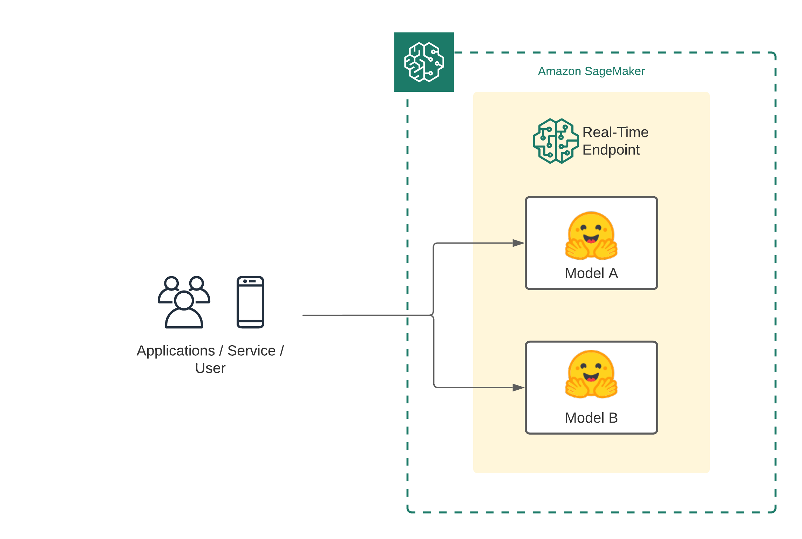
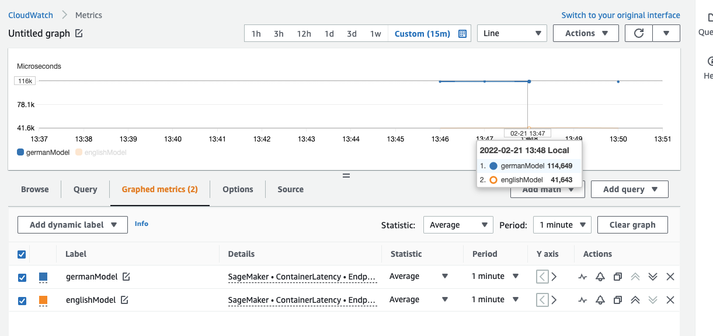
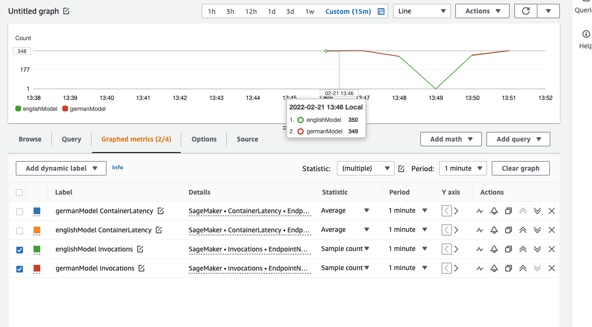

Welcome to this getting started guide. We will use the Hugging Face Inference DLCs and Amazon SageMaker to deploy multiple transformer models as [Multi-Container Endpoint](https://docs.aws.amazon.com/sagemaker/latest/dg/multi-container-endpoints.html). 
Amazon SageMaker Multi-Container Endpoint is an inference option to deploy multiple containers (multiple models) to the same SageMaker real-time endpoint. These models/containers can be accessed individually or in a pipeline. Amazon SageMaker [Multi-Container Endpoint](https://docs.aws.amazon.com/sagemaker/latest/dg/multi-container-endpoints.html) can be used to improve endpoint utilization and optimize costs. An example for this is **time zone differences**, the workload for model A (U.S) is mostly at during the day and the workload for model B (Germany) is mostly during the night, you can deploy model A and model B to the same SageMaker endpoint and optimize your costs. 

_**NOTE:** At the time of writing this, only `CPU` Instances are supported for Multi-Container Endpoint._

[notebook](https://github.com/philschmid/huggingface-sagemaker-multi-container-endpoint/blob/master/sagemaker-notebook.ipynb)  




## Development Environment and Permissions

_NOTE: You can run this demo in Sagemaker Studio, your local machine, or Sagemaker Notebook Instances_


```python
%pip install sagemaker --upgrade
import sagemaker

assert sagemaker.__version__ >= "2.75.0"
```

### Permissions

_If you are going to use Sagemaker in a local environment (not SageMaker Studio or Notebook Instances). You need access to an IAM Role with the required permissions for Sagemaker. You can find [here](https://docs.aws.amazon.com/sagemaker/latest/dg/sagemaker-roles.html) more about it._


```python
import sagemaker
import boto3
sess = sagemaker.Session()
# sagemaker session bucket -> used for uploading data, models and logs
# sagemaker will automatically create this bucket if it not exists
sagemaker_session_bucket=None
if sagemaker_session_bucket is None and sess is not None:
    # set to default bucket if a bucket name is not given
    sagemaker_session_bucket = sess.default_bucket()

try:
    role = sagemaker.get_execution_role()
except ValueError:
    iam = boto3.client('iam')
    role = iam.get_role(RoleName='sagemaker_execution_role')['Role']['Arn']

sess = sagemaker.Session(default_bucket=sagemaker_session_bucket)
region = sess.boto_region_name
sm_client = boto3.client('sagemaker')

print(f"sagemaker role arn: {role}")
print(f"sagemaker bucket: {sess.default_bucket()}")
print(f"sagemaker session region: {region}")
```

## Multi-Container Endpoint creation

When writing this does the [Amazon SageMaker Python SDK](https://sagemaker.readthedocs.io/en/stable/) not support Multi-Container Endpoint deployments. That's why we are going to use `boto3` to create the endpoint.

The first step though is to use the SDK to get our container uris for the Hugging Face Inference DLCs.


```python
from sagemaker import image_uris

hf_inference_dlc = image_uris.retrieve(framework='huggingface', 
                                region=region, 
                                version='4.12.3', 
                                image_scope='inference', 
                                base_framework_version='pytorch1.9.1', 
                                py_version='py38', 
                                container_version='ubuntu20.04', 
                                instance_type='ml.c5.xlarge')
# '763104351884.dkr.ecr.us-east-1.amazonaws.com/huggingface-pytorch-inference:1.9.1-transformers4.12.3-gpu-py38-cu111-ubuntu20.04'
```


### Define Hugging Face models

Next, we need to define the models we want to deploy to our multi-container endpoint. To stick with our example from the introduction, we will deploy an English sentiment-classification model and a german sentiment-classification model. For the English model, we will use [distilbert-base-uncased-finetuned-sst-2-english](https://huggingface.co/distilbert-base-uncased-finetuned-sst-2-english) and for the German model, we will use [oliverguhr/german-sentiment-bert](https://huggingface.co/oliverguhr/german-sentiment-bert). 
Similar to the endpoint creation with the SageMaker SDK do we need to provide the "Hub" configurations for the models as `HF_MODEL_ID` and `HF_TASK`. 


```python
# english model
englishModel = {
    'Image': hf_inference_dlc,
    'ContainerHostname': 'englishModel',
    'Environment': {
	    'HF_MODEL_ID':'distilbert-base-uncased-finetuned-sst-2-english',
	    'HF_TASK':'text-classification'
    }
}

# german model
germanModel = {
    'Image': hf_inference_dlc,
    'ContainerHostname': 'germanModel',
    'Environment': {
	    'HF_MODEL_ID':'oliverguhr/german-sentiment-bert',
	    'HF_TASK':'text-classification'
    }
}

# Set the Mode parameter of the InferenceExecutionConfig field to Direct for direct invocation of each container,
# or Serial to use containers as an inference pipeline. The default mode is Serial.
inferenceExecutionConfig = {"Mode": "Direct"}
```

## Create Multi-Container Endpoint

After we define our model configuration, we can deploy our endpoint. To create/deploy a real-time endpoint with `boto3` you need to create a "SageMaker Model", a "SageMaker Endpoint Configuration" and a "SageMaker Endpoint". The "SageMaker Model" contains our multi-container configuration including our two models. The "SageMaker Endpoint Configuration" contains the configuration for the endpoint. The "SageMaker Endpoint" is the actual endpoint.


```python
deployment_name = "multi-container-sentiment"
instance_type =  "ml.c5.4xlarge"


# create SageMaker Model
sm_client.create_model(
    ModelName        = f"{deployment_name}-model",
    InferenceExecutionConfig = inferenceExecutionConfig,
    ExecutionRoleArn = role,
    Containers       = [englishModel, germanModel]
    )

# create SageMaker Endpoint configuration
sm_client.create_endpoint_config(
    EndpointConfigName= f"{deployment_name}-config",
    ProductionVariants=[
        {
            "VariantName": "AllTraffic",
            "ModelName":  f"{deployment_name}-model",
            "InitialInstanceCount": 1,
            "InstanceType": instance_type,
        },
    ],
)

# create SageMaker Endpoint configuration
endpoint = sm_client.create_endpoint(
    EndpointName= f"{deployment_name}-ep", EndpointConfigName=f"{deployment_name}-config"
)
```

this will take a few minutes to deploy. You can check the console to see if the endpoint is in service

## Invoke Multi-Container Endpoint

To invoke our multi-container endpoint we can either use `boto3` or any other AWS SDK or the Amazon SageMaker SDK. We will test both ways and do some light load testing to take a look at the performance of our endpoint in cloudwatch.

```python
english_payload={"inputs":"This is a great way for saving money and optimizing my resources."}

german_payload={"inputs":"Das wird uns sehr helfen unsere Ressourcen effizient zu nutzen."}

```

### Sending requests with `boto3`

To send requests to our models we will use the `sagemaker-runtime` with the `invoke_endpoint` method. Compared to sending regular requests to a single-container endpoint we are passing `TargetContainerHostname` as additional information to point to the container, which should receive the request. In our case this is either `englishModel` or `germanModel`. 

#### `englishModel`


```python
import json
import boto3

# create client
invoke_client = boto3.client('sagemaker-runtime')

# send request to first container (bi-encoder)
response = invoke_client.invoke_endpoint(
    EndpointName=f"{deployment_name}-ep",
    ContentType="application/json",
    Accept="application/json",
    TargetContainerHostname="englishModel",
    Body=json.dumps(english_payload),
)
result = json.loads(response['Body'].read().decode())

```

#### `germanModel`


```python
import json
import boto3

# create client
invoke_client = boto3.client('sagemaker-runtime')

# send request to first container (bi-encoder)
response = invoke_client.invoke_endpoint(
    EndpointName=f"{deployment_name}-ep",
    ContentType="application/json",
    Accept="application/json",
    TargetContainerHostname="germanModel",
    Body=json.dumps(german_payload),
)
result = json.loads(response['Body'].read().decode())

```

### Sending requests with `HuggingFacePredictor`

The Python SageMaker SDK can not be used for deploying Multi-Container Endpoints but can be used to invoke/send requests to those. We will use the `HuggingFacePredictor` to send requests to the endpoint, where we also pass the `TargetContainerHostname` as additional information to point to the container, which should receive the request. In our case this is either `englishModel` or `germanModel`.


```python
from sagemaker.huggingface import HuggingFacePredictor

# predictor
predictor = HuggingFacePredictor(f"{deployment_name}-ep")

# english request
en_res = predictor.predict(english_payload, initial_args={"TargetContainerHostname":"englishModel"})
print(en_res)

# german request
de_res = predictor.predict(german_payload, initial_args={"TargetContainerHostname":"germanModel"})
print(de_res)
```

### Load testing the multi-container endpoint

As mentioned, we are doing some light load-testing, meaning sending a few alternating requests to the containers and looking at the latency in cloudwatch. 


```python
for i in range(1000):
    predictor.predict(english_payload, initial_args={"TargetContainerHostname":"englishModel"})
    predictor.predict(german_payload, initial_args={"TargetContainerHostname":"germanModel"})

# link to cloudwatch metrics dashboard
print("https://console.aws.amazon.com/cloudwatch/home?region=us-east-1#metricsV2:graph=~(metrics~(~(~'AWS*2fSageMaker~'ContainerLatency~'EndpointName~'multi-container-sentiment-ep~'ContainerName~'germanModel~'VariantName~'AllTraffic~(visible~false))~(~'...~'englishModel~'.~'.~(visible~false))~(~'.~'Invocations~'.~'.~'.~'.~'.~'.~(stat~'SampleCount))~(~'...~'germanModel~'.~'.~(stat~'SampleCount)))~view~'timeSeries~stacked~false~region~'us-east-1~stat~'Average~period~60~start~'-PT15M~end~'P0D);query=~'*7bAWS*2fSageMaker*2cContainerName*2cEndpointName*2cVariantName*7d")
```

We can see that the latency for the `englishModel` is around 2x faster than the for the `germanModel`, which makes sense since the `englishModel` is a DistilBERT model and the german one is a `BERT-base` model. 



In terms of invocations we can see both enpdoints are invocated the same amount, which makes sense since our test invoked both endpoints alternately. 



### Delete the Multi-Container Endpoint


```python
predictor.delete_model()
predictor.delete_endpoint()
```

## Conclusion  

We successfully deployed two Hugging Face Transformers to Amazon SageMaer for inference using the Multi-Container Endpoint, which allowed using the same instance two host multiple models as a container for inference. 
Multi-Container Endpoints are a great option to optimize compute utilization and costs for your models. Especially when you have independent inference workloads due to time differences or use-case differences.

You should try Multi-Container Endpoints for your models when you have workloads that are not correlated.

---

You can find the code [here](https://github.com/philschmid/huggingface-sagemaker-multi-container-endpoint/blob/master/sagemaker-notebook.ipynb).  

Thanks for reading! If you have any questions, feel free to contact me, through [Github](https://github.com/huggingface/transformers), or on the [forum](https://discuss.huggingface.co/c/sagemaker/17). You can also connect with me on [Twitter](https://twitter.com/_philschmid) or [LinkedIn](https://www.linkedin.com/in/philipp-schmid-a6a2bb196/).
