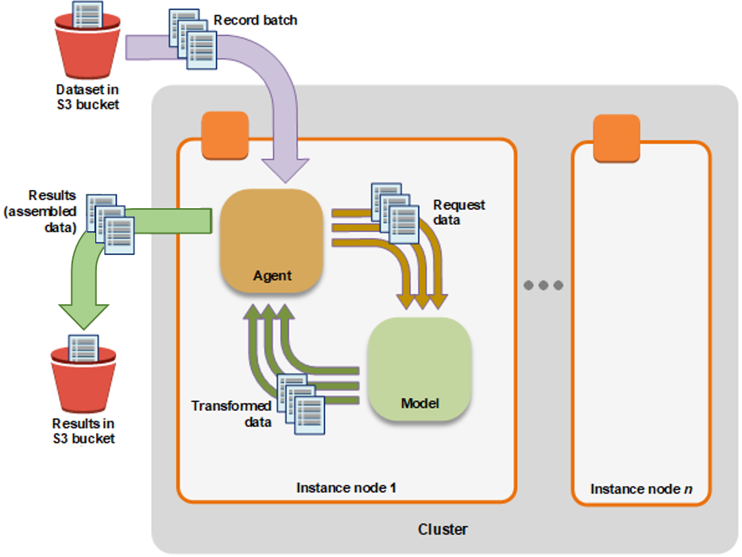
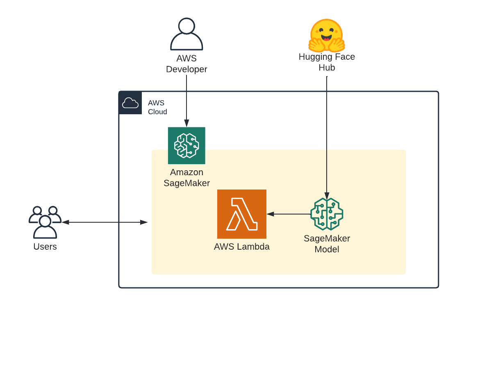

_"Amazon SageMaker is a fully managed machine learning service. With SageMaker, data scientists and developers can quickly and easily build and train machine learning models, and then directly deploy them into a production-ready hosted environment."_ - [AWS Documentation](https://docs.aws.amazon.com/sagemaker/latest/dg/whatis.html)

As of today Amazon SageMaker offers 4 different inference options with: 

* [Real-Time inference](https://docs.aws.amazon.com/sagemaker/latest/dg/realtime-endpoints.html)
* [Batch Transform](https://docs.aws.amazon.com/sagemaker/latest/dg/batch-transform.html)
* [Asynchronous Inference](https://docs.aws.amazon.com/sagemaker/latest/dg/async-inference.html)
* [Serverless Inference](https://docs.aws.amazon.com/sagemaker/latest/dg/serverless-endpoints.html)

Each of these inference options has different characteristics and use cases. Therefore we have created a table to compare the current existing SageMaker inference in latency, execution periode, payload, size and pricing and getting-started examples on how to use each of the inference options.

**Comparison table**

| Option          | latency budget | execution period        | max payload size | real-world example      | accelerators (GPU) | pricing                                                       |
|-----------------|----------------|-------------------------|------------------|-------------------------|--------------------|---------------------------------------------------------------|
| real-time       | milliseconds   | constantly              | 6MB              | route estimation        | Yes                | up time of the endpoint                                       |
| batch transform | hours          | ones a day/week         | Unlimited        | nightly embedding jobs  | Yes                | prediction (transform) time                                   |
| async inference | minutes        | every few minutes/hours | 1GB              | post-call transcription | Yes                | up time of the endpoint, can sacle to 0 when there is no load |
| serverless      | seconds        | every few minutes       | 6MB              | PoC for classification  | No                 | compute time (serverless)                                     |                                 |


**Examples**

You will learn how to: 

1. Deploy a Hugging Face Transformers For Real-Time inference.
2. Deploy a Hugging Face Transformers for Batch Transform Inference.
3. Deploy a Hugging Face Transformers for Asynchronous Inference.
4. Deploy a Hugging Face Transformers for Serverless Inference.

---

*If you are going to use Sagemaker in a local environment (not SageMaker Studio or Notebook Instances). You need access to an IAM Role with the required permissions for Sagemaker. You can find [here](https://docs.aws.amazon.com/sagemaker/latest/dg/sagemaker-roles.html) more about it.*


## Permissions
_If you are going to use Sagemaker in a local environment. You need access to an IAM Role with the required permissions for Sagemaker. You can find [here](https://docs.aws.amazon.com/sagemaker/latest/dg/sagemaker-roles.html) more about it._


```python
!pip install "sagemaker>=2.48.0" --upgrade
import sagemaker
import boto3
sess = sagemaker.Session()
# sagemaker session bucket -> used for uploading data, models and logs
# sagemaker will automatically create this bucket if it not exists
sagemaker_session_bucket=None
if sagemaker_session_bucket is None and sess is not None:
    # set to default bucket if a bucket name is not given
    sagemaker_session_bucket = sess.default_bucket()

try:
    role = sagemaker.get_execution_role()
except ValueError:
    iam = boto3.client('iam')
    role = iam.get_role(RoleName='sagemaker_execution_role')['Role']['Arn']

sess = sagemaker.Session(default_bucket=sagemaker_session_bucket)

print(f"sagemaker role arn: {role}")
print(f"sagemaker bucket: {sess.default_bucket()}")
print(f"sagemaker session region: {sess.boto_region_name}")
```

## [SageMaker Hugging Face Inference Toolkit](https://github.com/aws/sagemaker-huggingface-inference-toolkit)

The SageMaker Hugging Face Inference Toolkit is an open-source library for serving 🤗 Transformers models on Amazon SageMaker. This library provides default pre-processing, predict and postprocessing for certain 🤗 Transformers models and tasks using the `transformers pipelines`.
The Inference Toolkit accepts inputs in the `inputs` key, and supports additional pipelines `parameters` in the parameters key. You can provide any of the supported kwargs from `pipelines` as `parameters`.

Tasks supported by the Inference Toolkit API include:

- **`text-classification`**
- **`sentiment-analysis`**
- **`token-classification`**
- **`feature-extraction`**
- **`fill-mask`**
- **`summarization`**
- **`translation_xx_to_yy`**
- **`text2text-generation`**
- **`text-generation`**
- **`audio-classificatin`**
- **`automatic-speech-recognition`**
- **`conversational`**
- **`image-classification`**
- **`image-segmentation`**
- **`object-detection`**
- **`table-question-answering`**
- **`zero-shot-classification`**
- **`zero-shot-image-classification`**

See the following request examples for some of the tasks:

**text-classification**
```python
{
	"inputs": "Camera - You are awarded a SiPix Digital Camera! call 09061221066 fromm landline. Delivery within 28 days."
}
```

**text-generation parameterized**

```python
{
  "inputs": "Hugging Face, the winner of VentureBeat’s Innovation in Natural Language Process/Understanding Award for 2021, is looking to level the playing field. The team, launched by Clément Delangue and Julien Chaumond in 2016, was recognized for its work in democratizing NLP, the global market value for which is expected to hit $35.1 billion by 2026. This week, Google’s former head of Ethical AI Margaret Mitchell joined the team.",
  "parameters": {
    "repetition_penalty": 4.0,
    "length_penalty": 1.5
  }
}
```
More documentation and a list of supported tasks can be found in the [documentation](https://huggingface.co/docs/sagemaker/reference#inference-toolkit-api).

## 1. Deploy a Hugging Face Transformers For Real-Time inference.

### What are Amazon SageMaker Real-Time Endpoints? 

Real-time inference is ideal for inference workloads where you have real-time, interactive, low latency requirements. You can deploy your model to SageMaker hosting services and get an endpoint that can be used for inference. These endpoints are fully managed and support autoscaling.

**Deploying a model using SageMaker hosting services is a three-step process:**

1. **Create a model in SageMaker** —By creating a model, you tell SageMaker where it can find the model components. 
2. **Create an endpoint configuration for an HTTPS endpoint** —You specify the name of one or more models in production variants and the ML compute instances that you want SageMaker to launch to host each production variant.
3. **Create an HTTPS endpoint** —Provide the endpoint configuration to SageMaker. The service launches the ML compute instances and deploys the model or models as specified in the configuration


### Deploy a Hugging Face Transformer from the [Hub](hf.co/models)

Detailed Notebook: [deploy_model_from_hf_hub](https://github.com/huggingface/notebooks/blob/main/sagemaker/11_deploy_model_from_hf_hub/deploy_transformer_model_from_hf_hub.ipynb)

To deploy a model directly from the Hub to SageMaker we need to define 2 environment variables when creating the `HuggingFaceModel` . We need to define:

- `HF_MODEL_ID`: defines the model id, which will be automatically loaded from [huggingface.co/models](http://huggingface.co/models) when creating or SageMaker Endpoint. The 🤗 Hub provides +14 000 models all available through this environment variable.
- `HF_TASK`: defines the task for the used 🤗 Transformers pipeline. A full list of tasks can be find [here](https://huggingface.co/docs/sagemaker/reference#inference-toolkit-api).


```python
from sagemaker.huggingface import HuggingFaceModel

# Hub Model configuration. https://huggingface.co/models
hub = {
  'HF_MODEL_ID':'distilbert-base-uncased-distilled-squad', # model_id from hf.co/models
  'HF_TASK':'question-answering' # NLP task you want to use for predictions
}

# create Hugging Face Model Class
huggingface_model_rth = HuggingFaceModel(
   env=hub, # hugging face hub configuration
   role=role, # iam role with permissions to create an Endpoint
   transformers_version="4.17", # transformers version used
   pytorch_version="1.10", # pytorch version used
   py_version="py38", # python version of the DLC
)

# deploy model to SageMaker Inference
predictor_rth = huggingface_model_rth.deploy(
   initial_instance_count=1,
   instance_type="ml.g4dn.xlarge"
)
```

After model is deployed we can use the `predictor` to send requests.


```python
# example request, you always need to define "inputs"
data = {
"inputs": {
    "question": "What is used for inference?",
    "context": "My Name is Philipp and I live in Nuremberg. This model is used with sagemaker for inference."
    }
}

# request
predictor_rth.predict(data)
```

We can easily delete the endpoint again with the following command:


```python
# delete endpoint
predictor_rth.delete_model()
predictor_rth.delete_endpoint()
```

### Deploy a Hugging Face Transformer from the [Hub](hf.co/models)

Detailed Notebook: [deploy_model_from_s3](https://github.com/huggingface/notebooks/blob/main/sagemaker/10_deploy_model_from_s3/deploy_transformer_model_from_s3.ipynb)

To deploy a model directly from the Hub to SageMaker we need to define 2 environment variables when creating the `HuggingFaceModel` . We need to define:

- `HF_MODEL_ID`: defines the model id, which will be automatically loaded from [huggingface.co/models](http://huggingface.co/models) when creating or SageMaker Endpoint. The 🤗 Hub provides +14 000 models all available through this environment variable.
- `HF_TASK`: defines the task for the used 🤗 Transformers pipeline. A full list of tasks can be find [here](https://huggingface.co/docs/sagemaker/reference#inference-toolkit-api).


```python
from sagemaker.huggingface import HuggingFaceModel


# create Hugging Face Model Class
huggingface_model_rts3 = HuggingFaceModel(
   model_data="s3://hf-sagemaker-inference/model.tar.gz",  # path to your trained sagemaker model
   role=role, # iam role with permissions to create an Endpoint
   transformers_version="4.17", # transformers version used
   pytorch_version="1.10", # pytorch version used
   py_version="py38", # python version of the DLC
)

# deploy model to SageMaker Inference
predictor_rts3 = huggingface_model_rts3.deploy(
   initial_instance_count=1,
   instance_type="ml.m5.xlarge"
)
```

After model is deployed we can use the `predictor` to send requests.


```python
# example request, you always need to define "inputs"
data = {
   "inputs": "The new Hugging Face SageMaker DLC makes it super easy to deploy models in production. I love it!"
}

# request
predictor_rts3.predict(data)
#     [{'label': 'POSITIVE', 'score': 0.9996660947799683}]
```

We can easily delete the endpoint again with the following command:


```python
# delete endpoint
predictor_rts3.delete_model()
predictor_rts3.delete_endpoint()
```

## 2. Deploy a Hugging Face Transformers for Batch Transform Inference.

Detailed Notebook: [batch_transform_inference](https://github.com/huggingface/notebooks/blob/main/sagemaker/12_batch_transform_inference/sagemaker-notebook.ipynb)


### What is Amazon SageMaker Batch Transform? 

A Batch transform job uses a trained model to get inferences on a dataset and saves these results to an Amazon S3 location that you specify. Similar to real-time hosting it creates a web server that takes in HTTP POST but additionally a Agent. The Agent reads the data from Amazon S3 and sends it to the web server and stores the prediction at the end back to Amazon S3. The benefit of Batch Transform is that the instances are only used during the "job" and stopped afterwards.




**Use batch transform when you:**

* Want to get inferences for an entire dataset and index them to serve inferences in real time
* Don't need a persistent endpoint that applications (for example, web or mobile apps) can call to get inferences
* Don't need the subsecond latency that SageMaker hosted endpoints provide


```python
from sagemaker.huggingface import HuggingFaceModel
from sagemaker.s3 import S3Uploader,s3_path_join


dataset_jsonl_file="./tweet_data.jsonl"
# uploads a given file to S3.
input_s3_path = s3_path_join("s3://",sagemaker_session_bucket,"london/batch_transform/input")
output_s3_path = s3_path_join("s3://",sagemaker_session_bucket,"london/batch_transform/output")
s3_file_uri = S3Uploader.upload(dataset_jsonl_file,input_s3_path)

print(f"{dataset_jsonl_file} uploaded to {s3_file_uri}")

# Hub Model configuration. https://huggingface.co/models
hub = {
    'HF_MODEL_ID':'cardiffnlp/twitter-roberta-base-sentiment',
    'HF_TASK':'text-classification'
}

# create Hugging Face Model Class
huggingface_model = HuggingFaceModel(
   env=hub,                        # configuration for loading model from Hub
   role=role,                      # iam role with permissions to create an Endpoint
   transformers_version="4.17",    # transformers version used
   pytorch_version="1.10",         # pytorch version used
   py_version='py38',              # python version used
)

# create Transformer to run our batch job
batch_job = huggingface_model.transformer(
    instance_count=1,              # number of instances used for running the batch job
    instance_type='ml.m5.xlarge',# instance type for the batch job
    output_path=output_s3_path,    # we are using the same s3 path to save the output with the input
    strategy='SingleRecord')       # How we are sending the "requests" to the endpoint

# starts batch transform job and uses s3 data as input
batch_job.transform(
    data=s3_file_uri,               # preprocessed file location on s3 
    content_type='application/json',# mime-type of the file    
    split_type='Line')              # how the datapoints are split, here lines since it is `.jsonl`
```

## 3. Deploy a Hugging Face Transformers for Asynchronous Inference.

Detailed Notebook: [async_inference_hf_hub](https://github.com/huggingface/notebooks/blob/main/sagemaker/16_async_inference_hf_hub/sagemaker-notebook.ipynb)

### What is Amazon SageMaker Asynchronous Inference? 

Amazon SageMaker Asynchronous Inference is a new capability in SageMaker that queues incoming requests and processes them asynchronously. Compared to [Batch Transform](https://docs.aws.amazon.com/sagemaker/latest/dg/batch-transform.html) [Asynchronous Inference](https://docs.aws.amazon.com/sagemaker/latest/dg/async-inference.html) provides immediate access to the results of the inference job rather than waiting for the job to complete.


**Whats the difference between batch transform & real-time inference:**

* request will be uploaded to Amazon S3 and the Amazon S3 URI is passed in the request
* are always up and running but can scale to zero to save costs
* responses are also uploaded to Amazon S3 again.
* you can create a Amazon SNS topic to recieve notifications when predictions are finished


```python
from sagemaker.huggingface.model import HuggingFaceModel
from sagemaker.async_inference.async_inference_config import AsyncInferenceConfig
from sagemaker.s3 import s3_path_join

# Hub Model configuration. <https://huggingface.co/models>
hub = {
    'HF_MODEL_ID':'distilbert-base-uncased-finetuned-sst-2-english',
    'HF_TASK':'text-classification'
}

# create Hugging Face Model Class
huggingface_model_async = HuggingFaceModel(
   env=hub,                      # configuration for loading model from Hub
   role=role,                    # iam role with permissions to create an Endpoint
   transformers_version="4.17",  # transformers version used
   pytorch_version="1.10",       # pytorch version used
   py_version='py38',            # python version used
)

# create async endpoint configuration
async_config = AsyncInferenceConfig(
    output_path=s3_path_join("s3://",sagemaker_session_bucket,"async_inference/output") , # Where our results will be stored
    # notification_config={
            #   "SuccessTopic": "arn:aws:sns:us-east-2:123456789012:MyTopic",
            #   "ErrorTopic": "arn:aws:sns:us-east-2:123456789012:MyTopic",
    # }, #  Notification configuration
)

# deploy the endpoint endpoint
async_predictor = huggingface_model_async.deploy(
    initial_instance_count=1,
    instance_type="ml.g4dn.xlarge",
    async_inference_config=async_config
)

```

The `predict()` will upload our `data` to Amazon S3 and run inference against it. Since we are using `predict` it will block until the inference is complete.


```python
data = {
  "inputs": [
    "it 's a charming and often affecting journey .",
    "it 's slow -- very , very slow",
    "the mesmerizing performances of the leads keep the film grounded and keep the audience riveted .",
    "the emotions are raw and will strike a nerve with anyone who 's ever had family trauma ."
  ]
}

res = async_predictor.predict(data=data)
print(res)
#    [{'label': 'POSITIVE', 'score': 0.9998838901519775}, {'label': 'NEGATIVE', 'score': 0.999727189540863}, {'label': 'POSITIVE', 'score': 0.9998838901519775}, {'label': 'POSITIVE', 'score': 0.9994854927062988}]
```

We can easily delete the endpoint again with the following command:

```python
# delete endpoint
async_predictor.delete_model()
async_predictor.delete_endpoint()
```

## 4. Deploy a Hugging Face Transformers for Serverless Inference.

Detailed Notebook: [serverless_inference](https://github.com/huggingface/notebooks/blob/main/sagemaker/19_serverless_inference/sagemaker-notebook.ipynb)

### What is Amazon SageMaker Serverless Inference? 

[Amazon SageMaker Serverless Inference](https://docs.aws.amazon.com/sagemaker/latest/dg/serverless-endpoints.html) is a purpose-built inference option that makes it easy for you to deploy and scale ML models. Serverless Inference is ideal for workloads which have idle periods between traffic spurts and can tolerate cold starts. Serverless endpoints automatically launch compute resources and scale them in and out depending on traffic, eliminating the need to choose instance types or manage scaling policies. This takes away the undifferentiated heavy lifting of selecting and managing servers. Serverless Inference integrates with AWS Lambda to offer you high availability, built-in fault tolerance and automatic scaling.




**Use Severless Inference when you:**

* Want to get started quickly in a cost-effective way
* Don't need the subsecond latency that SageMaker hosted endpoints provide
* proofs-of-concept where cold starts or scalability is not mission-critical


```python
from sagemaker.huggingface.model import HuggingFaceModel
from sagemaker.serverless import ServerlessInferenceConfig
from sagemaker.serializers import DataSerializer

# Hub Model configuration. <https://huggingface.co/models>
hub = {
    'HF_MODEL_ID':'facebook/wav2vec2-base-960h',
    'HF_TASK':'automatic-speech-recognition',
}

# create Hugging Face Model Class
huggingface_model_sls = HuggingFaceModel(
   env=hub,                      # configuration for loading model from Hub
   role=role,                    # iam role with permissions to create an Endpoint
   transformers_version="4.17",  # transformers version used
   pytorch_version="1.10",        # pytorch version used
   py_version='py38',            # python version used
)

# Specify MemorySizeInMB and MaxConcurrency in the serverless config object
serverless_config = ServerlessInferenceConfig(
    memory_size_in_mb=4096, max_concurrency=10,
)

# create a serializer for the data
audio_serializer = DataSerializer(content_type='audio/x-audio') # using x-audio to support multiple audio formats


# deploy the endpoint endpoint
predictor_sls = huggingface_model_sls.deploy(
    serverless_inference_config=serverless_config,
    serializer=audio_serializer, # serializer for our audio data.
)
```


```python
!wget https://cdn-media.huggingface.co/speech_samples/sample1.flac

audio_path = "sample1.flac"

res = predictor_sls.predict(data=audio_path)
print(res)
# {'text': "GOING ALONG SLUSHY COUNTRY ROADS AND SPEAKING TO DAMP AUDIENCES IN DRAUGHTY SCHOOL ROOMS DAY AFTER DAY FOR A FORTNIGHT HE'LL HAVE TO PUT IN AN APPEARANCE AT SOME PLACE OF WORSHIP ON SUNDAY MORNING AND HE CAN COME TO US IMMEDIATELY AFTERWARDS"}
```

We can easily delete the endpoint again with the following command:


```python
# delete endpoint
predictor_sls.delete_model()
predictor_sls.delete_endpoint()
```

## Conclusion

Every current available inference option has a good use case and allows companies to optimize their machine learning workloads in the best possible way. Not only that with the addition of SageMaker Serverless companies can now quickly built cost-effective proof-of-concepts and move them after success to real-time endpoints by changing 1 line of code. 

Furthermore, this article has shown how easy it is to get started with Hugging Face Transformers on Amazon Sagemaker and how you can integrate state-of-the-art machine learning into existing applications.
---

Thanks for reading! If you have any questions, feel free to contact me, through [Github](https://github.com/huggingface/transformers), or on the [forum](https://discuss.huggingface.co/c/sagemaker/17). You can also connect with me on [Twitter](https://twitter.com/_philschmid) or [LinkedIn](https://www.linkedin.com/in/philipp-schmid-a6a2bb196/).
