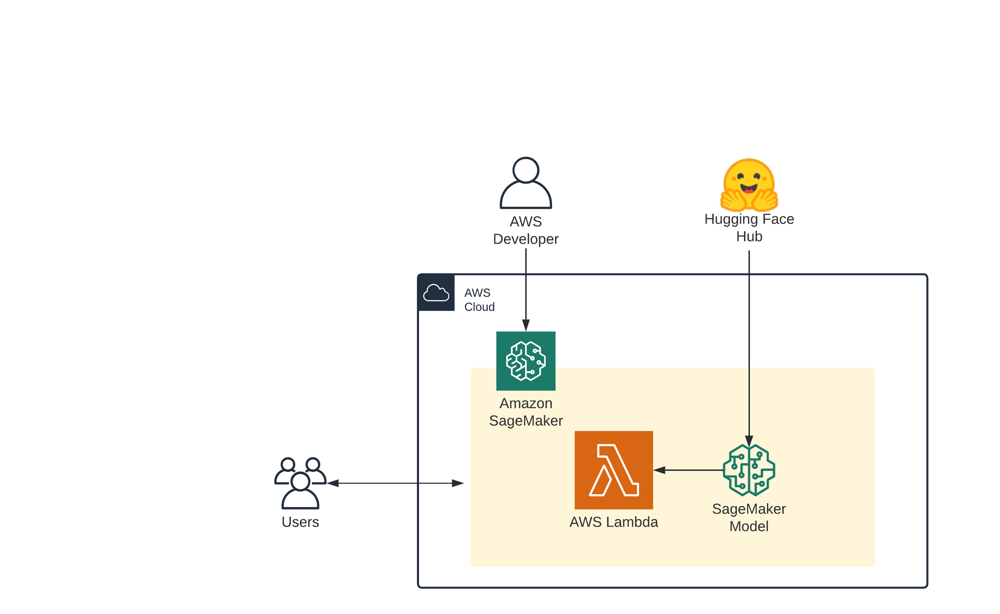

[Notebook: serverless_inference](https://github.com/huggingface/notebooks/blob/main/sagemaker/19_serverless_inference/sagemaker-notebook.ipynb)

Welcome to this getting started guide, you learn how to use the Hugging Face Inference DLCs and Amazon SageMaker Python SDK to create a [Serverless Inference](https://docs.aws.amazon.com/sagemaker/latest/dg/serverless-endpoints.html) endpoint.
Amazon SageMaker Serverless Inference is a new capability in SageMaker that enables you to deploy and scale ML models in a Serverless fashion. Serverless endpoints automatically launch compute resources and scale them in and out depending on traffic similar to AWS Lambda.
Serverless Inference is ideal for workloads which have idle periods between traffic spurts and can tolerate cold starts. With a pay-per-use model, Serverless Inference is a cost-effective option if you have an infrequent or unpredictable traffic pattern. 

You will learn how to: 

  - [1. Setup development environment and permissions](#1-setup-development-environment-and-permissions)
  - [2. Create and Deploy a Serverless Hugging Face Transformers](#2-create-and-deploy-a-serverless-hugging-face-transformers)
  - [3. Send requests to Serverless Inference Endpoint](#3-send-requests-to-serverless-inference-endpoint)

Let's get started! 🚀

### How it works 

The following diagram shows the workflow of Serverless Inference.



When you create a serverless endpoint, SageMaker provisions and manages the compute resources for you. Then, you can make inference requests to the endpoint and receive model predictions in response. SageMaker scales the compute resources up and down as needed to handle your request traffic, and you only pay for what you use.

### Limitations

Memory size: 1024 MB, 2048 MB, 3072 MB, 4096 MB, 5120 MB, or 6144 MB  
Concurrent invocations: 50 per region  
Cold starts: ms to seconds. Can be monitored with the `ModelSetupTime` Cloudwatch Metric  


_NOTE: You can run this demo in Sagemaker Studio, your local machine, or Sagemaker Notebook Instances_


## 1. Setup development environment and permissions

```python
!pip install sagemaker --upgrade

import sagemaker

assert sagemaker.__version__ >= "2.86.0"
```

_If you are going to use Sagemaker in a local environment (not SageMaker Studio or Notebook Instances). You need access to an IAM Role with the required permissions for Sagemaker. You can find [here](https://docs.aws.amazon.com/sagemaker/latest/dg/sagemaker-roles.html) more about it._


```python
import sagemaker
import boto3
sess = sagemaker.Session()
# sagemaker session bucket -> used for uploading data, models and logs
# sagemaker will automatically create this bucket if it not exists
sagemaker_session_bucket=None
if sagemaker_session_bucket is None and sess is not None:
    # set to default bucket if a bucket name is not given
    sagemaker_session_bucket = sess.default_bucket()

try:
    role = sagemaker.get_execution_role()
except ValueError:
    iam = boto3.client('iam')
    role = iam.get_role(RoleName='sagemaker_execution_role')['Role']['Arn']

sess = sagemaker.Session(default_bucket=sagemaker_session_bucket)

print(f"sagemaker role arn: {role}")
print(f"sagemaker bucket: {sess.default_bucket()}")
print(f"sagemaker session region: {sess.boto_region_name}")
```

## 2. Create and Deploy a Serverless Hugging Face Transformers

We use the [distilbert-base-uncased-finetuned-sst-2-english](https://huggingface.co/distilbert-base-uncased-finetuned-sst-2-english) model running our serverless endpoint. This model is a fine-tune checkpoint of [DistilBERT-base-uncased](https://huggingface.co/distilbert-base-uncased), fine-tuned on SST-2. This model reaches an accuracy of 91.3 on the dev set (for comparison, Bert bert-base-uncased version reaches an accuracy of 92.7).


```python
from sagemaker.huggingface.model import HuggingFaceModel
from sagemaker.serverless import ServerlessInferenceConfig

# Hub Model configuration. <https://huggingface.co/models>
hub = {
    'HF_MODEL_ID':'distilbert-base-uncased-finetuned-sst-2-english',
    'HF_TASK':'text-classification'
}

# create Hugging Face Model Class
huggingface_model = HuggingFaceModel(
   env=hub,                      # configuration for loading model from Hub
   role=role,                    # iam role with permissions to create an Endpoint
   transformers_version="4.12",  # transformers version used
   pytorch_version="1.9",        # pytorch version used
   py_version='py38',            # python version used
)

# Specify MemorySizeInMB and MaxConcurrency in the serverless config object
serverless_config = ServerlessInferenceConfig(
    memory_size_in_mb=4096, max_concurrency=10,
)

# deploy the endpoint endpoint
predictor = huggingface_model.deploy(
    serverless_inference_config=serverless_config
)
```

## 3. Send requests to Serverless Inference Endpoint

The `.deploy()` returns an `HuggingFacePredictor` object which can be used to request inference. This `HuggingFacePredictor` makes it easy to send requests to your endpoint and get the results back.

_The first request might have some coldstart (2-5s)._ 


```python
data = {
  "inputs": "the mesmerizing performances of the leads keep the film grounded and keep the audience riveted .",
}

res = predictor.predict(data=data)
print(res)
```

### Clean up


```python
predictor.delete_model()
predictor.delete_endpoint()
```

## 4. Conclusion

With the help of the Python SageMaker SDK, we were able to deploy an Amazon SageMaker Serverless Inference Endpoint for Hugging Face Transformers with 1 command (`deploy`).

This will help any large or small company get quickly and cost-effective started with Hugging Face Transformers on AWS. The beauty of Serverless computing will make sure that your Data Science or Machine Learning Team is not spending thousands of dollar while implementing a Proof of Conecpt or at the start of a new Product. 
After the PoC was successful or Serverless Inference is not performing well or become more expensive, you can easily deploy your model to real-time endpoints with GPUs just by changing 1 line of code.

You should definitely give SageMaker Serverless Inference a try!

---

Thanks for reading! If you have any questions, feel free to contact me, through [Github](https://github.com/huggingface/transformers), or on the [forum](https://discuss.huggingface.co/c/sagemaker/17). You can also connect with me on [Twitter](https://twitter.com/_philschmid) or [LinkedIn](https://www.linkedin.com/in/philipp-schmid-a6a2bb196/).
