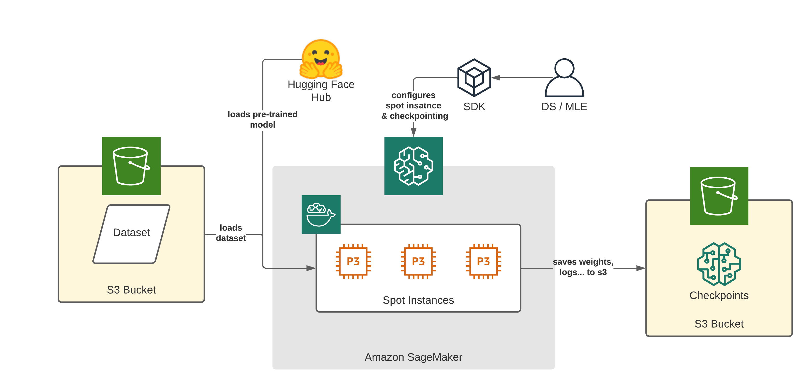

notebook: [sagemaker/05_spot_instances](https://github.com/huggingface/notebooks/blob/master/sagemaker/05_spot_instances/sagemaker-notebook.ipynb)


[Amazon EC2 Spot Instances](https://docs.aws.amazon.com/AWSEC2/latest/UserGuide/using-spot-instances.html) are a way to take advantage of unused EC2 capacity in the AWS cloud. A Spot Instance is an instance that uses spare EC2 capacity that is available for less than the On-Demand price. The hourly price for a Spot Instance is called a Spot price. If you want to learn more about Spot Instances, you should check out the concepts of it in the [documentation](https://docs.aws.amazon.com/AWSEC2/latest/UserGuide/using-spot-instances.html#spot-pricing). One concept we should nevertheless briefly address here is `Spot Instance interruption`. 

> Amazon EC2 terminates, stops, or hibernates your Spot Instance when Amazon EC2 needs the capacity back or the Spot price exceeds the maximum price for your request. Amazon EC2 provides a Spot Instance interruption notice, which gives the instance a two-minute warning before it is interrupted.

[Amazon SageMaker](https://docs.aws.amazon.com/sagemaker/latest/dg/model-managed-spot-training.html) and the [Hugging Face DLCs](https://huggingface.co/docs/sagemaker/main) make it easy to train transformer models using managed Spot instances. Managed spot training can optimize the cost of training models up to 90% over on-demand instances. 

As we learned spot instances can be interrupted, causing jobs to potentially stop before they are finished. To prevent any loss of model weights or information Amazon SageMaker offers support for [remote S3 Checkpointing](https://docs.aws.amazon.com/sagemaker/latest/dg/model-checkpoints.html) where data from a local path to Amazon S3 is saved. When the job is restarted, SageMaker copies the data from Amazon S3 back into the local path. 



In this example, we will learn how to use [managed Spot Training](https://docs.aws.amazon.com/sagemaker/latest/dg/model-managed-spot-training.html) and [S3 checkpointing](https://docs.aws.amazon.com/sagemaker/latest/dg/model-checkpoints.html) with Hugging Face Transformers to save up to 90% of the training costs. 

We are going to:

- preprocess a dataset in the notebook and upload it to Amazon S3
- configure checkpointing and spot training in the `HuggingFace` estimator
- run training on a spot instance

***NOTE: You can run this demo in Sagemaker Studio, your local machine, or Sagemaker Notebook Instances***

## **Development Environment and Permissions**

*Note: we only install the required libraries from Hugging Face and AWS. You also need PyTorch or Tensorflow, if you haven´t it installed*

```python
!pip install "sagemaker>=2.77.0" "transformers==4.12.3" "datasets[s3]==1.18.3" s3fs --upgrade
```

## **Permissions**

*If you are going to use Sagemaker in a local environment (not SageMaker Studio or Notebook Instances). You need access to an IAM Role with the required permissions for Sagemaker. You can find [here](https://docs.aws.amazon.com/sagemaker/latest/dg/sagemaker-roles.html) more about it.*

```python
import sagemaker
import boto3
sess = sagemaker.Session()
# sagemaker session bucket -> used for uploading data, models and logs
# sagemaker will automatically create this bucket if it not exists
sagemaker_session_bucket=None
if sagemaker_session_bucket is None and sess is not None:
    # set to default bucket if a bucket name is not given
    sagemaker_session_bucket = sess.default_bucket()

try:
    role = sagemaker.get_execution_role()
except ValueError:
    iam = boto3.client('iam')
    role = iam.get_role(RoleName='sagemaker_execution_role')['Role']['Arn']

sess = sagemaker.Session(default_bucket=sagemaker_session_bucket)

print(f"sagemaker role arn: {role}")
print(f"sagemaker bucket: {sess.default_bucket()}")
print(f"sagemaker session region: {sess.boto_region_name}")
```

## **Preprocessing**

We are using the `datasets` library to download and preprocess the `emotion` dataset. After preprocessing, the dataset will be uploaded to our `sagemaker_session_bucket` to be used within our training job. The [emotion](https://github.com/dair-ai/emotion_dataset) dataset consists of 16000 training examples, 2000 validation examples, and 2000 testing examples.

```python
from datasets import load_dataset
from transformers import AutoTokenizer

# model_id used for training and preprocessing
model_id = 'distilbert-base-uncased'

# dataset used
dataset_name = 'emotion'

# s3 key prefix for the data
s3_prefix = 'samples/datasets/emotion'

# download tokenizer
tokenizer = AutoTokenizer.from_pretrained(model_id)

# tokenizer helper function
def tokenize(batch):
    return tokenizer(batch['text'], padding='max_length', truncation=True)

# load dataset
train_dataset, test_dataset = load_dataset(dataset_name, split=['train', 'test'])

# tokenize dataset
train_dataset = train_dataset.map(tokenize, batched=True)
test_dataset = test_dataset.map(tokenize, batched=True)

# set format for pytorch
train_dataset =  train_dataset.rename_column("label", "labels")
train_dataset.set_format('torch', columns=['input_ids', 'attention_mask', 'labels'])
test_dataset = test_dataset.rename_column("label", "labels")
test_dataset.set_format('torch', columns=['input_ids', 'attention_mask', 'labels'])
```

After we processed the `datasets` we are going to use the new `FileSystem` [integration](https://huggingface.co/docs/datasets/filesystems.html) to upload our dataset to S3.

```python
import botocore
from datasets.filesystems import S3FileSystem

s3 = S3FileSystem()  

# save train_dataset to s3
training_input_path = f's3://{sess.default_bucket()}/{s3_prefix}/train'
train_dataset.save_to_disk(training_input_path, fs=s3)

# save test_dataset to s3
test_input_path = f's3://{sess.default_bucket()}/{s3_prefix}/test'
test_dataset.save_to_disk(test_input_path, fs=s3)
```

## Configure checkpointing and spot training in the `HuggingFace` estimator

After we have uploaded we can configure our spot training and make sure we have checkpointing enabled to not lose any progress if interruptions happen. 

To configure spot training we need to define the `max_wait` and `max_run` in the `HuggingFace` estimator and set `use_spot_instances` to `True`. 

- `max_wait`: Duration in seconds until Amazon SageMaker will stop the managed spot training if not completed yet
- `max_run`: Max duration in seconds for training the training job

`max_wait` also needs to be greater than `max_run`, because `max_wait` is the duration for waiting/accessing spot instances (can take time when no spot capacity is free) + the expected duration of the training job. 

**Example**

If you expect your training to take 3600 seconds (1 hour) you can set `max_run` to `4000` seconds (buffer) and `max_wait` to `7200` to include a `3200` seconds waiting time for your spot capacity. 

```python
# enables spot training
use_spot_instances=True
# max time including spot start + training time
max_wait=7200
# expected training time
max_run=4000
```

To enable checkpointing we need to define `checkpoint_s3_uri` in the `HuggingFace` estimator. `checkpoint_s3_uri` is a S3 URI in which to save the checkpoints. By default Amazon SageMaker will save now any file, which is written to `/opt/ml/checkpoints` in the training job to `checkpoint_s3_uri`. 

*It is possible to adjust `/opt/ml/checkpoints` by overwriting `checkpoint_local_path` in the `HuggingFace` estimator*

```python
# s3 uri where our checkpoints will be uploaded during training
base_job_name = "emotion-checkpointing"

checkpoint_s3_uri = f's3://{sess.default_bucket()}/{base_job_name}/checkpoints'

```

Next step is to create our `HuggingFace` estimator, provide our `hyperparameters` and add our spot and checkpointing configurations.

```python
from sagemaker.huggingface import HuggingFace

# hyperparameters, which are passed into the training job
hyperparameters={
	'epochs': 1,                       # number of training epochs
  'train_batch_size': 32,            # batch size for training
  'eval_batch_size': 64,             # batch size for evaluation
  'learning_rate': 3e-5,             # learning rate used during training
  'model_id':model_id,               # pre-trained model id 
  'fp16': True,                      # Whether to use 16-bit (mixed) precision training
	'output_dir':'/opt/ml/checkpoints' # make sure files are saved to the checkpoint directory
}

# create the Estimator
huggingface_estimator = HuggingFace(
    entry_point          = 'train.py',        # fine-tuning script used in training jon
    source_dir           = './scripts',       # directory where fine-tuning script is stored
    instance_type        = 'ml.p3.2xlarge',   # instances type used for the training job
    instance_count       = 1,                 # the number of instances used for training
    base_job_name        = base_job_name,     # the name of the training job
    role                 = role,              # Iam role used in training job to access AWS ressources, e.g. S3
    transformers_version = '4.12.3',          # the transformers version used in the training job
    pytorch_version      = '1.9.1',           # the pytorch_version version used in the training job
    py_version           = 'py38',            # the python version used in the training job
    hyperparameters      = hyperparameters,   # the hyperparameter used for running the training job
		use_spot_instances   = use_spot_instances,# wether to use spot instances or not
    max_wait             = max_wait,          # max time including spot start + training time
    max_run              = max_run,           # max expected training time
		checkpoint_s3_uri    = checkpoint_s3_uri, # s3 uri where our checkpoints will be uploaded during training

)
```

When using remote S3 checkpointing you have to make sure that your `train.py` also supports checkpointing. `Transformers` and the `Trainer` offers utilities on how to do this. You only need to add the following snippet to your `Trainer` training script

```python
from transformers.trainer_utils import get_last_checkpoint

# check if checkpoint existing if so continue training
if get_last_checkpoint(args.output_dir) is not None:
    logger.info("***** continue training *****")
    last_checkpoint = get_last_checkpoint(args.output_dir)
    trainer.train(resume_from_checkpoint=last_checkpoint)
else:
    trainer.train()
```

## Run training on a spot instance

The last step of this example is to start our managed Spot Training. Therefore we simple call the `.fit` method of our estimator and provide our dataset.

```python
# define train data object
data = {
	'train': training_input_path,
  'test': test_input_path
}

# starting the train job with our uploaded datasets as input
huggingface_estimator.fit(data)

# Training seconds: 874
# Billable seconds: 262
# Managed Spot Training savings: 70.0%
```

After the training is successful run you should see your spot savings in the logs. 

---

## **Conclusion**

We successfully managed to run a Managed Spot Training on Amazon SageMaker and save 70% off the training cost, which is a big margin. Especially we only needed to define 3 parameters to set it up. 

I can highly recommend using Managed Spot Training if you have grace period in between model training and delivery.  

If you want to learn more about Hugging Face Transformers on Amazon SageMaker you can checkout our [documentation](https://huggingface.co/docs/sagemaker/main) or other [examples](https://github.com/huggingface/notebooks/tree/master/sagemaker).
---

You can find the code [here](https://github.com/huggingface/notebooks/blob/master/sagemaker/05_spot_instances/sagemaker-notebook.ipynb). 

Thanks for reading! If you have any questions, feel free to contact me, through [Github](https://github.com/huggingface/transformers), or on the [forum](https://discuss.huggingface.co/c/sagemaker/17). You can also connect with me on [Twitter](https://twitter.com/_philschmid) or [LinkedIn](https://www.linkedin.com/in/philipp-schmid-a6a2bb196/).
