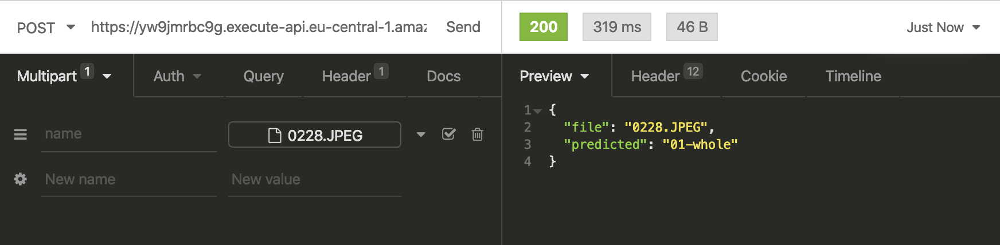

# Introduction

The workflow for building machine learning models often ends at the evaluation stage: you have achieved an acceptable
accuracy, which you can test and demonstrate in your "research environment" and “ta-da! Mission accomplished.” But this
is not all! The last - most important step in a machine learning workflow is **deploying** your model to work in
production.

> A model which does not work in production is worth nothing.

A deployed model can be defined as any unit that is seamlessly integrated into a production environment, which can take
in an input and return an output. But one of the main issues companies face with machine learning is finding a way to
deploy these models in such environments.

> [around 40% of failed projects reportedly stalled in development and didn`t get deployed into production](https://medium.com/vsinghbisen/these-are-the-reasons-why-more-than-95-ai-and-ml-projects-fail-cd97f4484ecc).
> [**Source**](https://medium.com/vsinghbisen/these-are-the-reasons-why-more-than-95-ai-and-ml-projects-fail-cd97f4484ecc)

In this post, I will show you step-by-step how to deploy your own custom-trained Pytorch model with AWS Lambda and
integrate it into your production environment with an API. We are going to leverage a simplified serverless computing
approach at scale.

## What is AWS Lambda?

[AWS Lambda](https://docs.aws.amazon.com/lambda/latest/dg/welcome.html) is a computing service that lets you run code
without managing servers. It executes your code only when required and scales automatically, from a few requests per day
to thousands per second. You only pay for the compute time you consume - there is no charge when your code is not
running.


[AWs Lambda features](https://aws.amazon.com/de/lambda/features/)

---

# **Requirements**

This post assumes you have the [Serverless Framework](https://serverless.com/) for deploying an AWS Lambda function
installed and configured, as well as a working Docker Environment. The Serverless Framework helps us develop and deploy
AWS Lambda functions. It’s a CLI that offers structure, automation, and best practices right out of the box. It also
allows you to focus on building sophisticated, event-driven, serverless architectures, comprised of functions and
events.


If you aren’t familiar or haven’t set up the Serverless Framework, take a look at
this [quick-start with the Serverless Framework](https://serverless.com/framework/docs/providers/aws/guide/quick-start/).

By modifying the serverless YAML file, you can connect SQS and, say, create a deep learning pipeline, or even connect it
to a chatbot via AWS Lex.

---

# Tutorial

Before we get started, I'd like to give you some information about the model we are going to use. I trained a Pytorch
image classifier in a
[google colab](https://colab.research.google.com/drive/1Ehy2Tfadj4XASpMDMuNTqHZsXHtDvTmf#scrollTo=rwm_44YP-mdk). If you
want to know what Google Colab is, take a look
[here](https://colab.research.google.com/drive/1Ehy2Tfadj4XASpMDMuNTqHZsXHtDvTmf#scrollTo=Rp7DFKE18vHI). I created a
dataset for classifying [car damage detection](https://www.kaggle.com/philschmid/car-damage-image-classifier) and
fine-tuned a resnet50 image classifier. In this tutorial, we are using `Python3.8` with `Pytorch1.5`.


What are we going to do:

- create a Python Lambda function with the Serverless Framework
- add Pytorch to the Lambda Environment
- write a predict function to classify images
- create a S3 bucket, which holds the model and a script to upload it
- configure the Serverless Framework to set up API Gateway for inference

The architecture we are building will look like this.


Now let’s get started with the tutorial.

---

# Create the AWS Lambda function

First, we create our AWS Lambda function by using the Serverless CLI with the `aws-python3` template.

```bash
serverless create --template aws-python3 --path scale-machine-learning-w-pytorch
```

This CLI command will create a new directory containing a `[handler.py](http://handler.py)`, `.gitignore` and
`serverless.yaml` file. The `handler.py` contains some basic boilerplate code.

```python
import json

def hello(event, context):
    body = {
        "message": "Go Serverless v1.0! Your function executed successfully!",
        "input":event
    }
    response = {
        "statusCode": 200,
        "body": json.dumps(body)
    }
    return response
```

---

# Add Python Requirements

Next, we are adding our Python Requirements to our AWS Lambda function. For this, we are using the Serverless plugin
`serverless-python-requirements`. It automatically bundles dependencies from a `requirements.txt` and makes them
available. The `serverless-python-requirements` plugin allows you to even bundle non-pure-Python modules. More on that
[here](https://github.com/UnitedIncome/serverless-python-requirements#readme).

### Installing the plugin

To install the plugin run the following command.

```bash
serverless plugin install -n serverless-python-requirements
```

This will automatically add the plugin to your project's `package.json` and to the plugins section in the
`serverless.yml`.

### Adding Requirements to `requirements.txt`

We have to create a `requirements.txt` file on the root level, with all required Python packages. But you have to be
careful that the deployment package size must not exceed 250MB unzipped. You can find a list of all AWS Lambda
limitations [here](https://docs.aws.amazon.com/lambda/latest/dg/gettingstarted-limits.html).

If we would install Pytorch with `pip install torch` the package would be around ~ 470 MB, which is too big to be
deployed in an AWS Lambda Environment. Thus, we are adding the link to the python wheel file (`.whl`) directly in the
`requirements.txt`. For a list of all PyTorch and torchvision packages consider
[this list](https://download.pytorch.org/whl/torch_stable.html).

The `requirements.txt` should look like this.

```python
https://download.pytorch.org/whl/cpu/torch-1.5.0%2Bcpu-cp38-cp38-linux_x86_64.whl
torchvision==0.6.0
requests_toolbelt
```

To make the dependencies even smaller we will employ three techniques available in the `serverless-python-requirements`
plugin:

- `zip` — Compresses the dependencies in the `requirements.txt` in an additional `.requirements.zip` file and
  adds`unzip_requirements.py` in the final bundle.
- `slim` — Removes unneeded files and directories such as `*.so`, `*.pyc`, `dist-info`, etc.
- `noDeploy` — Omits certain packages from deployment. We will use the standard list that excludes packages those
  already built into Lambda, as well as Tensorboard.

You can see the implementation of it in the section where we are "configuring our `serverless.yaml`" file.

---

# Predict function

Our Lambda function actually consists of 4 functions.

- `load_model_from_s3()` is for loading our model from S3 into memory creating our PyTorch model and a list called
  `classes`, which holds the predictable classes.
- `transform_image()` for transforming the incoming pictures into a PyTorch Tensor.
- `get_prediction()`, which uses the transformed Image as input to get a prediction.
- `detect_damage()` is the main function of our Lambda environment.

### Pseudo code

```python

model, classes =  load_model_from_s3():

def detect_damage(image):

	image_tensor = transform_image(image)

	prediction = get_prediction(image_tensor)

	return prediction
```

The working program code then looks like this.

```python
try:
    import unzip_requirements
except ImportError:
    pass
from requests_toolbelt.multipart import decoder
import torch
import torchvision
import torchvision.transforms as transforms
from PIL import Image

from torchvision.models import resnet50
from torch import nn

import boto3
import os
import tarfile
import io
import base64
import json

S3_BUCKET = os.environ['S3_BUCKET'] if 'S3_BUCKET' in os.environ else 'fallback-test-value'
MODEL_PATH = os.environ['MODEL_PATH'] if 'MODEL_PATH' in os.environ else 'fallback-test-value'

s3 = boto3.client('s3')

def load_model_from_s3():
    try:
				# get object from s3
        obj = s3.get_object(Bucket=S3_BUCKET, Key=MODEL_PATH)
				# read it in memory
        bytestream = io.BytesIO(obj['Body'].read())
				# unzip it
        tar = tarfile.open(fileobj=bytestream, mode="r:gz")
        for member in tar.getmembers():
            if member.name.endswith(".txt"):
                print("Classes file is :", member.name)
                f = tar.extractfile(member)
                classes = [classes.decode() for classes in f.read().splitlines()]
                print(classes)
            if member.name.endswith(".pth"):
                print("Model file is :", member.name)
                f = tar.extractfile(member)
                print("Loading PyTorch model")
								# set device to cpu
                device = torch.device('cpu')
								# create model class
                model = resnet50(pretrained=False)
                model.fc = nn.Sequential(nn.Linear(2048, 512), nn.ReLU(), nn.Dropout(0.2),
                                         nn.Linear(512, 10),
                                         nn.LogSoftmax(dim=1))
                # load downloaded model
								model.load_state_dict(torch.load(io.BytesIO(f.read()), map_location=device))
                model.eval()
				# return classes as list and model
        return model, classes
    except Exception as e:
        raise(e)

model, classes = load_model_from_s3()

def transform_image(image_bytes):
    try:
        transformations = transforms.Compose([
            transforms.Resize(255),
            transforms.CenterCrop(224),
            transforms.ToTensor(),
            transforms.Normalize(mean=[0.485, 0.456, 0.406], std=[0.229, 0.224, 0.225])])
        image = Image.open(io.BytesIO(image_bytes))
        return transformations(image).unsqueeze(0)
    except Exception as e:
        print(repr(e))
        raise(e)

def get_prediction(image_bytes):
    tensor = transform_image(image_bytes=image_bytes)
    outputs = model.forward(tensor)
    _, y_hat = outputs.max(1)
    predicted_idx = y_hat.item()
    return classes[predicted_idx]

def detect_damage(event, context):
    try:
        content_type_header = event['headers']['content-type']
        print(event['body'])
        body = base64.b64decode(event["body"])

        picture = decoder.MultipartDecoder(body, content_type_header).parts[0]
        prediction = get_prediction(image_bytes=picture.content)

        filename = picture.headers[b'Content-Disposition'].decode().split(';')[1].split('=')[1]
        if len(filename) < 4:
            filename = picture.headers[b'Content-Disposition'].decode().split(';')[2].split('=')[1]

        return {
            "statusCode": 200,
            "headers": {
                'Content-Type': 'application/json',
                'Access-Control-Allow-Origin': '*',
                "Access-Control-Allow-Credentials": True
            },
            "body": json.dumps({'file': filename.replace('"', ''), 'predicted': prediction})
        }
    except Exception as e:
        print(repr(e))
        return {
            "statusCode": 500,
            "headers": {
                'Content-Type': 'application/json',
                'Access-Control-Allow-Origin': '*',
                "Access-Control-Allow-Credentials": True
            },
            "body": json.dumps({"error": repr(e)})
        }
```

---

# Adding the trained model to our project

As explained earlier, I trained a car damage detection model in a
[colab notebook](https://colab.research.google.com/drive/1Ehy2Tfadj4XASpMDMuNTqHZsXHtDvTmf#scrollTo=Rp7DFKE18vHI), which
takes an image as input and returns whether the car depicted is `01-whole` or `00-damaged`. I also added some code that
does all the bundling magic for you: If you run the notebook it will create a file called `cardamage.tar.gz` that is
ready to be deployed on AWS. Keep in mind, the size of the Lambda function can be only 250MB unzipped. Thus, we cannot
include our model directly into the function. Instead we need to download it from S3 with the `load_model_from_s3()`.

For this to work, we need a S3 bucket. You can either create one using the management console or with this script.

```python
aws s3api create-bucket --bucket bucket-name --region eu-central-1 --create-bucket-configuration LocationConstraint=eu-central-1
```

After we created the bucket we can upload our model. You can do it either manually or using the provided python script.

```python
import boto3

def upload_model(model_path='', s3_bucket='', key_prefix='', aws_profile='default'):
    s3 = boto3.session.Session(profile_name=aws_profile)
    client = s3.client('s3')
    client.upload_file(model_path, s3_bucket, key_prefix)
```

---

# Configuring the `serverless.yaml`

The next step is to adjust the `serverless.yaml` and including the `custom` Python requirement configuration. We are
going to edit four sections of the `serverless.yaml`, ...

- the `provider` section which holds our runtime and IAM permissions.
- the `custom` section where we configure the `serverless-python-requirements` plugin.
- the `package` section where we exclude folders from production.
- the `function` section where we create the function and define events that invoke our Lambda function.

Have a look at the complete `serverless.yaml`. Don't worry, I will explan all four sections in detail in a minute.

```yaml
service: car-damage-pytorch

provider:
  name: aws
  runtime: python3.8
  region: eu-central-1
  timeout: 60
  environment:
    S3_BUCKET: S3_BUCKET_WHICH_HOLDS_YOUR_MODEL
    MODEL_PATH: PATH_TO_FILE_ON_S3
  iamRoleStatements:
    - Effect: 'Allow'
      Action:
        - s3:getObject
      Resource: arn:aws:s3:::S3_BUCKET_WHICH_HOLDS_YOUR_MODEL/PATH_TO_FILE_ON_S3

custom:
  pythonRequirements:
    dockerizePip: true
    zip: true
    slim: true
    strip: false
    noDeploy:
      - docutils
      - jmespath
      - pip
      - python-dateutil
      - setuptools
      - six
      - tensorboard
    useStaticCache: true
    useDownloadCache: true
    cacheLocation: './cache'

package:
  individually: false
  exclude:
    - package.json
    - package-log.json
    - node_modules/**
    - cache/**
    - test/**
    - __pycache__/**
    - .pytest_cache/**
    - model/**

functions:
  detect_damage:
    handler: handler.detect_damage
    memorySize: 3008
    timeout: 60
    events:
      - http:
          path: detect
          method: post
          cors: true

plugins:
  - serverless-python-requirements
```

## `provider`

In the serverless framework, we define where our function ins deployed in the `provider` section. We are using `aws` as
our provider, other options include `google`, `azure`, and many more. You can find a full list of providers
[here](https://www.serverless.com/framework/docs/providers/).

In addition, we define our runtime, our environment variables, and the permissions our Lambda function has.

As runtime, we are using `python3.8`. For our function to work we need two environment variables `S3_BUCKET` and
`MODEL_PATH`. `S3_BUCKET` contains the name of our S3 Bucket, which we created earlier. `MODEL_PATH` is the path to our
`cardamage.tar.gz` file in the S3 Bucket. We are still missing the permissions to get our model from S3 into our lambda
functions. The `iamRoleStatements`handles the permissions for our lambda function. The permission we need to get our
model from S3 is `s3:getObject` with the ARN
([Amazon Resource Names](https://docs.aws.amazon.com/general/latest/gr/aws-arns-and-namespaces.html)) of our S3 bucket
as a resource.

```yaml
provider:
  name: aws
  runtime: python3.8
  region: eu-central-1
  timeout: 60
  environment:
    S3_BUCKET: S3_BUCKET_WHICH_HOLDS_YOUR_MODEL
    MODEL_PATH: PATH_TO_FILE_ON_S3
  iamRoleStatements:
    - Effect: 'Allow'
      Action:
        - s3:getObject
      Resource: arn:aws:s3:::S3_BUCKET_WHICH_HOLDS_YOUR_MODEL/PATH_TO_FILE_ON_S3
```

## `custom`

In the `custom` section of the `serverless.yml`, we can define configurations for plugins or other scripts. For more
details, refer to this [guide](https://www.serverless.com/framework/docs/providers/aws/guide/variables/). As described
earlier we are using the `serverless-python-requirements` to install and reduce the size of our dependencies at the same
time so we can pack everything into the Lambda runtime. If you want to know how it works you can read
[here](https://www.npmjs.com/package/serverless-python-requirements).

```yaml
custom:
  pythonRequirements:
    dockerizePip: true
    zip: true
    slim: true
    strip: false
    noDeploy:
      - docutils
      - jmespath
      - pip
      - python-dateutil
      - setuptools
      - six
      - tensorboard
    useStaticCache: true
    useDownloadCache: true
    cacheLocation: './cache'
```

## `package`

The `package` section can be used to exclude directories/folders from the final package. This offers more control in the
packaging process. You can `exclude` specific folders and files, like `node_modules/`. For more detail take a look
[here](https://www.serverless.com/framework/docs/providers/aws/guide/packaging/).

```yaml
package:
  individually: false
  exclude:
    - package.json
    - package-log.json
    - node_modules/**
    - cache/**
    - test/**
    - __pycache__/**
    - .pytest_cache/**
    - model/**
```

## `function`

The fourth and last section - `function` - holds the configuration for our Lambda function. We define the allocated
memory size, a timeout, and the `events` here. In the `events` section of the `function`, we can define a number of
events, which will trigger our lambda function. For our project, we are using `http` which will automatically create an
API Gateway pointing to our function. You can also define events for `sqs`, `cron`, `s3` upload event and many more. You
can find the full list [here](https://www.serverless.com/framework/docs/providers/aws/guide/events/).

```yaml
functions:
  detect_damage:
    handler: handler.detect_damage
    memorySize: 3008
    timeout: 60
    events:
      - http:
          path: detect
          method: post
          cors: true
```

# Deploying the function

In order to deploy the function, we create a `deploy` script in the `package.json`. To deploy our function we need to
have docker up and running.

```json
{
  "name": "blog-github-actions-aws-lambda-python",
  "description": "",
  "version": "0.1.0",
  "dependencies": {},
  "scripts": {
    "deploy": "serverless deploy"
  },
  "devDependencies": {
    "serverless": "^1.67.0",
    "serverless-python-requirements": "^5.1.0"
  }
}
```

Afterwards, we can run `yarn deploy` or `npm run deploy` to deploy our function. This could take a while as we are
creating a Python environment with docker and installing all our dependencies in it and then uploading everything to
AWS.

After this process is done we should see something like this.


# Test and Outcome

To test our lambda function we can use Insomnia, Postman, or any other rest client. Just add an image of a damaged or
whole car as a multipart input in the request. Let´s try it with this image.




As a result of our test with the red car we get`01-whole`, which is correct. Also, you can see the complete request took
319ms with a lambda execution time of around 250ms. To be honest this is pretty fast.

If you are going to rebuild the classifier, you have to be careful that the first request could take a while. First off,
the Lambda is unzipping and installing our dependencies and then downloading the model from S3. After this is done once,
the lambda needs around 250ms - 1000ms depending on the input image size for classification.

**The best thing is, our classifier automatically scales up if there are several incoming requests!**

You can scale up to thousands parallel request without any worries.

---

Thanks for reading. You can find the GitHub repository with the complete code
[here](https://github.com/philschmid/scale-machine-learning-w-pytorch) and the colab notebook
[here](https://colab.research.google.com/drive/1Ehy2Tfadj4XASpMDMuNTqHZsXHtDvTmf#scrollTo=vV9cHcwN0MXw). If you have any
questions, feel free to contact me.
