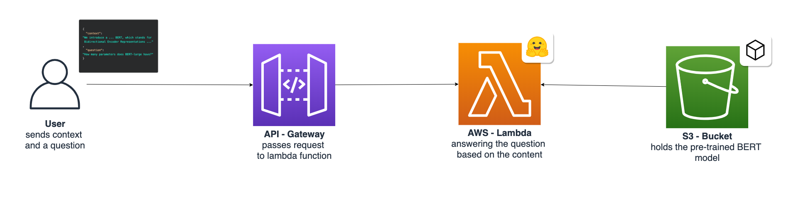
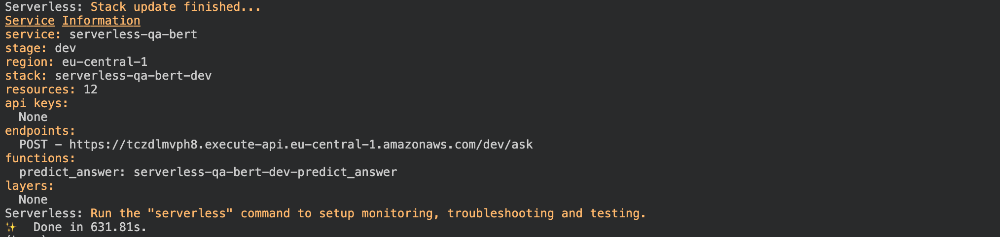
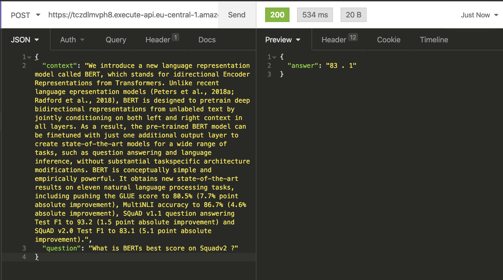

# Introduction

"Serverless" and "BERT" are two topics that strongly influenced the world of computing.
[Serverless architecture](https://hackernoon.com/what-is-serverless-architecture-what-are-its-pros-and-cons-cc4b804022e9)
allows us to provide dynamically scale-in and -out the software without managing and provisioning computing power.
[It allows us, developers, to focus on our applications](https://www.cloudflare.com/learning/serverless/why-use-serverless/).

BERT is probably the most known NLP model out there. You can say it changed the way we work with textual data and what
we can learn from it.
_["BERT will help [Google] Search [achieve a] better understand[ing] one in 10 searches"](https://www.blog.google/products/search/search-language-understanding-bert/)_.
BERT and its fellow friends RoBERTa, GPT-2, ALBERT, and T5 will drive business and business ideas in the next few years
and will change/disrupt business areas like the internet once did.


[search language understanding BERT](https://www.blog.google/products/search/search-language-understanding-bert/)

Imagine the business value you achieve combining these two together. But BERT is not the easiest machine learning model
to be deployed in a serverless architecture. BERT is quite big and needs quite some computing power. Most tutorials you
find online demonstrate how to deploy BERT in "easy" environments like a VM with 16GB of memory and 4 CPUs.

I will show you how to leverage the benefits of serverless architectures and deploy a BERT Question-Answering API in a
serverless environment. We are going to use the [Transformers](https://github.com/huggingface/transformers) library by
HuggingFace, the [Serverless Framework](https://serverless.com/), and AWS Lambda.

---

## Transformer Library by Huggingface


The [Transformers library](https://github.com/huggingface/transformers) provides state-of-the-art machine learning
architectures like BERT, GPT-2, RoBERTa, XLM, DistilBert, XLNet, T5 for Natural Language Understanding (NLU) and Natural
Language Generation (NLG). It also provides thousands of pre-trained models in 100+ different languages and is deeply
interoperability between PyTorch & TensorFlow 2.0. It enables developers to fine-tune machine learning models for
different NLP-tasks like text classification, sentiment analysis, question-answering, or text generation.

---

## AWS Lambda

[AWS Lambda](https://docs.aws.amazon.com/lambda/latest/dg/welcome.html) is a serverless computing service that lets you
run code without managing servers. It executes your code only when required and scales automatically, from a few
requests per day to thousands per second. You only pay for the compute time you consume – there is no charge when your
code is not running.


---

## Serverless Framework

The Serverless Framework helps us develop and deploy AWS Lambda functions. It’s a CLI that offers structure, automation,
and best practices right out of the box. It also allows us to focus on building sophisticated, event-driven, serverless
architectures, comprised of functions and events.


If you aren’t familiar or haven’t set up the Serverless Framework, take a look at
this [quick-start with the Serverless Framework](https://serverless.com/framework/docs/providers/aws/guide/quick-start/).

---

# Tutorial

Before we get started, make sure you have the [Serverless Framework](https://serverless.com/) configured and set up. You
also need a working Docker environment. A Docker environment is used to build our own python runtime, which we deploy to
AWS Lambda. Furthermore, you need access to an AWS Account to create an S3 Bucket and the AWS Lambda function.

In the tutorial, we are going to build a Question-Answering API with a pre-trained `BERT` model. The idea is we send a
context (small paragraph) and a question to the lambda function, which will respond with the answer to the question.

As this guide is not about building a model, we will use a pre-built version, that I created using `distilbert`. You can
check the colab notebook [here](https://colab.research.google.com/drive/1eyVi8tkCr7N-sE-yyhDB_lduowp1EZ78?usp=sharing).

```python
context = """We introduce a new language representation model called BERT, which stands for
Bidirectional Encoder Representations from Transformers. Unlike recent language
representation models (Peters et al., 2018a; Radford et al., 2018), BERT is
designed to pretrain deep bidirectional representations from unlabeled text by
jointly conditioning on both left and right context in all layers. As a result,
the pre-trained BERT model can be finetuned with just one additional output
layer to create state-of-the-art models for a wide range of tasks, such as
question answering and language inference, without substantial taskspecific
architecture modifications. BERT is conceptually simple and empirically
powerful. It obtains new state-of-the-art results on eleven natural language
processing tasks, including pushing the GLUE score to 80.5% (7.7% point absolute
improvement), MultiNLI accuracy to 86.7% (4.6% absolute improvement), SQuAD v1.1
question answering Test F1 to 93.2 (1.5 point absolute improvement) and SQuAD
v2.0 Test F1 to 83.1 (5.1 point absolute improvement)."""

question_one = "What is BERTs best score on Squadv2 ?"
# 83 . 1

question_two = "What does the 'B' in BERT stand for?"
# 'bidirectional encoder representations from transformers'
```

Before we start, I want to say that we're not gonna go into detail this time. If you want to understand more about how
to use Deep Learning in AWS Lambda I suggest you check out my other articles:

- [Scaling Machine Learning from ZERO to HERO](https://www.philschmid.de/scaling-machine-learning-from-zero-to-hero)
- [How to Set Up a CI/CD Pipeline for AWS Lambda With GitHub Actions and Serverless](https://www.philschmid.de/how-to-set-up-a-ci-cd-pipeline-for-aws-lambda-with-github-actions-and-serverless)

The architecture we are building will look like this.



**What are we going to do:**

- create a Python Lambda function with the Serverless Framework
- create an S3 Bucket and upload our model
- Configure the `serverless.yaml`, add `transformers` as a dependency and set up an API Gateway for inference
- add the `BERT` model from the
  [colab notebook](https://colab.research.google.com/drive/1eyVi8tkCr7N-sE-yyhDB_lduowp1EZ78?usp=sharing#scrollTo=pUdW5bwb1qre)
  to our function
- deploy & test the function

You can find everything we are doing in this
[GitHub repository](https://github.com/philschmid/serverless-bert-with-huggingface-aws-lambda/blob/master/model/model.py)
and the
[colab notebook](https://colab.research.google.com/drive/1Ehy2Tfadj4XASpMDMuNTqHZsXHtDvTmf#scrollTo=vV9cHcwN0MXw).

---

# Create a Python Lambda function

First, we create our AWS Lambda function by using the Serverless CLI with the `aws-python3` template.

```bash
serverless create --template aws-python3 --path serverless-bert
```

This CLI command will create a new directory containing a `handler.py`, `.gitignore` and `serverless.yaml` file. The
`handler.py` contains some basic boilerplate code.

```python
import json

def hello(event, context):
    body = {
        "message": "Go Serverless v1.0! Your function executed successfully!",
        "input": event
    }
    response = {
        "statusCode": 200,
        "body": json.dumps(body)
    }
    return response
```

---

# Add `transformers` as a dependency

The Serverless Framework created almost anything we need, except for the `requirements.txt`. We create the
`requirements.txt` by hand and add the following dependencies.

```python
https://download.pytorch.org/whl/cpu/torch-1.5.0%2Bcpu-cp38-cp38-linux_x86_64.whl
transformers==2.10
```

---

# Create an S3 Bucket and upload the model

AWS S3 and Pytorch provide a unique way of working with machine learning models which are bigger than 250MB. Why 250 MB?
The size of the Lambda function is limited to 250MB unzipped.

But S3 allows files to be loaded directly from S3 into memory. In our function, we are going to load our model
`squad-distilbert` from S3 into memory and reading it from memory as a buffer in Pytorch.

If you run the
[colab notebook](https://colab.research.google.com/drive/1eyVi8tkCr7N-sE-yyhDB_lduowp1EZ78?usp=sharing#scrollTo=pUdW5bwb1qre)
it will create a file called `squad-distilbert.tar.gz`, which includes our model.

For creating an S3 Bucket you can either create one using the management console or with this command.

```python
aws s3api create-bucket --bucket bucket-name --region eu-central-1 --create-bucket-configuration LocationConstraint=eu-central-1
```

After we created the bucket we can upload our model. You can do it either manually or using the provided python script.

```python
import boto3

def upload_model(model_path='', s3_bucket='', key_prefix='', aws_profile='default'):
    s3 = boto3.session.Session(profile_name=aws_profile)
    client = s3.client('s3')
    client.upload_file(model_path, s3_bucket, key_prefix)
```

---

# Configuring the `serverless.yaml`

This time I provided the complete `serverless.yaml`for us. If you want to know what each section is used for, I suggest
you check out
[Scaling Machine Learning from ZERO to HERO](https://www.philschmid.de/scaling-machine-learning-from-zero-to-hero). In
this article, I went through each configuration and explain the usage of them.

```yaml
service: serverless-bert

provider:
  name: aws
  runtime: python3.8
  region: eu-central-1
  timeout: 60
  iamRoleStatements:
    - Effect: 'Allow'
      Action:
        - s3:getObject
      Resource: arn:aws:s3:::<your-S3-Bucket>/<key_prefix>/*

custom:
  pythonRequirements:
    dockerizePip: true
    zip: true
    slim: true
    strip: false
    noDeploy:
      - docutils
      - jmespath
      - pip
      - python-dateutil
      - setuptools
      - six
      - tensorboard
    useStaticCache: true
    useDownloadCache: true
    cacheLocation: './cache'
package:
  individually: false
  exclude:
    - package.json
    - package-log.json
    - node_modules/**
    - cache/**
    - test/**
    - __pycache__/**
    - .pytest_cache/**
    - model/pytorch_model.bin
    - raw/**
    - .vscode/**
    - .ipynb_checkpoints/**

functions:
  predict_answer:
    handler: handler.predict_answer
    memorySize: 3008
    timeout: 60
    events:
      - http:
          path: ask
          method: post
          cors: true

plugins:
  - serverless-python-requirements
```

---

# Add the `BERT` model from the [colab notebook](https://colab.research.google.com/drive/1eyVi8tkCr7N-sE-yyhDB_lduowp1EZ78?usp=sharing#scrollTo=pUdW5bwb1qre) to our function

A typical `transformers` model consists of a `pytorch_model.bin`, `config.json`, `special_tokens_map.json`,
`tokenizer_config.json`, and `vocab.txt`. The`pytorch_model.bin` has already been extracted and uploaded to S3.

We are going to add `config.json`, `special_tokens_map.json`, `tokenizer_config.json`, and `vocab.txt` directly into our
Lambda function because they are only a few KB in size. Therefore we create a `model` directory in our lambda function.

_If this sounds complicated, check out the
[GitHub repository](https://github.com/philschmid/serverless-bert-with-huggingface-aws-lambda)._

The next step is to create a `model.py` in the `model/` directory that holds our model class `ServerlessModel`.

```python
from transformers import AutoModelForQuestionAnswering, AutoTokenizer, AutoConfig
import torch
import boto3
import os
import tarfile
import io
import base64
import json
import re

s3 = boto3.client('s3')

class ServerlessModel:
    def __init__(self, model_path=None, s3_bucket=None, file_prefix=None):
        self.model, self.tokenizer = self.from_pretrained(
            model_path, s3_bucket, file_prefix)

    def from_pretrained(self, model_path: str, s3_bucket: str, file_prefix: str):
        model = self.load_model_from_s3(model_path, s3_bucket, file_prefix)
        tokenizer = self.load_tokenizer(model_path)
        return model, tokenizer

    def load_model_from_s3(self, model_path: str, s3_bucket: str, file_prefix: str):
        if model_path and s3_bucket and file_prefix:
            obj = s3.get_object(Bucket=s3_bucket, Key=file_prefix)
            bytestream = io.BytesIO(obj['Body'].read())
            tar = tarfile.open(fileobj=bytestream, mode="r:gz")
            config = AutoConfig.from_pretrained(f'{model_path}/config.json')
            for member in tar.getmembers():
                if member.name.endswith(".bin"):
                    f = tar.extractfile(member)
                    state = torch.load(io.BytesIO(f.read()))
                    model = AutoModelForQuestionAnswering.from_pretrained(
                        pretrained_model_name_or_path=None, state_dict=state, config=config)
            return model
        else:
            raise KeyError('No S3 Bucket and Key Prefix provided')

    def load_tokenizer(self, model_path: str):
        tokenizer = AutoTokenizer.from_pretrained(model_path)
        return tokenizer

    def encode(self, question, context):
        encoded = self.tokenizer.encode_plus(question, context)
        return encoded["input_ids"], encoded["attention_mask"]

    def decode(self, token):
        answer_tokens = self.tokenizer.convert_ids_to_tokens(
            token, skip_special_tokens=True)
        return self.tokenizer.convert_tokens_to_string(answer_tokens)

    def predict(self, question, context):
        input_ids, attention_mask = self.encode(question, context)
        start_scores, end_scores = self.model(torch.tensor(
            [input_ids]), attention_mask=torch.tensor([attention_mask]))
        ans_tokens = input_ids[torch.argmax(
            start_scores): torch.argmax(end_scores)+1]
        answer = self.decode(ans_tokens)
        return answer
```

In the `handler.py` we create an instance of our `ServerlessModel` and can use the `predict` function to get our answer.

```python
try:
    import unzip_requirements
except ImportError:
    pass
from model.model import ServerlessModel
import json

model = ServerlessModel('./model', <s3_bucket>, <file_prefix>)

def predict_answer(event, context):
    try:
        body = json.loads(event['body'])
        answer = model.predict(body['question'], body['context'])

        return {
            "statusCode": 200,
            "headers": {
                'Content-Type': 'application/json',
                'Access-Control-Allow-Origin': '*',
                "Access-Control-Allow-Credentials": True

            },
            "body": json.dumps({'answer': answer})
        }
    except Exception as e:
        return {
            "statusCode": 500,
            "headers": {
                'Content-Type': 'application/json',
                'Access-Control-Allow-Origin': '*',
                "Access-Control-Allow-Credentials": True
            },
            "body": json.dumps({"error": repr(e)})
        }
```

---

# Deploy & Test the function

In order to deploy the function you only have to run `serverless deploy`.

After this process is done we should see something like this.



---

# Test and Outcome

To test our Lambda function we can use Insomnia, Postman, or any other REST client. Just add a JSON with a `context` and
a `question` to the body of your request. Let´s try it with our example from the colab notebook.

```json
{
  "context": "We introduce a new language representation model called BERT, which stands for idirectional Encoder Representations from Transformers. Unlike recent language epresentation models (Peters et al., 2018a; Radford et al., 2018), BERT is designed to pretrain deep bidirectional representations from unlabeled text by jointly conditioning on both left and right context in all layers. As a result, the pre-trained BERT model can be finetuned with just one additional output layer to create state-of-the-art models for a wide range of tasks, such as question answering and language inference, without substantial taskspecific architecture modifications. BERT is conceptually simple and empirically powerful. It obtains new state-of-the-art results on eleven natural language processing tasks, including pushing the GLUE score to 80.5% (7.7% point absolute improvement), MultiNLI accuracy to 86.7% (4.6% absolute improvement), SQuAD v1.1 question answering Test F1 to 93.2 (1.5 point absolute improvement) and SQuAD v2.0 Test F1 to 83.1 (5.1 point absolute improvement).",
  "question": "What is BERTs best score on Squadv2 ?"
}
```



Our `ServerlessModel` answered our question correctly with `83.1`. Also, you can see the complete request took 319ms
with a lambda execution time of around 530ms. To be honest, this is pretty fast.

The best thing is, our BERT model automatically scales up if there are several incoming requests! It scales up to
thousands of parallel requests without any worries.

If you _rebuild this, you have to be careful that the first request could take a while. First off, the Lambda is
unzipping and installing our dependencies and then downloading the model from S3._

---

Thanks for reading. You can find the
[GitHub repository](https://github.com/philschmid/serverless-bert-with-huggingface-aws-lambda) with the complete code
[here](https://github.com/philschmid/serverless-bert-with-huggingface-aws-lambda) and the colab notebook
[here](https://colab.research.google.com/drive/1Ehy2Tfadj4XASpMDMuNTqHZsXHtDvTmf#scrollTo=vV9cHcwN0MXw).

Thanks for reading. If you have any questions, feel free to contact me or comment this article. You can also connect
with me on [Twitter](https://twitter.com/_philschmid) or
[LinkedIn](https://www.linkedin.com/in/philipp-schmid-a6a2bb196/).
