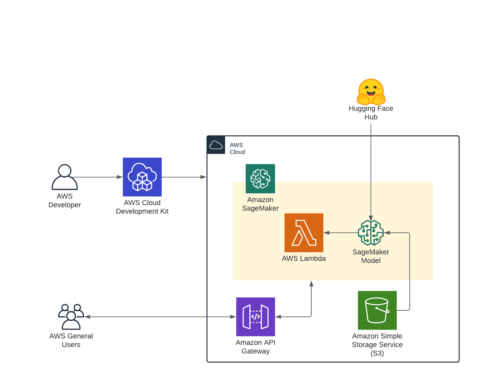
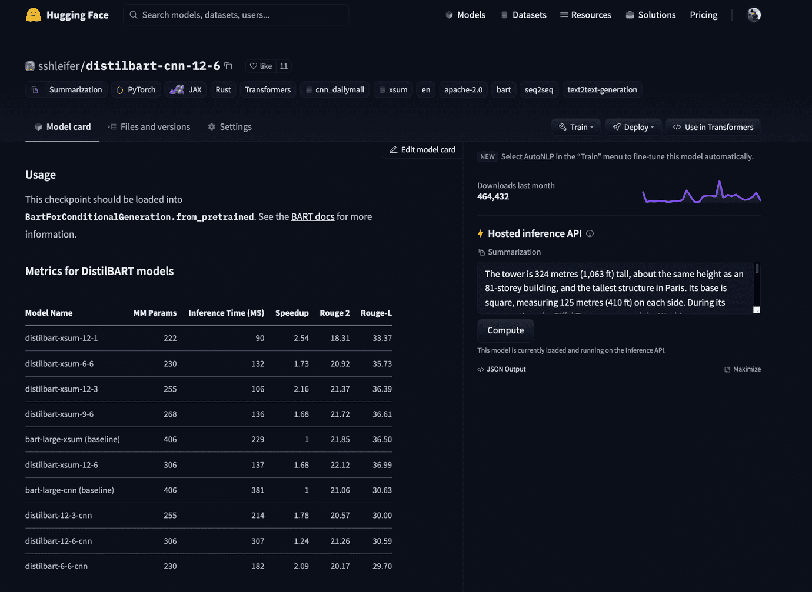
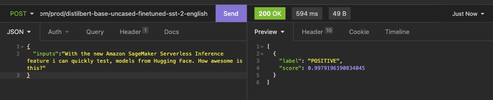

Last week at re:Invent 2021, AWS announced several new features for [Amazon SageMaker](https://aws.amazon.com/sagemaker/) to improve the Machine Learning experience using AWS and Amazon SageMaker. Amongst all the new announcements during [Swami Sivasubramanian](https://www.linkedin.com/in/swaminathansivasubramanian) Machine Learning Keynote, were three special ones, at least for me. 

The new Amazon [SageMaker Training Compiler](https://aws.amazon.com/blogs/aws/new-introducing-sagemaker-training-compiler/), which optimizes Deep Learning models to accelerate training by more efficiently using GPU instances and allowing higher batch sizes. You can check out my blog post ["Hugging Face Transformers BERT fine-tuning using Amazon SageMaker and Training Compiler"](https://www.philschmid.de/huggingface-amazon-sagemaker-training-compiler) to learn how to use it.

The [Amazon SageMaker Studio Lab](https://aws.amazon.com/sagemaker/studio-lab/) is a free machine learning (ML) development environment based on top of jupyter similar to [Google Colab - Colaboratory](https://colab.research.google.com/notebooks/welcome.ipynb?hl=de), which includes free CPU or GPU sessions for your projects.

Last but not least [Amazon SageMaker Serverless Inference](https://docs.aws.amazon.com/sagemaker/latest/dg/serverless-endpoints.html) which we will have a closer look at and learn how to use in this blog. Amazon SageMaker Serverless Inference as the name suggests is a fully managed serverless inference solution with pay-per-use pricing built on top of [AWS Lambda](https://aws.amazon.com/lambda/?nc1=h_ls). 

Serverless Machine Learning especially Serverless Deep Learning is a topic, which occupies me already for a long time. I created several blog posts on how to use Transformers, BERT, or PyTorch in Serverless environments with ["Serverless BERT with HuggingFace, AWS Lambda, and Docker"](https://www.philschmid.de/serverless-bert-with-huggingface-aws-lambda-docker), ["New Serverless Bert with Huggingface, AWS Lambda, and AWS EFS"](https://www.philschmid.de/new-serverless-bert-with-huggingface-aws-lambda) or ["Scaling Machine Learning from ZERO to HERO"](https://www.philschmid.de/scaling-machine-learning-from-zero-to-hero). 

The new Amazon SageMaker Serverless Inference feature strongly simplifies hosting for Serverless Transformers or Deep Learning Models a lot, but with still has some limitations. 

In this blog post, I will show you how you can easily deploy any [Hugging Face Transformer](https://huggingface.co/models) compatible model using Amazon SageMaker Serverless Inference and the [Hugging Face Inference DLCs](https://huggingface.co/docs/sagemaker/main) to quickly build cost-effective Proof of Concepts for your machine learning applications. We will take a look at the current existing limitations for it.

You can find the code for it in this [Github Repository](https://github.com/philschmid/cdk-samples/tree/master/sagemaker-serverless-huggingface-endpoint).

---

## Amazon SageMaker Serverless Inference

Amazon SageMaker Serverless Inference is a fully managed serverless inference option that makes it easy for you to deploy and scale ML models built on top of [AWS Lambda](https://aws.amazon.com/lambda/?nc1=h_ls) and fully integrated into the Amazon SageMaker service. Serverless Inference looks ideal for workloads that have idle periods, can tolerate cold starts, aren't latency and throughput critical, cost-effective & fast proofs-of-concept. 

Talking about cost-effectiveness with Amazon SageMaker Serverless inference you only pay for the compute capacity used to process inference requests, billed by the millisecond, and the amount of data processed and it comes with a free tier of "150,000 seconds of inference duration". Learn more about pricing [here](https://aws.amazon.com/sagemaker/pricing/).

Since Amazon SageMaker Serverless Inference is built on top of AWS Lambda we not only have the already existing limitations for AWS Lambda, like [cold starts](https://aws.amazon.com/blogs/compute/new-for-aws-lambda-predictable-start-up-times-with-provisioned-concurrency/), we also have additional SageMaker Serverless specific limitations. All of the following limitations existed at the time of writing the blog. 

- Compared to AWS Lambda does SageMaker Serverless Inference only supports up to 6GB of memory.
- The maximum concurrency for a single endpoint is limited to 50 with a total concurrency of 200 per accounts. Meaning 1 endpoint can scale at max to 50 concurrent running environments/functions.
- The endpoint must respond successfully to health checks within 3 minutes (for me unclear, because serverless functions are normally not always "warm")
- The "function" timeout for the container to respond to inference requests is 1 minute.
- **found limitation when testing:** [Currently, Transformer models > 512MB create errors](https://example.com)

You can find all of the current limitations and configurations in the [documentation of Serverless Inference](https://docs.aws.amazon.com/sagemaker/latest/dg/serverless-endpoints.html#serverless-endpoints-how-it-works).

At the time of writing this blog Serverless Inference is in Preview and only available in the following 6 Regions: US East (N. Virginia) `us-east-1`, US East (Ohio) `us-east-2`, US West (Oregon) `us-west-2`, Europe (Ireland) `eu-west-1`, Asia Pacific (Tokyo) `ap-northeast-1` and Asia Pacific (Sydney) `ap-southeast-2`.

---

## Tutorial

Before we get started, I’d like to give you some information about what we are going to do. We are going to create an Amazon Serverless SageMaker Endpoint using the [Hugging Face Inference DLC](https://huggingface.co/docs/sagemaker/main). The Hugging Face Inference DLC are pre-build optimized containers including all required packages to run seamless, optimized Inference with Hugging Face Transformers. Next to the optimized Deep Learning Frameworks it also includes the [SageMaker Hugging Face Inference Toolkit](https://github.com/aws/sagemaker-huggingface-inference-toolkit) an open-source library for serving 🤗 Transformers models on Amazon SageMaker, with default pre-processing, predicting, and postprocessing. 

We are going to use the [AWS Cloud Development Kit (AWS CDK)](https://aws.amazon.com/cdk/?nc1=h_ls) to create our infrastructure for our Serverless Endpoint. More specifically, we are going to build an application using the Hugging Face Inference DLC for serverless model serving and Amazon [API Gateway](https://aws.amazon.com/de/api-gateway/) as a proxy to call our Amazon SageMaker Endpoint. 

You can find the code for it in this [Github Repository](https://github.com/philschmid/cdk-samples/tree/master/sagemaker-serverless-huggingface-endpoint).

### Architecture



Before we get started, make sure you have the [AWS CDK installed](https://docs.aws.amazon.com/cdk/latest/guide/getting_started.html#getting_started_install) and [configured your AWS credentials](https://docs.aws.amazon.com/cdk/latest/guide/getting_started.html#getting_started_prerequisites).

**What are we going to do:**

- selecting a model from the [Hugging Face Hub](https://huggingface.co/models)
- bootstrap our CDK project
- Deploy the model using CDK and Serverless Inference
- Run inference and test the API

### Selecting a model from the [Hugging Face Hub](https://huggingface.co/models)

For those of you who don’t what the Hugging Face Hub is you should definitely take a look [here](https://huggingface.co/docs/hub/main). But the TL;DR; is that the Hugging Face Hub is an open community-driven collection of state-of-the-art models. At the time of writing the blog post, we have 20 000+ available free models to use.

To select the model we want to use we navigate to [hf.co/models](http://hf.co/models) then pre-filter using the task on the left, e.g. `summarization`. For this blog post, I went with the [sshleifer/distilbart-cnn-12-6](https://huggingface.co/sshleifer/distilbart-cnn-12-6), which was fine-tuned on CNN articles for summarization.



## **Bootstrap our CDK project**

Deploying applications using the CDK may require additional resources for CDK to store for example assets. The process of provisioning these initial resources is called [bootstrapping](https://docs.aws.amazon.com/cdk/latest/guide/bootstrapping.html). So before being able to deploy our application, we need to make sure that we bootstrapped our project.

1. Clone the Github repository

```bash
git clone https://github.com/philschmid/cdk-samples.git
cd sagemaker-serverless-huggingface-endpoint
```

2. Install the CDK required dependencies.

```bash
pip3 install -r requirements.txt
```

3. [Bootstrap](https://docs.aws.amazon.com/cdk/latest/guide/bootstrapping.html) your application in the cloud.

```bash
cdk bootstrap
```

## **Deploy the model using CDK**

Now we are able to deploy our application with the whole infrastructure and deploy our previous selected Transformer `sshleifer/distilbart-cnn-12-6` to Amazon SageMaker Serverless Inference. Our application uses the [CDK context](https://docs.aws.amazon.com/cdk/latest/guide/context.html) to accept dynamic parameters for the deployment. We can provide our model with a key `model` and our task as a key `task`. 

In our case we will provide `model=sshleifer/distilbart-cnn-12-6` and `task=summarization`.

```bash
cdk deploy \
   -c model="distilbert-base-uncased-finetuned-sst-2-english" \
   -c task="text-classification"
```

*Note: Currently, Transformer models > 512MB create errors*

After running the `cdk deploy` command we will get an output of all resources, which are going to be created. We then confirm our deployment and the CDK will create all required resources, deploy our AWS Lambda function and our Model to Amazon SageMaker. This takes around 3-5 minutes.

After the deployment, the console output should look similar to this.

```python
✅  HuggingfaceServerlessSagemakerEndpoint

Outputs:
HuggingfaceServerlessSagemakerEndpoint.SageMakerEndpointUrl = "https://io6528yt5a.execute-api.us-east-1.amazonaws.com/prod/distilbert-base-uncased-finetuned-sst-2-english"
HuggingfaceServerlessSagemakerEndpoint.apiEndpoint9349E63C = "https://io6528yt5a.execute-api.us-east-1.amazonaws.com/prod/"

Stack ARN:
arn:aws:cloudformation:us-east-1:558105141721:stack/HuggingfaceServerlessSagemakerEndpoint/66c9f250-5db4-11ec-a371-0a05d9e5c641

```

## **Run inference and test the API**

After the deployment is successfully complete we can grab our Endpoint URL `HuggingfaceServerlessSagemakerEndpoint.SageMakerEndpointUrl` from the CLI output and use any REST client to test it.

The first request/cold start can take 10-30s depending on the model you use



the request as curl to copy

```bash
curl --request POST \
  --url https://io6528yt5a.execute-api.us-east-1.amazonaws.com/prod/distilbert-base-uncased-finetuned-sst-2-english \
  --header 'Content-Type: application/json' \
  --data '{
	"inputs":"With the new Amazon SageMaker Serverless Inference feature i can quickly test, models from Hugging Face. How awesome is this?"
}'
```

---

> While testing this functionality I ran into several issues when deploying models > 512 MB, like `sshleifer/distilbart-cnn-12-6`. I am in contact with the AWS team to hopefully solve this issue soon.

## Conclusion

With the help of the AWS CDK, we were able to deploy an Amazon SageMaker Serverless Inference Endpoint for Hugging Face Transformers with 1 Line of code. It is great to see how things have evolved over the last year from complex container building for Serverless Deep Learning up to just providing a `model_id` and `task` to create a fully managed serverless HTTP API. 

But still, Serverless Inference is not yet ready for real production workload in my opinion. We are still having barriers we need to break to be able to recommend this for high scale, low latency real-time production use-cases. 

SageMaker Serverless Inference will 100% help you accelerate your machine learning journey and enables you to build fast and cost-effective proofs-of-concept where cold starts or scalability is not mission-critical, which can quickly be moved to GPUs or more high scale environments

Additionally, SageMaker Serverless creates "only" real-time endpoints, meaning we are missing the great trigger, which exists in AWS Lambda, like S3 or SQS to build more event-driven applications and architectures. **But what is not, can still become.** 

You should definitely give SageMaker Serverless Inference a try! 

---

You can find the code [here](https://github.com/philschmid/cdk-samples/tree/master/sagemaker-serverless-huggingface-endpoint) and feel free to open a thread on the [forum](https://discuss.huggingface.co/).

Thanks for reading. If you have any questions, feel free to contact me, through [Github](https://github.com/huggingface/transformers), or on the [forum](https://discuss.huggingface.co/c/sagemaker/17). You can also connect with me on [Twitter](https://twitter.com/_philschmid) or [LinkedIn](https://www.linkedin.com/in/philipp-schmid-a6a2bb196/).