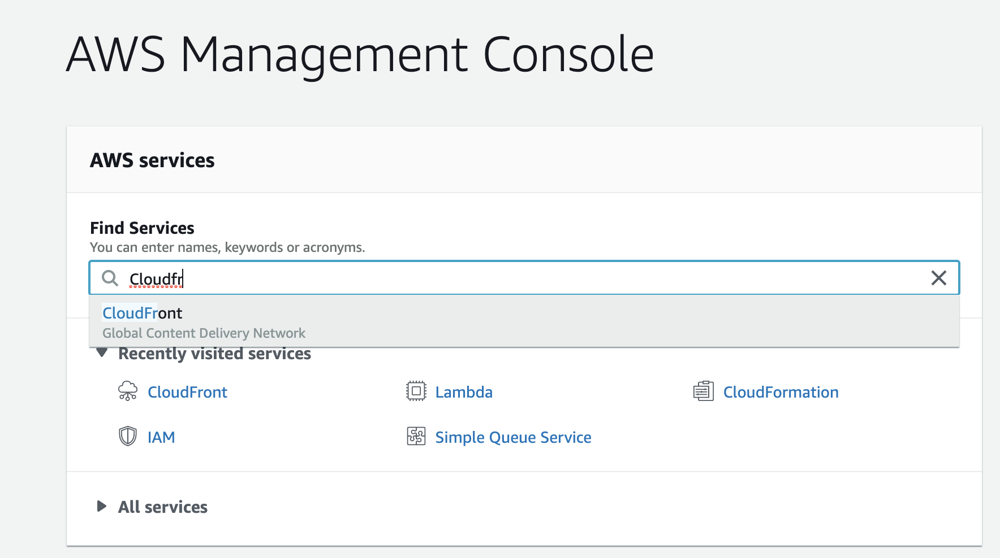
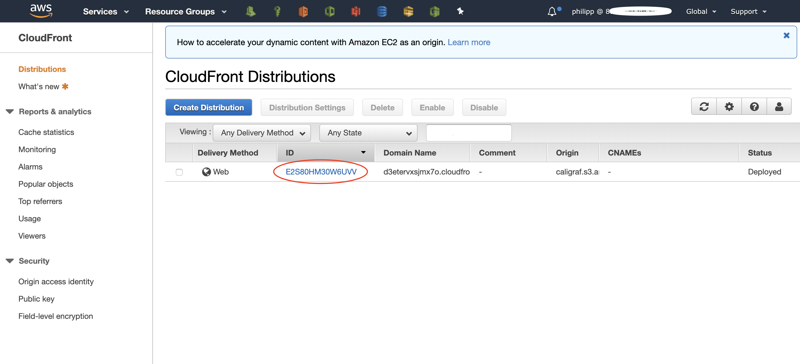
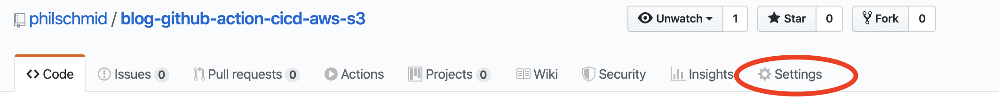
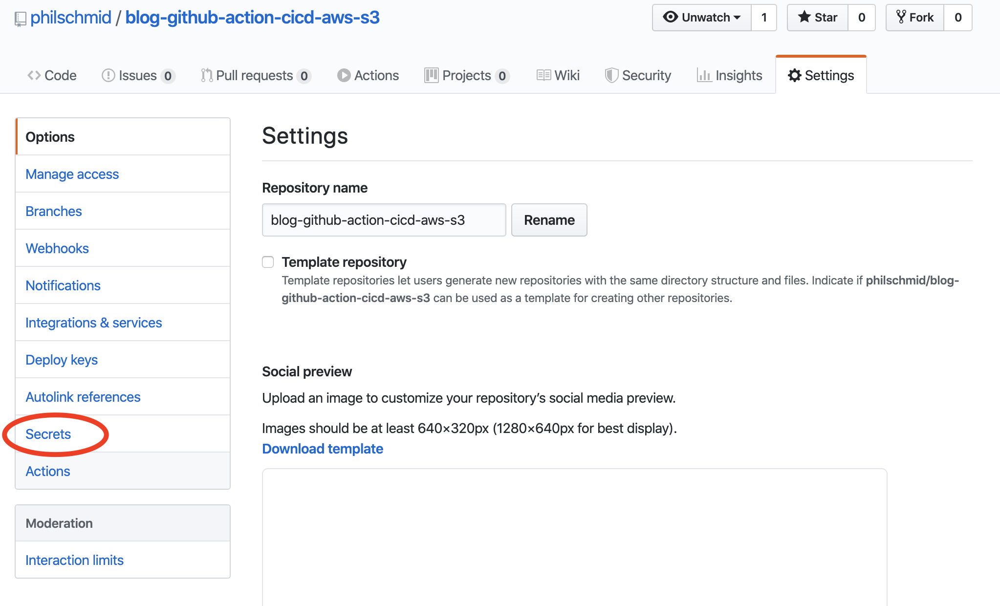
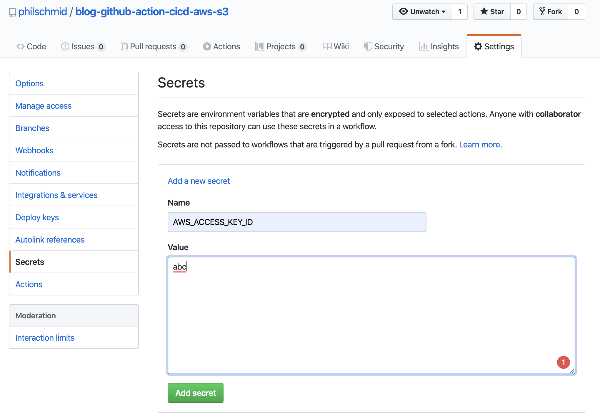
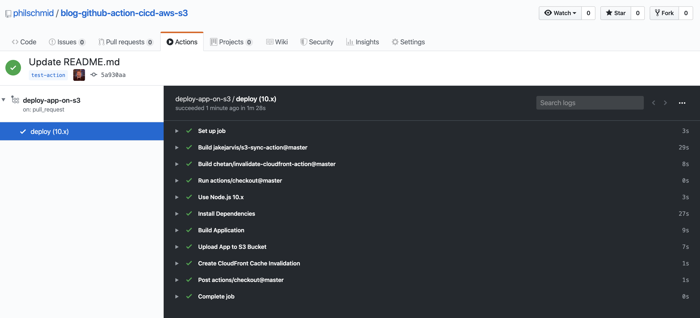

# Introduction

Nat Friedman described Github Actions as an API *“… to orchestrate any workflow, based on any event, while GitHub
manages the execution, provides rich feedback and secures every step along the way. With GitHub Actions, workflows and
steps are just code in a repository, so you can create, share, reuse, and fork your software development practices.”*

You can read his full blog post [here](https://github.blog/2019-08-08-github-actions-now-supports-ci-cd/).

This blog post explains how to set up a GitHub action within 5 minutes to automatically deploy your hosted web app on S3
and create an automatic CloudFront cache Invalidation. You will be able to deploy any app that runs on S3 be it React,
Vue, Angular or svelte.

This Action is using 2 community-built actions from
j[akejarvis](https://github.com/jakejarvis/s3-sync-action) and [chetan](https://github.com/chetan/invalidate-cloudfront-action).

---

## TL;DR

If you don´t want to read the complete post. Copy the action from this Github repository and add at the Github secrets
to your repository. If you fail, come back and read the article!

---

# Requirements

This post assumes that you have already deployed a working web app on s3 with CloudFront distribution before. So the
requirements are a working web app, with `build` script in the `package.json`, a static hosting bucket on s3, a working
CloudFront distribution and IAM User with programmatic access and enough permissions to deploy to s3 and create a
CloudFront chance invalidation

Now let’s get started with the tutorial.

---

# Create folders & files

The first thing we have to do is create the folder `.github` with a folder `workflows` in it on your project root level.
Afterward create the `deploy-app-on-s3.yaml` file in it.

# Creating the Github Action

Copy this code snippet into the `deploy-app-on-s3.yaml` file.

```yaml
name: deploy-app-on-s3

on:
  pull_request:
    branches: [master]
    types: [closed]
jobs:
  deploy:
    runs-on: ubuntu-latest
    env:
      AWS_S3_BUCKET_NAME: your-bucket-name
      AWS_CF_DISTRIBUTION_ID: your-cloudfront-id
    strategy:
      matrix:
        node-version: [10.x]
    steps:
      - uses: actions/checkout@master
      - name: Use Node.js ${{ matrix.node-version }}
        uses: actions/setup-node@v1
        with:
          node-version: ${{ matrix.node-version }}
      - name: Install Dependencies
        run: npm install
      - name: Build Application
        run: npm run-script build
      - uses: jakejarvis/s3-sync-action@master
        name: Upload App to S3 Bucket
        with:
          args: --follow-symlinks --delete --cache-control max-age=2592000
        env:
          AWS_S3_BUCKET: ${{ env.AWS_S3_BUCKET_NAME }}
          AWS_ACCESS_KEY_ID: ${{ secrets.AWS_ACCESS_KEY_ID }}
          AWS_SECRET_ACCESS_KEY: ${{ secrets.AWS_SECRET_ACCESS_KEY }}
          AWS_REGION: 'eu-central-1'
          SOURCE_DIR: 'dist'
      - name: Create CloudFront Cache Invalidation
        uses: chetan/invalidate-cloudfront-action@master
        env:
          DISTRIBUTION: ${{ env.AWS_CF_DISTRIBUTION_ID }}
          PATHS: '/*'
          AWS_REGION: 'eu-central-1'
          AWS_ACCESS_KEY_ID: ${{ secrets.AWS_ACCESS_KEY_ID }}
          AWS_SECRET_ACCESS_KEY: ${{ secrets.AWS_SECRET_ACCESS_KEY }}
```

This code snippet describes the action. The Github Action will be triggered after your pull request on the `master`
branch is successfully closed. You can change this by adjusting the `on` section in the snippet. If you want a different
trigger for your action look [here](https://help.github.com/en/actions/reference/events-that-trigger-workflows). It
could be possible that you have to adapt for example the `SOURCE_DIR` from "dist" to your build directory or the
`AWS_REGION`.

# Adjust environment variables

The third step is to adjust all environment variables. In this action, we have the bucket name `AWS_S3_BUCKET_NAME` and
the CloudFront distribution ID `AWS_CF_DISTRIBUTION_ID` as an environment variable. The value of `AWS_S3_BUCKET_NAME` is
the name of your S3 Bucket you can find in the management console and the value of `AWS_CF_DISTRIBUTION_ID` is the id of
the CloudFront distribution.

You can get the ID for the `AWS_CF_DISTRIBUTION_ID` variable of the CloudFront distribution via the management console
by navigating to the "CloudFront" service and then going on "Distribution".



The table has a column "ID" with the value we need. You can recognize the correct row by identifying your S3 Bucket name
in the column "origin".



## Add secrets to your repository

The fourth and last step is to add secrets to your Github repository. For this Github Action, we need the access key ID
and secret access key from IAM User as secrets called `AWS_ACCESS_KEY_ID` and `AWS_SECRET_ACCESS_KEY`.

If you are not sure on how to create an IAM user for the access key ID and secret access key you can read
[here](https://serverless-stack.com/chapters/create-an-iam-user.html).

### Adding the secrets

To add the secrets you have to go the "settings" tab of your repository.



then go to secrets in the left navigation



and on the secrets page, you can add your 2 secrets `AWS_ACCESS_KEY_ID` and `AWS_SECRET_ACCESS_KEY.`



## Crab a coffee and enjoy it

Lastly, you have to create a pull request from a feature branch into master and watch your action deploying your app to
s3 and creating a cache invalidation.



---

I created a demo repository with a vue app as example. You can find the repository
[here](https://github.com/philschmid/blog-github-action-cicd-aws-s3). If something is unclear let me know and i will
adjust it.
