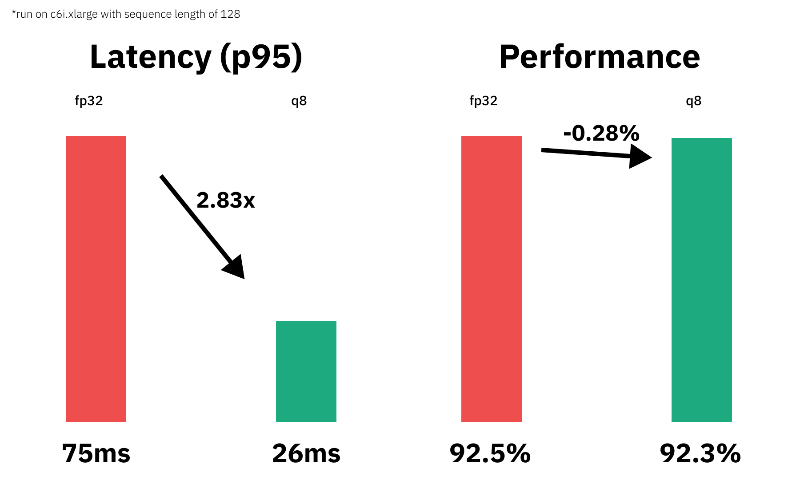

notebook: [optimum-static-quantization](https://github.com/philschmid/optimum-static-quantization/blob/master/notebook.ipynb)  

In this session, you will learn how to do post-training static quantization on Hugging Face Transformers model. The session will show you how to quantize a DistilBERT model using [Hugging Face Optimum](https://huggingface.co/docs/optimum/index) and [ONNX Runtime](https://onnxruntime.ai/). Hugging Face Optimum is an extension of 🤗 Transformers, providing a set of performance optimization tools enabling maximum efficiency to train and run models on targeted hardware.

Note: Static quantization is currently only supported for CPUs, so we will not be utilizing GPUs / CUDA in this session. By the end of this session, you see how quantization with Hugging Face Optimum can result in significant increase in model latency while keeping almost 100% of the full-precision model. Furthermore, you’ll see how to easily apply some advanced quantization and optimization techniques shown here so that your models take much less of an accuracy hit than they would otherwise. 

You will learn how to:
- [1. Setup Development Environment](#1-setup-development-environment)
- [2. Convert a Hugging Face `Transformers` model to ONNX for inference](#2-convert-a-hugging-face-transformers-model-to-onnx-for-inference)
- [3. Configure static quantization & run Calibration of quantization ranges](#3-configure-static-quantization--run-calibration-of-quantization-ranges)
- [4. Use the ORTQuantizer to apply static quantization](#4-use-the-ortquantizer-to-apply-static-quantization)
- [5. Test inference with the quantized model](#5-test-inference-with-the-quantized-model)
- [6. Evaluate the performance and speed](#6-evaluate-the-performance-and-speed)
- [7. Push the quantized model to the Hub](#7-push-the-quantized-model-to-the-hub)
- [8. Load and run inference with a quantized model from the hub](#8-load-and-run-inference-with-a-quantized-model-from-the-hub)

Or you can immediately jump to the [Conclusion](#conclusion).

Let's get started! 🚀


_This tutorial was created and run on a c6i.xlarge AWS EC2 Instance._

---

## 1. Setup Development Environment

Our first step is to install Optimum with the onnxruntime utilities and evaluate.

This will install all required packages including transformers, torch, and onnxruntime. If you are going to use a GPU you can install optimum with pip install optimum[onnxruntime-gpu].


```python
!pip install "optimum[onnxruntime]==1.2.2" evaluate[evaluator] sklearn mkl-include mkl
```

## 2. Convert a Hugging Face `Transformers` model to ONNX for inference

Before we can start qunatizing, we need to convert our vanilla `transformers` model to the `onnx` format. To do this we will use the new [ORTModelForSequenceClassification](https://huggingface.co/docs/optimum/main/en/onnxruntime/modeling_ort#optimum.onnxruntime.ORTModelForSequenceClassification) class calling the `from_pretrained()` method with the `from_transformers` attribute. The model we are using is the [optimum/distilbert-base-uncased-finetuned-banking77](https://huggingface.co/optimum/distilbert-base-uncased-finetuned-banking77) a fine-tuned DistilBERT model on the Banking77 dataset achieving an Accuracy score of `92.5` and as the feature (task) `text-classification`.


```python
from optimum.onnxruntime import ORTModelForSequenceClassification
from transformers import AutoTokenizer
from pathlib import Path


model_id="optimum/distilbert-base-uncased-finetuned-banking77"
dataset_id="banking77"
onnx_path = Path("onnx")

# load vanilla transformers and convert to onnx
model = ORTModelForSequenceClassification.from_pretrained(model_id, from_transformers=True)
tokenizer = AutoTokenizer.from_pretrained(model_id)

# save onnx checkpoint and tokenizer
model.save_pretrained(onnx_path)
tokenizer.save_pretrained(onnx_path)
```

## 3. Configure static quantization & run Calibration of quantization ranges

Post-training static quantization, compared to dynamic quantization not only involves converting the weights from float to int, but also performing an first additional step of feeding the data through the model to compute the distributions of the different activations (calibration ranges). These distributions are then used to determine how the different activations should be quantized at inference time. 
Importantly, this additional step allows us to pass quantized values between operations instead of converting these values to floats - and then back to ints - between every operation, resulting in a significant speed-up.

First step is to create our Quantization configuration using `optimum`.


```python
from optimum.onnxruntime import ORTQuantizer
from optimum.onnxruntime.configuration import AutoQuantizationConfig
from onnxruntime.quantization import QuantFormat, QuantizationMode

# create ORTQuantizer and define quantization configuration
quantizer = ORTQuantizer.from_pretrained(model_id, feature=model.pipeline_task)
qconfig = AutoQuantizationConfig.avx512_vnni(
    is_static=True,
    format=QuantFormat.QOperator,
    mode=QuantizationMode.QLinearOps,
    per_channel=True,
    operators_to_quantize=["MatMul", "Add" ]
    )
```

After we have configured our configuration we are going to use the fine-tuning dataset as calibration data to calculate the quantization parameters of activations. The `ORTQuantizer` supports three calibration methods: MinMax, Entropy and Percentile.

We are going to use Percentile as a calibration method. For the session we have already run hyperparameter optimization in advance to find the right `percentiles` to achieve the highest accuracy. Therefore we used the `scripts/run_static_quantizatio_hpo.py` together with `optuna`.

Finding the right calibration method and percentiles is what makes static quantization cost-intensive. Since it can take up to multiple hours to find the right values and there is sadly no rule of thumb. 
If you want to learn more about it you should check out the "[INTEGER QUANTIZATION FOR DEEP LEARNING INFERENCE:
PRINCIPLES AND EMPIRICAL EVALUATION](https://arxiv.org/pdf/2004.09602.pdf)" paper


```python
import os
from functools import partial
from optimum.onnxruntime.configuration import AutoCalibrationConfig

def preprocess_fn(ex, tokenizer):
    return tokenizer(ex["text"],padding="longest")

# Create the calibration dataset
calibration_samples = 256
calibration_dataset = quantizer.get_calibration_dataset(
    dataset_id,
    preprocess_function=partial(preprocess_fn, tokenizer=quantizer.tokenizer),
    num_samples=calibration_samples,
    dataset_split="train",
)

# Create the calibration configuration containing the parameters related to calibration.
calibration_config = AutoCalibrationConfig.percentiles(calibration_dataset, percentile=99.99239080907178)

# Perform the calibration step: computes the activations quantization ranges
shards=16
for i in range(shards):
    shard = calibration_dataset.shard(shards, i)
    quantizer.partial_fit(
        dataset=shard,
        calibration_config=calibration_config,
        onnx_model_path=onnx_path / "model.onnx",
        operators_to_quantize=qconfig.operators_to_quantize,
        batch_size=calibration_samples//shards,
        use_external_data_format=False,
    )
ranges = quantizer.compute_ranges()

# remove temp augmented model again
os.remove("augmented_model.onnx")

```

## 4. Use the ORTQuantizer to apply static quantization

After we have calculated our calibration tensor ranges we can quantize our model using the `ORTQuantizer`. 


```python
from utils import create_quantization_preprocessor

# create processor
quantization_preprocessor = create_quantization_preprocessor()

# Quantize the same way we did for dynamic quantization!
quantizer.export(
    onnx_model_path=onnx_path / "model.onnx",
    onnx_quantized_model_output_path=onnx_path / "model-quantized.onnx",
    calibration_tensors_range=ranges,
    quantization_config=qconfig,
    preprocessor=quantization_preprocessor,
)
```

Lets quickly check the new model size.


```python
import os

# get model file size
size = os.path.getsize(onnx_path / "model.onnx")/(1024*1024)
quantized_model = os.path.getsize(onnx_path / "model-quantized.onnx")/(1024*1024)

print(f"Model file size: {size:.2f} MB")
print(f"Quantized Model file size: {quantized_model:.2f} MB")
#    Model file size: 255.68 MB
#    Quantized Model file size: 134.32 MB
```

## 5. Test inference with the quantized model

[Optimum](https://huggingface.co/docs/optimum/main/en/pipelines#optimizing-with-ortoptimizer) has built-in support for [transformers pipelines](https://huggingface.co/docs/transformers/main/en/main_classes/pipelines#pipelines). This allows us to leverage the same API that we know from using PyTorch and TensorFlow models.
Therefore we can load our quantized model with `ORTModelForSequenceClassification` class and transformers `pipeline`.


```python
from optimum.onnxruntime import ORTModelForSequenceClassification
from transformers import pipeline, AutoTokenizer

model = ORTModelForSequenceClassification.from_pretrained(onnx_path,file_name="model-quantized.onnx")
tokenizer = AutoTokenizer.from_pretrained(onnx_path)

clx = pipeline("text-classification",model=model, tokenizer=tokenizer)

clx("What is the exchange rate like on this app?")
```

## 6. Evaluate the performance and speed

We can now leverage the map function of datasets to iterate over the validation set of squad 2 and run prediction for each data point. Therefore we write a evaluate helper method which uses our pipelines and applies some transformation to work with the squad v2 metric.

```python
from evaluate import evaluator
from datasets import load_dataset 

eval = evaluator("text-classification")
eval_dataset = load_dataset("banking77", split="test")

results = eval.compute(
    model_or_pipeline=clx,
    data=eval_dataset,
    metric="accuracy",
    input_column="text",
    label_column="label",
    label_mapping=model.config.label2id,
    strategy="simple",
)
print(results)
#     {'accuracy': 0.9224025974025974}

print(f"Vanilla model: 92.5%")
print(f"Quantized model: {results['accuracy']*100:.2f}%")
print(f"The quantized model achieves {round(results['accuracy']/0.925,4)*100:.2f}% accuracy of the fp32 model")

#    Vanilla model: 92.5%
#    Quantized model: 92.24%
#    The quantized model achieves 99.72% accuracy of the fp32 model
```

Okay, now let's test the performance (latency) of our quantized model. We are going to use a payload with a sequence length of 128 for the benchmark. To keep it simple, we are going to use a python loop and calculate the avg,mean & p95 latency for our vanilla model and for the quantized model.

```python
from time import perf_counter
import numpy as np 

payload="Hello my name is Philipp. I am getting in touch with you because i didn't get a response from you. What do I need to do to get my new card which I have requested 2 weeks ago? Please help me and answer this email in the next 7 days. Best regards and have a nice weekend "*2
print(f'Payload sequence length: {len(tokenizer(payload)["input_ids"])}')

def measure_latency(pipe):
    latencies = []
    # warm up
    for _ in range(10):
        _ = pipe(payload)
    # Timed run
    for _ in range(300):
        start_time = perf_counter()
        _ =  pipe(payload)
        latency = perf_counter() - start_time
        latencies.append(latency)
    # Compute run statistics
    time_avg_ms = 1000 * np.mean(latencies)
    time_std_ms = 1000 * np.std(latencies)
    time_p95_ms = 1000 * np.percentile(latencies,95)
    return f"P95 latency (ms) - {time_p95_ms}; Average latency (ms) - {time_avg_ms:.2f} +\- {time_std_ms:.2f};", time_p95_ms

vanilla_clx = pipeline("text-classification",model=model_id)


vanilla_model=measure_latency(vanilla_clx)
quantized_model=measure_latency(clx)

print(f"Vanilla model: {vanilla_model[0]}")
print(f"Quantized model: {quantized_model[0]}")
print(f"Improvement through quantization: {round(vanilla_model[1]/quantized_model[1],2)}x")
```

We managed to accelerate our model latency from 75.69ms to 26.75ms or 2.83x while keeping 99.72% of the accuracy. 



## 7. Push the quantized model to the Hub

The Optimum model classes like `ORTModelForSequenceClassification` are integrated with the Hugging Face Model Hub, which means you can not only load model from the Hub, but also push your models to the Hub with `push_to_hub()` method. That way we can now save our qunatized model on the Hub to be for example used inside our inference API.

_We have to make sure that we are also saving the `tokenizer` as well as the `config.json` to have a good inference experience._

If you haven't logged into the `huggingface hub` yet you can use the `notebook_login` to do so.


```python
from huggingface_hub import notebook_login

notebook_login()
```

After we have configured our hugging face hub credentials we can push the model.


```python
from transformers import AutoTokenizer
from optimum.onnxruntime import ORTModelForSequenceClassification

tmp_store_directory="onnx_hub_repo"
repository_id="quantized-distilbert-banking77"
model_file_name="model-quantized.onnx"

model.latest_model_name=model_file_name # workaround for PR #214
model.save_pretrained(tmp_store_directory)
quantizer.tokenizer.save_pretrained(tmp_store_directory)

model.push_to_hub(tmp_store_directory,
                  repository_id=repository_id,
                  use_auth_token=True
                  )
```

## 8. Load and run inference with a quantized model from the hub

This step serves as a demonstration of how you could use optimum in your api to load and use our qunatized model.


```python
from optimum.onnxruntime import ORTModelForSequenceClassification
from transformers import pipeline, AutoTokenizer

model = ORTModelForSequenceClassification.from_pretrained("philschmid/quantized-distilbert-banking77")
tokenizer = AutoTokenizer.from_pretrained("philschmid/quantized-distilbert-banking77")

remote_clx = pipeline("text-classification",model=model, tokenizer=tokenizer)

remote_clx("What is the exchange rate like on this app?")
```

## Conclusion

We successfully quantized our vanilla Transformers model with Hugging Face and managed to accelerate our model latency from 75.69ms to 26.75ms or 2.83x while keeping 99.72% of the accuracy. 

But I have to say that this isn't a plug and play process you can transfer to any Transformers model, task and dataset. The challenge with static quantization is the calibration of the dataset to find the right ranges which you can use to quantize the model achieve good performance. I ran a hyperparameter search to find the best ranges for our dataset and quantized the model using the [run_static_quantizatio_hpo.py](https://github.com/philschmid/optimum-static-quantization/blob/master/scripts/run_static_quantizatio_hpo.py). 

Also, notably to say it that static quantization can only achieve as good as results as dynamic quantization, but will be faster than dynamic quantization. Means that it might always be a good start to first dynamically quantize your model using Optimum and then move to static quantization for further latency and throughput gains. The attached repository also includes an example on how dynamically quantize the model [dynamic_quantization.py](https://github.com/philschmid/optimum-static-quantization/blob/master/scripts/dynamic_quantization.py)

The code can be found in this repository [philschmid/optimum-static-quantization](https://github.com/philschmid/optimum-static-quantization)

---

Thanks for reading! If you have any questions, feel free to contact me, through [Github](https://github.com/huggingface/transformers), or on the [forum](https://discuss.huggingface.co/c/optimum/59). You can also connect with me on [Twitter](https://twitter.com/_philschmid) or [LinkedIn](https://www.linkedin.com/in/philipp-schmid-a6a2bb196/).